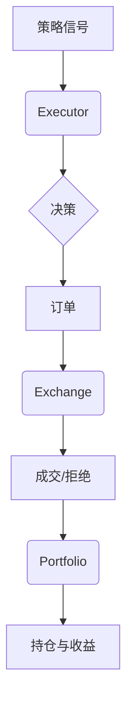

# 回测系统API

<cite>
**本文档引用文件**   
- [exchange.py](file://qlib/backtest/exchange.py)
- [executor.py](file://qlib/backtest/executor.py)
- [backtest.py](file://qlib/backtest/backtest.py)
- [decision.py](file://qlib/backtest/decision.py)
- [position.py](file://qlib/backtest/position.py)
- [signal.py](file://qlib/backtest/signal.py)
</cite>

## 目录
1. [引言](#引言)
2. [核心组件与协作关系](#核心组件与协作关系)
3. [BacktestInstance 与 Executor 协作流程](#backtestinstance-与-executor-协作流程)
4. [Exchange 模拟撮合机制](#exchange-模拟撮合机制)
5. [策略信号到订单的转换逻辑](#策略信号到订单的转换逻辑)
6. [持仓与收益跟踪：Portfolio 对象](#持仓与收益跟踪portfolio-对象)
7. [关键参数配置详解](#关键参数配置详解)
8. [高频与日频回测配置范例](#高频与日频回测配置范例)
9. [性能瓶颈分析与优化建议](#性能瓶颈分析与优化建议)

## 引言
本API参考文档旨在全面解析Qlib框架中的回测系统，覆盖从策略执行、订单生成、成交模拟到绩效分析的全流程。文档深入剖析了`BacktestInstance`、`Executor`和`Exchange`三大核心组件之间的协作关系，并详细阐述了滑点、手续费、交易单元等关键参数的配置方式。同时，文档还介绍了信号转决策（SignalToOrder）、动态再平衡等策略转换逻辑，以及如何通过`Portfolio`对象精确跟踪投资组合的持仓与收益变化。最后，文档提供了针对不同频率回测的配置范例，并对潜在的性能瓶颈（如事件驱动延迟）提出了优化建议。

## 核心组件与协作关系

回测系统的架构由多个核心组件构成，它们协同工作以模拟真实的交易环境。`BacktestInstance`作为回测的顶层控制器，负责管理整个回测生命周期。`Executor`是执行引擎，它接收来自策略的决策并将其转化为具体的订单。`Exchange`则扮演着市场模拟器的角色，根据设定的规则处理订单的撮合与成交。这三者之间形成了一个清晰的数据流和控制流：策略产生信号 -> `Executor`生成决策 -> `Executor`向`Exchange`提交订单 -> `Exchange`返回成交结果 -> `Portfolio`更新状态。

**Section sources**
- [backtest.py](file://qlib/backtest/backtest.py#L1-L50)
- [executor.py](file://qlib/backtest/executor.py#L1-L30)
- [exchange.py](file://qlib/backtest/exchange.py#L1-L20)



**Diagram sources **
- [backtest.py](file://qlib/backtest/backtest.py#L1-L100)
- [executor.py](file://qlib/backtest/executor.py#L1-L50)
- [exchange.py](file://qlib/backtest/exchange.py#L1-L30)
- [position.py](file://qlib/backtest/position.py#L1-L20)

## BacktestInstance 与 Executor 协作流程

`BacktestInstance`是回测会话的主入口，它初始化并协调所有底层组件。当用户启动一个回测时，`BacktestInstance`会创建一个`Executor`实例。`Executor`的核心职责是将抽象的“决策”（Decision）转化为可执行的“订单”（Order）。这个过程通常发生在每个交易周期的开始。`Executor`会查询当前的投资组合状态和可用资金，然后根据策略提供的目标权重或目标数量，计算出需要买入或卖出的具体股票及数量。

一旦订单生成，`Executor`就会调用`Exchange`的接口来尝试执行这些订单。`BacktestInstance`会持续监控`Executor`的状态，并在每个周期结束后收集绩效数据，最终生成完整的回测报告。

**Section sources**
- [backtest.py](file://qlib/backtest/backtest.py#L100-L300)
- [executor.py](file://qlib/backtest/executor.py#L50-L200)
- [decision.py](file://qlib/backtest/decision.py#L1-L50)

## Exchange 模拟撮合机制

`Exchange`类是回测系统中最为复杂的部分，它精确地模拟了真实市场的交易规则和限制。

### 初始化与参数配置
`Exchange`的构造函数接受一系列关键参数，用于定义回测环境：
- **`freq`**: 数据频率，如"day"（日频）或"1min"（分钟级）。
- **`deal_price`**: 成交价格，可以是`$close`（收盘价）、`$open`（开盘价）或`$vwap`（成交量加权平均价）。支持为买入和卖出分别指定不同的价格。
- **`open_cost` 和 `close_cost`**: 开仓和平仓的费率，默认分别为0.15%和0.25%。
- **`impact_cost`**: 市场冲击成本率（即滑点），推荐值为0.1。
- **`trade_unit`**: 交易单位，例如A股市场为100股，用于确保订单数量符合整手要求。
- **`limit_threshold`**: 涨跌停板限制，可以是一个浮点数（如0.1表示10%涨跌幅限制）或一个元组表达式，用于更精细地控制哪些股票在特定条件下不可交易。
- **`volume_threshold`**: 成交量限制，防止在流动性不足的情况下进行大额交易。支持累积成交量（cum）和瞬时成交量（current）两种模式。

### 订单处理流程
`deal_order`方法是`Exchange`的核心。它首先通过`check_order`方法检查订单的有效性，包括：
1.  **停牌检查** (`check_stock_suspended`): 确认股票在该时间段内是否正常交易。
2.  **涨跌停检查** (`check_stock_limit`): 确认股票是否触及涨跌停板而无法交易。

如果订单通过检查，`Exchange`会根据`deal_price`获取实际的成交价格，并计算交易产生的价值、成本和最终成交价。交易成本的计算遵循`open_cost`和`close_cost`的规则，并考虑`min_cost`（最低佣金）的限制。最后，`Exchange`会更新账户或持仓信息。

**Section sources**
- [exchange.py](file://qlib/backtest/exchange.py#L27-L957)

## 策略信号到订单的转换逻辑

回测系统提供了一套灵活的机制，将策略输出的原始信号转换为可执行的交易指令。

### SignalToOrder 转换器
`signal.py`模块中的`SignalToOrder`类是这一过程的关键。它接收一个包含股票代码和信号值（通常是预测收益率）的字典。`SignalToOrder`会根据预设的规则（如信号排序、分位数筛选等）选择待交易的股票池。

### 动态再平衡
在确定了目标股票后，系统会进行动态再平衡计算。`generate_amount_position_from_weight_position`方法可以根据目标权重和当前现金，计算出每个股票的目标持仓数量。随后，`generate_order_for_target_amount_position`方法会比较当前持仓和目标持仓，生成具体的买入或卖出订单列表。此过程会自动考虑交易单位的限制，通过`round_amount_by_trade_unit`方法对订单数量进行向下取整。

**Section sources**
- [signal.py](file://qlib/backtest/signal.py#L1-L100)
- [executor.py](file://qlib/backtest/executor.py#L150-L250)

## 持仓与收益跟踪：Portfolio 对象

`Portfolio`对象（通常由`Account`或`BasePosition`实现）是回测系统中记录投资组合状态的核心。它维护着以下关键信息：
- **当前持仓** (`current_position`): 一个字典，记录每只股票的持有数量。
- **现金余额** (`cash`): 可用于交易的资金。
- **总资产** (`total_value`): 持仓市值加上现金余额，是衡量投资组合表现的核心指标。

每当一笔订单成功成交，`Portfolio`都会被`update_order`方法更新。该方法会根据成交的数量、价格和成本，调整相应的股票持仓和现金余额。`get_close`等方法会被用来获取最新的股价，从而计算持仓的实时市值。通过在整个回测期间持续跟踪`total_value`的变化，系统可以准确地计算出累计收益率、夏普比率等绩效指标。

**Section sources**
- [position.py](file://qlib/backtest/position.py#L1-L150)
- [account.py](file://qlib/backtest/account.py#L1-L100)

## 关键参数配置详解

正确配置回测参数对于获得可靠的结果至关重要。

| 参数 | 类型 | 默认值 | 说明 |
| :--- | :--- | :--- | :--- |
| `deal_price` | str 或 tuple[str, str] | `$close` | 决定订单的成交价格。使用`($buy_price, $sell_price)`元组可以为买卖设置不同价格。 |
| `open_cost` / `close_cost` | float | 0.0015 / 0.0025 | 开仓和平仓的费率。总交易成本 = (开仓价值 * open_cost) + (平仓价值 * close_cost)。 |
| `impact_cost` | float | 0.0 | 市场冲击成本率，模拟大单交易对市场价格的影响。 |
| `trade_unit` | int 或 None | 100 | 交易单位。设为`None`可禁用此限制。 |
| `limit_threshold` | float, tuple[str, str], 或 None | None | 涨跌停板限制。`None`表示无限制；`float`（如0.1）表示±10%的涨跌幅限制；`tuple`允许使用自定义表达式。 |
| `volume_threshold` | dict 或 tuple | None | 成交量限制，防止过度交易。例如 `{"all": ("cum", "0.2 * DayCumsum($volume, '9:45', '14:45')")}` 表示单日累计成交量不超过前一交易时段的20%。 |

**Section sources**
- [exchange.py](file://qlib/backtest/exchange.py#L27-L200)

## 高频与日频回测配置范例

### 日频回测配置
```python
exchange = Exchange(
   