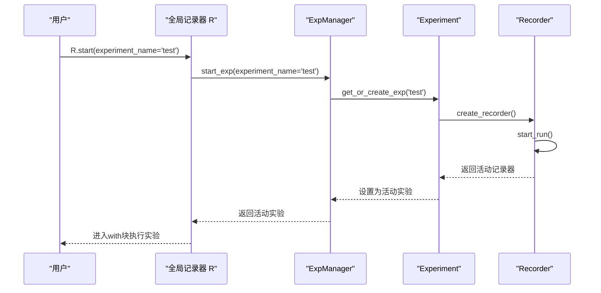
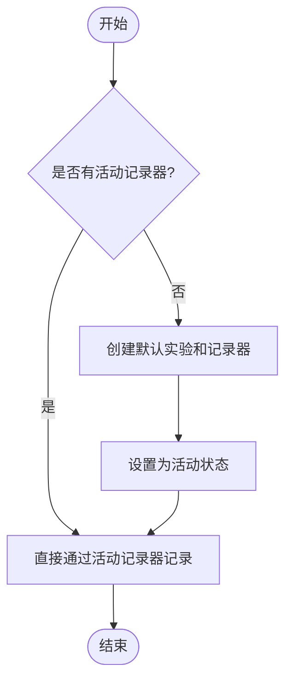

# 工作流管理API

<cite>
**本文档引用的文件**   
- [expm.py](file://qlib/workflow/expm.py)
- [exp.py](file://qlib/workflow/exp.py)
- [recorder.py](file://qlib/workflow/recorder.py)
- [__init__.py](file://qlib/workflow/__init__.py)
- [record_temp.py](file://qlib/workflow/record_temp.py)
- [utils.py](file://qlib/workflow/online/utils.py)
</cite>

## 目录
1. [简介](#简介)
2. [核心组件](#核心组件)
3. [实验生命周期管理](#实验生命周期管理)
4. [记录器与指标日志](#记录器与指标日志)
5. [模型与结果持久化](#模型与结果持久化)
6. [MLflow集成实现](#mlflow集成实现)
7. [高级用法示例](#高级用法示例)
8. [潜在风险点](#潜在风险点)

## 简介
本API文档详细描述了工作流管理系统（Experiment & Recorder）的核心功能，涵盖实验生命周期管理的所有接口。系统提供了`ExpManager`、`Experiment`、`Recorder`和`Artifact`等核心类，用于管理机器学习实验的完整流程。通过简洁的API如`R.start()`和`R.log_metrics()`，用户可以轻松完成复杂的追踪任务。该系统基于MLflow进行集成，提供了更丰富的特性和更好的设计，支持跨会话结果检索、版本控制和在线服务更新等高级功能。

## 核心组件

工作流管理系统由四个核心组件构成：`ExpManager`（实验管理器）、`Experiment`（实验）、`Recorder`（记录器）和`Artifact`（工件）。这些组件共同构成了一个完整的实验追踪框架，允许用户从创建实验到记录结果的全过程进行精细化管理。

**Section sources**
- [expm.py](file://qlib/workflow/expm.py#L22-L314)
- [exp.py](file://qlib/workflow/exp.py#L14-L239)
- [recorder.py](file://qlib/workflow/recorder.py#L27-L243)

## 实验生命周期管理

### 实验创建与启动
实验的生命周期始于`ExpManager`的初始化，它负责管理所有实验。用户可以通过`start_exp`方法启动一个新的实验，该方法会首先获取或创建一个实验实例，并将其设置为活动状态。`Experiment`类代表单个实验，每个实验可以包含多个记录器。

**Diagram sources **
- [expm.py](file://qlib/workflow/expm.py#L46-L92)
- [exp.py](file://qlib/workflow/exp.py#L43-L60)
- [__init__.py](file://qlib/workflow/__init__.py#L33-L60)

### 实验结束与清理
当实验完成时，用户应调用`end_exp`方法来结束实验。此方法会将活动实验的状态设置为完成，并清理相关资源。系统支持手动结束实验，也支持在`with`语句块结束后自动结束。

**Section sources**
- [expm.py](file://qlib/workflow/expm.py#L94-L108)
- [exp.py](file://qlib/workflow/exp.py#L62-L68)

## 记录器与指标日志

### 记录器操作
`Recorder`是实验中的核心记录单元，负责记录参数、指标和标签。每个实验可以有多个记录器，但同一时间只能有一个活动记录器。用户可以通过`get_recorder`方法获取特定的记录器实例。

### 指标日志写入
系统提供了简洁的API来记录指标和参数。`R.log_metrics()`和`R.log_params()`方法允许用户在不显式获取记录器的情况下直接记录数据。如果当前没有活动记录器，系统会自动创建一个默认实验和记录器。

**Diagram sources **
- [recorder.py](file://qlib/workflow/recorder.py#L132-L141)
- [__init__.py](file://qlib/workflow/__init__.py#L548-L589)

**Section sources**
- [recorder.py](file://qlib/workflow/recorder.py#L73-L87)
- [__init__.py](file://qlib/workflow/__init__.py#L519-L550)

## 模型与结果持久化

### 工件保存与加载
`save_objects`方法允许用户将Python对象（如模型、预测结果）作为工件保存到存储后端。用户可以选择通过`local_path`保存本地文件，或通过关键字参数直接传递对象。`load_object`方法则用于从存储中加载已保存的对象。

### 预定义记录模板
系统提供了`RecordTemp`基类和多个预定义的记录模板，如`SignalRecord`（信号记录）、`SigAnaRecord`（信号分析记录）和`PortAnaRecord`（投资组合分析记录）。这些模板简化了常见分析任务的实现。

**Section sources**
- [recorder.py](file://qlib/workflow/recorder.py#L73-L87)
- [record_temp.py](file://qlib/workflow/record_temp.py#L86-L133)

## MLflow集成实现

### 后端封装
系统通过`MLflowExpManager`和`MLflowRecorder`类对MLflow进行了封装，提供了更友好的API和额外功能。这种封装使得更换底层追踪后端变得更容易，同时增加了自动记录未提交代码、环境变量等便利特性。

### 异步日志
为了提高性能，系统实现了异步日志记录。`AsyncCaller`装饰器被应用于`log_params`、`log_metrics`等方法，允许日志操作在后台线程中执行，从而减少对主程序的阻塞。

**Section sources**
- [expm.py](file://qlib/workflow/expm.py#L317-L363)
- [recorder.py](file://qlib/workflow/recorder.py#L356-L385)

## 高级用法示例

### 跨会话结果检索
用户可以通过`search_records`方法跨多个实验检索记录，支持按指标、参数等条件过滤和排序。`list_experiments`和`list_recorders`方法可用于浏览所有存在的实验和记录器。

### 在线服务更新
`OnlineToolR`类提供了在线模型管理功能，支持`reset_online_tag`设置在线模型和`update_online_pred`更新在线预测。这使得系统能够动态更新生产环境中的模型预测。

**Section sources**
- [expm.py](file://qlib/workflow/expm.py#L250-L271)
- [utils.py](file://qlib/workflow/online/utils.py#L0-L187)

## 潜在风险点

### 并发写入
当多个进程尝试同时创建实验时，可能会发生冲突。系统通过`FileLock`机制在文件URI情况下解决了这个问题，但对于HTTP等其他URI方案，仍需注意潜在的并发问题。

### 存储路径权限
确保指定的存储路径具有正确的读写权限。特别是当使用共享存储时，权限配置不当可能导致记录失败。

### 资源清理
在长时间运行的应用中，应注意及时结束实验和记录器，避免资源泄漏。未正确结束的实验可能会占用大量存储空间。

**Section sources**
- [expm.py](file://qlib/workflow/expm.py#L232-L271)
- [recorder.py](file://qlib/workflow/recorder.py#L383-L411)