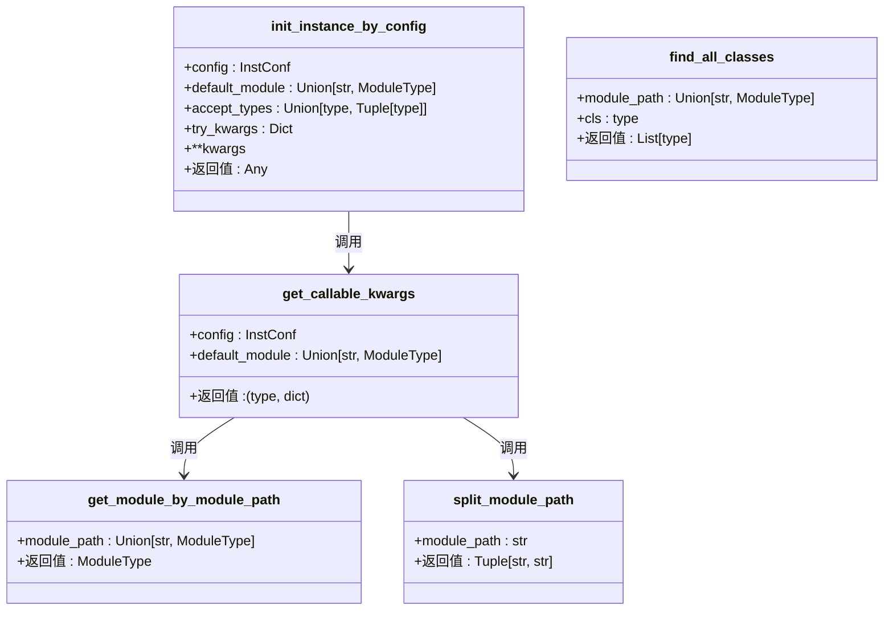
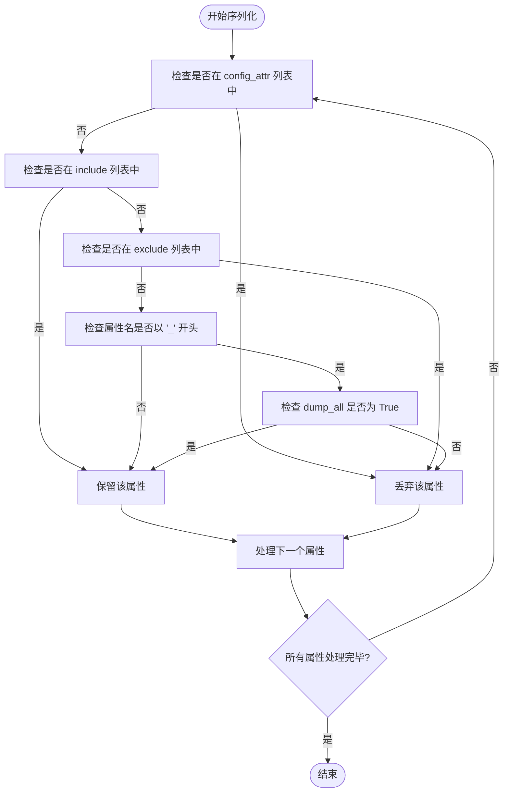
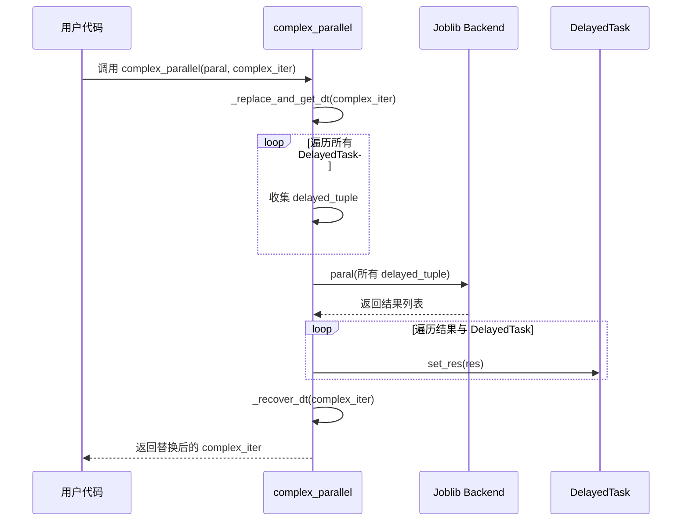

# 工具与辅助API

<cite>
**本文档中引用的文件**
- [mod.py](file://qlib/utils/mod.py)
- [serial.py](file://qlib/utils/serial.py)
- [paral.py](file://qlib/utils/paral.py)
- [file.py](file://qlib/utils/file.py)
- [workflow/recorder.py](file://qlib/workflow/recorder.py)
- [workflow/__init__.py](file://qlib/workflow/__init__.py)
</cite>

## 目录
1. [简介](#简介)
2. [核心功能概览](#核心功能概览)
3. [模块动态加载与插件架构](#模块动态加载与插件架构)
4. [序列化与反序列化实践](#序列化与反序列化实践)
5. [并行计算工具](#并行计算工具)
6. [文件操作工具](#文件操作工具)
7. [安全与性能考量](#安全与性能考量)
8. [总结](#总结)

## 简介
本文档旨在系统性地整理 Qlib 框架中的实用工具模块 API，涵盖序列化、并行计算、文件操作和模块动态加载等底层支持功能。重点阐述 `mod.ModuleType` 如何实现插件式架构，使用户能够注册自定义数据处理器或模型。同时详细说明 `get_module_by_name`、`save_objects`、`parallel_run` 等高频工具函数的使用方法与性能考量。

## 核心功能概览
Qlib 的 `utils` 模块提供了一套强大的底层工具集，主要分为四大类：
- **模块管理 (mod.py)**：实现动态导入、类查找和实例化，是插件架构的核心。
- **序列化 (serial.py)**：提供可配置的对象持久化机制，支持 pickle 和 dill 后端。
- **并行计算 (paral.py)**：基于 joblib 封装，支持复杂数据结构的并行处理。
- **文件操作 (file.py)**：提供临时文件、归档打包等高级文件操作接口。

这些工具共同构成了 Qlib 可扩展性和高性能的基础。

## 模块动态加载与插件架构

### mod.ModuleType 与插件式设计
Qlib 通过 `qlib.utils.mod` 模块实现了灵活的插件式架构。其核心在于 `init_instance_by_config` 函数，它允许从配置字典或字符串路径动态创建对象实例。这种设计使得用户可以轻松注册和使用自定义的数据处理器、模型或策略，而无需修改框架核心代码。



**图示来源**
- [mod.py](file://qlib/utils/mod.py#L0-L240)

#### 动态实例化流程
当调用 `init_instance_by_config` 时，系统会执行以下步骤：
1. 首先检查配置是否为可接受类型，若是则直接返回。
2. 若配置为文件路径（如 `file:///path/to/model.pkl`），则使用 pickle 反序列化加载对象。
3. 对于字典或字符串配置，通过 `get_callable_kwargs` 解析出目标类/函数及其参数。
4. 使用 `get_module_by_module_path` 加载指定模块。
5. 最终调用目标类构造函数并传入参数，完成实例化。

此机制广泛应用于 Qlib 的数据集、模型和策略组件的初始化。

#### 查找所有子类
`find_all_classes` 函数提供了强大的反射能力，可以在指定模块内递归查找所有继承自某个基类的子类。这对于自动发现和注册插件非常有用。例如，可以扫描 `qlib.contrib.data.handler` 模块，找出所有继承自 `DataHandler` 的自定义数据处理器。

**本节来源**
- [mod.py](file://qlib/utils/mod.py#L0-L240)

## 序列化与反序列化实践

### Serializable 类详解
`qlib.utils.serial.Serializable` 是一个基类，用于控制对象在序列化过程中的行为。它定义了精细的规则来决定哪些属性应该被保留或丢弃：



**图示来源**
- [serial.py](file://qlib/utils/serial.py#L0-L190)

#### 属性保留规则
属性保留遵循优先级顺序，从高到低如下：
1. 在 `config_attr` 列表中的属性（如 `_include`, `_exclude`）始终被丢弃。
2. 在 `include` 列表中的属性始终被保留。
3. 在 `exclude` 列表中的属性始终被丢弃。
4. 名称不以 `_` 开头的属性被保留。
5. 名称以 `_` 开头的属性仅在 `dump_all=True` 时被保留。

这使得像 `DataHandler` 这样的学习型组件可以在保存时只保留参数而忽略庞大的原始数据。

#### 安全反序列化指南
由于 Python 的 `pickle` 模块存在潜在的安全风险（反序列化恶意代码），Qlib 提供了以下最佳实践：
- **验证类型**：`Serializable.load` 方法在加载后会检查对象类型，确保其确实是预期的类实例，防止类型混淆攻击。
- **避免直接使用 pickle**：对于普通对象，推荐使用 `Serializable.general_dump` 和 `.load` 方法，它们封装了更安全的逻辑。
- **限制反序列化源**：仅从可信来源加载 `.pkl` 文件，避免加载用户上传或网络下载的未知文件。
- **使用 dill 后端需谨慎**：虽然 `dill` 可以序列化更多类型的对象，但它也带来了更大的安全风险，应仅在必要时启用。

**本节来源**
- [serial.py](file://qlib/utils/serial.py#L0-L190)

## 并行计算工具

### parallel_run 与 complex_parallel
Qlib 的并行计算工具主要封装在 `qlib.utils.paral` 模块中。`complex_parallel` 函数是其核心，它能够处理嵌套了 `joblib.delayed` 任务的复杂数据结构（如字典、列表），并将其所有延迟任务并行执行，最后用结果替换原任务。



**图示来源**
- [paral.py](file://qlib/utils/paral.py#L0-L333)

#### 高频数据分组应用
`datetime_groupby_apply` 函数专为金融时间序列设计，它将 DataFrame 按时间索引（如月度 "ME"）进行重采样，然后对每个分组应用指定函数，并利用多进程并行处理。这极大地加速了对大规模历史数据的批处理任务。

#### 子进程隔离执行
`call_in_subproc` 类提供了一种在独立子进程中运行函数的方法。这对于解决内存泄漏问题特别有效，因为每次调用后子进程都会完全退出，释放所有资源。它通过 `concurrent.futures.ProcessPoolExecutor` 实现，确保了良好的跨平台兼容性。

**本节来源**
- [paral.py](file://qlib/utils/paral.py#L0-L333)

## 文件操作工具

### 高级文件操作
`qlib.utils.file` 模块提供了几个上下文管理器，简化了常见的文件操作模式。

#### 多部分文件保存
`save_multiple_parts_file` 允许用户在一个临时目录中创建多个文件，然后将整个目录打包成一个单一的归档文件（如 .tar.gz）。这对于保存包含多个相关文件的模型或实验结果非常方便。

#### 归档文件解包
`unpack_archive_with_buffer` 接收一个字节缓冲区（代表一个归档文件），将其写入临时文件，解压到临时目录，然后将目录路径提供给用户进行操作。操作完成后，所有临时文件和目录都会被自动清理。

#### 获取 IO 对象
`get_io_object` 是一个通用的上下文管理器，它能统一处理 `IO` 对象、字符串路径和 `Path` 对象，为上层代码提供一致的文件读写接口。

**本节来源**
- [file.py](file://qlib/utils/file.py#L0-L191)

## 安全与性能考量

### save_objects API 分析
`save_objects` 是 Qlib 实验管理中的关键 API，用于将对象（如模型、预测结果）作为工件保存到后端存储。它有两种使用方式：
1. **直接传递对象**：通过关键字参数（如 `R.save_objects(model=my_model)`），对象会被 `Serializable.general_dump` 序列化后上传。
2. **指定本地路径**：通过 `local_path` 参数，直接上传指定的文件或目录。

```mermaid
graph TB
subgraph "QlibRecorder.save_objects"
A[调用 R.save_objects] --> B{local_path 和 kwargs?}
B --> |两者都提供| C[抛出 ValueError]
B --> |仅 local_path| D[调用 MLflow log_artifact(s)]
B --> |仅 kwargs| E[创建临时目录]
E --> F[遍历 kwargs]
F --> G[Serializable.general_dump(data, path)]
G --> H[MLflow log_artifact]
H --> I[删除临时目录]
end
```

**图示来源**
- [workflow/__init__.py](file://qlib/workflow/__init__.py#L480-L533)
- [workflow/recorder.py](file://qlib/workflow/recorder.py#L396-L410)

#### 避免多进程资源竞争
在使用 `joblib` 或 `ProcessPoolExecutor` 进行并行计算时，应注意以下几点以避免资源竞争：
- **共享状态**：尽量避免在并行任务间共享可变状态。如果必须共享，应使用 `multiprocessing` 模块提供的同步原