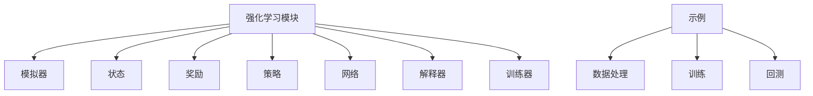
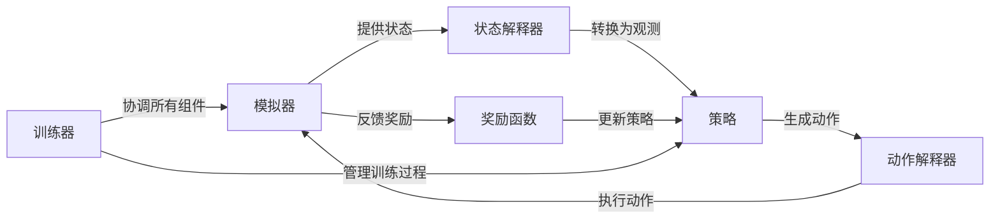
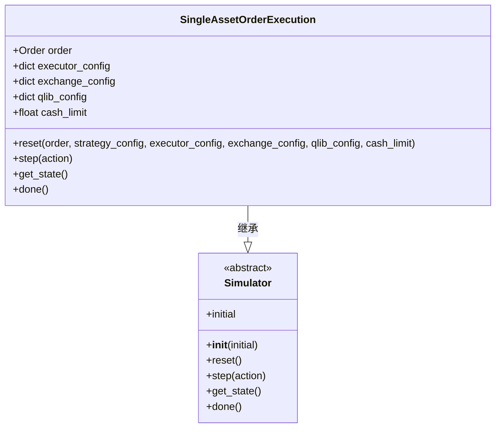
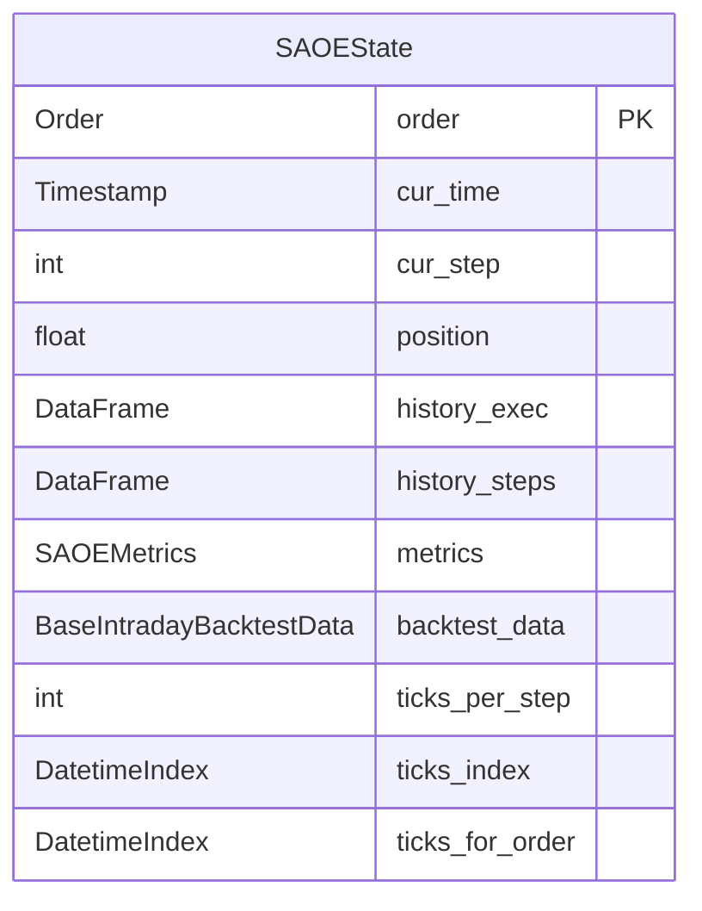
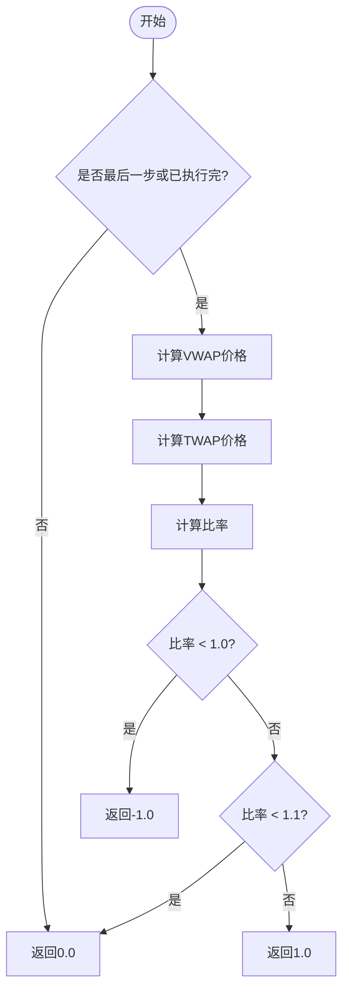
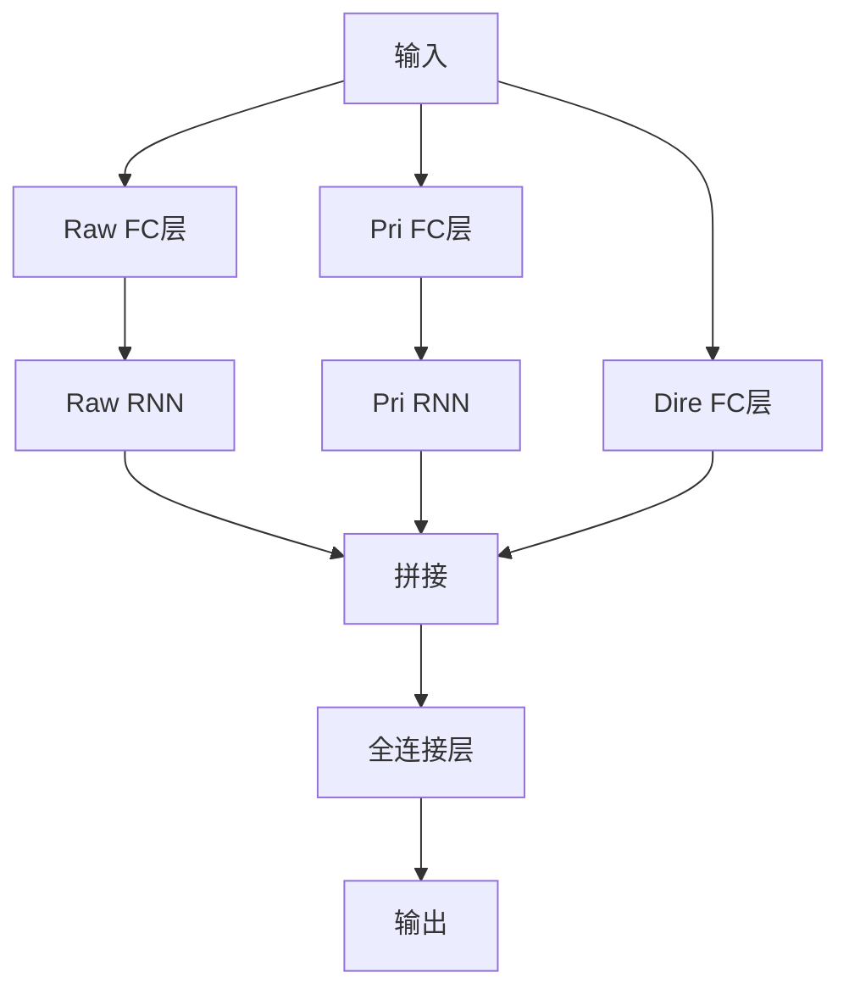
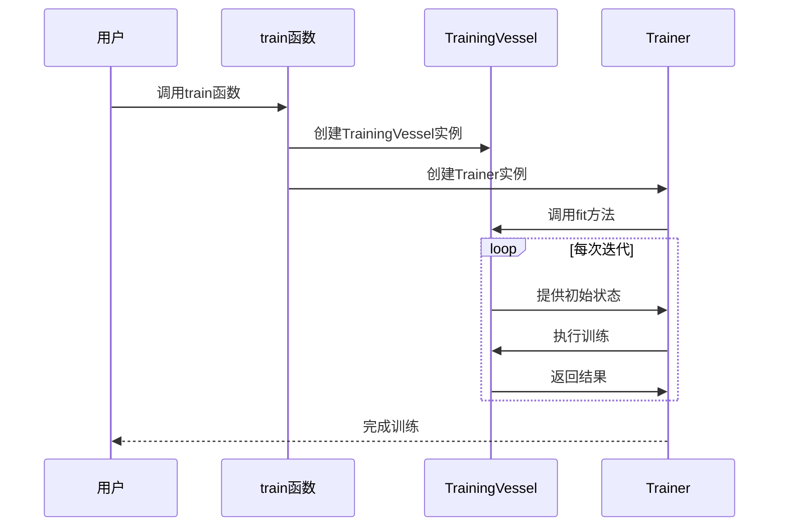
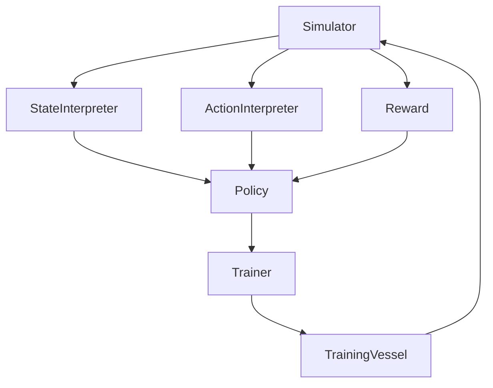

# 强化学习API

<cite>
**本文档中引用的文件**  
- [simulator_qlib.py](file://qlib/rl/order_execution/simulator_qlib.py)
- [state.py](file://qlib/rl/order_execution/state.py)
- [reward.py](file://qlib/rl/order_execution/reward.py)
- [policy.py](file://qlib/rl/order_execution/policy.py)
- [network.py](file://qlib/rl/order_execution/network.py)
- [interpreter.py](file://qlib/rl/order_execution/interpreter.py)
- [trainer.py](file://qlib/rl/trainer/trainer.py)
- [api.py](file://qlib/rl/trainer/api.py)
- [README.md](file://examples/rl_order_execution/README.md)
</cite>

## 目录
1. [简介](#简介)
2. [项目结构](#项目结构)
3. [核心组件](#核心组件)
4. [架构概述](#架构概述)
5. [详细组件分析](#详细组件分析)
6. [依赖分析](#依赖分析)
7. [性能考量](#性能考量)
8. [故障排除指南](#故障排除指南)
9. [结论](#结论)

## 简介
本文档旨在为基于Qlib框架的强化学习（RL）模块提供专业的API文档，重点聚焦于订单执行场景下的环境、策略与训练接口。文档详细描述了如何使用`SimulatorQLib`对接市场数据，并定义状态空间、动作空间与奖励函数。同时说明了PPO、OPDS等策略网络的配置方式，以及如何利用`Trainer`进行离线训练和在线评估。此外，还提供了从原始行情数据构建RL训练集的完整流程示例，并强调了有限horizon环境、episode重置机制等特殊设计要点。

## 项目结构
该强化学习模块位于`qlib/rl/order_execution`目录下，主要包含模拟器、状态、奖励、策略、网络、解释器及训练器等核心组件。相关示例和配置文件位于`examples/rl_order_execution`目录中，用于演示完整的训练与回测流程。

**Diagram sources**
- [simulator_qlib.py](file://qlib/rl/order_execution/simulator_qlib.py)
- [state.py](file://qlib/rl/order_execution/state.py)
- [reward.py](file://qlib/rl/order_execution/reward.py)
- [policy.py](file://qlib/rl/order_execution/policy.py)
- [network.py](file://qlib/rl/order_execution/network.py)
- [interpreter.py](file://qlib/rl/order_execution/interpreter.py)
- [trainer.py](file://qlib/rl/trainer/trainer.py)
- [api.py](file://qlib/rl/trainer/api.py)

**Section sources**
- [simulator_qlib.py](file://qlib/rl/order_execution/simulator_qlib.py)
- [state.py](file://qlib/rl/order_execution/state.py)
- [reward.py](file://qlib/rl/order_execution/reward.py)
- [policy.py](file://qlib/rl/order_execution/policy.py)
- [network.py](file://qlib/rl/order_execution/network.py)
- [interpreter.py](file://qlib/rl/order_execution/interpreter.py)
- [trainer.py](file://qlib/rl/trainer/trainer.py)
- [api.py](file://qlib/rl/trainer/api.py)

## 核心组件
本节将深入分析强化学习模块中的各个核心组件，包括模拟器、状态、奖励、策略、网络、解释器和训练器。

**Section sources**
- [simulator_qlib.py](file://qlib/rl/order_execution/simulator_qlib.py)
- [state.py](file://qlib/rl/order_execution/state.py)
- [reward.py](file://qlib/rl/order_execution/reward.py)
- [policy.py](file://qlib/rl/order_execution/policy.py)
- [network.py](file://qlib/rl/order_execution/network.py)
- [interpreter.py](file://qlib/rl/order_execution/interpreter.py)
- [trainer.py](file://qlib/rl/trainer/trainer.py)
- [api.py](file://qlib/rl/trainer/api.py)

## 架构概述
整个强化学习系统的架构由多个相互协作的组件构成，主要包括模拟器、状态解释器、动作解释器、策略网络、奖励函数和训练器。这些组件共同作用，实现对订单执行过程的建模与优化。

**Diagram sources**
- [simulator_qlib.py](file://qlib/rl/order_execution/simulator_qlib.py)
- [interpreter.py](file://qlib/rl/order_execution/interpreter.py)
- [policy.py](file://qlib/rl/order_execution/policy.py)
- [reward.py](file://qlib/rl/order_execution/reward.py)
- [trainer.py](file://qlib/rl/trainer/trainer.py)

## 详细组件分析
### 模拟器分析
`SingleAssetOrderExecution`类是基于Qlib回测工具实现的单资产订单执行模拟器。它通过初始化一个订单作为起点，结合执行器配置、交易所配置和Qlib配置来创建一个完整的交易环境。

#### 对象关系图

**Diagram sources**
- [simulator_qlib.py](file://qlib/rl/order_execution/simulator_qlib.py)

**Section sources**
- [simulator_qlib.py](file://qlib/rl/order_execution/simulator_qlib.py)

### 状态分析
`SAOEState`类定义了订单执行过程中每个时间步的状态信息，包括当前时间、剩余待执行数量、历史执行记录等。

#### 数据结构

**Diagram sources**
- [state.py](file://qlib/rl/order_execution/state.py)

**Section sources**
- [state.py](file://qlib/rl/order_execution/state.py)

### 奖励函数分析
系统提供了两种奖励函数：`PAPenaltyReward`和`PPOReward`，分别对应不同的优化目标。

#### 流程图

**Diagram sources**
- [reward.py](file://qlib/rl/order_execution/reward.py)

**Section sources**
- [reward.py](file://qlib/rl/order_execution/reward.py)

### 策略网络分析
策略网络采用RNN架构，将输入分为公共变量和私有变量两部分，分别由`raw_rnn`和`pri_rnn`处理。

#### 网络结构

**Diagram sources**
- [network.py](file://qlib/rl/order_execution/network.py)

**Section sources**
- [network.py](file://qlib/rl/order_execution/network.py)

### 训练流程分析
训练流程通过`train`函数协调所有组件，实现并行化的策略训练。

#### 序列图

**Diagram sources**
- [api.py](file://qlib/rl/trainer/api.py)
- [trainer.py](file://qlib/rl/trainer/trainer.py)

**Section sources**
- [api.py](file://qlib/rl/trainer/api.py)
- [trainer.py](file://qlib/rl/trainer/trainer.py)

## 依赖分析
各组件之间的依赖关系如下所示：

**Diagram sources**
- [simulator_qlib.py](file://qlib/rl/order_execution/simulator_qlib.py)
- [interpreter.py](file://qlib/rl/order_execution/interpreter.py)
- [policy.py](file://qlib/rl/order_execution/policy.py)
- [reward.py](file://qlib/rl/order_execution/reward.py)
- [trainer.py](file://qlib/rl/trainer/trainer.py)
- [api.py](file://qlib/rl/trainer/api.py)

**Section sources**
- [simulator_qlib.py](file://qlib/rl/order_execution/simulator_qlib.py)
- [interpreter.py](file://qlib/rl/order_execution/interpreter.py)
- [policy.py](file://qlib/rl/order_execution/policy.py)
- [reward.py](file://qlib/rl/order_execution/reward.py)
- [trainer.py](file://qlib/rl/trainer/trainer.py)
- [api.py](file://qlib/rl/trainer/api.py)

## 性能考量
在实际应用中，需要注意以下几点以确保最佳性能：
- 使用适当的并发数（concurrency）以充分利用多核CPU资源。
- 合理设置最大迭代次数（max_iters）和验证频率（val_every_n_iters）。
- 在调试阶段可启用fast_dev_run选项以快速验证代码逻辑。

## 故障排除指南
常见问题及解决方案：
- **NaN奖励值**：检查输入数据是否存在异常值或缺失值。
- **内存泄漏**：确保及时释放不再使用的向量环境对象。
- **训练不稳定**：调整学习率（lr）和其他超参数。

**Section sources**
- [trainer.py](file://qlib/rl/trainer/trainer.py)
- [reward.py](file://qlib/rl/order_execution/reward.py)

## 结论
本文档全面介绍了基于Qlib框架的强化学习模块，涵盖了从环境搭建到模型训练的全过程。通过合理配置各项参数并遵循最佳实践，可以有效提升订单执行策略的表现。