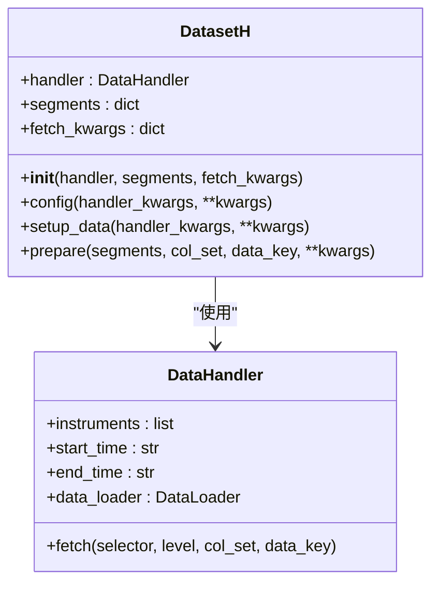
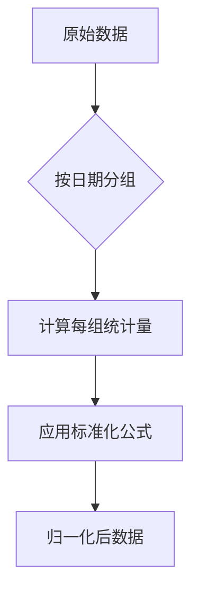
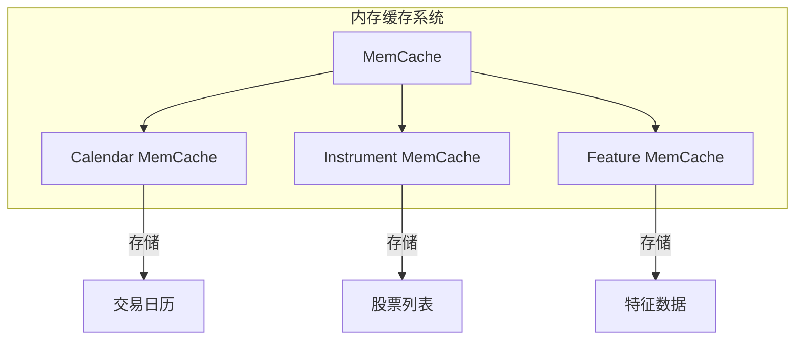
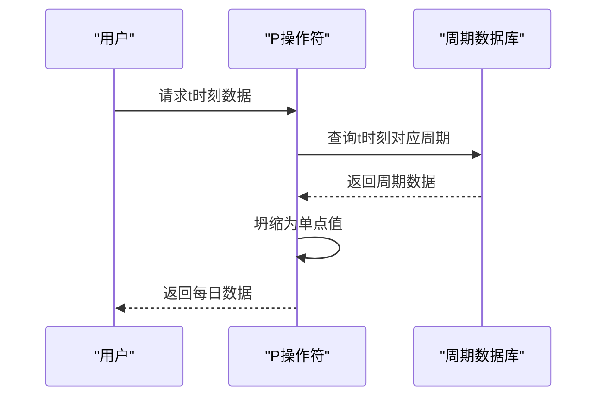
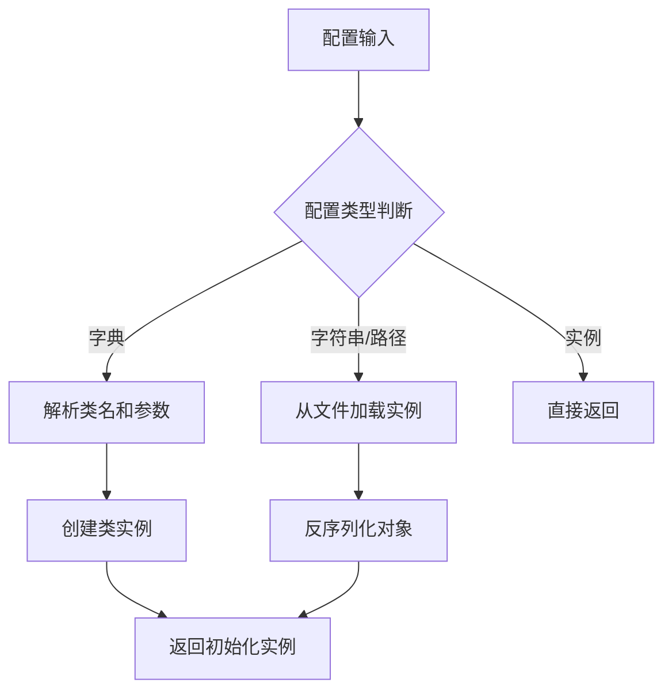

# 数据模块API

<cite>
**本文档中引用的文件**
- [__init__.py](file://qlib/data/__init__.py)
- [cache.py](file://qlib/data/cache.py)
- [data.py](file://qlib/data/data.py)
- [dataset/__init__.py](file://qlib/data/dataset/__init__.py)
- [dataset/handler.py](file://qlib/data/dataset/handler.py)
- [dataset/loader.py](file://qlib/data/dataset/loader.py)
- [dataset/processor.py](file://qlib/data/dataset/processor.py)
- [pit.py](file://qlib/data/pit.py)
- [mod.py](file://qlib/utils/mod.py)
</cite>

## 目录
1. [简介](#简介)
2. [核心组件](#核心组件)
3. [数据加载器（DataLoader）](#数据加载器dataloder)
4. [数据集构建（Dataset）](#数据集构建dataset)
5. [特征处理器（Processor）](#特征处理器processor)
6. [缓存机制（H）](#缓存机制h)
7. [PIT一致性保障机制](#pit一致性保障机制)
8. [初始化配置与init_instance_by_config](#初始化配置与init_instance_by_config)
9. [常见问题解决方案](#常见问题解决方案)
10. [高性能数据访问模式](#高性能数据访问模式)

## 简介
Qlib的数据模块提供了一套完整的金融数据处理框架，支持从原始数据加载到特征工程、数据集构建和缓存管理的全流程。该模块通过分层设计实现了高度可扩展性和灵活性，允许用户以编程方式或YAML配置文件定义复杂的数据流水线。核心功能包括基于表达式的特征计算、跨截面标准化、时间序列预处理以及高效的磁盘/内存缓存机制。

本API参考文档详细说明了`qlib.data`包中导出的核心类和函数，重点介绍数据加载、数据集构建、特征处理和缓存机制的关键接口。文档还深入解析了`init_instance_by_config`在组件初始化中的作用，并提供了针对数据路径未挂载、缓存冲突等常见问题的解决方案。

## 核心组件

Qlib数据模块由多个协同工作的核心组件构成，形成一个完整的数据处理流水线。这些组件通过清晰的接口定义实现松耦合，支持灵活组合和扩展。主要组件包括数据加载器（DataLoader）、数据处理器（Processor）、数据集（Dataset）和缓存系统（Cache），它们共同完成从原始数据到模型输入的转换过程。

**本文档中引用的文件**
- [__init__.py](file://qlib/data/__init__.py)
- [dataset/__init__.py](file://qlib/data/dataset/__init__.py)
- [dataset/handler.py](file://qlib/data/dataset/handler.py)

## 数据加载器（DataLoder）

### QlibDataLoader
`QlibDataLoader`是Qlib框架中最常用的数据加载器，负责从底层数据源加载原始金融数据。它通过配置化的字段定义支持灵活的特征选择和重命名。

```python
from qlib.data.dataset.loader import QlibDataLoader

# 配置示例
config = {
    "feature": (["$open", "$high", "$low", "$close"], ["OPEN", "HIGH", "LOW", "CLOSE"]),
    "label": (["Ref($close, -2)/Ref($close, -1) - 1"], ["LABEL0"])
}
data_loader = QlibDataLoader(config=config, freq="day")
```

**参数说明：**
- `config`: 字段配置，支持字典格式（分组）或列表格式
- `filter_pipe`: 用于过滤股票池的管道
- `swap_level`: 是否交换多级索引顺序，默认为True返回<datetime, instrument>顺序
- `freq`: 数据频率，支持"day"、"week"等
- `inst_processors`: 每只股票的数据处理器列表

**Section sources**
- [loader.py](file://qlib/data/dataset/loader.py#L1-L414)

### StaticDataLoader
`StaticDataLoader`用于从文件或内存对象加载静态数据，适用于已经预处理好的数据集。

```python
from qlib.data.dataset.loader import StaticDataLoader

# 从DataFrame加载
static_loader = StaticDataLoader(config=df)

# 从文件加载
static_loader = StaticDataLoader(config="path/to/data.pkl")
```

**Section sources**
- [loader.py](file://qlib/data/dataset/loader.py#L200-L250)

### NestedDataLoader
`NestedDataLoader`允许组合多个数据加载器，实现多源数据融合。

```python
from qlib.data.dataset.loader import NestedDataLoader

nested_loader = NestedDataLoader(
    dataloader_l=[
        {"class": "Alpha158DL"},
        {"class": "Alpha360DL", "kwargs": {"config": {...}}}
    ]
)
```

**Section sources**
- [loader.py](file://qlib/data/dataset/loader.py#L300-L350)

## 数据集构建（Dataset）

### DatasetH
`DatasetH`是基于数据处理器（Handler）构建数据集的核心类，将数据加载和预处理逻辑分离。



**Diagram sources**
- [dataset/__init__.py](file://qlib/data/dataset/__init__.py#L100-L200)
- [handler.py](file://qlib/data/dataset/handler.py#L100-L200)

### TSDatasetH
`TSDatasetH`专门用于构建时间序列数据集，自动处理滑动窗口和样本生成。

```python
from qlib.data.dataset import TSDatasetH

ts_dataset = TSDatasetH(
    handler=handler_config,
    segments={"train": ("2008-01-01", "2014-12-31")},
    step_len=30  # 时间步长
)
```

**关键参数：**
- `step_len`: 时间序列长度，默认30
- `flt_col`: 用于过滤数据的列名
- `segments`: 数据分割配置

**Section sources**
- [dataset/__init__.py](file://qlib/data/dataset/__init__.py#L500-L600)

## 特征处理器（Processor）

### 标准化处理器
Qlib提供了多种特征标准化处理器，用于消除量纲影响。

#### MinMaxNorm
最小-最大值归一化处理器：

```python
from qlib.data.dataset.processor import MinMaxNorm

processor = MinMaxNorm(
    fit_start_time="2008-01-01",
    fit_end_time="2012-12-31",
    fields_group="feature"
)
```

#### ZScoreNorm
Z-Score标准化处理器：

```python
from qlib.data.dataset.processor import ZScoreNorm

processor = ZScoreNorm(
    fit_start_time="2008-01-01",
    fit_end_time="2012-12-31",
    fields_group="feature"
)
```

**Section sources**
- [processor.py](file://qlib/data/dataset/processor.py#L200-L300)

### 跨截面处理器
跨截面处理器在每个时间点对所有股票进行操作。

#### CSRankNorm
跨截面排名归一化：

```python
from qlib.data.dataset.processor import CSRankNorm

cs_rank_norm = CSRankNorm(fields_group="feature")
```

#### CSZScoreNorm
跨截面Z-Score归一化：

```python
from qlib.data.dataset.processor import CSZScoreNorm

cs_zscore_norm = CSZScoreNorm(fields_group="feature")
```



**Diagram sources**
- [processor.py](file://qlib/data/dataset/processor.py#L350-L400)

### 缺失值处理
处理NaN和无穷大值的处理器：

```python
from qlib.data.dataset.processor import Fillna, ProcessInf

# 填充缺失值
fillna_proc = Fillna(fields_group="feature", fill_value=0)

# 处理无穷大值
process_inf_proc = ProcessInf()
```

**Section sources**
- [processor.py](file://qlib/data/dataset/processor.py#L150-L200)

## 缓存机制（H）

### 内存缓存（MemCache）
Qlib使用三级内存缓存系统优化频繁访问的数据：



**Diagram sources**
- [cache.py](file://qlib/data/cache.py#L100-L200)

### 磁盘缓存
磁盘缓存机制支持表达式和数据集级别的持久化缓存。

#### DiskExpressionCache
表达式级别缓存，按股票和特征存储：

```python
from qlib.data.cache import DiskExpressionCache

expr_cache = DiskExpressionCache(provider=expression_provider)
```

#### DiskDatasetCache
数据集级别缓存，提高大数据集加载效率：

```python
from qlib.data.cache import DiskDatasetCache

dataset_cache = DiskDatasetCache(provider=dataset_provider)
```

**Section sources**
- [cache.py](file://qlib/data/cache.py#L500-L700)

## PIT一致性保障机制

### P操作符
PIT（Point-in-Time）机制确保历史数据的一致性，避免未来信息泄露。

```python
from qlib.data.pit import P

# 将季度财报数据转换为每日数据
roewa_daily = P("$$roewa_q")
```

**工作原理：**
1. 对每个观察时间点t，查找对应的周期数据
2. 将周期数据"坍缩"为单个观测值
3. 构建完整的时序数据集



**Diagram sources**
- [pit.py](file://qlib/data/pit.py#L1-L50)

### PRef操作符
支持引用历史周期数据：

```python
from qlib.data.pit import PRef

# 获取上一季度的ROE
prev_roe = PRef("$$roewa_q", period=-1)
```

**Section sources**
- [pit.py](file://qlib/data/pit.py#L50-L70)

## 初始化配置与init_instance_by_config

### init_instance_by_config函数
`init_instance_by_config`是Qlib组件初始化的核心工具函数，支持多种配置格式。

```python
from qlib.utils.mod import init_instance_by_config

# 配置字典
config = {
    "class": "MinMaxNorm",
    "kwargs": {
        "fit_start_time": "2008-01-01",
        "fit_end_time": "2012-12-31"
    }
}

processor = init_instance_by_config(config)
```

**参数说明：**
- `config`: 配置信息，支持字符串、路径、字典或实例
- `default_module`: 默认模块，用于解析类名
- `accept_types`: 接受的类型，若config是这些类型的实例则直接返回
- `try_kwargs`: 尝试传递的额外参数



**Diagram sources**
- [mod.py](file://qlib/utils