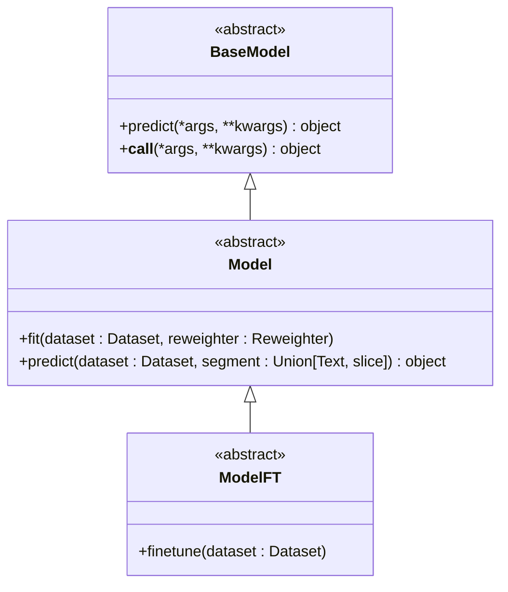

# 模型模块API

<cite>
**本文档中引用的文件**   
- [BaseModel](file://qlib/model/base.py#L9-L18)
- [Model](file://qlib/model/base.py#L21-L77)
- [ModelFT](file://qlib/model/base.py#L80-L109)
- [Trainer](file://qlib/model/trainer.py#L130-L205)
- [TrainerR](file://qlib/model/trainer.py#L208-L289)
- [TrainerRM](file://qlib/model/trainer.py#L340-L487)
- [DelayTrainerR](file://qlib/model/trainer.py#L292-L337)
- [DelayTrainerRM](file://qlib/model/trainer.py#L490-L618)
- [Recorder](file://qlib/workflow/recorder.py#L27-L243)
- [mod.py](file://qlib/utils/mod.py)
</cite>

## 目录
1. [模型定义与继承结构](#模型定义与继承结构)
2. [训练流程与预测接口](#训练流程与预测接口)
3. [不同模型类型的关键参数](#不同模型类型的关键参数)
4. [训练回调机制](#训练回调机制)
5. [自定义模型注册与实验记录](#自定义模型注册与实验记录)
6. [典型错误排查方法](#典型错误排查方法)

## 模型定义与继承结构

`qlib.model`模块中的核心基类是`BaseModel`，它继承自`Serializable`并使用抽象基类元类。所有可学习的模型都应继承自`Model`类，该类扩展了`BaseModel`并引入了`fit`和`predict`方法。对于支持微调的模型，可以继承`ModelFT`类，该类提供了`finetune`方法。



**图源**
- [base.py](file://qlib/model/base.py#L9-L109)

**本节来源**
- [base.py](file://qlib/model/base.py#L9-L109)

## 训练流程与预测接口

训练流程由`Trainer`类及其子类管理。`Trainer`是一个抽象基类，定义了`train`和`end_train`方法。`TrainerR`和`TrainerRM`是具体的实现，分别用于线性训练和基于任务管理器的多进程训练。`Recorder`类用于记录实验，其API设计类似于mlflow。

```mermaid