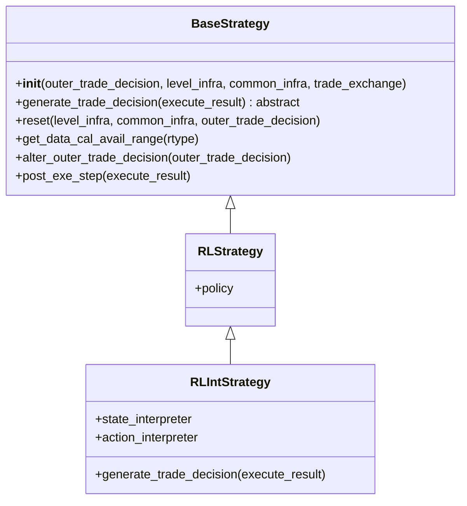
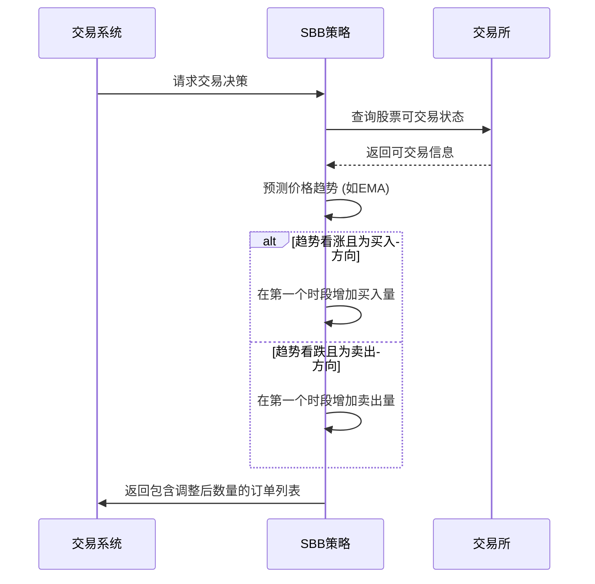
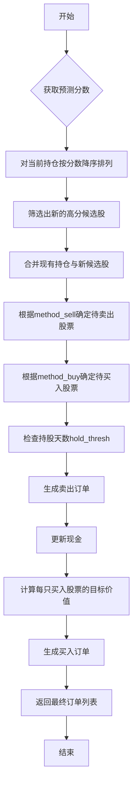
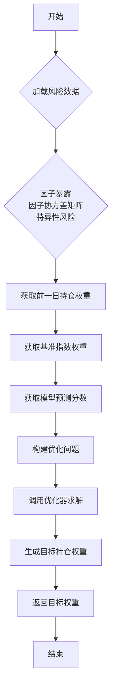

# 策略模块API

<cite>
**本文档中引用的文件**  
- [base.py](file://qlib/strategy/base.py)
- [rule_strategy.py](file://qlib/contrib/strategy/rule_strategy.py)
- [signal_strategy.py](file://qlib/contrib/strategy/signal_strategy.py)
- [cost_control.py](file://qlib/contrib/strategy/cost_control.py)
- [config_enhanced_indexing.yaml](file://examples/portfolio/config_enhanced_indexing.yaml)
- [workflow.py](file://examples/nested_decision_execution/workflow.py)
</cite>

## 目录
1. [简介](#简介)
2. [策略体系概览](#策略体系概览)
3. [基类设计原则](#基类设计原则)
4. [规则型策略](#规则型策略)
5. [信号驱动型策略](#信号驱动型策略)
6. [投资组合优化型策略](#投资组合优化型策略)
7. [交易指令生成机制](#交易指令生成机制)
8. [成本控制与换仓限制](#成本控制与换仓限制)
9. [多策略组合与嵌套执行](#多策略组合与嵌套执行)
10. [风险提示](#风险提示)

## 简介
本API文档详细介绍了Qlib框架中的策略模块，涵盖三大核心策略体系：规则型、信号驱动型和投资组合优化型。文档阐述了`Strategy`基类的设计原则，并深入分析了如TopkDropoutStrategy、EnhancedIndexingStrategy等具体策略的配置参数与行为差异。同时，文档展示了如何将模型输出的分数映射为实际交易指令，并介绍了成本控制、换仓频率限制等功能的实现方式。通过真实配置文件片段，演示了多策略组合与嵌套决策执行的高级模式。

## 策略体系概览
Qlib的策略模块提供了多层次的策略实现，以满足不同的量化投资需求：
- **规则型策略 (Rule-based)**: 基于预定义的市场规则（如TWAP、SBB）进行交易。
- **信号驱动型策略 (Signal-driven)**: 依赖模型预测的信号（如Alpha分数）来指导投资组合调整。
- **投资组合优化型策略 (Portfolio Optimization)**: 结合主动管理与被动跟踪，在追求超额收益的同时严格控制风险暴露。

这些策略均继承自统一的`BaseStrategy`基类，确保了接口的一致性和可扩展性。

## 基类设计原则
所有策略都继承自`BaseStrategy`类，该类定义了策略的核心接口和共享基础设施。



**Diagram sources**
- [base.py](file://qlib/strategy/base.py#L22-L236)

**Section sources**
- [base.py](file://qlib/strategy/base.py#L22-L236)

### 核心方法
- `generate_trade_decision`: 抽象方法，是每个策略必须实现的核心逻辑，用于在每个交易周期生成交易决策。
- `reset`: 用于重置策略的共享基础设施，如交易日历、账户信息等。
- `get_data_cal_avail_range`: 获取策略可用的数据范围，考虑了外部策略决策的限制。

### 属性访问
策略通过属性访问器便捷地获取运行时环境：
- `trade_calendar`: 访问交易日历管理器。
- `trade_position`: 访问当前持仓。
- `trade_exchange`: 访问交易所实例，用于查询行情和执行订单。

## 规则型策略
规则型策略直接基于时间或价格趋势等简单规则生成交易指令。

### TWAP策略
时间加权平均价格（TWAP）策略将一个大额订单拆分成多个小额订单，并在指定的时间段内均匀执行，旨在减少市场冲击。

### SBB策略
选择更好时机（Select the Better Bar）策略利用技术指标（如EMA）预测相邻两个交易时段的价格趋势，并据此决定在哪个时段买入或卖出。



**Diagram sources**
- [rule_strategy.py](file://qlib/contrib/strategy/rule_strategy.py#L1-L673)

**Section sources**
- [rule_strategy.py](file://qlib/contrib/strategy/rule_strategy.py#L1-L673)

## 信号驱动型策略
信号驱动型策略以模型产生的预测信号为基础，动态调整投资组合。

### TopkDropoutStrategy
这是最典型的信号驱动策略，其工作流程如下：



**Diagram sources**
- [signal_strategy.py](file://qlib/contrib/strategy/signal_strategy.py#L74-L294)

**Section sources**
- [signal_strategy.py](file://qlib/contrib/strategy/signal_strategy.py#L74-L294)

#### 关键配置参数
| 参数 | 类型 | 默认值 | 说明 |
| :--- | :--- | :--- | :--- |
| `topk` | int | - | 投资组合的目标股票数量。 |
| `n_drop` | int | - | 每个交易日计划替换的股票数量。 |
| `method_sell` | str | "bottom" | 卖出方法："bottom"（淘汰分数最低的）或"random"（随机）。 |
| `method_buy` | str | "top" | 买入方法："top"（买入分数最高的）或"random"（随机）。 |
| `hold_thresh` | int | 1 | 最小持有天数，防止频繁交易。 |
| `only_tradable` | bool | False | 是否仅在可交易时才进行买卖决策。 |
| `forbid_all_trade_at_limit` | bool | True | 达到涨跌停时是否禁止所有交易。 |

## 投资组合优化型策略
增强型指数化（Enhanced Indexing）策略旨在跑赢基准指数，同时控制跟踪误差。

### EnhancedIndexingStrategy
该策略利用风险模型数据进行优化求解。



**Diagram sources**
- [signal_strategy.py](file://qlib/contrib/strategy/signal_strategy.py#L374-L521)

**Section sources**
- [signal_strategy.py](file://qlib/contrib/strategy/signal_strategy.py#L374-L521)

#### 关键配置参数
| 参数 | 类型 | 默认值 | 说明 |
| :--- | :--- | :--- | :--- |
| `riskmodel_root` | str | - | 风险模型数据的根目录路径。 |
| `market` | str | "csi500" | 基准指数名称（如csi500）。 |
| `turn_limit` | float | None | 换手率限制。 |
| `name_mapping` | dict | {} | 风险模型文件名的映射字典。 |
| `optimizer_kwargs` | dict | {} | 传递给优化器的额外参数。 |
| `verbose` | bool | False | 是否打印详细的优化日志。 |

## 交易指令生成机制
策略通过`generate_trade_decision`方法将内部逻辑转化为具体的交易指令（`Order`对象）。

1.  **信号获取**: 策略首先从`self.signal`中获取下一个交易周期的预测信号。
2.  **逻辑计算**: 根据策略类型（TopK、优化等），计算需要买入和卖出的股票及数量。
3.  **订单创建**: 使用`OrderHelper`创建`Order`对象，指定股票代码、数量、方向和时间窗口。
4.  **决策封装**: 将生成的订单列表封装在`TradeDecisionWO`对象中返回。

此过程确保了从抽象的“分数”到具体的“交易动作”的可靠映射。

## 成本控制与换仓限制
策略模块内置了多种机制来模拟真实交易环境的成本和约束。

### 成本控制
- **交易费用**: 在`exchange_kwargs`中配置`open_cost`（开仓费）和`close_cost`（平仓费）。
- **最小成本**: 设置`min_cost`以模拟佣金下限。
- **滑点**: 可通过配置影响成交价格。

### 换仓频率限制
- **hold_thresh**: `TopkDropoutStrategy`中的参数，强制股票至少持有一定天数。
- **time_per_step**: 执行器（Executor）的配置，决定了策略执行的频率（如日频、分钟级）。

这些功能共同作用，使回测结果更贴近实盘表现。

## 多策略组合与嵌套执行
通过嵌套执行器（NestedExecutor），可以实现复杂的多层级决策。

### 配置示例
以下是从`workflow.py`中提取的嵌套执行配置片段：

```yaml
executor:
  class: NestedExecutor
  module_path: qlib.backtest.executor
  kwargs:
    time_per_step: day
    inner_executor:
      class: NestedExecutor
      module_path: qlib.backtest.executor
      kwargs:
        time_per_step: 30min
        inner_executor:
          class: SimulatorExecutor
          module_path: qlib.backtest.executor
          kwargs:
            time_per_step: 5min
        inner_strategy:
          class: TWAPStrategy
          module_path: qlib.contrib.strategy.rule_strategy
    inner_strategy:
      class: SBBStrategyEMA
      module_path: qlib.contrib.strategy.rule_strategy
      kwargs:
        instruments: csi300
        freq: 1min
```

### 执行流程
1.  **外层策略**: `SBBStrategyEMA`在日线级别做出宏观决策。
2.  **中层执行**: `NestedExecutor`接收日线决策，并将其交给`TWAPStrategy`。
3.  **内层执行**: `TWAPStrategy`在30分钟级别将大单拆解执行。
4.  **底层执行**: `SimulatorExecutor`在5分钟粒度上完成最终的订单撮合。

这种模式允许用户在不同时间尺度上应用不同的策略，实现精细化的交易管理。

**Section sources**
- [workflow.py](file://examples/nested_decision_execution/workflow.py#L1-L395)

## 风险提示
在使用策略模块时，需警惕以下风险：

- **策略漂移 (Strategy Drift)**: 模型过拟合或市场结构变化可能导致策略失效。建议定期重新训练模型并监控策略表现。
- **过拟合风险 (Overfitting Risk)**: 在历史数据上表现优异的策略可能在未来表现不佳。应使用严格的交叉验证和样本外测试。
- **参数敏感性**: 如`topk`、`n_drop`等参数的选择对结果影响巨大，需进行充分的参数敏感性分析。
- **数据质量**: 回测结果高度依赖于输入数据的质量，包括行情数据、财务数据和风险模型数据。