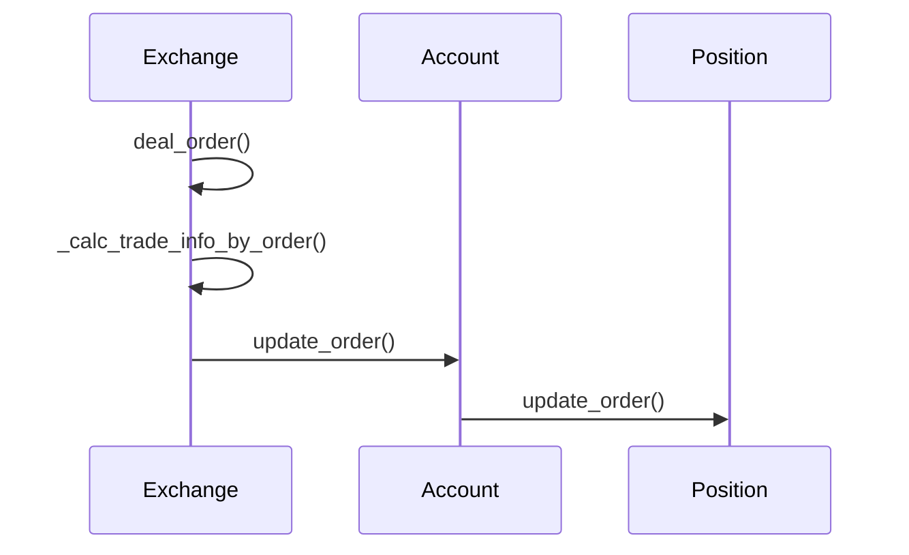

# 交易成本计算

<cite>
**本文档中引用的文件**
- [exchange.py](file://qlib/backtest/exchange.py)
- [account.py](file://qlib/backtest/account.py)
- [position.py](file://qlib/backtest/position.py)
</cite>

## 目录
1. [交易成本构成与参数机制](#交易成本构成与参数机制)
2. [典型费率配置示例](#典型费率配置示例)
3. [最小手续费min_cost的作用机制](#最小手续费min_cost的作用机制)
4. [成本计算链路追踪](#成本计算链路追踪)
5. [自定义成本结构扩展接口](#自定义成本结构扩展接口)
6. [常见错误配置及其影响](#常见错误配置及其影响)

## 交易成本构成与参数机制

在Exchange模块中，交易成本由三个核心参数构成：open_cost（开仓费率）、close_cost（平仓费率）和min_cost（最低手续费）。这些参数在`Exchange`类的初始化方法中被定义，并用于后续的交易成本计算。

- **open_cost**: 开仓费率，默认值为0.0015。该参数表示买入操作时的交易成本比例。
- **close_cost**: 平仓费率，默认值为0.0025。该参数表示卖出操作时的交易成本比例。
- **min_cost**: 最低手续费，默认值为5.0。该参数确保即使交易金额较小，也会收取一定的最低费用。

这些参数通过`_calc_trade_info_by_order`方法参与实际的成本计算过程。对于买入订单，使用`open_cost`；对于卖出订单，使用`close_cost`。同时，无论交易额大小，最终的交易成本都会与`min_cost`进行比较，取较大者作为实际收取的手续费。

**Section sources**
- [exchange.py](file://qlib/backtest/exchange.py#L96-L112)

## 典型费率配置示例

以中国A股市场为例，典型的费率配置如下：
- 开仓费率(open_cost)设置为0.0015，即千分之一点五；
- 平仓费率(close_cost)设置为0.0025，即千分之二点五；
- 最低手续费(min_cost)保持默认值5元。

这种配置反映了中国A股市场的实际情况，其中包含佣金、印花税等各项费用。例如，在一个完整的买卖循环中，总交易成本将包括买入时的0.15%加上卖出时的0.25%，再加上可能触发的最低5元手续费。

**Section sources**
- [exchange.py](file://qlib/backtest/exchange.py#L96-L112)

## 最小手续费min_cost的作用机制

当交易金额较小时，min_cost起主导作用，避免了不合理的零成本假设。具体来说，系统会先根据交易金额乘以相应的费率（open_cost或close_cost）计算出理论上的交易成本，然后将此结果与min_cost进行比较。如果计算出的成本低于min_cost，则采用min_cost作为最终的交易成本。

这一机制保证了即使是小额交易也需支付一定数额的手续费，符合现实世界中的券商收费规则。例如，若某次交易按比率计算仅需支付3元手续费，但由于min_cost设定为5元，因此实际扣除5元。

**Section sources**
- [exchange.py](file://qlib/backtest/exchange.py#L858-L951)

## 成本计算链路追踪

从订单执行到账户更新的完整链路涉及多个组件之间的协作。首先，`deal_order`方法调用`_calc_trade_info_by_order`来计算交易价格、交易价值及交易成本。接着，基于这些信息，`update_order`方法被调用来更新账户状态。

**Diagram sources**
- [exchange.py](file://qlib/backtest/exchange.py#L420-L462)
- [account.py](file://qlib/backtest/account.py#L202-L222)
- [position.py](file://qlib/backtest/position.py#L389-L398)

**Section sources**
- [exchange.py](file://qlib/backtest/exchange.py#L420-L462)
- [account.py](file://qlib/backtest/account.py#L202-L222)

## 自定义成本结构扩展接口

用户可以通过修改`Exchange`类实例化时传入的参数来自定义成本结构。除了基本的open_cost、close_cost和min_cost外，还可以调整其他相关参数如trade_unit（交易单位），从而适应不同市场的特定需求。

此外，开发者可以继承`Exchange`类并重写关键方法（如`_calc_trade_info_by_order`）以实现更复杂的成本模型。这允许引入动态费率、阶梯式定价或其他高级特性。

**Section sources**
- [exchange.py](file://qlib/backtest/exchange.py#L858-L951)

## 常见错误配置及其影响

错误地配置交易成本参数可能导致回测结果严重失真。常见的问题包括：
- 将min_cost设得过低甚至为零，导致忽略了真实交易中存在的固定成本；
- 使用不符合目标市场实际情况的open_cost和close_cost值，使得模拟收益偏离现实；
- 忽视trade_unit的影响，特别是在处理需要整手买卖的证券时。

这些问题都可能造成策略表现评估过于乐观，进而误导投资决策。因此，在设置这些参数时必须仔细考虑所针对的具体市场环境。

**Section sources**
- [exchange.py](file://qlib/backtest/exchange.py#L96-L112)
- [exchange.py](file://qlib/backtest/exchange.py#L858-L951)