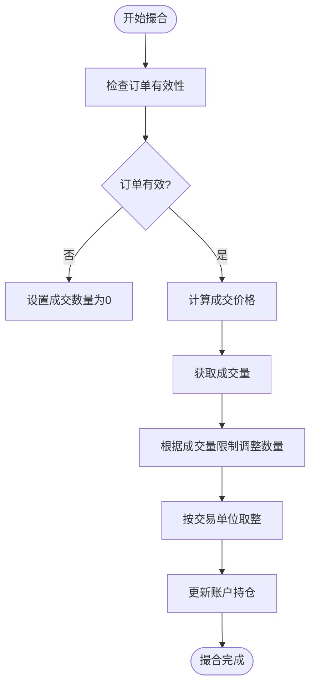
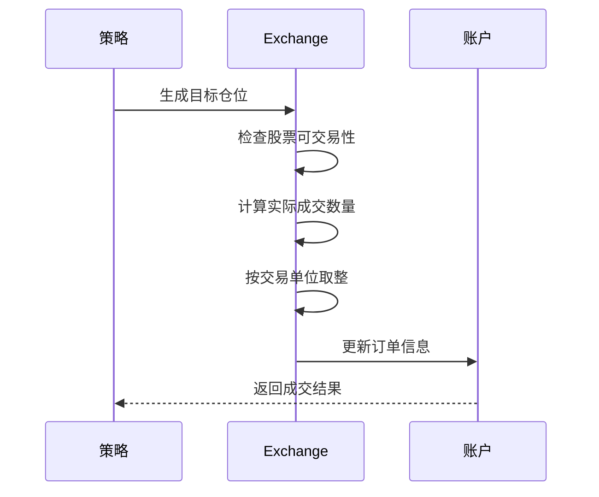
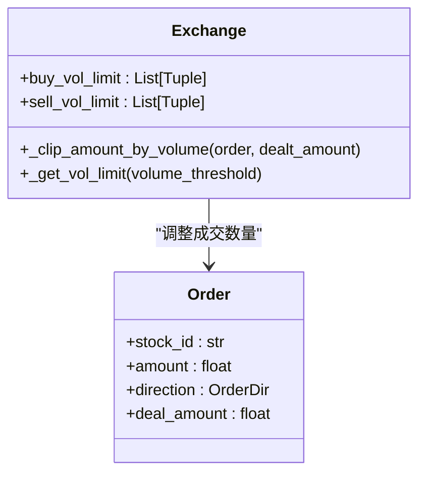
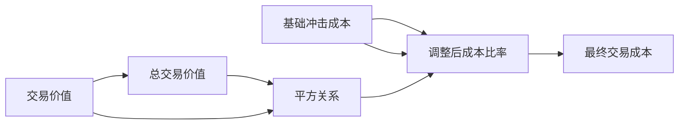

# 交易所模拟

<cite>
**本文档引用的文件**
- [exchange.py](file://qlib/backtest/exchange.py)
- [decision.py](file://qlib/backtest/decision.py)
- [utils.py](file://qlib/backtest/utils.py)
</cite>

## 目录
1. [引言](#引言)
2. [订单撮合逻辑与市场行为模拟](#订单撮合逻辑与市场行为模拟)
3. [流动性限制模型](#流动性限制模型)
4. [滑点计算模型](#滑点计算模型)
5. [辅助功能与真实性保障](#辅助功能与真实性保障)
6. [扩展性与自定义接口](#扩展性与自定义接口)
7. [常见问题防范](#常见问题防范)

## 引言
本文档系统性地描述了Qlib框架中Exchange模块的订单撮合逻辑与市场行为模拟能力。该模块通过精确的交易规则和限制条件，为量化回测提供了高度真实的市场环境模拟。

## 订单撮合逻辑与市场行为模拟

### 限价单与市价单撮合规则
Exchange模块实现了完整的订单撮合机制，支持限价单和市价单的处理。订单撮合遵循价格优先、时间优先的原则，确保模拟结果符合真实市场行为。

在`deal_order`方法中，系统首先检查订单的有效性，包括股票是否可交易、是否达到涨跌停限制等。如果订单有效，则根据指定的成交价格（buy_price/sell_price）进行撮合。成交价格可以配置为$close、$open、$vwap等不同类型的市场价格。



**Diagram sources**
- [exchange.py](file://qlib/backtest/exchange.py#L420-L462)

### 价格优先与时间优先实现
价格优先原则通过选择最优的买卖价格来实现，而时间优先原则则通过订单的提交顺序来保证。在生成目标仓位的订单时，系统会对股票代码进行排序并使用固定随机种子打乱顺序，确保相同参数下的回测结果一致。



**Diagram sources**
- [exchange.py](file://qlib/backtest/exchange.py#L610-L676)

### 部分成交与撤单处理
系统能够正确处理部分成交和撤单等边缘情况。当订单数量超过可用成交量或资金限制时，系统会自动调整成交数量。对于无法成交的订单，系统会将其成交数量设置为0，并记录相应的警告信息。

**Section sources**
- [exchange.py](file://qlib/backtest/exchange.py#L858-L951)

## 流动性限制模型

### 基于历史成交量的动态调整
流动性限制模型通过`volume_threshold`参数实现，可以根据历史成交量动态调整可交易数量，防止过度成交（over-trading）。该模型支持两种类型的成交量限制：

- **累积型（cum）**：基于一段时间内的累积成交量，如"0.2 * DayCumsum($volume, '9:45', '14:45')"
- **实时型（current）**：基于实时的买卖盘口量，如"$bidV1"



**Diagram sources**
- [exchange.py](file://qlib/backtest/exchange.py#L785-L831)

### 可交易数量计算
系统通过`_clip_amount_by_volume`方法计算实际可交易数量。该方法会考虑所有相关的成交量限制，并取最小值作为最终的成交上限。已成交的数量也会从累积限制中扣除，确保跨时段交易的一致性。

**Section sources**
- [exchange.py](file://qlib/backtest/exchange.py#L294-L335)

## 滑点计算模型

### 固定滑点与比例滑点
滑点计算通过`impact_cost`参数实现，支持固定滑点和比例滑点两种模式。基础滑点率由`open_cost`和`close_cost`参数定义，分别对应开仓和平仓的成本。

### 基于成交量的非线性滑点
系统实现了基于成交量的非线性滑点模型，其数学公式如下：

```
adj_cost_ratio = impact_cost * (trade_val / total_trade_val)²
```

其中：
- `trade_val`为本次交易价值
- `total_trade_val`为时间段内的总交易价值
- `impact_cost`为基础冲击成本率

这种非线性模型能够更真实地反映大额交易对市场价格的影响。



**Diagram sources**
- [exchange.py](file://qlib/backtest/exchange.py#L858-L951)

## 辅助功能与真实性保障

### 价格对齐与交易时段过滤
系统通过`TradeCalendarManager`类管理交易日历，确保交易行为符合实际交易时段。该类提供时间步进、范围查询等功能，支持分钟级到日级的不同频率交易。

```mermaid
classDiagram
    class TradeCalendarManager {
        +freq: str
        +start_time: Timestamp
        +end_time: Timestamp
        +get_step_time(trade_step)
        +get_range