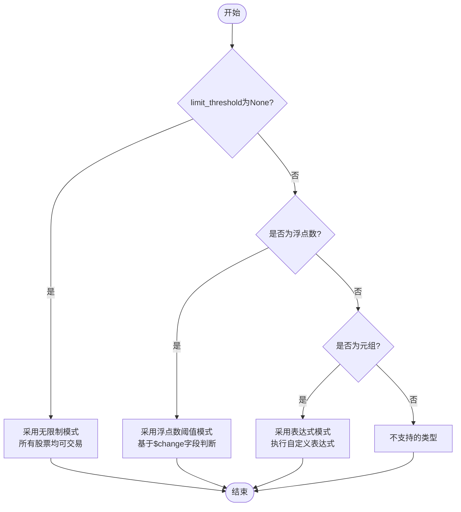
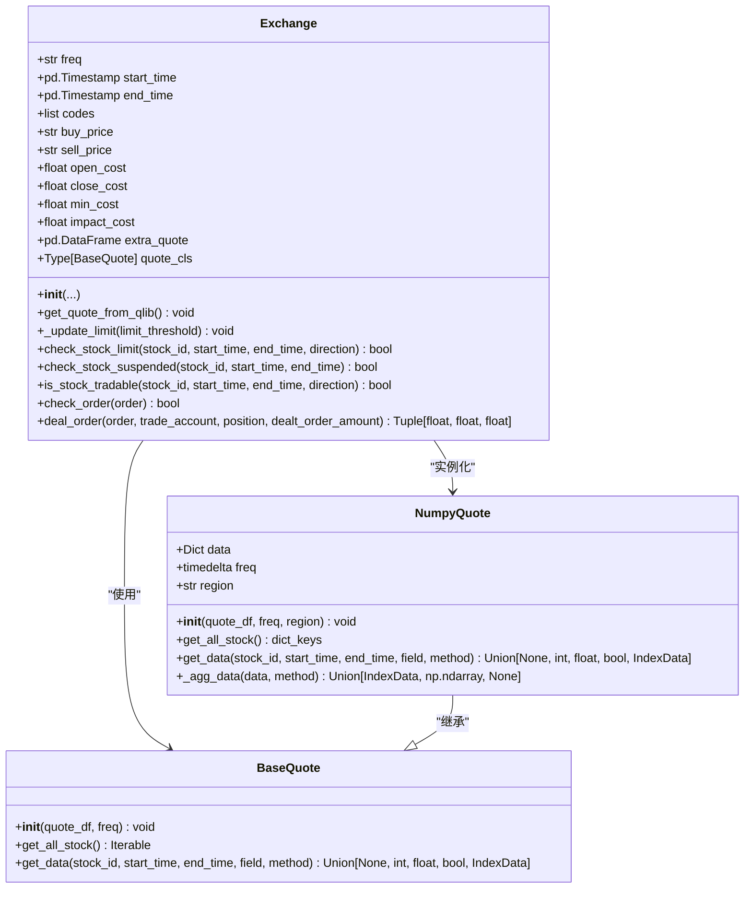
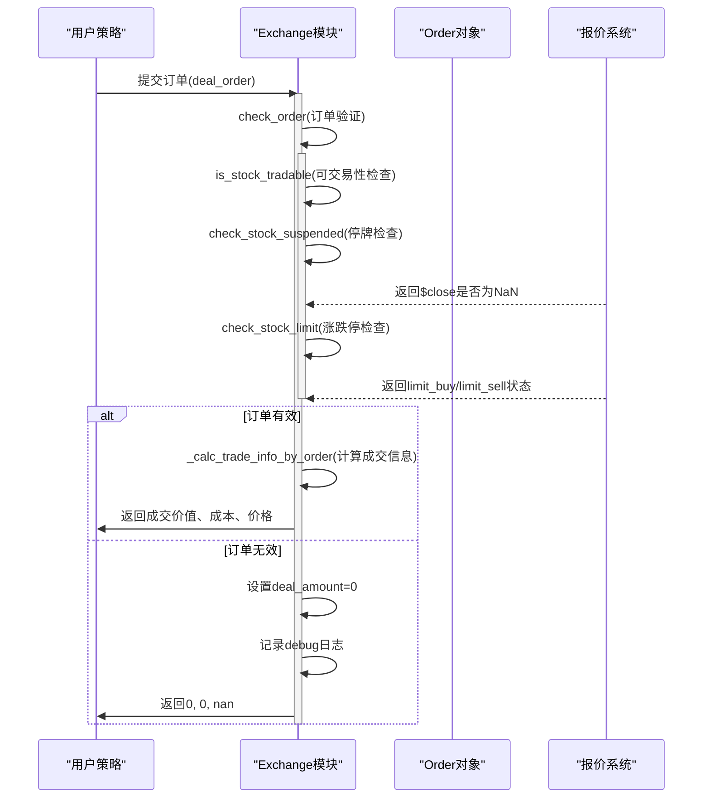

# 交易限制处理

<cite>
**本文档中引用的文件**
- [exchange.py](file://qlib/backtest/exchange.py)
- [decision.py](file://qlib/backtest/decision.py)
- [high_performance_ds.py](file://qlib/backtest/high_performance_ds.py)
</cite>

## 目录
1. [引言](#引言)
2. [核心机制概述](#核心机制概述)
3. [limit_threshold参数模式解析](#limit_threshold参数模式解析)
4. [涨跌停与停牌状态识别逻辑](#涨跌停与停牌状态识别逻辑)
5. [订单可交易性判断流程](#订单可交易性判断流程)
6. [extra_quote字段优先级说明](#extra_quote字段优先级说明)
7. [案例分析：订单拒绝行为](#案例分析：订单拒绝行为)
8. [日志调试信息解读](#日志调试信息解读)
9. [结论](#结论)

## 引言
本文档详细说明了Qlib框架中Exchange模块对股票涨跌停、停牌状态的识别与处理机制。重点解析`limit_threshold`参数的三种配置模式及其在中国A股等有涨跌幅限制市场中的应用方式。通过分析`check_stock_limit`和`check_stock_suspended`方法的协同工作原理，阐明标的资产可交易性的判定逻辑。同时解释`$change`字段在涨跌停判断中的作用，并展示`extra_quote`中`limit_buy`/`limit_sell`字段的优先级规则。最后通过具体案例说明当标的触及涨跌停或停牌时订单被拒绝的行为表现，并提供相关日志信息的解读指南。

## 核心机制概述

Exchange模块是Qlib回测系统的核心组件之一，负责模拟真实市场的交易环境。其主要功能包括价格撮合、成本计算、交易限制检查等。其中，针对中国A股等存在涨跌停制度的市场，Exchange实现了完整的涨跌停与停牌状态识别机制。

该机制基于以下关键设计原则：
- 使用`$close`字段是否存在NaN值来判断股票是否停牌
- 利用`$change`字段结合`limit_threshold`参数判断是否达到涨跌停
- 支持通过表达式模式灵活定义复杂的交易限制条件
- 提供`extra_quote`接口允许外部数据源覆盖默认限制判断

这些机制共同确保了回测结果能够准确反映实际交易环境中因涨跌停或停牌导致的订单执行失败情况。

**Section sources**
- [exchange.py](file://qlib/backtest/exchange.py#L37-L198)
- [exchange.py](file://qlib/backtest/exchange.py#L200-L255)

## limit_threshold参数模式解析

`limit_threshold`参数用于控制股票交易的涨跌停限制，支持三种不同的配置模式：

### None模式（无限制）
当`limit_threshold`设置为`None`时，系统不施加任何涨跌停限制。这意味着即使股票价格波动剧烈，也不会阻止买卖操作。此模式适用于没有涨跌幅限制的市场，或者用户希望忽略涨跌停影响进行理论分析的场景。

```python
limit_threshold = None
```

在初始化过程中，若检测到区域为中国（REG_CN）或台湾（REG_TW）且未设置`limit_threshold`，系统会发出警告提示："limit_threshold not set. The stocks hit the limit may be bought/sold"。

### 浮点数阈值模式
该模式使用一个浮点数值作为涨跌停判断的标准。例如设置`limit_threshold=0.1`表示当日涨幅≥10%视为涨停，≤-10%视为跌停。

```python
limit_threshold = 0.1
```

系统通过比较`$change`字段与阈值的关系来判断：
- `limit_buy` = `$change`.ge(limit_threshold) | suspended
- `limit_sell` = `$change`.le(-limit_threshold) | suspended

需要注意的是，在中国A股市场，建议将阈值设置在合理范围内（通常不超过0.1），否则系统会发出警告："limit_threshold may not be set to a reasonable value"。

### 表达式模式（LT_TP_EXP）
这是最灵活的模式，允许用户通过Qlib表达式语言定义复杂的限制条件。需要传入一个包含两个字符串的元组，分别对应买入和卖出的限制表达式。

```python
limit_threshold = ("$high_limit", "$low_limit")
```

在这种模式下：
- 第一个表达式结果为True时表示禁止买入
- 第二个表达式结果为False时表示禁止卖出
- 表达式结果会被转换为布尔类型参与判断

这种模式特别适合处理ST股、新股上市等特殊情况下不同的涨跌幅规则。

**Diagram sources**
- [exchange.py](file://qlib/backtest/exchange.py#L257-L259)



**Section sources**
- [exchange.py](file://qlib/backtest/exchange.py#L261-L270)
- [exchange.py](file://qlib/backtest/exchange.py#L272-L291)

## 涨跌停与停牌状态识别逻辑

### $change字段的作用
`$change`字段代表股票的收益率变化，在涨跌停判断中起着核心作用。系统通过以下公式计算涨跌幅：

```
change = (current_price - previous_close) / previous_close
```

在浮点数阈值模式下，直接将`$change`与`limit_threshold`进行比较：
- 当`$change ≥ limit_threshold`时，标记为涨停（limit_buy=True）
- 当`$change ≤ -limit_threshold`时，标记为跌停（limit_sell=True）

### check_stock_limit方法
该方法用于检查股票是否处于涨跌停状态，决定了能否进行相应方向的交易。

```python
def check_stock_limit(self, stock_id, start_time, end_time, direction=None):
    if direction is None:
        return buy_limit or sell_limit
    elif direction == Order.BUY:
        return limit_buy
    elif direction == Order.SELL:
        return limit_sell
```

关键特性：
- 支持按交易方向单独检查
- 使用`method="all"`聚合时间段内的所有数据点
- 返回True表示交易受限，不可交易

### check_stock_suspended方法
该方法通过检查`$close`字段是否存在NaN值来判断股票是否停牌。

```python
def check_stock_suspended(self, stock_id, start_time, end_time):
    close = self.quote.get_data(stock_id, start_time, end_time, "$close")
    if close is None:
        return True
    elif isinstance(close, IndexData):
        return close.isna().all()
    else:
        return np.isnan(close)
```

判断逻辑：
- 若无收盘价记录 → 停牌
- 若所有时间点的收盘价均为NaN → 停牌
- 若单个时间点收盘价为NaN → 停牌

这两个方法共同构成了完整的交易可行性评估体系。

**Diagram sources**
- [exchange.py](file://qlib/backtest/exchange.py#L337-L375)
- [exchange.py](file://qlib/backtest/exchange.py#L377-L401)



**Section sources**
- [exchange.py](file://qlib/backtest/exchange.py#L337-L375)
- [exchange.py](file://qlib/backtest/exchange.py#L377-L401)
- [high_performance_ds.py](file://qlib/backtest/high_performance_ds.py#L127-L203)

## 订单可交易性判断流程

### is_stock_tradable方法
这是判断标的资产是否可交易的核心方法，它综合了涨跌停和停牌两种限制条件。

```python
def is_stock_tradable(self, stock_id, start_time, end_time, direction=None):
    return not (
        self.check_stock_suspended(stock_id, start_time, end_time)
        or self.check_stock_limit(stock_id, start_time, end_time, direction)
    )
```

逻辑关系为：
- 只要股票处于**停牌状态**或**涨跌停状态**，即视为不可交易
- 两者取逻辑或后取反得到最终结果

### check_order方法
该方法直接调用`is_stock_tradable`来验证订单的有效性。

```python
def check_order(self, order: Order) -> bool:
    return self.is_stock_tradable(
        order.stock_id, 
        order.start_time, 
        order.end_time, 
        order.direction
    )
```

### deal_order方法中的应用
在实际成交处理中，首先会调用`check_order`进行前置验证：

```python
if not self.check_order(order):
    order.deal_amount = 0.0
    self.logger.debug(f"Order failed due to trading limitation: {order}")
    return 0.0, 0.0, np.nan
```

如果订单因涨跌停或停牌被拒绝，系统会：
- 将成交数量设为0
- 记录调试日志
- 返回空的交易价格

这一系列操作确保了不符合交易条件的订单不会被执行，从而保证回测的真实性。

**Diagram sources**
- [exchange.py](file://qlib/backtest/exchange.py#L403-L414)
- [exchange.py](file://qlib/backtest/exchange.py#L416-L418)
- [exchange.py](file://qlib/backtest/exchange.py#L420-L462)



**Section sources**
- [exchange.py](file://qlib/backtest/exchange.py#L403-L414)
- [exchange.py](file://qlib/backtest/exchange.py#L416-L418)
- [exchange.py](file://qlib/backtest/exchange.py#L420-L462)

## extra_quote字段优先级说明

`extra_quote`参数允许用户提供额外的报价数据，其中包含`limit_buy`和`limit_sell`字段，可用于覆盖默认的涨跌停判断结果。

### 字段优先级规则
1. **必要字段检查**：必须包含`$close`字段，否则抛出异常
2. **缺失字段补全**：
   - 缺少`buy_price`/`sell_price` → 使用`$close`替代
   - 缺少`$factor` → 默认设为1.0
   - 缺少`limit_sell` → 默认设为False（可卖）
   - 缺少`limit_buy` → 默认设为False（可买）
3. **数据合并**：通过`pd.concat`将`extra_quote`与主数据拼接

### 优先级体现
`extra_quote`中的`limit_buy`/`limit_sell`字段具有最高优先级，可以覆盖由`_update_limit`方法根据`limit_threshold`生成的默认判断结果。这使得用户能够：
- 引入第三方权威数据源的涨跌停标识
- 手动修正某些特殊情况下的交易限制
- 实现更精细化的交易控制策略

例如，对于ST股可能需要单独设置±5%的涨跌幅限制，就可以通过`extra_quote`实现差异化管理。

**Section sources**
- [exchange.py](file://qlib/backtest/exchange.py#L200-L255)
- [exchange.py](file://qlib/backtest/exchange.py#L272-L291)

## 案例分析：订单拒绝行为

### 案例1：涨停板买入订单
假设某股票当日上涨10.1%，触发涨停：

```python
# 配置
limit_threshold = 0.1
order = Order(stock_id="SH600000", amount=1000, direction=Order.BUY, ...)

# 执行过程
$change = 0.101 > 0.1 → limit_buy = True
check_stock_limit(direction=BUY) → True
is_stock_tradable() → False
check_order() → False
deal_order() → deal_amount = 0, 日志输出"Order failed..."
```

最终结果：买入订单被完全拒绝，成交数量为0。

### 案例2：停牌期间交易尝试
某股票因重大事项全天停牌：

```python
# 数据特征
$close = NaN for all timestamps
check_stock_suspended() → True
is_stock_tradable() → False regardless of direction
```

无论是买入还是卖出订单，都会因为停牌状态而被拒绝。

### 案例3：表达式模式下的特殊限制
使用表达式模式区分不同股票类型：

```python
limit_threshold = ("($change >= 0.1) | is_st_stock", "($change <= -0.1) | is_st_stock")

# 对于ST股，即使涨幅未达10%也被限制买入
is_st_stock = True → limit_buy = True
```

这种方式实现了对ST股更为严格的交易管控。

这些案例展示了系统如何精确模拟真实市场中因涨跌停或停牌导致的订单拒绝行为，确保回测结果的可靠性。

**Section sources**
- [exchange.py](file://qlib/backtest/exchange.py#L420-L462)
- [decision.py](file://qlib/backtest/decision.py#L36-L150)

## 日志调试信息解读

当订单因交易限制被拒绝时，系统会生成详细的调试日