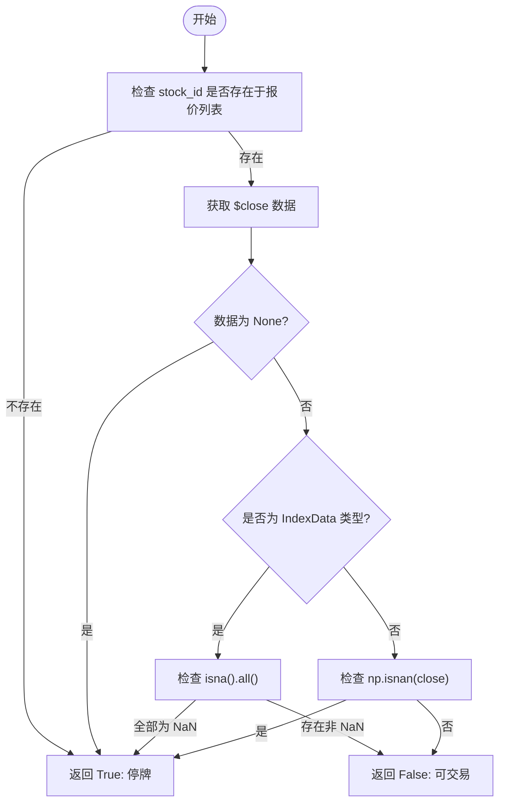
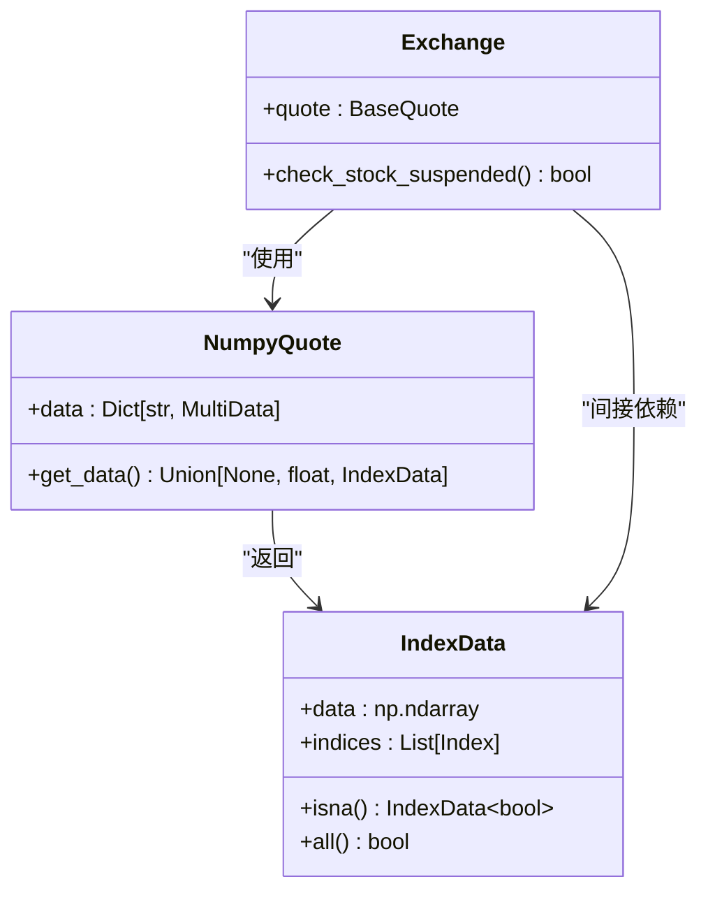

# 停牌状态处理

<cite>
**本文档引用文件**  
- [exchange.py](file://qlib/backtest/exchange.py)
- [index_data.py](file://qlib/utils/index_data.py)
- [decision.py](file://qlib/backtest/decision.py)
- [high_performance_ds.py](file://qlib/backtest/high_performance_ds.py)
</cite>

## 目录
1. [引言](#引言)  
2. [停牌检测逻辑分析](#停牌检测逻辑分析)  
3. [核心方法实现机制](#核心方法实现机制)  
4. [数据结构与类型判断](#数据结构与类型判断)  
5. [回测系统响应行为](#回测系统响应行为)  
6. [实际应用场景说明](#实际应用场景说明)  
7. [总结](#总结)

## 引言
在量化回测系统中，准确识别股票的交易状态是确保策略真实性和有效性的关键环节。当某只股票因故暂停交易（即“停牌”）时，系统必须能够及时识别并阻止对该股票发出交易指令，以避免产生不切实际的交易信号。本文将深入解析 `check_stock_suspended` 方法如何通过检查 `$close` 字段的存在性及是否全为 NaN 值来判断股票是否处于停牌状态，区分 stock_id 不在报价列表与存在但无有效收盘价两种情形的处理方式，并结合实际回测场景说明系统的响应机制。

**Section sources**  
- [exchange.py](file://qlib/backtest/exchange.py#L377-L401)

## 停牌检测逻辑分析
`check_stock_suspended` 方法用于判断指定时间段内某只股票是否处于停牌状态。其核心逻辑基于市场数据中的 `$close` 字段进行判断：

1. **股票是否存在**：首先检查 `stock_id` 是否存在于当前市场的所有股票列表中（通过 `self.quote.get_all_stock()` 获取）。若不存在，则视为不可交易，直接返回 `True` 表示停牌。
2. **获取收盘价数据**：若股票存在，则调用 `self.quote.get_data(stock_id, start_time, end_time, "$close")` 获取该股票在指定时间范围内的收盘价数据。
3. **多态数据处理**：
   - 若返回值为 `None`，表示没有任何收盘价记录，判定为停牌。
   - 若返回值为 `IndexData` 类型（序列化数据），则进一步检查其所有值是否均为 NaN。
   - 若返回值为单点数值，则使用 `np.isnan(close)` 判断该值是否为 NaN。

此逻辑确保了对不同数据形态的兼容性，无论是单日数据还是跨多日的时间序列数据，都能正确识别停牌状态。



**Diagram sources**  
- [exchange.py](file://qlib/backtest/exchange.py#L377-L401)

**Section sources**  
- [exchange.py](file://qlib/backtest/exchange.py#L377-L401)

## 核心方法实现机制
### check_stock_suspended 方法详解
该方法定义于 `Exchange` 类中，接受三个参数：`stock_id`、`start_time` 和 `end_time`，返回布尔值表示股票是否停牌。

#### 两种主要情形的处理
1. **stock_id 不在 quote 列表中**
   - 这种情况通常发生在目标股票未被纳入当前回测范围或已退市。
   - 系统将其视为不可交易资产，直接返回 `True`，表示停牌。

2. **stock_id 存在但无有效收盘价**
   - 此情形更为复杂，需进一步判断 `$close` 字段的具体内容。
   - 若 `$close` 为 `None`，说明完全没有价格记录，属于极端情况下的停牌。
   - 若 `$close` 为 `IndexData` 实例，则调用 `.isna().all()` 检查整个时间序列是否全为 NaN。
   - 若为单个浮点数，则使用 `np.isnan(close)` 进行判断。

#### 关键函数应用
- **IndexData.isna().all()**：该链式调用首先生成一个布尔型 `IndexData` 对象，其中每个元素表示原数据对应位置是否为 NaN；随后调用 `.all()` 方法判断所有值是否均为 `True`，即整个序列是否完全由 NaN 构成。
- **np.isnan(close)**：针对标量值的 NaN 检测，适用于高频或单点查询场景。

这些设计保证了方法在面对不同频率（日频、分钟频）和不同数据完整性的情况下仍能稳定运行。

**Section sources**  
- [exchange.py](file://qlib/backtest/exchange.py#L377-L401)
- [index_data.py](file://qlib/utils/index_data.py#L501-L502)

## 数据结构与类型判断
### IndexData 数据结构
`IndexData` 是 Qlib 自定义的高性能数据容器，旨在替代 Pandas 提供更高效的数值计算能力。它支持带索引的数组操作，底层基于 NumPy 实现，仅允许 `np.floating` 类型的数据存储。

#### isna() 方法实现
```python
def isna(self):
    return self.__class__(np.isnan(self.data), *self.indices)
```
该方法利用 `np.isnan()` 函数对底层数据数组进行逐元素 NaN 检测，生成一个新的 `IndexData` 实例，其数据部分为布尔数组，保留原始索引结构。这使得后续可以继续使用 `.all()` 或 `.any()` 等聚合方法进行整体判断。

#### all() 方法行为
值得注意的是，`IndexData.all()` 在处理包含 `None` 的数组时有特殊逻辑：会先过滤掉 `None` 再进行 `all()` 判断。但在本上下文中，由于数据已被转换为 float64 类型，`None` 将被转为 `nan`，因此实际行为等同于 `np.nan` 的逻辑处理。

### 类型分支控制
系统通过 `isinstance(close, IndexData)` 明确区分序列化数据与标量数据，从而选择不同的处理路径。这种显式的类型检查避免了潜在的运行时错误，增强了代码鲁棒性。



**Diagram sources**  
- [index_data.py](file://qlib/utils/index_data.py#L345-L525)
- [high_performance_ds.py](file://qlib/backtest/high_performance_ds.py#L127-L203)

**Section sources**  
- [index_data.py](file://qlib/utils/index_data.py#L345-L525)
- [high_performance_ds.py](file://qlib/backtest/high_performance_ds.py#L127-L203)

## 回测系统响应行为
当 `check_stock_suspended` 返回 `True` 时，系统将采取一系列措施防止无效交易发生：

### 订单自动拒绝机制
在 `deal_order` 方法中，系统首先调用 `check_order` 验证订单合法性：
```python
if not self.check_order(order):
    order.deal_amount = 0.0
    self.logger.debug(f"Order failed due to trading limitation: {order}")
    return 0.0, 0.0, np.nan
```
其中 `check_order` 会调用 `is_stock_tradable`，而后者又依赖于 `check_stock_suspended` 和 `check_stock_limit`。一旦任一条件不满足，订单即被标记为失败，成交数量设为 0。

### 日志记录策略
系统通过 `self.logger.debug` 输出详细的拒绝原因，便于用户排查问题。例如：
```
Order failed due to trading limitation: Order(stock_id='SH600000', amount=100, direction=1, start_time=2020-01-01, end_time=2020-01-01)
```
此类日志有助于复盘交易决策过程，验证策略逻辑的合理性。

### 账户与持仓更新保护
由于订单未被执行，相关账户余额和持仓信息不会发生变化，避免了因虚假交易导致的资金或仓位偏差，保障了回测结果的真实性。

**Section sources**  
- [exchange.py](file://qlib/backtest/exchange.py#L489-L515)
- [decision.py](file://qlib/backtest/decision.py#L36-L150)

## 实际应用场景说明
在真实的回测流程中，假设某策略在某一交易日生成买入某股票的信号，系统执行步骤如下：

1. **订单生成**：策略模块输出 `Order` 对象，包含目标股票代码、数量、方向和时间窗口。
2. **交易可行性检查**：`Exchange` 模块调用 `is_stock_tradable`，进而触发 `check_stock_suspended`。
3. **停牌判定**：若该股票当日无 `$close` 数据或全为 NaN，`check_stock_suspended` 返回 `True`。
4. **订单拦截**：`deal_order` 拒绝执行该订单，设置 `deal_amount=0` 并记录日志。
5. **状态反馈**：策略接收到执行结果，知晓该次交易未能完成，可据此调整后续行为。

这一机制有效模拟了现实市场中无法交易停牌股的情况，提升了回测环境的真实感和可信度。

**Section sources**  
- [exchange.py](file://qlib/backtest/exchange.py#L489-L515)
- [decision.py](file://qlib/backtest/decision.py#L36-L150)

## 总结
`check_stock_suspended` 方法通过严谨的数据存在性与完整性校验，实现了对股票停牌状态的精准识别。其设计充分考虑了多种边界情况，包括股票不在列表中、无价格记录、全 NaN 序列以及单点 NaN 值等。结合 `IndexData.isna().all()` 和 `np.isnan()` 等高效工具，确保了检测逻辑的准确性与性能表现。在回测过程中，该功能作为安全网，阻止了对非流通时段资产的无效交易，显著增强了回测结果的真实性与可靠性，是构建稳健量化策略不可或缺的基础组件。

**Section sources**  
- [exchange.py](file://qlib/backtest/exchange.py#L377-L401)
- [index_data.py](file://qlib/utils/index_data.py#L501-L502)