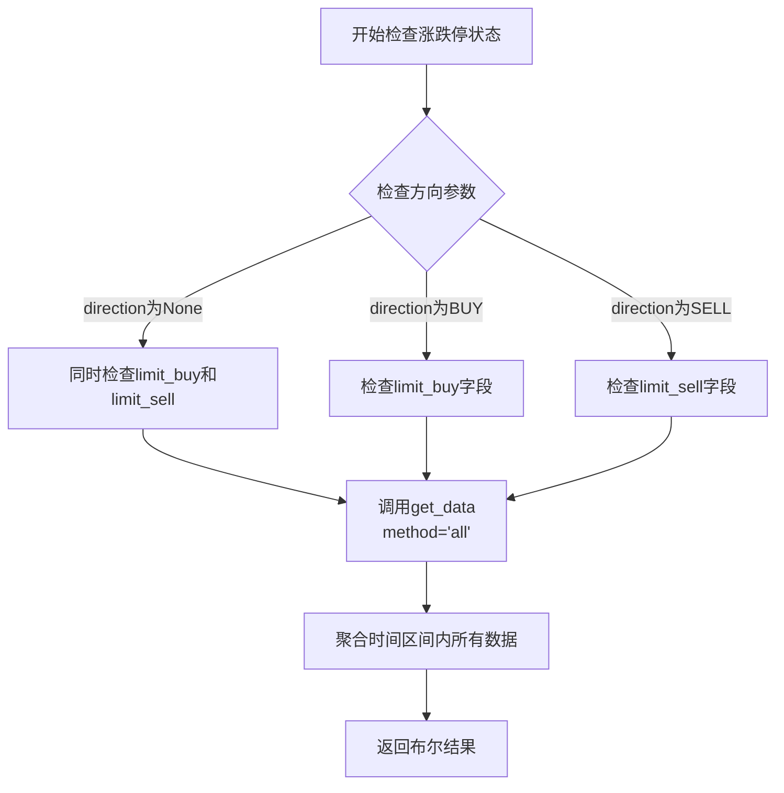
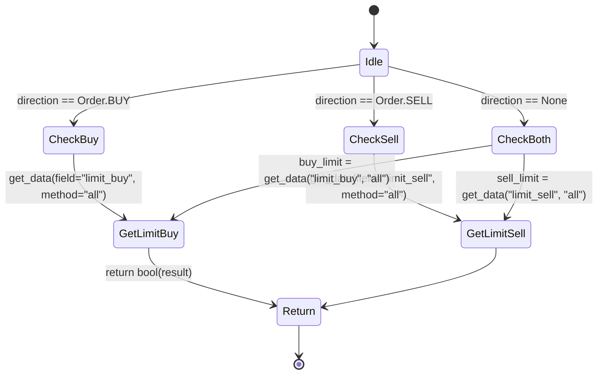

# 涨跌停限制处理

<cite>
**本文档中引用的文件**
- [exchange.py](file://qlib/backtest/exchange.py)
- [high_performance_ds.py](file://qlib/backtest/high_performance_ds.py)
- [decision.py](file://qlib/backtest/decision.py)
</cite>

## 目录
1. [涨跌停状态判定机制](#涨跌停状态判定机制)
2. [limit_buy与limit_sell字段数据来源](#limit_buy与limit_sell字段数据来源)
3. [全时段限制判断实现](#全时段限制判断实现)
4. [交易方向控制流程](#交易方向控制流程)
5. [订单拒绝案例分析](#订单拒绝案例分析)
6. [日志输出与调试方法](#日志输出与调试方法)
7. [A股市场应用价值](#a股市场应用价值)

## 涨跌停状态判定机制

`check_stock_limit` 方法是Exchange模块中用于判断股票是否触及涨跌停状态的核心函数。该方法通过分析指定时间区间内的行情数据，确定标的证券的交易限制状态。当股票价格达到交易所规定的涨跌幅上限或下限时，系统将标记其为不可交易状态。

该机制在回测过程中起到关键作用，确保模拟交易行为符合中国A股等具有涨跌停制度市场的实际交易规则。通过对买入和卖出两个方向分别进行限制检查，系统能够准确反映涨停时无法买入、跌停时无法卖出的真实市场情况。

**Section sources**
- [exchange.py](file://qlib/backtest/exchange.py#L337-L375)

## limit_buy与limit_sell字段数据来源

`limit_buy` 和 `limit_sell` 字段的数据来源于 `extra_quote` 参数提供的DataFrame以及通过 `_update_limit` 方法生成的内部数据。在初始化Exchange实例时，这些字段的优先级逻辑如下：

首先，系统会从Qlib数据系统获取基础行情数据，并根据 `limit_threshold` 配置项计算初始的涨跌停状态。如果用户提供了 `extra_quote` 参数且其中包含 `limit_buy` 或 `limit_sell` 字段，则使用用户提供的值；否则，系统将默认设置为False（表示可交易）。

这种设计允许用户既可以通过配置参数让系统自动计算涨跌停状态，也可以提供自定义的涨跌停信息，实现了灵活性与自动化之间的平衡。

**Section sources**
- [exchange.py](file://qlib/backtest/exchange.py#L200-L255)
- [exchange.py](file://qlib/backtest/exchange.py#L272-L291)

## 全时段限制判断实现

`get_data` 接口结合 `method='all'` 参数实现了时间区间内的全时段限制判断。当调用 `self.quote.get_data` 方法并指定 `method="all"` 时，系统会对整个时间区间内的所有数据点执行逻辑与运算（`data.all()`），只有当区间内每个时间点都满足限制条件时才返回True。

这一机制确保了严格的限制检查：即使在一个交易日内仅有部分时间段处于涨跌停状态，也会被视为全天受限。例如，在分钟级数据回测中，若某股票在上午10:00至10:30期间触及涨停，则在此时间段内发出的任何买入订单都将被拒绝。

**Diagram sources**
- [exchange.py](file://qlib/backtest/exchange.py#L337-L375)
- [high_performance_ds.py](file://qlib/backtest/high_performance_ds.py#L183-L203)

**Section sources**
- [exchange.py](file://qlib/backtest/exchange.py#L337-L375)
- [high_performance_ds.py](file://qlib/backtest/high_performance_ds.py#L183-L203)

## 交易方向控制流程

`direction` 参数在买入、卖出及双向检查时表现出不同的行为差异。该参数与 `Order.BUY` 和 `Order.SELL` 常量共同构成了完整的交易方向控制体系：

- 当 `direction` 为 `None` 时，系统将同时检查买入和卖出限制，任一方向受限即判定为不可交易
- 当 `direction` 为 `Order.BUY` 时，仅检查 `limit_buy` 字段，适用于买入订单的限制判断
- 当 `direction` 为 `Order.SELL` 时，仅检查 `limit_sell` 字段，适用于卖出订单的限制判断

`Order.BUY` 和 `Order.SELL` 是定义在 `Order` 类中的类变量常量，分别对应 `OrderDir.BUY` (1) 和 `OrderDir.SELL` (0) 枚举值。这种设计使得交易方向的控制既直观又类型安全，避免了魔法数字的使用。

**Diagram sources**
- [exchange.py](file://qlib/backtest/exchange.py#L337-L375)
- [decision.py](file://qlib/backtest/decision.py#L79-L80)

**Section sources**
- [exchange.py](file://qlib/backtest/exchange.py#L337-L375)
- [decision.py](file://qlib/backtest/decision.py#L29-L32)

## 订单拒绝案例分析

当标的证券触及涨停（`limit_buy=True`）或跌停（`limit_sell=True`）时，相关订单将被系统拒绝。具体案例场景如下：

假设某股票在交易日上午9:30至10:00期间触及涨停板，此时：
1. 系统检测到 `limit_buy=True`
2. 用户提交买入订单
3. `check_order` 方法调用 `check_stock_limit` 进行验证
4. 由于买入方向受限，返回True表示存在交易限制
5. `is_stock_tradable` 返回False
6. 订单被拒绝，`deal_amount` 设置为0.0

类似地，当股票处于跌停状态时，任何卖出订单都将遭遇相同处理流程。这种机制有效防止了在无法成交的价格水平上执行交易，保证了回测结果的真实性。

**Section sources**
- [exchange.py](file://qlib/backtest/exchange.py#L337-L375)
- [exchange.py](file://qlib/backtest/exchange.py#L400-L415)

## 日志输出与调试方法

系统通过内置的日志记录功能提供详细的调试信息。当订单因涨跌停限制被拒绝时，会输出包含以下信息的日志条目：
- 被拒绝的订单详情（股票代码、数量、方向等）
- 触发限制的具体原因
- 相关的时间戳信息

开发者可通过启用详细日志模式来跟踪涨跌停判断的全过程，包括每次 `get_data` 调用的结果和最终的决策依据。此外，还可以通过单元测试验证不同市场条件下涨跌停逻辑的正确性，确保策略在各种极端行情下的稳健表现。

**Section sources**
- [exchange.py](file://qlib/backtest/exchange.py#L400-L415)
- [exchange.py](file://qlib/backtest/exchange.py#L200-L255)

## A股市场应用价值

该涨跌停限制处理机制在中国A股市场等具有涨跌幅限制的场景下具有关键作用。它