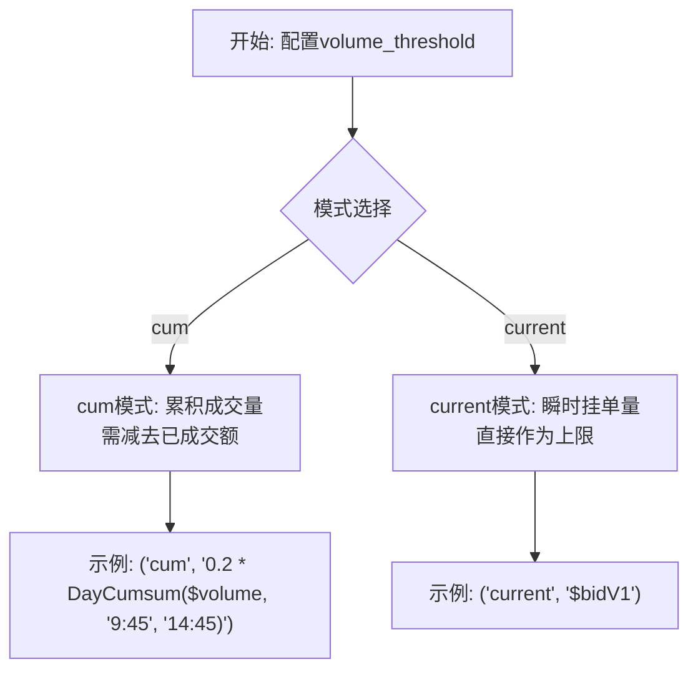
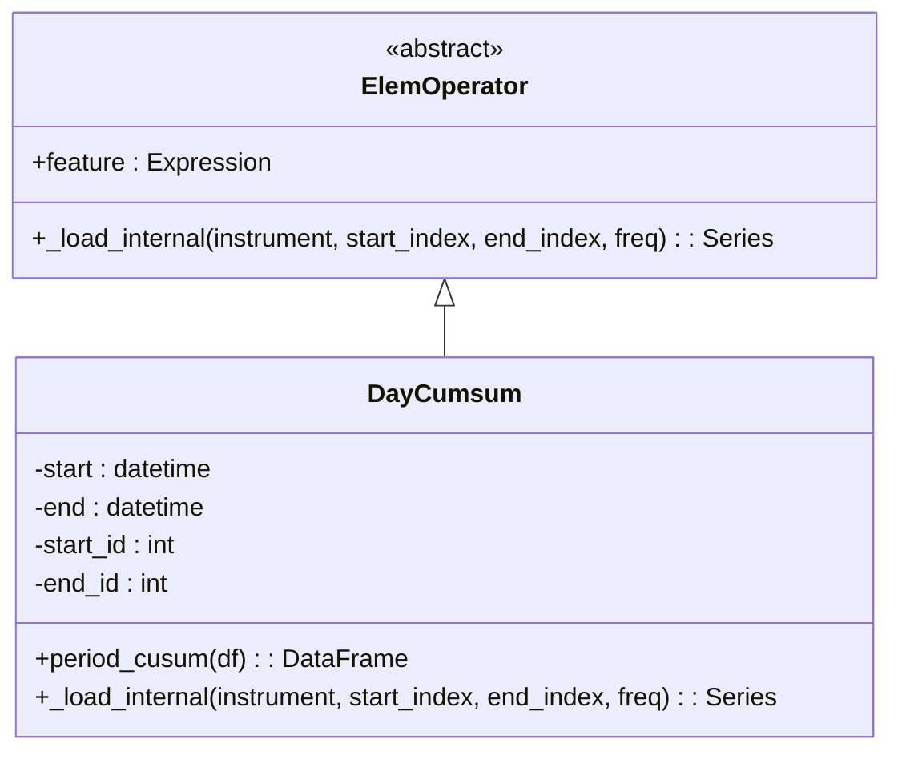
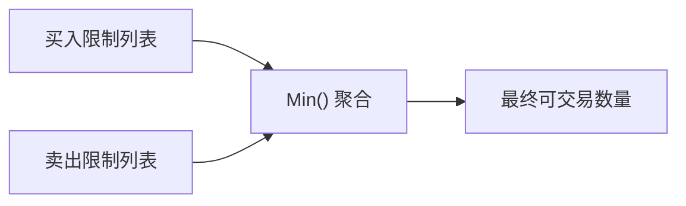

# 流动性建模

<cite>
**本文档中引用的文件**  
- [exchange.py](file://qlib/backtest/exchange.py)
- [high_freq.py](file://qlib/contrib/ops/high_freq.py)
</cite>

## 目录
1. [引言](#引言)
2. [流动性限制模型概述](#流动性限制模型概述)
3. [volume_threshold参数详解](#volumethreshold参数详解)
4. [自定义算子DayCumsum解析](#自定义算子daycumsum解析)
5. [买卖双向阈值聚合逻辑](#买卖双向阈值聚合逻辑)
6. [差异化时段约束配置示例](#差异化时段约束配置示例)
7. [register操作的重要性](#register操作的重要性)
8. [性能优化建议](#性能优化建议)

## 引言
在量化交易回测系统中，流动性建模是防止过度成交（over-trading）的关键环节。本文件深入阐述Qlib框架Exchange模块中的基于历史成交量的流动性限制机制，重点解析`volume_threshold`参数支持的两种模式及其在实际交易决策中的应用。

## 流动性限制模型概述
Exchange模块通过`volume_threshold`参数实现对交易量的动态控制，确保模拟交易符合市场实际流动性状况。该模型结合Qlib表达式引擎与自定义算子，在订单执行阶段对可交易数量进行上限计算和剪裁，有效避免因假设无限流动性而导致的策略失真。

**Section sources**
- [exchange.py](file://qlib/backtest/exchange.py#L64-L112)

## volume_threshold参数详解
`volume_threshold`参数支持两种核心模式：'cum'（累积量）和'current'（瞬时量），用于定义不同的流动性约束方式。

### cum模式（累积量）
- **定义**：表示随时间累积的累计值，如当日累计成交量。
- **特点**：作为容量限制使用时，需减去已成交金额（dealt_amount），以反映剩余可交易额度。
- **应用场景**：适用于设置全天或特定时间段内的最大可交易比例。

### current模式（瞬时量）
- **定义**：表示不随时间累积的实时值。
- **特点**：可直接用作容量限制，无需调整。
- **应用场景**：适用于基于盘口挂单量（如$bidV1、$askV1）等瞬时市场深度信息进行交易控制。



**Diagram sources**
- [exchange.py](file://qlib/backtest/exchange.py#L81-L96)

**Section sources**
- [exchange.py](file://qlib/backtest/exchange.py#L81-L96)

## 自定义算子DayCumsum解析
`DayCumsum`是contrib.ops.high_freq模块提供的关键自定义算子，用于动态计算指定时段内的成交量累积值。

### 核心功能
- 在每个交易日内，对指定特征（如$volume）进行分段累加。
- 支持设定起止时间（start/end），精确控制累加区间（例如早盘9:45至午盘14:45）。
- 非交易时段的数据将被置零处理。

### Qlib表达式集成
通过Qlib表达式语法调用：
```
"0.2 * DayCumsum($volume, '9:45', '14:45')"
```
此表达式表示取该时段内总成交量的20%作为交易上限。



**Diagram sources**
- [high_freq.py](file://qlib/contrib/ops/high_freq.py#L49-L85)

**Section sources**
- [high_freq.py](file://qlib/contrib/ops/high_freq.py#L49-L85)

## 买卖双向阈值聚合逻辑
当同时为买入和卖出方向设置不同流动性限制时，系统采用取最小值（min()）的聚合策略：

- 若仅设置`all`，则买卖共用同一限制。
- 若分别设置`buy`和`sell`，则各自独立生效。
- 多个限制条件并存时，最终可交易量取所有限制中的最小值。

这种设计保证了最严格的约束始终生效，提升了回测的真实性。



**Diagram sources**
- [exchange.py](file://qlib/backtest/exchange.py#L293-L333)

**Section sources**
- [exchange.py](file://qlib/backtest/exchange.py#L293-L333)

## 差异化时段约束配置示例
可通过灵活配置`volume_threshold`实现不同时段的差异化流动性管理：

```python
# 示例：开盘与收盘时段的不同约束
volume_threshold = {
    "all": ("cum", "0.1 * DayCumsum($volume, '9:30', '10:30')"),  # 开盘一小时限10%
    "buy": ("current", "$askV1"),   # 买入受卖一价挂单量限制
    "sell": ("current", "$bidV1")   # 卖出受买一价挂单量限制
}
```

此配置实现了：
- 开盘初期采用保守成交比例；
- 全天候根据实时盘口深度调整下单量；
- 区分买卖方向实施针对性控制。

**Section sources**
- [exchange.py](file://qlib/backtest/exchange.py#L96-L112)

## register操作的重要性
为确保自定义算子（如DayCumsum）可在Qlib表达式中正常使用，必须在初始化阶段完成注册：

- **必要性**：未注册的算子无法被表达式解析器识别。
- **注册时机**：应在`qlib_init`过程中调用`Operators.register()`方法。
- **风险提示**：忽略此步骤将导致表达式解析失败，影响流动性模型正常工作。

**Section sources**
- [exchange.py](file://qlib/backtest/exchange.py#L81-L96)

## 性能优化建议
为提升包含复杂流动性限制的回测效率，建议采取以下措施：

1. **预加载日历缓存**：提前调用`get_calendar_day()`等函数，避免重复加载。
2. **合理设置data_granularity**：根据回测频率调整粒度，减少不必要的计算开销。
3. **复用已注册算子**：避免重复注册相同自定义算子，降低内存消耗。
4. **简化表达式结构**：优先使用内置高效算子组合，而非嵌套复杂逻辑。

**Section sources**
- [high_freq.py](file://qlib/contrib/ops/high_freq.py#L0-L50)