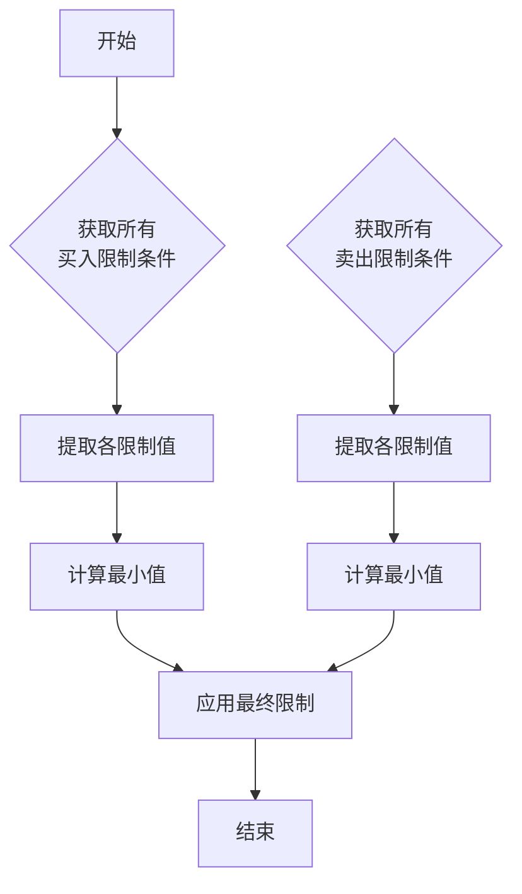

# 瞬时成交量模式

<cite>
**本文档中引用的文件**  
- [exchange.py](file://qlib/backtest/exchange.py)
- [high_freq.py](file://qlib/contrib/ops/high_freq.py)
</cite>

## 目录
1. [引言](#引言)  
2. [瞬时成交量阈值机制详解](#瞬时成交量阈值机制详解)  
3. [与累积模式的对比分析](#与累积模式的对比分析)  
4. [买卖双向流动性阈值聚合逻辑](#买卖双向流动性阈值聚合逻辑)  
5. [差异化约束配置实践](#差异化约束配置实践)  
6. [register操作的关键性说明](#register操作的关键性说明)  
7. [常见配置错误规避指南](#常见配置错误规避指南)

## 引言
在高频交易环境中，流动性建模对于执行策略的有效性至关重要。'current'模式作为一种实时限制机制，通过捕捉市场短期流动性变化，为交易执行提供动态容量控制。该模式特别适用于应对突发行情和盘中高频交易场景，能够有效防止因市场深度不足导致的滑点扩大或订单失败。

## 瞬时成交量阈值机制详解
'current'模式的核心在于使用实时市场数据作为交易容量的即时限制条件。根据代码实现，当设置`volume_threshold`为`("current", limit_str)`时，系统将直接采用当前时刻的实时值作为容量上限，无需进行时间累积计算。

例如，在交易所配置中：
```python
"volume_threshold": {
    "buy": ("current", "$askV1"),
    "sell": ("current", "$bidV1")
}
```
此配置表示买入订单受卖一档挂单量（$askV1）限制，卖出订单受买一档挂单量（$bidV1）限制。这种设计使得交易行为能够紧密跟随市场微观结构的变化，确保每笔交易都不会超过当前市场的承接能力。

该模式的优势在于其响应速度极快，能够在毫秒级时间内调整交易决策，特别适合处理闪崩、暴涨等极端行情下的流动性风险。

**本节来源**
- [exchange.py](file://qlib/backtest/exchange.py#L81-L96)

## 与累积模式的对比分析
相较于'cum'（累积）模式，'current'模式在应对突发行情方面展现出显著差异：

| 特性 | 'current' 模式 | 'cum' 模式 |
|------|---------------|-----------|
| 数据性质 | 实时瞬时值 | 时间累积值 |
| 更新频率 | 每个时间步更新 | 需减去已成交部分 |
| 响应延迟 | 极低 | 存在累积滞后 |
| 适用场景 | 高频交易、突发行情 | 日内平均分配、TWAP策略 |

以`DayCumsum($volume, '9:30', '14:29')`为例，该表达式计算指定时间段内的累计成交量，属于典型的累积模式应用。而'current'模式则完全摒弃了历史累积的概念，专注于当前市场状态的精确反映。

在突发行情发生时，'cum'模式可能因基于前期平均流量预估而导致过度下单，而'current'模式能立即感知到流动性枯竭并自动降低交易规模。

**本节来源**
- [exchange.py](file://qlib/backtest/exchange.py#L81-L96)
- [high_freq.py](file://qlib/contrib/ops/high_freq.py#L49-L85)

## 买卖双向流动性阈值聚合逻辑
在实际交易系统中，往往需要同时考虑多个流动性限制条件。系统采用取最小值（min()）的方式对不同维度的限制进行聚合，确保最严格的约束生效。

具体实现逻辑如下：
1. 分别获取买入方向的所有限制条件（buy_vol_limit）
2. 分别获取卖出方向的所有限制条件（sell_vol_limit）
3. 对每个方向的多个限制值执行min()运算
4. 最终交易量不得超过该最小值

这种聚合方式保证了交易行为始终处于所有约束条件的安全交集内。例如，若同时存在"不超过卖一档量"和"不超过日均量20%"两项限制，则实际可交易量取两者中的较小值。



**图表来源**
- [exchange.py](file://qlib/backtest/exchange.py#L64-L81)
- [exchange.py](file://qlib/backtest/exchange.py#L96-L112)

**本节来源**
- [exchange.py](file://qlib/backtest/exchange.py#L64-L112)

## 差异化约束配置实践
为了适应复杂的盘中高频交易需求，系统支持针对不同交易方向设置差异化的约束条件。典型配置示例如下：

```python
"volume_threshold": {
    "all": ("cum", "0.2 * DayCumsum($volume, '9:30', '14:29')"),
    "buy": ("current", "$askV1"),
    "sell": ("current", "$bidV1")
}
```

上述配置实现了多层次的保护机制：
- 全局层面：任何方向的交易均不得超过当日累计成交量的20%
- 方向层面：买入受限于卖一档挂单量，卖出受限于买一档挂单量

这种分层设计既保证了整体交易节奏的平稳，又兼顾了市场微观结构的实时变化。特别是在开盘集合竞价后或重大消息发布时，能有效避免因单一指标失真导致的风险暴露。

**本节来源**
- [exchange.py](file://qlib/backtest/exchange.py#L96-L112)
- [test_qlib_simulator.py](file://tests/rl/test_qlib_simulator.py#L70-L106)

## register操作的关键性说明
在使用自定义算子（如DayCumsum）时，必须通过register机制将其注册到系统中。这是因为在Qlib框架中，所有数据表达式中的操作符都需要预先声明才能被解析器识别。

关键步骤包括：
1. 定义继承自ElemOperator的自定义类
2. 在初始化函数中正确设置参数
3. 通过Operators.register()方法注册到全局操作符集合
4. 确保在qlib_init阶段完成注册

未正确注册会导致表达式解析失败，进而引发运行时异常。因此，所有涉及高频特征计算的自定义算子都必须严格遵循此流程。

**本节来源**
- [high_freq.py](file://qlib/contrib/ops/high_freq.py#L49-L85)
- [ops.py](file://qlib/data/ops.py#L1638-L1680)

## 常见配置错误规避指南
为确保'current'模式正确运行，需注意以下常见配置陷阱：

1. **忘记注册自定义算子**  
   使用DayCumsum等高频算子前必须调用register_all_ops()

2. **字段名称拼写错误**  
   如将$askV1误写为$askv1（大小写敏感）

3. **时间格式不匹配**  
   DayCumsum的时间参数必须符合"HH:MM"格式

4. **混合模式逻辑冲突**  
   避免在同一方向同时设置cum和current限制造成歧义

5. **缺乏兜底保护**  
   建议始终保留至少一项全局性限制（如all字段）

正确的配置应当层次分明、逻辑清晰，并经过充分测试验证。建议在实盘前通过回测模拟各种极端行情下的系统表现。

**本节来源**
- [high_freq.py](file://qlib/contrib/ops/high_freq.py#L49-L85)
- [exchange.py](file://qlib/backtest/exchange.py#L81-L96)