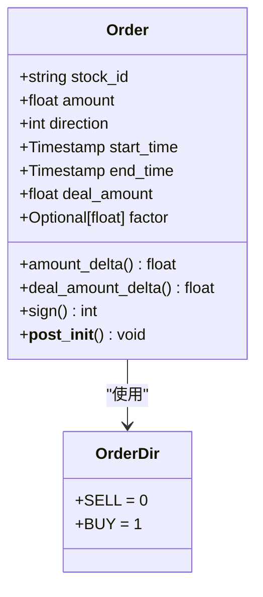
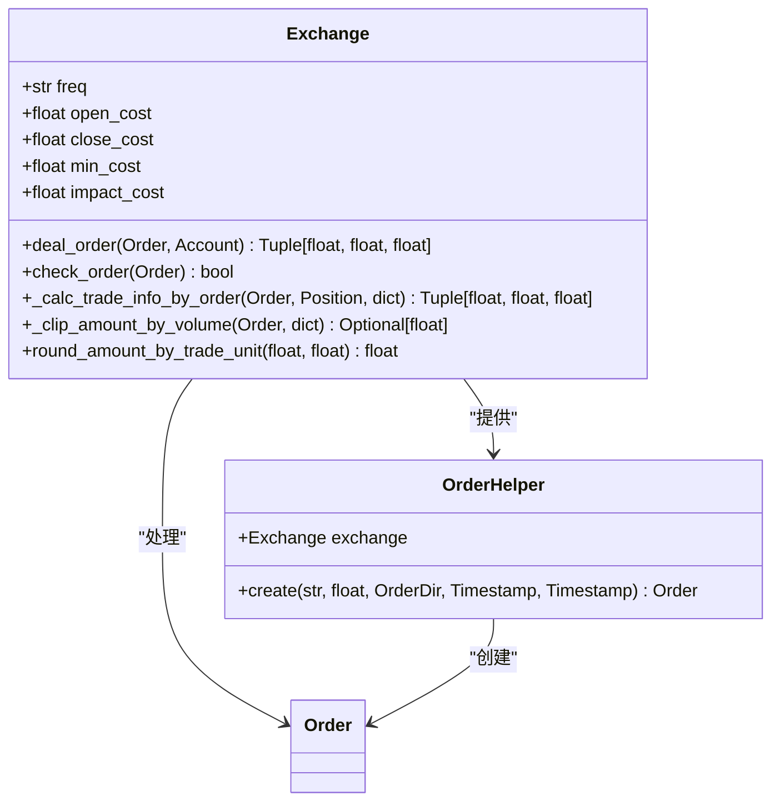
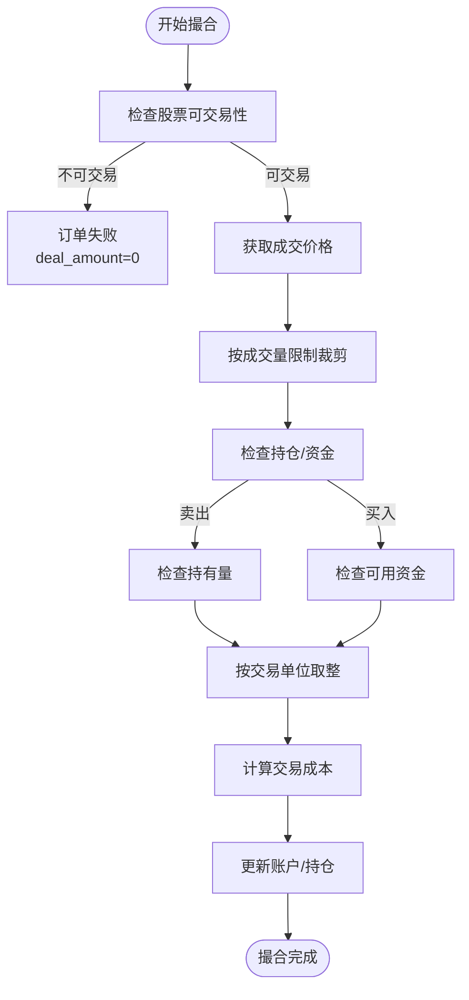
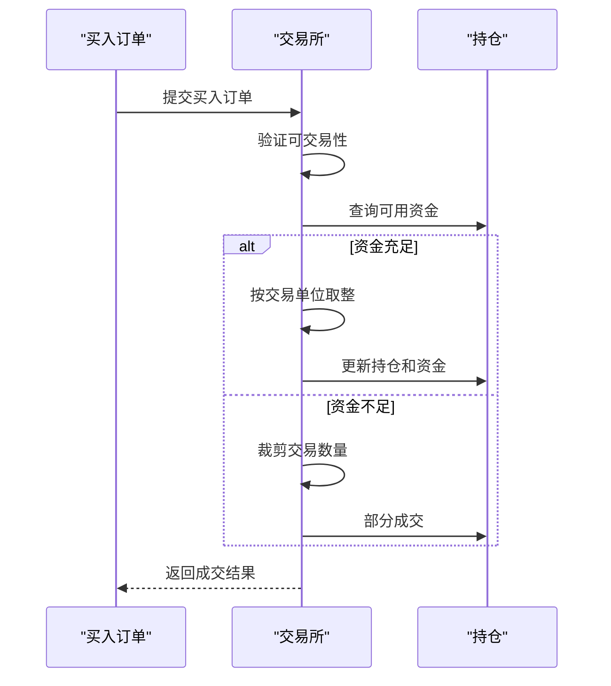
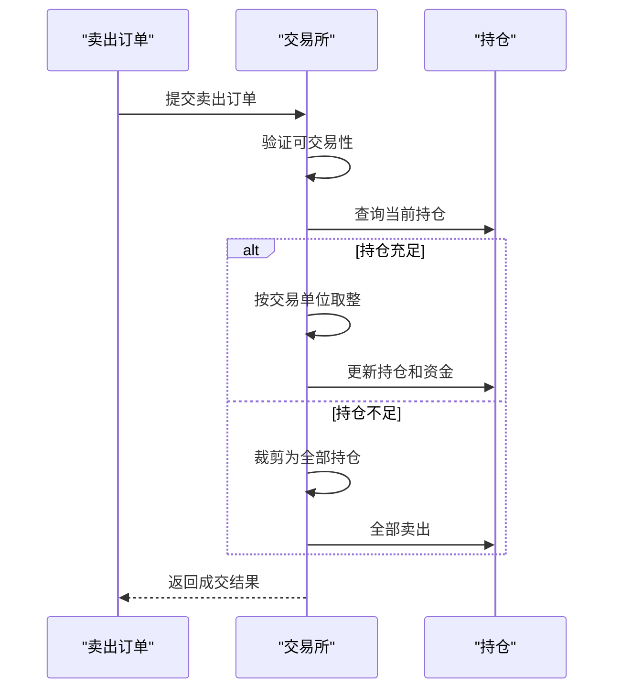
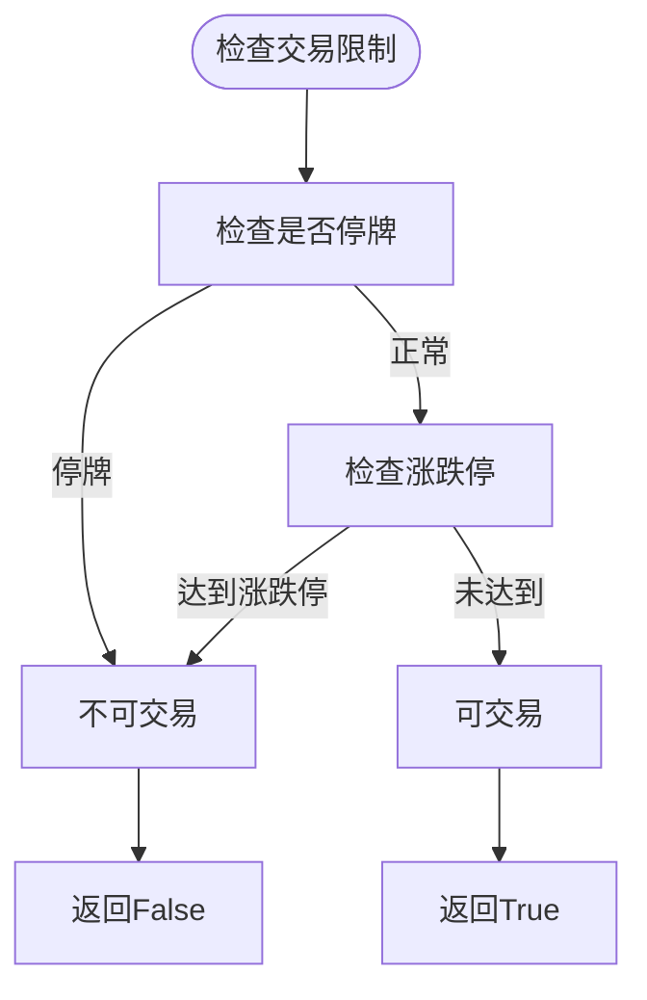

# 订单撮合规则

<cite>
**本文档中引用的文件**
- [exchange.py](file://qlib/backtest/exchange.py)
- [decision.py](file://qlib/backtest/decision.py)
</cite>

## 目录
1. [引言](#引言)
2. [核心组件分析](#核心组件分析)
3. [订单撮合机制详解](#订单撮合机制详解)
4. [价格与时间优先原则实现](#价格与时间优先原则实现)
5. [订单方向对撮合的影响](#订单方向对撮合的影响)
6. [部分成交处理流程](#部分成交处理流程)
7. [异常情况防范策略](#异常情况防范策略)
8. [结论](#结论)

## 引言
本文档系统性地阐述了Qlib框架中Exchange模块的订单撮合逻辑，重点分析限价单与市价单在回测环境下的执行机制。文档详细说明了价格优先、时间优先原则的实现方式，订单队列管理策略，以及部分成交（partial fill）的处理流程。通过分析Order类和OrderHelper工具，深入解释了订单生命周期中的状态转换机制，并探讨了高频场景下时间戳对撮合顺序的影响及未来信息泄露的防范策略。

## 核心组件分析

### Order类设计
订单撮合系统的核心是`Order`类，它定义了交易的基本单元。该类包含股票代码、交易数量、方向、时间区间等关键属性，并通过`deal_amount`字段记录实际成交数量。



**图示来源**
- [decision.py](file://qlib/backtest/decision.py#L36-L150)

### Exchange撮合引擎
`Exchange`类作为撮合引擎的核心，负责处理订单的验证、价格计算、成交量限制和成本核算。它通过引用市场数据来确定交易可行性，并执行实际的撮合逻辑。



**图示来源**
- [exchange.py](file://qlib/backtest/exchange.py#L420-L951)
- [decision.py](file://qlib/backtest/decision.py#L153-L202)

**本节来源**
- [exchange.py](file://qlib/backtest/exchange.py#L1-L959)
- [decision.py](file://qlib/backtest/decision.py#L1-L597)

## 订单撮合机制详解

### 撮合流程概述
订单撮合流程始于`deal_order`方法的调用，该方法首先验证订单的可交易性，然后计算交易价格、价值和成本。整个过程遵循严格的检查顺序：先检查交易限制，再进行成交量限制裁剪，最后考虑资金约束。



**图示来源**
- [exchange.py](file://qlib/backtest/exchange.py#L420-L462)
- [exchange.py](file://qlib/backtest/exchange.py#L858-L951)

### 成交价格确定
成交价格由`get_deal_price`方法确定，根据订单方向选择买入价或卖出价。系统支持多种价格类型（如$close、$open、$vwap），并在价格无效时自动回退到收盘价。

```python
def get_deal_price(self, stock_id: str, start_time: pd.Timestamp, end_time: pd.Timestamp, direction: OrderDir) -> Union[None, float]:
    if direction == OrderDir.SELL:
        pstr = self.sell_price
    elif direction == OrderDir.BUY:
        pstr = self.buy_price
    
    deal_price = self.quote.get_data(stock_id, start_time, end_time, field=pstr)
    if deal_price is None or np.isnan(deal_price):
        deal_price = self.get_close(stock_id, start_time, end_time)
    return deal_price
```

**本节来源**
- [exchange.py](file://qlib/backtest/exchange.py#L493-L513)

## 价格与时间优先原则实现

### 价格优先原则
系统通过配置`deal_price`参数实现价格优先原则。对于限价单，系统使用指定的价格字段（如$limit_price）进行撮合；对于市价单，则使用市场最优价格（通常是$ask或$bid）。

### 时间优先原则
时间优先原则通过订单的时间戳实现。系统按照`start_time`字段对订单进行排序，确保较早提交的订单优先执行。在生成目标仓位订单时，系统会对股票ID进行随机洗牌以保证结果的可重现性。

```python
# 在generate_order_for_target_amount_position中实现
sorted_ids = sorted(set(list(current_position.keys()) + list(target_position.keys())))
random.seed(0)
random.shuffle(sorted_ids)
```

**本节来源**
- [exchange.py](file://qlib/backtest/exchange.py#L610-L650)

## 订单方向对撮合的影响

### 买入订单处理
买入订单的处理需要考虑资金约束和交易成本。系统首先检查可用资金是否足以覆盖交易成本，然后根据资金情况调整购买数量。



**图示来源**
- [exchange.py](file://qlib/backtest/exchange.py#L858-L951)

### 卖出订单处理
卖出订单的处理需要验证持仓情况，确保不会出现卖空行为。系统会检查当前持仓量，并据此裁剪卖出数量。



**图示来源**
- [exchange.py](file://qlib/backtest/exchange.py#L858-L951)

## 部分成交处理流程

### 成交量限制裁剪
系统通过`_clip_amount_by_volume`方法实现成交量限制，根据预设的买卖量阈值对订单数量进行裁剪。

```python
def _clip_amount_by_volume(self, order: Order, dealt_order_amount: dict) -> None:
    vol_limit = self.buy_vol_limit if order.direction == Order.BUY else self.sell_vol_limit
    if vol_limit is None:
        return
        
    vol_limit_num = []
    for limit in vol_limit:
        if limit[0] == "current":
            limit_value = self.quote.get_data(order.stock_id, order.start_time, order.end_time, field=limit[1], method="sum")
            vol_limit_num.append(limit_value)
        elif limit[0] == "cum":
            limit_value = self.quote.get_data(order.stock_id, order.start_time, order.end_time, field=limit[1], method="ts_data_last")
            vol_limit_num.append(limit_value - dealt_order_amount[order.stock_id])
    
    vol_limit_min = min(vol_limit_num)
    order.deal_amount = max(min(vol_limit_min, order.deal_amount), 0)
```

### 交易单位取整
中国A股市场的交易单位为100股，系统通过`round_amount_by_trade_unit`方法实现交易单位的取整。

```python
def round_amount_by_trade_unit(self, deal_amount: float, factor: float = None) -> float:
    if not self.trade_w_adj_price and self.trade_unit is not None:
        factor = self._get_factor_or_raise_error(factor)
        return (deal_amount * factor + 0.1) // self.trade_unit * self.trade_unit / factor
    return deal_amount
```

**本节来源**
- [exchange.py](file://qlib/backtest/exchange.py#L785-L831)
- [exchange.py](file://qlib/backtest/exchange.py#L760-L783)

## 异常情况防范策略

### 未来信息泄露防范
系统通过严格的时序控制防止未来信息泄露。所有决策都基于当前时间点之前的数据，且订单的执行时间范围受到严格限制。

### 交易限制检查
系统实现了全面的交易限制检查机制，包括涨停/跌停限制和停牌检查。



**本节来源**
- [exchange.py](file://qlib/backtest/exchange.py#L403-L414)

## 结论
Qlib的订单撮合系统实现了完整的限价单与市价单处理逻辑，严格遵循价格优先、时间优先的交易原则。系统通过多层次的检查机制确保交易的合规性，包括成交量限制、资金约束、持仓验证和交易单位取整。在异常情况处理方面，系统有效防范了未来信息泄露，并实现了全面的交易限制检查。整体设计既符合现实交易约束，又为回测提供了高度的灵活性和准确性。