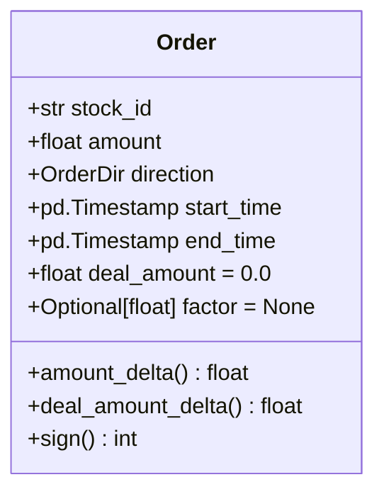
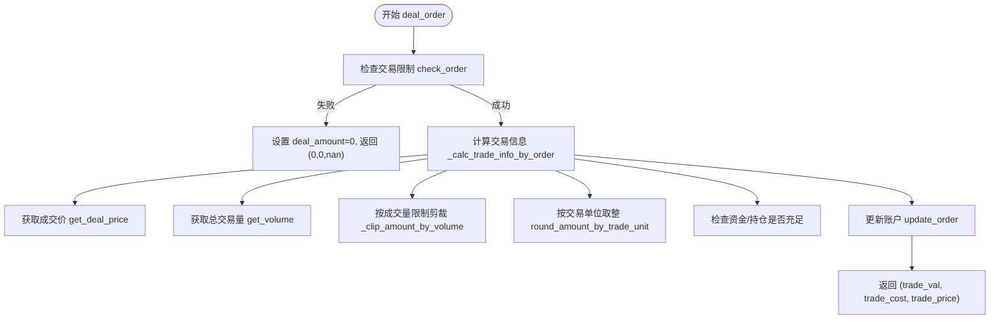

# 限价单撮合机制

<cite>
**本文档中引用的文件**
- [exchange.py](file://qlib/backtest/exchange.py)
- [decision.py](file://qlib/backtest/decision.py)
</cite>

## 目录
1. [引言](#引言)
2. [订单结构与核心字段](#订单结构与核心字段)
3. [撮合流程总览](#撮合流程总览)
4. [价格优先与时间优先原则](#价格优先与时间优先原则)
5. [订单状态判定：挂单与即时成交](#订单状态判定挂单与即时成交)
6. [部分成交处理流程](#部分成交处理流程)
7. [成交量限制与市场冲击防护](#成交量限制与市场冲击防护)
8. [异常情况与未来信息防范](#异常情况与未来信息防范)
9. [结论](#结论)

## 引言
本文档系统性地阐述了Qlib回测框架中Exchange模块对限价单的撮合实现逻辑。文档详细说明了在回测环境下，如何通过代码实现“价格优先、时间优先”的交易原则，并深入解析了订单簿维护、价格匹配算法以及时间戳排序机制。同时，文档解释了订单挂单（pending）与即时成交（immediate fill）的判定条件，结合`Order`类和`deal_order`方法说明了部分成交（partial fill）的处理流程。此外，还描述了如何通过`volume_threshold`参数限制成交量以防止市场冲击，并说明了对异常情况如未来信息泄露的防范策略，确保模拟过程符合现实交易约束。

## 订单结构与核心字段
`Order`类是表示交易指令的核心数据结构，它封装了所有必要的交易信息。

**Section sources**
- [decision.py](file://qlib/backtest/decision.py#L36-L150)

### 核心属性

**Diagram sources**
- [decision.py](file://qlib/backtest/decision.py#L36-L150)

- **stock_id**: 字符串类型，代表交易标的的唯一标识符。
- **amount**: 浮点数类型，表示用户希望交易的数量，是一个非负且已调整的值。
- **direction**: `OrderDir`枚举类型，表示交易方向，`BUY`为买入，`SELL`为卖出。
- **start_time/end_time**: `pd.Timestamp`类型，定义了该订单有效的交易时间区间（闭区间）。
- **deal_amount**: 浮点数类型，作为结果字段，由撮合引擎填充，表示该订单实际成交的数量。
- **factor**: 可选浮点数，作为结果字段，由撮合引擎填充，表示用于价格调整的因子。

## 撮合流程总览
限价单的撮合流程始于`Exchange`类的`deal_order`方法，该方法是整个撮合逻辑的入口点。

**Diagram sources**
- [exchange.py](file://qlib/backtest/exchange.py#L420-L462)
- [exchange.py](file://qlib/backtest/exchange.py#L858-L958)

**Section sources**
- [exchange.py](file://qlib/backtest/exchange.py#L420-L462)
- [exchange.py](file://qlib/backtest/exchange.py#L858-L958)

## 价格优先与时间优先原则
在Qlib的回测环境中，“价格优先”和“时间优先”原则主要通过订单的生成顺序和执行时间来隐式实现。

### 实现方式
1.  **价格优先**: 回测框架假设用户的策略已经根据价格优先的原则生成了订单。例如，一个做多的策略会自然地将预期收益率最高的股票排在前面。因此，`Exchange`本身不进行跨订单的价格排序，而是依赖于上游策略的输出顺序。
2.  **时间优先**: 时间优先原则体现在订单的`start_time`和`end_time`上。`Exchange`会严格按照这些时间戳来判断订单的有效性。当多个订单在同一时间点被处理时，它们的执行顺序取决于`generate_order_for_target_amount_position`等方法中订单列表的构建顺序。该方法通过对股票ID进行排序后随机打乱（使用固定种子），保证了回测结果的可复现性，这在一定程度上也体现了时间上的公平性。

**Section sources**
- [exchange.py](file://qlib/backtest/exchange.py#L700-L735)

## 订单状态判定：挂单与即时成交
在回测中，订单的“挂单”或“即时成交”并非实时动态发生，而是由`deal_order`方法