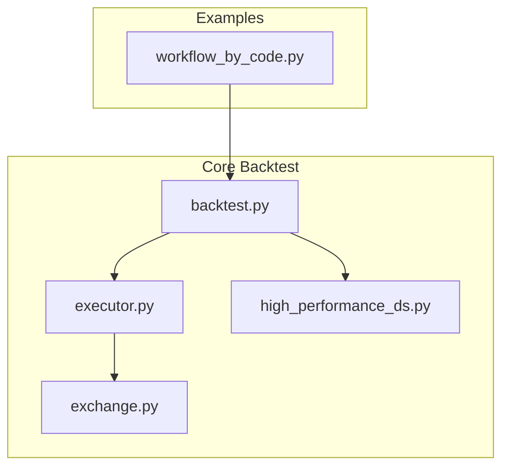
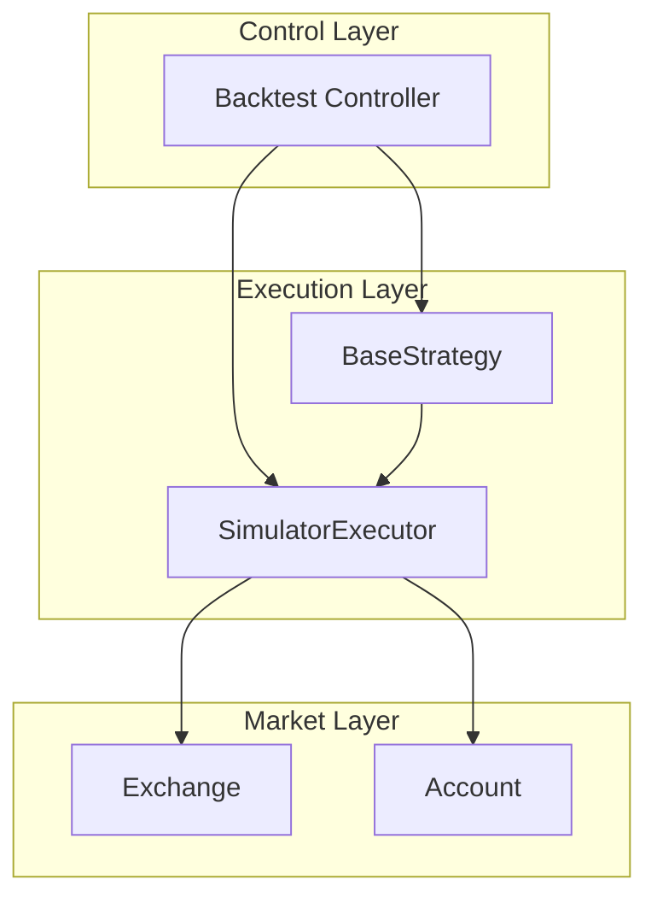
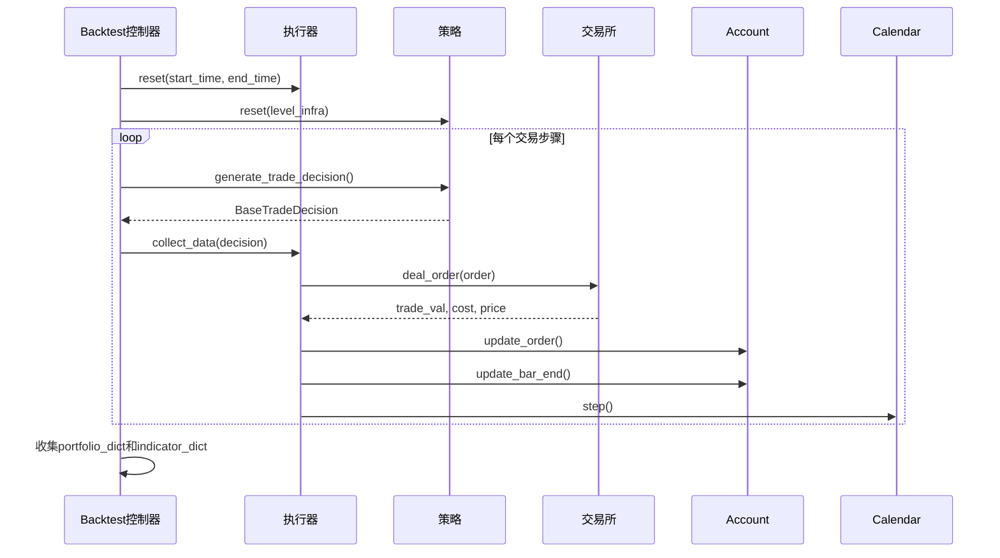
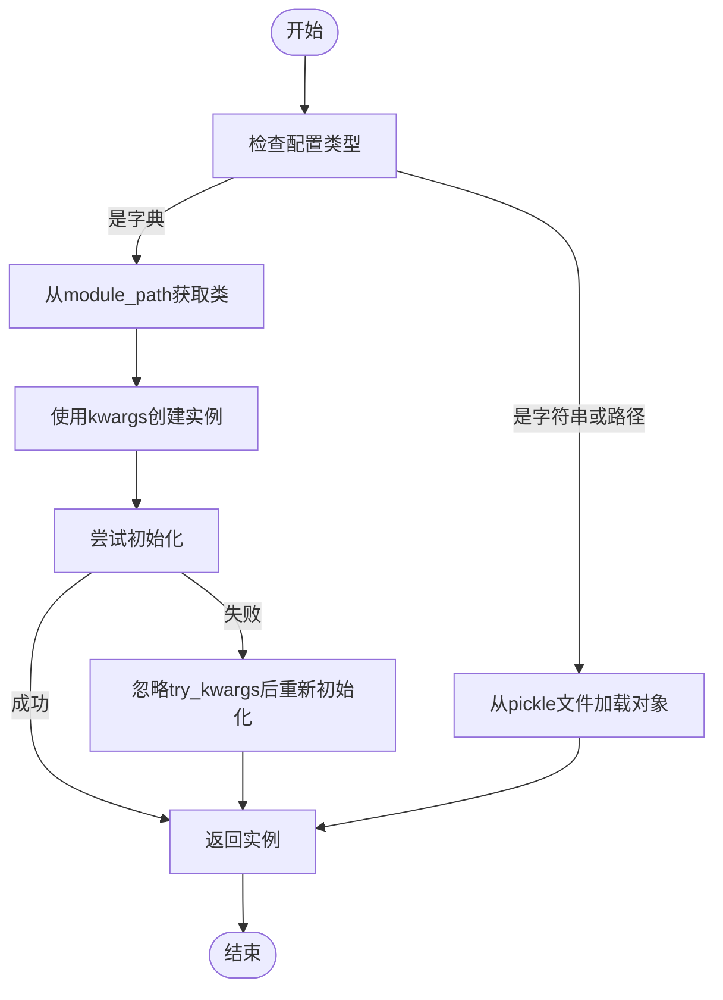
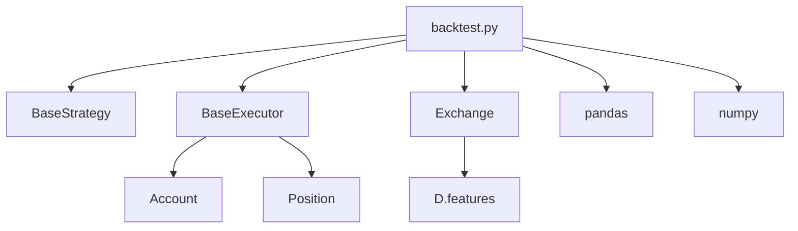

# 回测引擎核心

<cite>
**本文档中引用的文件**
- [backtest.py](file://qlib/backtest/backtest.py)
- [workflow_by_code.py](file://examples/workflow_by_code.py)
- [high_performance_ds.py](file://qlib/backtest/high_performance_ds.py)
- [executor.py](file://qlib/backtest/executor.py)
- [__init__.py](file://qlib/backtest/__init__.py)
- [exchange.py](file://qlib/backtest/exchange.py)
</cite>

## 目录
1. [简介](#简介)
2. [项目结构](#项目结构)
3. [核心组件](#核心组件)
4. [架构概述](#架构概述)
5. [详细组件分析](#详细组件分析)
6. [依赖分析](#依赖分析)
7. [性能考量](#性能考量)
8. [故障排除指南](#故障排除指南)
9. [结论](#结论)

## 简介
Qlib是一个量化投资研究平台，其回测引擎是整个系统的核心。`Backtest`类作为回测流程的控制中枢，负责协调策略（Strategy）、执行器（Executor）和交易所（Exchange）等关键组件。它通过时间序列驱动机制和市场事件调度逻辑，精确模拟交易过程，并生成详细的绩效报告。本文档将深入剖析`Backtest`类的工作原理，从初始化到结果报告的完整生命周期，并结合代码示例展示如何构建自定义回测流程。

## 项目结构
Qlib的项目结构清晰地划分了不同功能模块。核心回测逻辑位于`qlib/backtest/`目录下，其中`backtest.py`文件包含了主要的回测循环函数。`examples/`目录提供了丰富的使用案例，特别是`workflow_by_code.py`展示了如何通过编程方式构建回测工作流。此外，`high_performance_ds.py`文件实现了高性能数据结构，对于优化大规模回测的内存和计算效率至关重要。

**Diagram sources**
- [backtest.py](file://qlib/backtest/backtest.py#L1-L110)
- [workflow_by_code.py](file://examples/workflow_by_code.py#L1-L85)
- [high_performance_ds.py](file://qlib/backtest/high_performance_ds.py#L1-L658)

**Section sources**
- [backtest.py](file://qlib/backtest/backtest.py#L1-L110)
- [workflow_by_code.py](file://examples/workflow_by_code.py#L1-L85)

## 核心组件
`Backtest`类的核心由几个关键函数构成：`backtest_loop`、`collect_data_loop`以及`init_instance_by_config`。`backtest_loop`是主循环，它调用`collect_data_loop`来生成交易决策并执行。`init_instance_by_config`则根据YAML配置动态初始化所有回测环境组件，如策略、执行器和账户。这些组件协同工作，确保回测过程的准确性和可配置性。

**Section sources**
- [backtest.py](file://qlib/backtest/backtest.py#L1-L110)
- [__init__.py](file://qlib/backtest/__init__.py#L207-L227)

## 架构概述
Qlib的回测架构采用分层设计，以支持复杂的嵌套决策执行。最外层是`Backtest`控制器，它管理着一个`SimulatorExecutor`，该执行器在指定的时间步长（如日频或分钟频）内运行。执行器与`Exchange`交互以获取市场数据和执行订单，同时维护一个`Account`对象来跟踪资产组合的状态。这种解耦的设计使得各个组件可以独立开发和测试。

**Diagram sources**
- [backtest.py](file://qlib/backtest/backtest.py#L1-L110)
- [executor.py](file://qlib/backtest/executor.py#L1-L628)
- [exchange.py](file://qlib/backtest/exchange.py#L1-L799)

## 详细组件分析

### Backtest类分析
`Backtest`类通过`backtest_loop`函数实现了一个迭代式的回测流程。该流程首先重置执行器和策略，然后进入一个进度条循环，直到执行器完成所有交易步骤。在每个步骤中，策略生成交易决策，执行器收集数据并更新账户状态，最后推进日历。

#### 回测流程序列图

**Diagram sources**
- [backtest.py](file://qlib/backtest/backtest.py#L1-L110)
- [executor.py](file://qlib/backtest/executor.py#L1-L628)

### init_instance_by_config方法分析
`init_instance_by_config`是Qlib中用于动态实例化对象的关键工具。它接受一个包含类名、模块路径和参数的字典配置，并利用Python的反射机制创建相应的对象。这使得用户可以通过简单的YAML文件来配置复杂的回测环境，而无需编写大量样板代码。

#### 动态初始化流程图

**Diagram sources**
- [mod.py](file://qlib/utils/mod.py#L121-L183)

### 回测生命周期分析
完整的回测生命周期可分为六个阶段：初始化、数据加载、信号生成、订单执行、状态更新和结果报告。在初始化阶段，`init_instance_by_config`根据配置创建所有必要组件。随后，`collect_data_loop`驱动整个流程，在每个时间步长内，策略生成信号，执行器将其转化为订单并与交易所交互，最终账户状态被更新并记录下来。

**Section sources**
- [backtest.py](file://qlib/backtest/backtest.py#L1-L110)
- [__init__.py](file://qlib/backtest/__init__.py#L207-L227)

## 依赖分析
`Backtest`类的正常运行依赖于多个核心模块。它直接依赖于`BaseStrategy`、`BaseExecutor`和`Exchange`等抽象基类，这些类定义了各组件之间的接口契约。此外，它还依赖于`pandas`进行数据处理和`numpy`进行数值计算。通过`init_instance_by_config`，它能够灵活地集成各种具体的策略和执行器实现。

**Diagram sources**
- [backtest.py](file://qlib/backtest/backtest.py#L1-L110)
- [executor.py](file://qlib/backtest/executor.py#L1-L628)
- [exchange.py](file://qlib/backtest/exchange.py#L1-L799)

**Section sources**
- [backtest.py](file://qlib/backtest/backtest.py#L1-L110)
- [executor.py](file://qlib/backtest/executor.py#L1-L628)
- [exchange.py](file://qlib/backtest/exchange.py#L1-L799)

## 性能考量
为了应对大规模回测带来的性能挑战，Qlib提供了`high_performance_ds.py`中的高性能数据结构。例如，`NumpyQuote`类利用NumPy数组替代Pandas DataFrame来存储行情数据，显著减少了内存占用和访问延迟。在处理高频数据时，这种优化尤为重要，因为它直接影响回测的速度和可扩展性。

**Section sources**
- [high_performance_ds.py](file://qlib/backtest/high_performance_ds.py#L1-L658)

## 故障排除指南
常见的回测配置错误包括：未正确设置`start_time`和`end_time`导致数据缺失，`deal_price`字段拼写错误（如缺少`$`前缀），以及`limit_threshold`设置不合理。调试时应首先检查日志输出，确认组件是否成功初始化。如果遇到性能瓶颈，建议启用`track_data`选项来分析数据流，并考虑使用`NumpyQuote`等高性能数据结构。

**Section sources**
- [backtest.py](file://qlib/backtest/backtest.py#L1-L110)
- [exchange.py](file://qlib/backtest/exchange.py#L1-L799)
- [high_performance_ds.py](file://qlib/backtest/high_performance_ds.py#L1-L658)

## 结论
`Backtest`类是Qlib回测系统的神经中枢，它通过精巧的设计实现了灵活性与性能的平衡。通过理解其内部机制，用户可以更有效地利用该平台进行量化策略研究。未来的工作可以进一步探索如何利用分布式计算和GPU加速来提升回