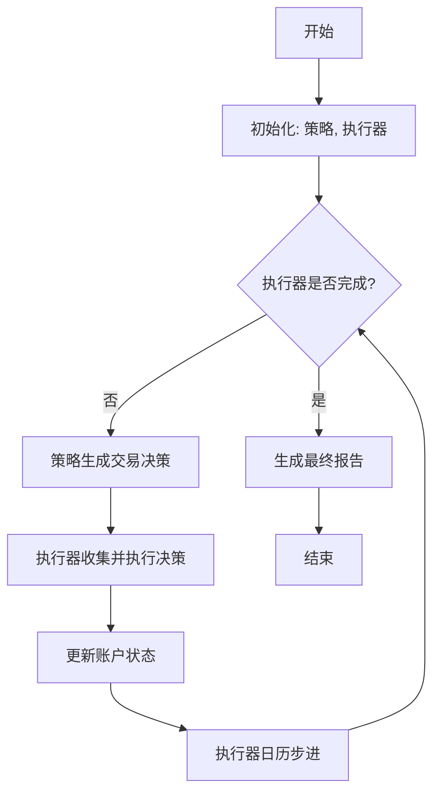
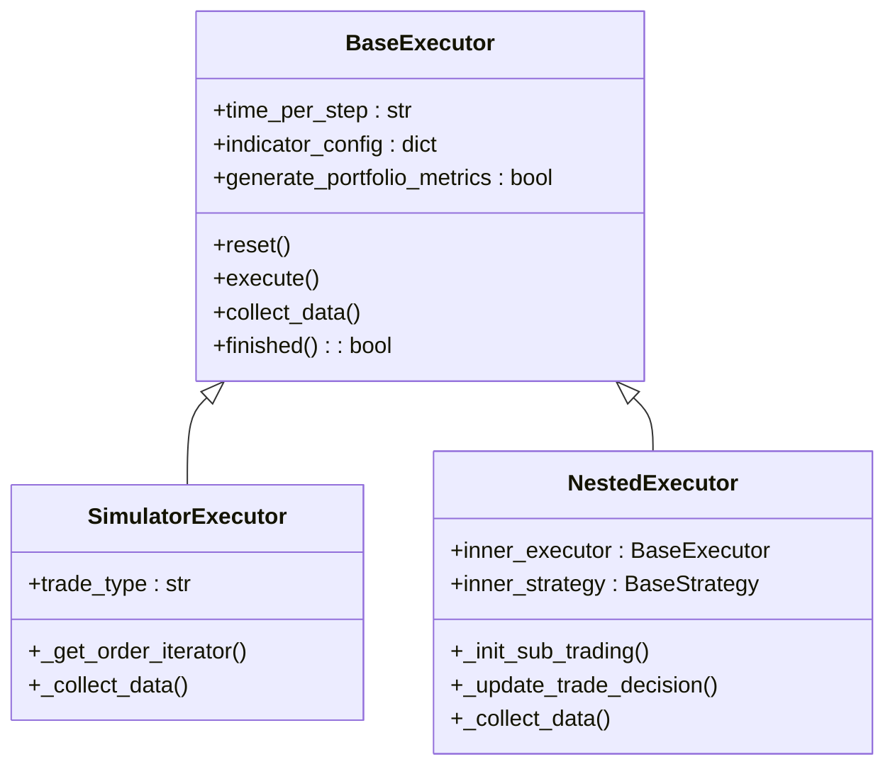

# 回测模块

<cite>
**本文档中引用的文件**  
- [backtest.py](file://qlib/backtest/backtest.py)
- [executor.py](file://qlib/backtest/executor.py)
- [exchange.py](file://qlib/backtest/exchange.py)
- [account.py](file://qlib/backtest/account.py)
- [position.py](file://qlib/backtest/position.py)
- [workflow.py](file://examples/highfreq/workflow.py)
- [highfreq_handler.py](file://examples/highfreq/highfreq_handler.py)
- [highfreq_ops.py](file://examples/highfreq/highfreq_ops.py)
</cite>

## 目录
1. [引言](#引言)
2. [回测引擎架构概览](#回测引擎架构概览)
3. [核心组件分析](#核心组件分析)
4. [Executor执行器模式详解](#executor执行器模式详解)
5. [Exchange模拟交易所与订单撮合](#exchange模拟交易所与订单撮合)
6. [Account账户与Position持仓管理](#account账户与position持仓管理)
7. [交易成本、滑点与流动性模型](#交易成本滑点与流动性模型)
8. [高频回测能力示例](#高频回测能力示例)
9. [扩展性与配置参数影响](#扩展性与配置参数影响)

## 引言

本文档旨在系统性地阐述Qlib框架中回测模块的各个组成部分及其协同工作机制。回测是量化策略开发流程中的关键环节，它通过历史数据模拟策略的实际交易过程，以评估其表现和风险。Qlib的回测引擎设计精巧，采用分层架构，将策略决策（Strategy）、执行逻辑（Executor）和市场模拟（Exchange）解耦，从而支持从日频到分钟级甚至更高频率的复杂回测需求。本文将深入剖析`Backtest`类的整体控制流、不同`Executor`的执行模式、`Exchange`的订单撮合规则、`Account`和`Position`的管理机制，并结合高频示例说明其高精度时间序列处理能力。

## 回测引擎架构概览

Qlib的回测引擎遵循一个清晰的事件驱动循环。整个流程由`backtest_loop`函数启动，该函数协调最外层的`BaseStrategy`（策略）和`BaseExecutor`（执行器）。其核心是一个生成器`collect_data_loop`，它在每个交易周期内迭代执行以下步骤：策略根据当前市场状态生成交易决策（`TradeDecision`），然后该决策被传递给执行器进行处理。执行器负责调用内部的`_collect_data`方法来实际执行交易，并更新账户和持仓状态。此过程持续进行，直到覆盖整个回测时间段。

**Diagram sources**
- [backtest.py](file://qlib/backtest/backtest.py#L0-L110)

## 核心组件分析

### Backtest类控制逻辑

`Backtest`模块的核心并非一个单一的“Backtest”类，而是一组协同工作的函数和类。主控逻辑体现在`backtest_loop`和`collect_data_loop`这两个函数中。`collect_data_loop`构成了回测的主循环，它利用Python生成器的特性，在每次迭代中暂停并等待策略产生新的决策。一旦获得决策，它便将其交给执行器的`collect_data`方法进行处理。执行完成后，执行结果会反馈给策略，以便其为下一个周期做准备。这个循环高效地串联了策略的“思考”和执行器的“行动”，确保了回测过程的连贯性和准确性。

**Section sources**
- [backtest.py](file://qlib/backtest/backtest.py#L0-L110)

### Executor执行器模式详解

`Executor`是回测引擎的执行中枢，负责将抽象的交易决策转化为具体的买卖操作。`BaseExecutor`定义了通用接口，而`SimulatorExecutor`是其主要实现。`SimulatorExecutor`支持两种关键的交易模式，通过`trade_type`参数控制：

1.  **串行模式 (Serial Mode)**: 在此模式下，订单按顺序执行。这意味着在一个交易周期内，可以先卖出股票A，然后立即使用所得资金买入股票B。这种模式更贴近某些允许日内资金再投资的市场环境。
2.  **并行模式 (Parallel Mode)**: 在此模式下，所有订单被视为同时执行。如果策略试图卖出A来购买B，但由于A的成交价格或数量不确定，可能导致用于购买B的资金不足，从而使整个交易失败。这更严格地模拟了资金约束。

此外，`NestedExecutor`实现了嵌套执行的概念，允许在日线级别的交易周期内，嵌入一个更高频率（如分钟级）的子执行器，这对于实现复杂的多周期策略至关重要。

**Diagram sources**
- [executor.py](file://qlib/backtest/executor.py#L0-L628)

**Section sources**
- [executor.py](file://qlib/backtest/executor.py#L0-L628)

## Exchange模拟交易所与订单撮合

`Exchange`类扮演着虚拟市场的角色，负责提供行情数据、检查