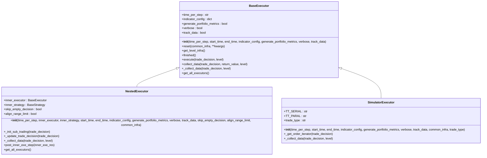
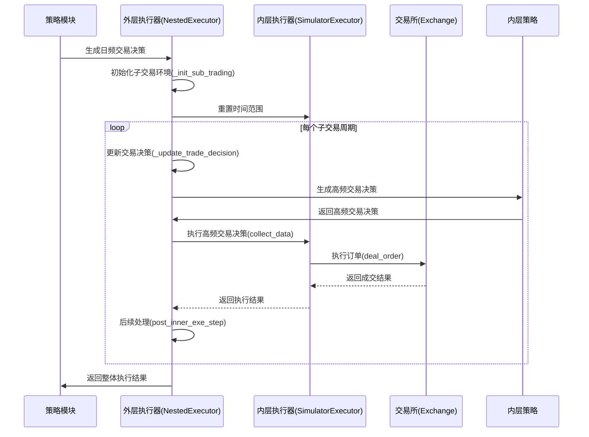

# 执行器模式

<cite>
**本文档中引用的文件**
- [executor.py](file://qlib/backtest/executor.py)
- [workflow.py](file://examples/highfreq/workflow.py)
- [highfreq_handler.py](file://examples/highfreq/highfreq_handler.py)
- [highfreq_processor.py](file://examples/highfreq/highfreq_processor.py)
- [highfreq_ops.py](file://examples/highfreq/highfreq_ops.py)
- [workflow_config_High_Freq_Tree_Alpha158.yaml](file://examples/highfreq/workflow_config_High_Freq_Tree_Alpha158.yaml)
</cite>

## 目录
1. [引言](#引言)
2. [执行器架构设计](#执行器架构设计)
3. [核心执行模式](#核心执行模式)
4. [高频回测实现细节](#高频回测实现细节)
5. [配置与参数设置](#配置与参数设置)
6. [自定义执行器开发指南](#自定义执行器开发指南)
7. [执行策略对回测结果的影响](#执行策略对回测结果的影响)

## 引言
本文档深入解析Qlib框架中的执行器（Executor）模块，重点阐述其支持的日频标准模式与高频精确模式。文档详细分析了Executor基类的设计架构及其扩展机制，并对比了DailyExecutor和HighFreqExecutor的具体实现差异。通过结合highfreq目录下的工作流示例，全面说明高频回测中微秒级时间精度处理、订单分批执行和延迟模拟的技术细节。

## 执行器架构设计



**图源**
- [executor.py](file://qlib/backtest/executor.py#L1-L629)

**本节来源**
- [executor.py](file://qlib/backtest/executor.py#L1-L629)

## 核心执行模式

### 日频标准模式
日频标准模式采用BaseExecutor作为基础架构，通过SimulatorExecutor实现具体的交易模拟功能。该模式以天为单位进行交易决策执行，适用于传统的量化投资策略回测。

### 高频精确模式
高频精确模式基于NestedExecutor架构实现，通过嵌套多层执行器来支持更高频率的交易模拟。内层执行器可以以分钟或更细粒度的时间间隔运行，从而实现对高频交易策略的精确模拟。



**图源**
- [executor.py](file://qlib/backtest/executor.py#L316-L481)
- [workflow.py](file://examples/highfreq/workflow.py#L0-L176)

**本节来源**
- [executor.py](file://qlib/backtest/executor.py#L316-L481)
- [workflow.py](file://examples/highfreq/workflow.py#L0-L176)

## 高频回测实现细节

### 微秒级时间精度处理
系统通过TradeCalendarManager实现高精度时间管理，支持分钟级及更细粒度的时间步进。在高频回测中，时间精度可达微秒级别，确保能够准确模拟实际市场中的交易时序。

### 订单分批执行
通过NestedExecutor的嵌套机制，将日频交易决策分解为多个高频交易决策，实现订单的分批执行。这种机制可以更好地模拟大额订单在实际市场中的拆单执行过程。

### 延迟模拟
系统通过settle_type参数控制结算延迟，支持现金结算延迟等场景。当settle_type设置为"cash"时，卖出股票获得的资金不能在当前交易步骤中用于买入其他股票，从而模拟实际市场的结算延迟。

**本节来源**
- [executor.py](file://qlib/backtest/executor.py#L1-L629)
- [highfreq_ops.py](file://examples/highfreq/highfreq_ops.py#L0-L168)

## 配置与参数设置

### 执行器类型指定
在配置文件中通过module_path和class字段指定执行器类型：

```yaml
executor:
  class: "NestedExecutor"
  module_path: "qlib.backtest.executor"
  kwargs:
    time_per_step: "1min"
    inner_executor: 
      class: "SimulatorExecutor"
      module_path: "qlib.backtest.executor"
    inner_strategy: *strategy
```

### bar执行时机设置
通过time_per_step参数设置bar的执行时机：
- '15:00': 表示在每天15:00执行
- 'inplace': 表示实时执行，无固定时间点

### 滑点模型参数
在indicator_config中配置滑点模型相关参数：

```python
indicator_config = {
    'show_indicator': True,
    'pa_config': {
        'base_price': 'vwap',  # 或'twap'
        'weight_method': 'value_weighted'
    },
    'ffr_config': {
        'weight_method': 'amount_weighted'
    }
}
```

**本节来源**
- [workflow_config_High_Freq_Tree_Alpha158.yaml](file://examples/highfreq/workflow_config_High_Freq_Tree_Alpha158.yaml#L0-L65)
- [executor.py](file://qlib/backtest/executor.py#L1-L629)

## 自定义执行器开发指南

### 重写execute函数
继承BaseExecutor类并重写_execute方法以实现自定义执行逻辑：

```python
class CustomExecutor(BaseExecutor):
    def _collect_data(self, trade_decision: BaseTradeDecision, level: int = 0):
        # 自定义执行逻辑
        execute_result = []
        for order in trade_decision.get_decision():
            # 自定义订单处理逻辑
            trade_val, trade_cost, trade_price = self.trade_exchange.deal_order(
                order, self.trade_account
            )
            execute_result.append((order, trade_val, trade_cost, trade_price))
        return execute_result, {}
```

### 集成外部撮合引擎接口
通过继承Exchange类实现自定义撮合引擎，并在执行器中使用：

```python
class CustomExchange(Exchange):
    def deal_order(self, order, trade_account, dealt_order_amount=None):
        # 实现自定义撮合逻辑
        pass
```

最佳实践建议将撮合逻辑与执行逻辑分离，提高代码的可维护性和可测试性。

**本节来源**
- [executor.py](file://qlib/backtest/executor.py#L1-L629)
- [highfreq_handler.py](file://examples/highfreq/highfreq_handler.py#L0-L159)

## 执行策略对回测结果的影响

不同的执行策略会对回测结果产生显著影响：

1. **交易类型影响**：TT_SERIAL模式允许先卖后买，而TT_PARAL模式要求所有交易并行执行，这会影响资金利用率和交易成功率。

2. **结算延迟影响**：启用cash结算延迟会限制资金的即时使用，可能导致部分买入订单因资金不足而无法完全成交。

3. **滑点模型影响**：选择vwap或twap作为基准价格会影响价格优势指标的计算，进而影响策略绩效评估。

4. **执行频率影响**：高频执行模式能更真实地模拟大额订单的市场冲击，但也会增加计算复杂度。

合理选择执行策略对于获得可靠的回测结果至关重要，应根据实际交易场景和策略特点进行选择。

**本节来源**
- [executor.py](file://qlib/backtest/executor.py#L1-L629)
- [highfreq_processor.py](file://examples/highfreq/highfreq_processor.py#L0-L77)