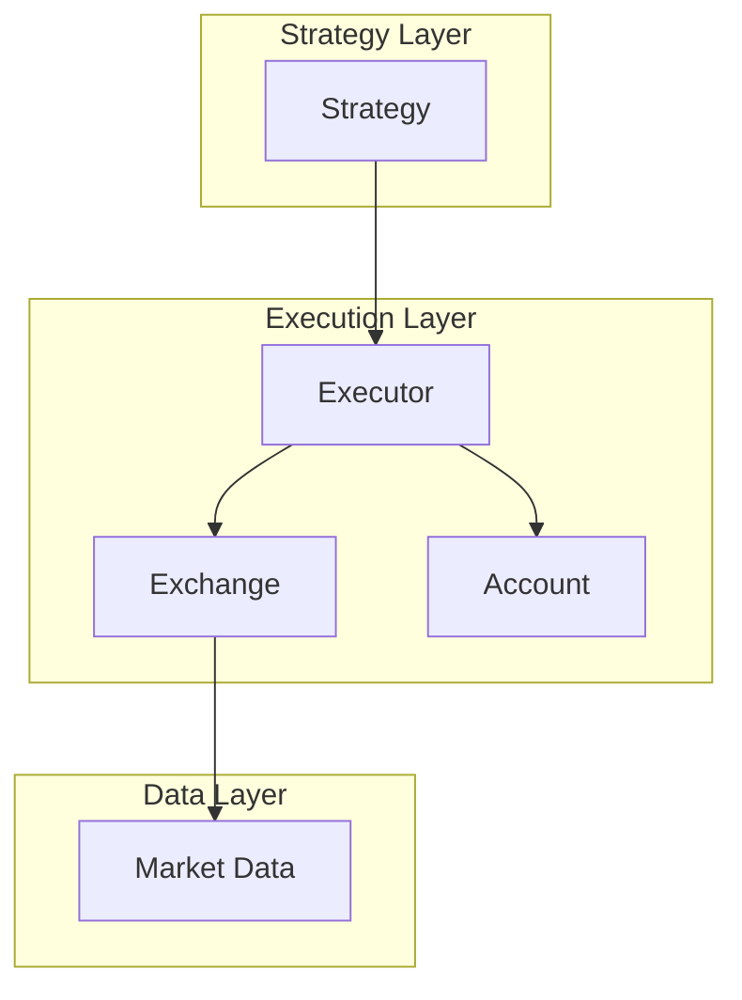
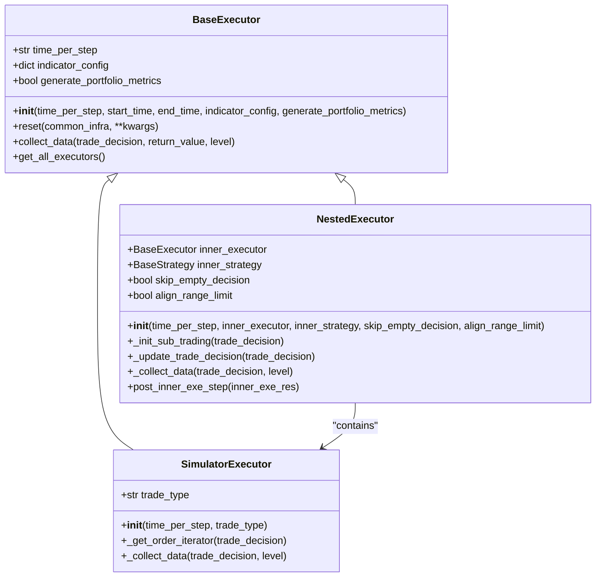
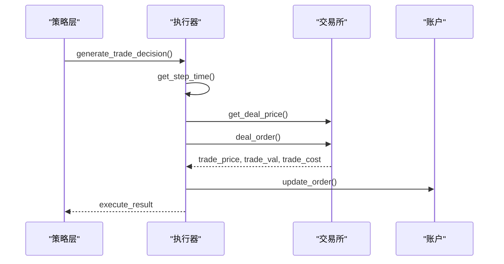
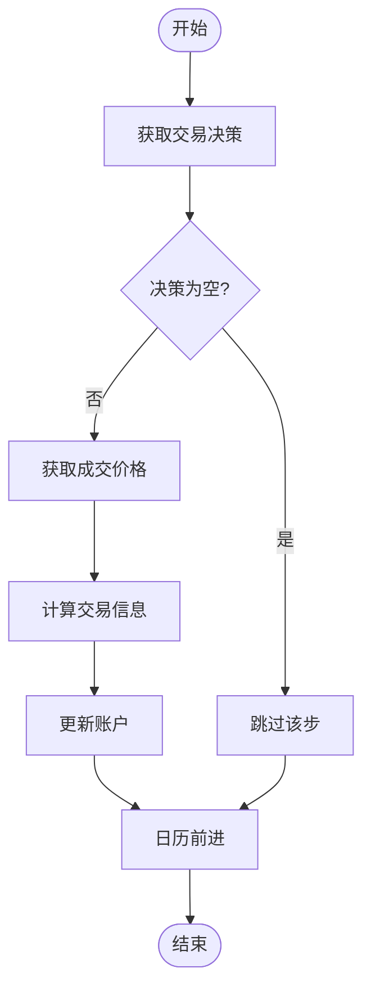
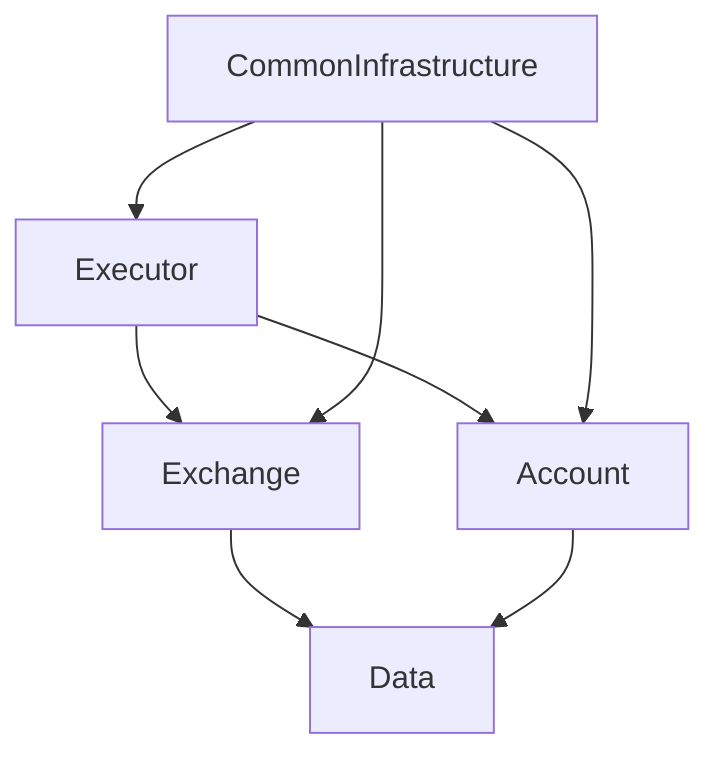

# 日频标准执行器

<cite>
**本文档中引用的文件 **   
- [executor.py](file://qlib/backtest/executor.py)
- [exchange.py](file://qlib/backtest/exchange.py)
</cite>

## 目录
1. [简介](#简介)
2. [项目结构](#项目结构)
3. [核心组件](#核心组件)
4. [架构概述](#架构概述)
5. [详细组件分析](#详细组件分析)
6. [依赖关系分析](#依赖关系分析)
7. [性能考虑](#性能考虑)
8. [故障排除指南](#故障排除指南)
9. [结论](#结论)

## 简介
本文件深入探讨了DailyExecutor的实现细节，重点阐述其作为基类Executor的标准日频回测执行逻辑。详细说明其在每个交易日结束时（如'15:00'）集中处理所有订单的机制，包括订单撮合流程、价格填充策略（如收盘价成交）和滑点计算模型（如固定比例或百分比滑点）。结合executor.py中的execute函数实现，分析其与Exchange组件的交互方式，以及如何通过配置参数控制bar对齐行为和执行延迟。

## 项目结构
该项目主要由以下几个核心模块组成：backtest、strategy、data、model等。其中，backtest模块负责回测执行的核心逻辑，包含executor、exchange、account等关键组件。executor模块实现了不同频率的执行器，包括日频执行器和分钟级执行器。strategy模块定义了各种投资策略。data模块负责数据获取和处理。整个项目的结构设计遵循了模块化原则，各组件之间通过清晰的接口进行交互。

```mermaid
graph TD
subgraph "Backtest"
Executor[Executor]
Exchange[Exchange]
Account[Account]
end
subgraph "Strategy"
Strategy[Strategy]
end
subgraph "Data"
Data[Data]
end
Executor --> Exchange
Executor --> Account
Executor --> Strategy
Data --> Executor
```

**图表来源**
- [executor.py](file://qlib/backtest/executor.py#L1-L50)
- [exchange.py](file://qlib/backtest/exchange.py#L1-L50)

**章节来源**
- [executor.py](file://qlib/backtest/executor.py#L1-L100)
- [exchange.py](file://qlib/backtest/exchange.py#L1-L100)

## 核心组件
DailyExecutor的核心组件主要包括SimulatorExecutor、BaseExecutor和NestedExecutor三个类。SimulatorExecutor是实际执行交易的核心类，负责处理订单撮合、价格计算和成本核算。BaseExecutor是所有执行器的基类，定义了执行器的基本接口和通用功能。NestedExecutor用于实现多层嵌套执行，支持不同时间频率的混合执行策略。这些组件通过TradeCalendarManager协调执行时间，确保在正确的交易时段执行相应的操作。

**章节来源**
- [executor.py](file://qlib/backtest/executor.py#L150-L300)
- [executor.py](file://qlib/backtest/executor.py#L400-L600)

## 架构概述
系统的整体架构采用分层设计，上层为策略层，中间为执行层，底层为数据层。执行层的核心是Executor组件，它接收来自策略层的交易决策，并通过Exchange组件与市场数据进行交互。Executor根据配置的时间粒度（time_per_step）生成交易日历，按计划执行交易。整个架构支持灵活的配置，可以通过YAML文件定义不同的执行策略和参数。



**图表来源**
- [executor.py](file://qlib/backtest/executor.py#L1-L20)
- [exchange.py](file://qlib/backtest/exchange.py#L1-L20)

## 详细组件分析
### DailyExecutor分析
DailyExecutor作为日频执行器，其核心功能是在每个交易日结束时集中处理所有订单。它通过继承SimulatorExecutor类来实现这一功能。执行过程主要包括以下几个步骤：首先，根据交易日历确定当前交易时段；然后，从策略层获取交易决策；接着，通过Exchange组件获取市场价格信息；最后，执行订单撮合并更新账户状态。

#### 对象导向组件


**图表来源**
- [executor.py](file://qlib/backtest/executor.py#L150-L600)

#### API/服务组件


**图表来源**
- [executor.py](file://qlib/backtest/executor.py#L500-L600)
- [exchange.py](file://qlib/backtest/exchange.py#L400-L500)

#### 复杂逻辑组件


**图表来源**
- [executor.py](file://qlib/backtest/executor.py#L500-L600)

**章节来源**
- [executor.py](file://qlib/backtest/executor.py#L500-L600)

### 概念概述
日频执行器的设计理念是模拟真实交易环境，在每个交易日结束时统一处理所有交易指令。这种设计可以有效避免日内频繁交易带来的数据干扰，更准确地反映策略的实际表现。同时，通过配置不同的参数，可以灵活调整执行逻辑，满足不同策略的需求。


## 依赖关系分析
系统各组件之间的依赖关系清晰明确。Executor组件依赖于Exchange组件获取市场数据，依赖于Account组件管理账户状态。Exchange组件依赖于底层的数据服务获取历史行情数据。这种分层依赖结构保证了系统的可维护性和扩展性。通过CommonInfrastructure统一管理这些依赖关系，确保各个组件能够协同工作。



**图表来源**
- [executor.py](file://qlib/backtest/executor.py#L1-L50)
- [exchange.py](file://qlib/backtest/exchange.py#L1-L50)

**章节来源**
- [executor.py](file://qlib/backtest/executor.py#L1-L100)
- [exchange.py](file://qlib/backtest/exchange.py#L1-L100)

## 性能考虑
在性能优化方面，系统采用了多种技术手段。首先，通过批量处理订单减少I/O操作次数。其次，使用缓存机制存储常用数据，避免重复计算。再者，利用并行处理技术提高执行效率。此外，还通过合理的内存管理和垃圾回收策略，确保系统长时间运行的稳定性。这些优化措施共同作用，使得系统能够在保证准确性的同时，提供高效的执行性能。

## 故障排除指南
在使用过程中可能遇到的主要问题包括：交易时间配置错误导致执行时机偏差、市场数据缺失影响价格撮合、账户余额不足导致交易失败等。针对这些问题，系统提供了详细的日志记录功能，可以帮助用户快速定位问题。同时，建议定期检查配置文件的正确性，确保市场数据的完整性，并合理设置账户初始资金规模。

**章节来源**
- [executor.py](file://qlib/backtest/executor.py#L550-L600)
- [exchange.py](file://qlib/backtest/exchange.py#L450-L500)

## 结论
DailyExecutor作为Qlib框架中的重要组成部分，提供了稳定可靠的日频回测执行能力。通过对执行逻辑的精细控制和对各种异常情况的妥善处理，确保了回测结果的准确性和可靠性。未来可以通过引入更多智能化的执行策略，进一步提升系统的实用价值。