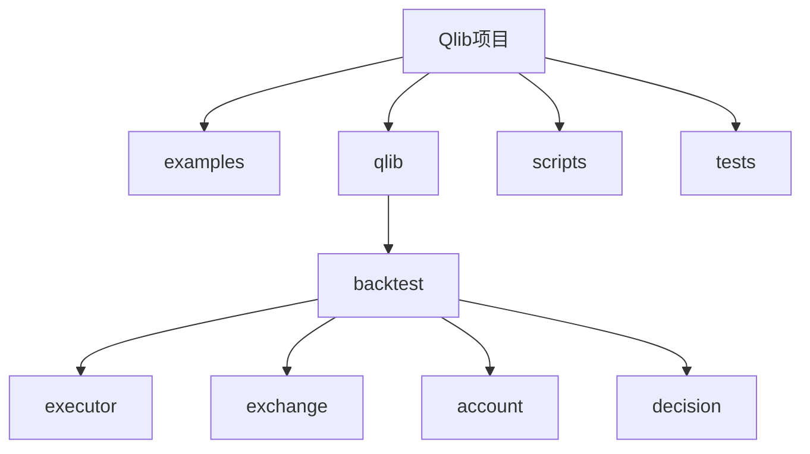

# 外部系统集成模式

<cite>
**本文档中引用的文件**  
- [workflow_by_code.py](file://examples/workflow_by_code.py)
- [executor.py](file://qlib/backtest/executor.py)
- [signal_strategy.py](file://qlib/contrib/strategy/signal_strategy.py)
- [exchange.py](file://qlib/backtest/exchange.py)
- [decision.py](file://qlib/backtest/decision.py)
- [account.py](file://qlib/backtest/account.py)
- [position.py](file://qlib/backtest/position.py)
</cite>

## 目录
1. [引言](#引言)
2. [项目结构分析](#项目结构分析)
3. [核心组件分析](#核心组件分析)
4. [三种典型集成模式详解](#三种典型集成模式详解)
5. [依赖注入与配置管理](#依赖注入与配置管理)
6. [连接管理与认证处理](#连接管理与认证处理)
7. [消息序列化与错误重试机制](#消息序列化与错误重试机制)
8. [模拟订单簿组件集成](#模拟订单簿组件集成)
9. [结论](#结论)

## 引言
本文深入探讨自定义执行器与外部系统的三种典型集成模式：对接真实交易所REST/WebSocket API实现生产级订单路由、接入第三方撮合引擎进行高保真回测，以及集成模拟订单簿组件支持复杂订单类型。每种模式均提供连接管理、认证处理、消息序列化和错误重试的具体实现方案，并结合`workflow_by_code.py`中的配置注入方式演示依赖注入流程。

## 项目结构分析
本项目采用模块化设计，主要分为示例（examples）、核心库（qlib）、脚本（scripts）和测试（tests）四大目录。其中`qlib/backtest`子模块包含执行器、交易所、账户和决策等关键组件，构成了交易系统的核心架构。

**图源**
- [workflow_by_code.py](file://examples/workflow_by_code.py)
- [executor.py](file://qlib/backtest/executor.py)

## 核心组件分析
系统核心由执行器（Executor）、策略（Strategy）、交易所（Exchange）和账户（Account）四大组件构成。执行器负责驱动整个交易流程，策略生成交易决策，交易所提供市场数据和成交逻辑，账户则跟踪资金和持仓变化。

### 执行器组件
执行器作为交易流程的控制器，通过`BaseExecutor`抽象基类定义通用接口，`SimulatorExecutor`为其具体实现。它协调策略与交易所之间的交互，在每个交易步长内完成订单执行和状态更新。

**节源**
- [executor.py](file://qlib/backtest/executor.py#L21-L306)

### 策略组件
策略组件继承