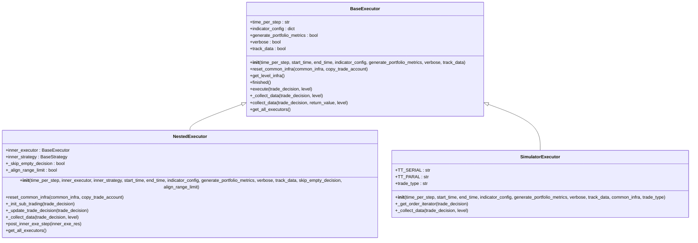
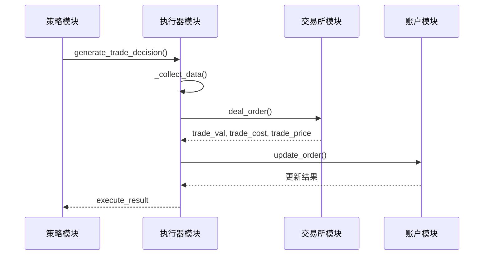
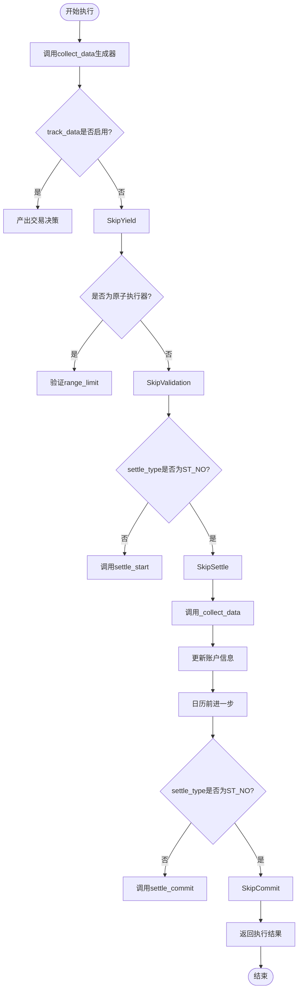
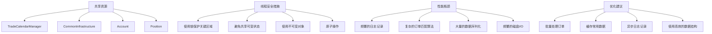

# 自定义执行器开发

<cite>
**本文档中引用的文件**  
- [executor.py](file://qlib/backtest/executor.py)
- [workflow_by_code.py](file://examples/workflow_by_code.py)
- [decision.py](file://qlib/backtest/decision.py)
- [exchange.py](file://qlib/backtest/exchange.py)
- [account.py](file://qlib/backtest/account.py)
- [utils.py](file://qlib/backtest/utils.py)
</cite>

## 目录
1. [简介](#简介)
2. [核心组件分析](#核心组件分析)
3. [自定义执行器实现指南](#自定义执行器实现指南)
4. [扩展点设计与集成](#扩展点设计与集成)
5. [工作流注册与执行](#工作流注册与执行)
6. [异常处理与部分成交场景](#异常处理与部分成交场景)
7. [线程安全与性能优化](#线程安全与性能优化)
8. [常见扩展用例](#常见扩展用例)
9. [结论](#结论)

## 简介
本文档提供完整的自定义执行器（Executor）开发指南，指导用户如何继承基类 `BaseExecutor` 并重写 `execute` 方法以实现特定交易逻辑。详细说明了扩展点设计，包括如何接入外部撮合引擎API、实现自定义订单簿模拟器或集成真实交易所接口。通过 `workflow_by_code.py` 中的实例演示如何将自定义执行器注册到实验工作流中，并处理异常订单状态和部分成交场景。

**Section sources**
- [executor.py](file://qlib/backtest/executor.py#L21-L306)
- [workflow_by_code.py](file://examples/workflow_by_code.py#L1-L85)

## 核心组件分析

### 执行器架构
Qlib的执行器系统采用分层设计，核心组件包括：
- **BaseExecutor**: 所有执行器的基类，定义了执行框架和生命周期管理
- **NestedExecutor**: 支持嵌套策略的执行器，允许在不同时间粒度下执行交易决策
- **SimulatorExecutor**: 模拟真实市场环境的执行器，负责订单执行和账户更新



**Diagram sources**
- [executor.py](file://qlib/backtest/executor.py#L21-L306)
- [executor.py](file://qlib/backtest/executor.py#L309-L497)
- [executor.py](file://qlib/backtest/executor.py#L512-L627)

### 交易决策流程
执行器与策略之间的交互通过交易决策对象进行，主要涉及以下组件：



**Diagram sources**
- [executor.py](file://qlib/backtest/executor.py#L205-L224)
- [exchange.py](file://qlib/backtest/exchange.py#L420-L462)
- [account.py](file://qlib/backtest/account.py#L337-L402)

**Section sources**
- [executor.py](file://qlib/backtest/executor.py#L205-L224)
- [exchange.py](file://qlib/backtest/exchange.py#L420-L462)
- [account.py](file://qlib/backtest/account.py#L337-L402)

## 自定义执行器实现指南

### 继承基类Executor
要创建自定义执行器，需要继承 `BaseExecutor` 类并重写 `_collect_data` 方法。该方法是执行器的核心逻辑所在，负责处理交易决策并返回执行结果。

```python
from qlib.backtest.executor import BaseExecutor
from qlib.backtest.decision import BaseTradeDecision

class CustomExecutor(BaseExecutor):
    def __init__(self, time_per_step: str, **kwargs):
        super().__init__(time_per_step=time_per_step, **kwargs)
        
    def _collect_data(self, trade_decision: BaseTradeDecision, level: int = 0):
        # 实现自定义交易逻辑
        execute_result = []
        # ... 处理交易决策 ...
        return execute_result, {"trade_info": execute_result}
```

**Section sources**
- [executor.py](file://qlib/backtest/executor.py#L205-L224)

### 重写execute方法
虽然 `execute` 方法在框架中很少直接使用，但理解其工作原理对于开发自定义执行器至关重要。该方法通过调用 `collect_data` 生成器来收集交易决策数据。



**Diagram sources**
- [executor.py](file://qlib/backtest/executor.py#L182-L202)

## 扩展点设计与集成

### 接入外部撮合引擎API
可以通过重写 `deal_order` 方法来集成外部撮合引擎API，实现更真实的交易模拟。

```python
def deal_order_with_external_engine(self, order, trade_account, dealt_order_amount):
    """
    使用外部撮合引擎处理订单
    """
    # 调用外部API获取成交价格和数量
    external_result = self.external_api.execute_order(order)
    
    if external_result.success:
        trade_val = external_result.price * external_result.quantity
        trade_cost = trade_val * self.transaction_cost_rate
        trade_price = external_result.price
        
        # 更新账户
        trade_account.update_order(
            order=order, 
            trade_val=trade_val, 
            cost=trade_cost, 
            trade_price=trade_price
        )
        
        return trade_val, trade_cost, trade_price
    else:
        # 订单失败处理
        order.deal_amount = 0.0
        return 0.0, 0.0, float('nan')
```

**Section sources**
- [exchange.py](file://qlib/backtest/exchange.py#L420-L462)

### 实现自定义订单簿模拟器
可以创建一个基于订单簿的执行器，更精确地模拟市场微观结构。

```python
class OrderBookSimulatorExecutor(SimulatorExecutor):
    def __init__(self, time_per_step: str, order_book_data: pd.DataFrame, **kwargs):
        super().__init__(time_per_step=time_per_step, **kwargs)
        self.order_book_data = order_book_data
        
    def _simulate_order_execution(self, order: Order) -> Tuple[float, float, float]:
        """
        基于订单簿数据模拟订单执行
        """
        current_time = self.trade_calendar.get_step_time()[0]
        book_snapshot = self.order_book_data.loc[current_time]
        
        if order.direction == Order.BUY:
            # 买方订单匹配卖一价
            price = book_snapshot['ask_price']
            quantity = min(order.amount, book_snapshot['ask_volume'])
        else:
            # 卖方订单匹配买一价
            price = book_snapshot['bid_price']
            quantity = min(order.amount, book_snapshot['bid_volume'])
            
        value = price * quantity
        cost = value * self.transaction_cost_rate
        
        return value, cost, price
```

**Section sources**
- [executor.py](file://qlib/backtest/executor.py#L589-L627)

## 工作流注册与执行

### 在workflow_by_code.py中注册
通过配置文件将自定义执行器注册到实验工作流中，实现无缝集成。

```python
port_analysis_config = {
    "executor": {
        "class": "CustomExecutor",
        "module_path": "path.to.custom.executor",
        "kwargs": {
            "time_per_step": "day",
            "generate_portfolio_metrics": True,
            "custom_param": "value"
        },
    },
    "strategy": {
        "class": "TopkDropoutStrategy",
        "module_path": "qlib.contrib.strategy.signal_strategy",
        "kwargs": {
            "signal": (model, dataset),
            "topk": 50,
            "n_drop": 5,
        },
    },
    "backtest": {
        "start_time": "2017-01-01",
        "end_time": "2020-08-01",
        "account": 100000000,
        "benchmark": CSI300_BENCH,
        "exchange_kwargs": {
            "freq": "day",
            "limit_threshold": 0.095,
            "deal_price": "close",
            "open_cost": 0.0005,
            "close_cost": 0.0015,
            "min_cost": 5,
        },
    },
}
```

**Section sources**
- [workflow_by_code.py](file://examples/workflow_by_code.py#L1-L85)

## 异常处理与部分成交场景

### 异常订单状态处理
在执行过程中需要妥善处理各种异常情况，确保系统的稳定性和可靠性。

```python
def handle_order_exceptions(self, order: Order):
    """
    处理订单异常情况
    """
    # 检查股票是否可交易
    if not self.is_stock_tradable(order.stock_id, order.start_time, order.end_time):
        order.deal_amount = 0.0
        self.logger.warning(f"股票 {order.stock_id} 不可交易")
        return False
        
    # 检查交易限制
    if self.check_stock_limit(order.stock_id, order.start_time, order.end_time, order.direction):
        order.deal_amount = 0.0
        self.logger.warning(f"股票 {order.stock_id} 达到涨跌停限制")
        return False
        
    # 检查资金/持仓是否充足
    if order.direction == Order.SELL:
        current_amount = self.trade_account.current_position.get_stock_amount(order.stock_id)
        if current_amount < order.amount:
            # 部分成交
            order.deal_amount = current_amount
            self.logger.info(f"卖出订单部分成交: {order.stock_id}")
            return True
    else:
        required_cash = order.amount * self.get_deal_price(order.stock_id, order.start_time, order.end_time)
        if self.trade_account.get_cash() < required_cash:
            # 计算最大可买入数量
            max_amount = self.trade_account.get_cash() / self.get_deal_price(order.stock_id, order.start_time, order.end_time)
            order.deal_amount = max_amount
            self.logger.info(f"买入订单部分成交: {order.stock_id}")
            return True
            
    return True
```

**Section sources**
- [exchange.py](file://qlib/backtest/exchange.py#L420-L462)

## 线程安全与性能优化

### 线程安全注意事项
在多线程环境下使用执行器时需要注意以下几点：



**Diagram sources**
- [utils.py](file://qlib/backtest/utils.py#L86-L89)

### 性能瓶颈排查技巧
识别和解决性能瓶颈是确保执行器高效运行的关键。

```python
class PerformanceMonitor:
    def __init__(self):
        self.metrics = {}
        
    def measure_execution_time(self, func_name: str):
        """
        装饰器用于测量函数执行时间
        """
        def decorator(func):
            def wrapper(*args, **kwargs):
                start_time = time.time()
                result = func(*args, **kwargs)
                end_time = time.time()
                
                if func_name not in self.metrics:
                    self.metrics[func_name] = []
                self.metrics[func_name].append(end_time - start_time)
                
                return result
            return wrapper
        return decorator
        
    def get_performance_report(self):
        """
        生成性能报告
        """
        report = {}
        for func_name, times in self.metrics.items():
            report[func_name] = {
                'avg': np.mean(times),
                'max': np.max(times),
                'min': np.min(times),
                'count': len(times)
            }
        return report
```

**Section sources**
- [executor.py](file://qlib/backtest/executor.py#L205-L224)

## 常见扩展用例

### 暗池交易模拟
实现暗池交易模拟器，支持隐蔽的大宗交易执行。

```python
class DarkPoolExecutor(SimulatorExecutor):
    def __init__(self, time_per_step: str, dark_pool_ratio: float = 0.3, **kwargs):
        super().__init__(time_per_step=time_per_step, **kwargs)
        self.dark_pool_ratio = dark_pool_ratio
        
    def _execute_dark_pool_order(self, order: Order):
        """
        在暗池中执行订单
        """
        # 根据市场深度决定暗池成交比例
        market_volume = self.exchange.get_volume(order.stock_id, order.start_time, order.end_time)
        dark_pool_volume = market_volume * self.dark_pool_ratio
        
        execution_ratio = min(1.0, dark_pool_volume / order.amount)
        executed_amount = order.amount * execution_ratio
        
        trade_price = self._determine_dark_pool_price(order, execution_ratio)
        trade_val = trade_price * executed_amount
        trade_cost = trade_val * self.transaction_cost_rate
        
        return trade_val, trade_cost, trade_price, executed_amount
```

### 冰山订单执行
实现冰山订单执行策略，将大额订单拆分为多个小额订单逐步执行。

```python
class IcebergOrderExecutor(SimulatorExecutor):
    def __init__(self, time_per_step: str, visible_size: float = 1000, **kwargs):
        super().__init__(time_per_step=time_per_step, **kwargs)
        self.visible_size = visible_size
        self.remaining_orders = {}
        
    def _split_iceberg_order(self, order: Order):
        """
        将冰山订单拆分为可见和隐藏部分
        """
        visible_amount = min(order.amount, self.visible_size)
        hidden_amount = order.amount - visible_amount
        
        visible_order = Order(
            stock_id=order.stock_id,
            amount=visible_amount,
            direction=order.direction,
            start_time=order.start_time,
            end_time=order.end_time
        )
        
        if hidden_amount > 0:
            self.remaining_orders[order.stock_id] = {
                'amount': hidden_amount,
                'direction': order.direction
            }
            
        return visible_order
```

### 跨市场套利路由
实现跨市场套利执行器，自动识别并执行套利机会。

```python
class CrossMarketArbitrageExecutor(NestedExecutor):
    def __init__(self, time_per_step: str, markets: List[str], **kwargs):
        super().__init__(time_per_step=time_per_step, **kwargs)
        self.markets = markets
        self.price_cache = {}
        
    def _detect_arbitrage_opportunity(self):
        """
        检测跨市场套利机会
        """
        prices = {}
        for market in self.markets:
            prices[market] = self._get_market_price(market)
            
        # 计算价差
        price_diffs = self._calculate_price_differences(prices)
        
        opportunities = []
        for pair, diff in price_diffs.items():
            if abs(diff) > self.arbitrage_threshold:
                opportunities.append({
                    'pair': pair,
                    'price_diff': diff,
                    'direction': 'long_short' if diff > 0 else 'short_long'
                })
                
        return opportunities
```

**Section sources**
- [executor.py](file://qlib/backtest/executor.py#L309-L497)

## 结论
本文档详细介绍了Qlib框架中自定义执行器的开发方法，涵盖了从基础继承到高级扩展的各个方面。通过继承 `BaseExecutor` 类并重写 `_collect_data` 方法，开发者可以实现各种复杂的