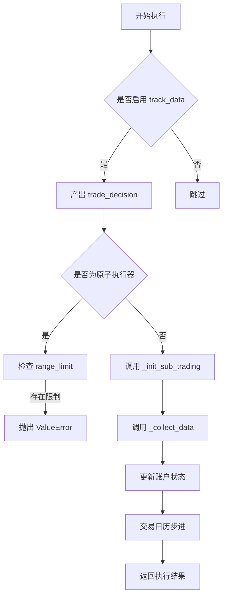
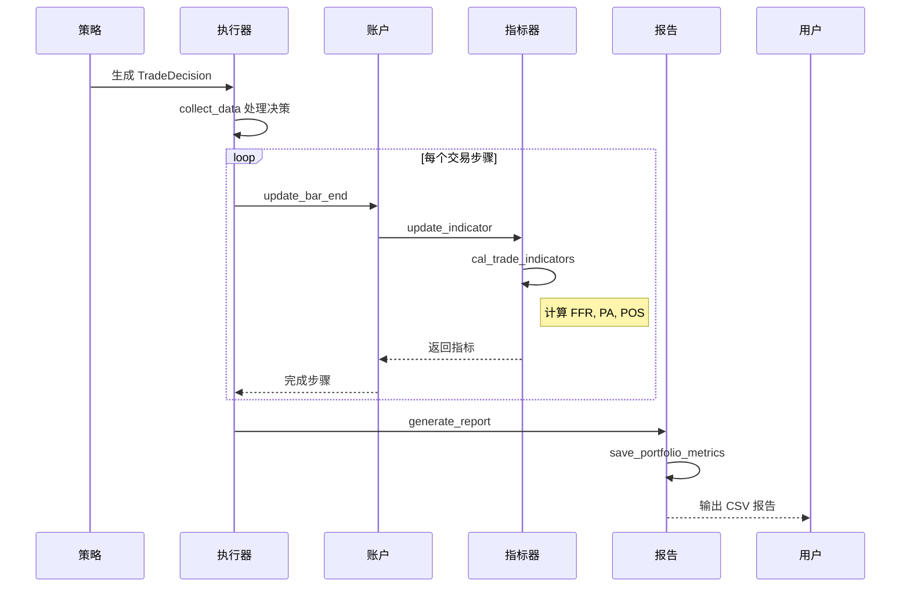

# 调试与性能优化

<cite>
**本文档中引用的文件 **  
- [executor.py](file://qlib/backtest/executor.py)
- [report.py](file://qlib/backtest/report.py)
- [decision.py](file://qlib/backtest/decision.py)
- [exchange.py](file://qlib/backtest/exchange.py)
</cite>

## 目录
1. [引言](#引言)
2. [自定义执行器全链路调试](#自定义执行器全链路调试)
3. [性能瓶颈分析与诊断](#性能瓶颈分析与诊断)
4. [执行质量分析报告生成](#执行质量分析报告生成)
5. [结论](#结论)

## 引言
本文档旨在为 Qlib 框架中的自定义执行器提供全面的调试与性能优化指南。核心目标是帮助开发者深入理解交易执行流程，实现对订单流的精确追踪，并通过系统化的手段识别和解决性能瓶颈。文档将详细介绍如何利用日志埋点、中间状态持久化等技术进行全链路调试，分析常见的 I/O 阻塞、锁竞争和内存泄漏问题，并指导如何使用 `report.py` 生成执行质量分析报告，以评估滑点、成交率和策略偏离度等关键指标，最终实现执行逻辑的持续优化。

## 自定义执行器全链路调试

### 日志埋点建议
在自定义执行器中实施有效的日志埋点是调试的基础。根据代码分析，`SimulatorExecutor` 类在 `_collect_data` 方法中已包含详细的日志输出（当 `verbose=True` 时），记录了每次交易的详细信息，包括时间、买卖方向、股票代码、价格、数量、成交数量、因子、价值和现金余额。这为观察执行过程提供了直接依据。


**图来源**
- [executor.py](file://qlib/backtest/executor.py#L226-L302)

**本节来源**
- [executor.py](file://qlib/backtest/executor.py#L21-L628)

### 中间状态持久化
Qlib 的执行框架通过 `CommonInfrastructure` 和 `LevelInfrastructure` 来管理共享的基础设施，如交易账户 (`trade_account`) 和交易所 (`trade_exchange`)。在 `NestedExecutor` 中，通过 `reset_common_infra` 方法实现了账户的浅拷贝，确保了不同层级的执行器可以共享持仓位置，但拥有独立的指标计算。这种设计天然地支持了中间状态的隔离与持久化。开发者可以通过重写 `get_level_infra` 等方法来扩展状态管理功能。

### 订单流追踪
订单流的追踪始于 `BaseTradeDecision` 对象。该对象由策略生成，包含了具体的 `Order` 列表。执行器通过 `collect_data` 方法接收并处理这些决策。在 `NestedExecutor` 中，订单流会从外层策略传递到内层策略，通过 `mod_inner_decision` 方法进行传播，从而实现了多级嵌套执行环境下的订单流追踪。`Indicator` 类则负责在每个交易步骤结束时，收集并记录订单的执行详情（如成交价、成交量、费用等），为后续分析提供了数据基础。

**本节来源**
- [executor.py](file://qlib/backtest/executor.py#L21-L628)
- [decision.py](file://qlib/backtest/decision.py#L343-L382)
- [report.py](file://qlib/backtest/report.py#L248-L650)

## 性能瓶颈分析与诊断

### 常见性能瓶颈
1.  **I/O 阻塞**: 在 `Exchange` 类的初始化过程中，`get_quote_from_qlib` 方法会从数据源（如 Qlib 数据库）批量加载特征数据。如果数据量巨大或网络延迟高，此操作可能成为主要的 I/O 瓶颈。
2.  **锁竞争**: 当前代码未显式使用线程锁。但在多进程或并发回测场景下，对共享资源（如全局配置、缓存）的访问可能会引发锁竞争。例如，`D.features` 函数在获取数据时可能存在内部锁机制。
3.  **内存泄漏**: 主要风险在于长时间运行的回测任务中，`PortfolioMetrics` 和 `Indicator` 类的 `OrderedDict` 会持续累积历史数据。虽然这些数据对于生成报告是必要的，但如果回测周期极长，可能会占用大量内存。

### Python profiling 工具诊断流程
为了诊断上述性能瓶颈，推荐使用 Python 内置的 `cProfile` 模块。以下是标准的诊断流程：
1.  **启动性能分析**: 使用 `python -m cProfile -o profile_output.prof your_backtest_script.py` 运行你的回测脚本。
2.  **分析结果**: 使用 `pstats` 模块加载并分析生成的 `.prof` 文件。
    ```python
    import pstats
    from pstats import SortKey
    
    p = pstats.Stats('profile_output.prof')
    # 按累计时间排序，显示耗时最长的函数
    p.sort_stats(SortKey.CUMULATIVE).print_stats(10)
    # 按内部时间排序，查看纯函数执行时间
    p.sort_stats(SortKey.TIME).print_stats(10)
    ```
3.  **定位瓶颈**: 根据输出结果，重点关注 `get_quote_from_qlib`, `deal_order`, `_collect_data` 等方法的调用次数和耗时，判断是 I/O、计算还是其他环节导致了性能下降。

**本节来源**
- [exchange.py](file://qlib/backtest/exchange.py#L420-L462)
- [executor.py](file://qlib/backtest/executor.py#L589-L627)
- [report.py](file://qlib/backtest/report.py#L21-L245)

## 执行质量分析报告生成

### report.py 报告生成机制
`report.py` 文件是生成执行质量分析报告的核心。它主要包含两个关键类：
*   **`PortfolioMetrics`**: 负责计算和记录投资组合层面的指标，如账户总值、收益率、换手率、交易成本和基准收益。这些指标在 `update_portfolio_metrics_record` 方法中被逐条记录，并可通过 `generate_portfolio_metrics_dataframe` 方法导出为 Pandas DataFrame。
*   **`Indicator`**: 负责计算和记录单笔订单及整体交易的执行质量指标。其核心指标包括：
    *   **FFR (Fulfill Rate)**: 成交率，衡量订单的完成度。
    *   **PA (Price Advantage)**: 价格优势，衡量实际成交价相对于基准价（如 TWAP/VWAP）的优势。
    *   **POS (Positive Rate)**: 正向率，衡量成交价优于基准价的订单比例。

报告的生成流程如下：在每个交易步骤结束时，`Account` 类的 `update_bar_end` 方法会被调用，该方法进而调用 `update_indicator`，触发 `Indicator` 类的 `cal_trade_indicators` 方法计算当前步骤的各项指标，并将其记录到历史字典中。



**图来源**
- [report.py](file://qlib/backtest/report.py#L248-L650)
- [account.py](file://qlib/backtest/account.py#L337-L402)

**本节来源**
- [report.py](file://qlib/backtest/report.py#L21-L650)

### 关键指标评估与优化
*   **滑点 (Slippage)**: 主要通过 **PA (Price Advantage)** 指标来评估。一个负的 PA 值表示实际成交价劣于基准价，即发生了滑点。优化方向包括调整下单时机、采用更优的执行算法（如 TWAP、VWAP）或降低市场冲击成本参数。
*   **成交率 (Fill Rate)**: 由 **FFR (Fulfill Rate)** 指标直接反映。低成交率可能源于流动性不足、价格限制或交易量限制。优化策略包括放宽交易条件、分拆大额订单或选择流动性更好的标的。
*   **策略偏离度**: 可通过比较 `PortfolioMetrics` 中的实际投资组合价值与理想情况下的价值来评估。高交易成本和低成交率是导致偏离的主要原因。通过综合优化 PA 和 FFR 指标，可以有效降低策略偏离度。

## 结论
通过对 Qlib 执行器架构的深入分析，我们建立了一套完整的调试与性能优化体系。利用内置的日志、状态管理和指标计算功能，开发者可以实现对订单流的全链路追踪。结合 Python 的 `cProfile` 等工具，能够精准定位 I/O、计算等性能瓶颈。最后，通过 `report.py` 生成的量化报告，特别是 FFR、PA 和 POS 指标，为评估执行质量提供了客观依据，指导开发者不断迭代和优化执行逻辑，最终提升量化策略的整体表现。