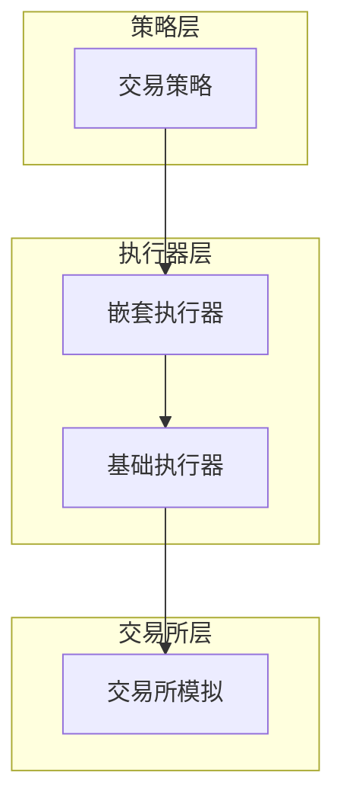
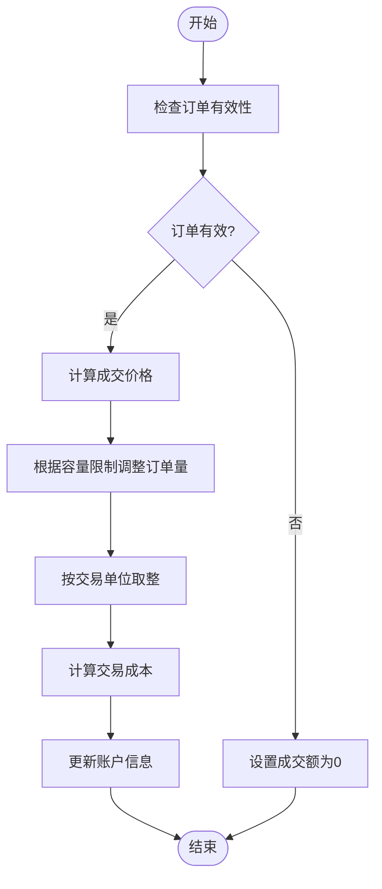
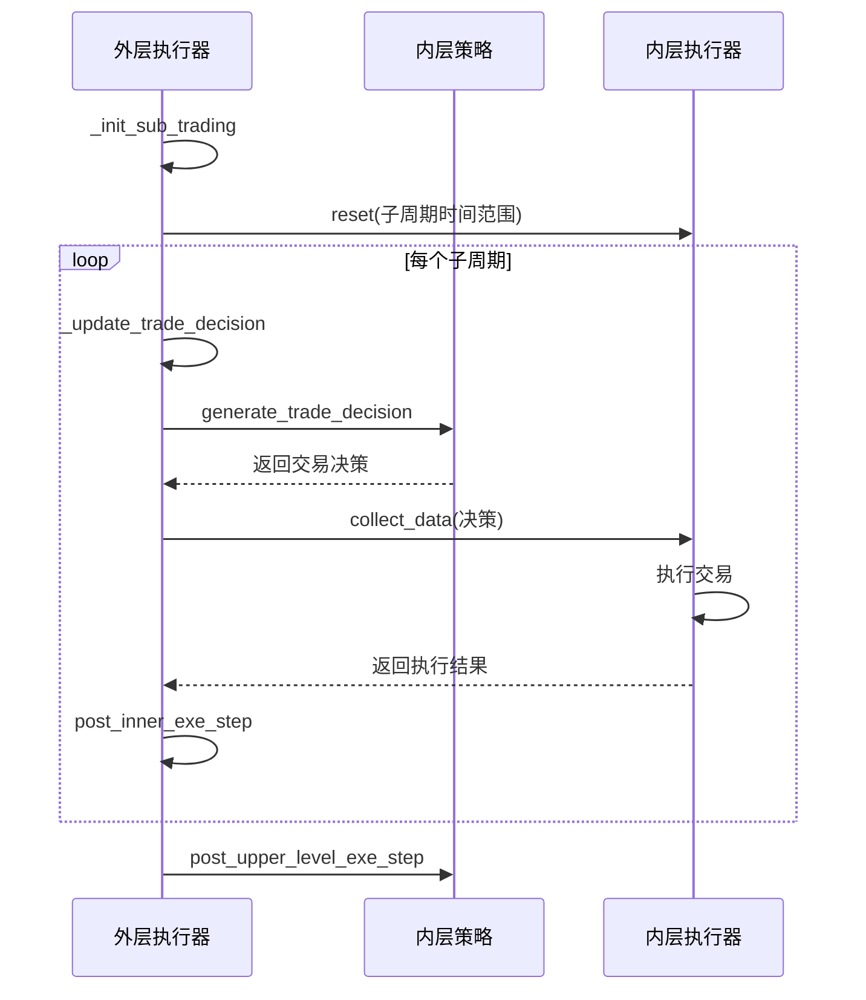
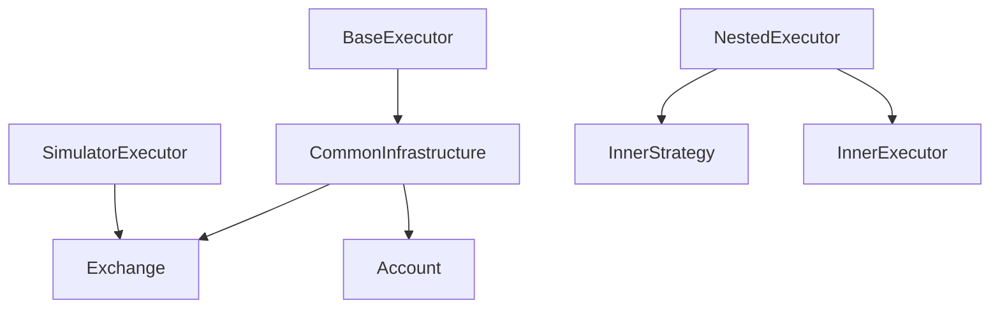

# 高级执行策略实现

<cite>
**本文档中引用的文件**   
- [exchange.py](file://qlib/backtest/exchange.py)
- [executor.py](file://qlib/backtest/executor.py)
</cite>

## 目录
1. [简介](#简介)
2. [项目结构](#项目结构)
3. [核心组件](#核心组件)
4. [架构概述](#架构概述)
5. [详细组件分析](#详细组件分析)
6. [依赖分析](#依赖分析)
7. [性能考虑](#性能考虑)
8. [故障排除指南](#故障排除指南)
9. [结论](#结论)

## 简介
本文档旨在指导暗池交易探测、冰山订单拆单执行、时间加权平均价格（TWAP）等算法交易策略在执行器层面的实现。重点描述订单切片逻辑、延迟控制、市场冲击建模及动态调整机制。通过具体案例展示如何利用exchange.py提供的限价撮合规则扩展为更复杂的执行行为，并确保与信号生成频率和数据采样周期同步。

## 项目结构
该项目采用模块化设计，主要分为backtest、strategy、data等核心模块。backtest模块包含executor和exchange两个关键组件，分别负责执行决策和模拟交易所行为。executor.py实现了基础执行器、嵌套执行器和模拟执行器，支持不同层级的交易策略执行。exchange.py则封装了交易所的核心功能，包括价格获取、订单成交、限制检查等。整个架构支持高频交易场景下的复杂执行逻辑。

```mermaid
graph TD
subgraph "Backtest"
Executor[Executor]
Exchange[Exchange]
end
subgraph "Strategy"
Strategy[Strategy]
end
subgraph "Data"
Data[Data]
end
Strategy --> Executor
Executor --> Exchange
Exchange --> Data
```

**图表来源**
- [executor.py](file://qlib/backtest/executor.py)
- [exchange.py](file://qlib/backtest/exchange.py)

**章节来源**
- [executor.py](file://qlib/backtest/executor.py)
- [exchange.py](file://qlib/backtest/exchange.py)

## 核心组件
核心组件包括Exchange类和Executor类。Exchange类负责处理订单成交、价格计算、交易限制检查等交易所相关功能。Executor类则负责执行交易决策，管理交易日历，处理账户更新等。两者协同工作，实现了完整的交易执行流程。特别地，NestedExecutor支持多层级执行策略，允许在主执行周期内嵌套更细粒度的执行逻辑，这对于实现TWAP等需要分时执行的策略至关重要。

**章节来源**
- [executor.py](file://qlib/backtest/executor.py#L21-L306)
- [exchange.py](file://qlib/backtest/exchange.py#L27-L641)

## 架构概述
系统采用分层架构设计，顶层为策略层，负责生成交易决策；中间为执行器层，负责解析和执行交易决策；底层为交易所模拟层，负责提供市场数据和执行订单成交。执行器层采用嵌套式设计，支持多层级执行逻辑。这种架构使得复杂的执行策略如冰山订单拆单、TWAP等能够被有效实现。同时，系统通过CommonInfrastructure共享基础设施，确保各层级间的数据一致性。



**图表来源**
- [executor.py](file://qlib/backtest/executor.py)
- [exchange.py](file://qlib/backtest/exchange.py)

## 详细组件分析

### 订单执行逻辑分析
该组件负责处理订单的实际成交过程，包括价格确定、成交量计算、交易成本核算等。核心方法deal_order首先检查订单的有效性，然后调用_calc_trade_info_by_order计算成交价格、成交金额和交易成本。其中，_clip_amount_by_volume方法用于根据市场容量限制调整订单量，round_amount_by_trade_unit方法则确保订单量符合交易单位要求。

#### 订单执行流程图


**图表来源**
- [exchange.py](file://qlib/backtest/exchange.py#L420-L462)
- [exchange.py](file://qlib/backtest/exchange.py#L858-L951)

**章节来源**
- [exchange.py](file://qlib/backtest/exchange.py#L420-L462)
- [exchange.py](file://qlib/backtest/exchange.py#L858-L951)

### 嵌套执行器分析
嵌套执行器(NestedExecutor)实现了多层级执行逻辑，允许在主执行周期内嵌套更细粒度的执行策略。其核心在于_init_sub_trading方法初始化子级执行环境，_update_trade_decision方法在每个子周期更新交易决策，_collect_data方法则协调内外层执行器的工作流程。这种设计特别适合实现TWAP策略，可以将大额订单均匀分布在多个子周期内执行。

#### 嵌套执行流程图


**图表来源**
- [executor.py](file://qlib/backtest/executor.py#L388-L393)
- [executor.py](file://qlib/backtest/executor.py#L395-L403)
- [executor.py](file://qlib/backtest/executor.py#L405-L482)

**章节来源**
- [executor.py](file://qlib/backtest/executor.py#L309-L497)

## 依赖分析
系统主要依赖关系体现在执行器与交易所之间的交互。SimulatorExecutor依赖Exchange进行订单成交处理，NestedExecutor依赖InnerExecutor和InnerStrategy完成嵌套执行逻辑。此外，所有执行器都依赖CommonInfrastructure共享账户和交易所实例。这种依赖结构确保了执行逻辑的灵活性和可扩展性，同时也保证了数据的一致性和完整性。



**图表来源**
- [executor.py](file://qlib/backtest/executor.py)
- [exchange.py](file://qlib/backtest/exchange.py)

**章节来源**
- [executor.py](file://qlib/backtest/executor.py)
- [exchange.py](file://qlib/backtest/exchange.py)

## 性能考虑
在实现高级执行策略时，需要考虑以下几个性能因素：首先，频繁的订单切片和成交计算会增加计算开销，建议合理设置执行周期；其次，市场冲击成本的计算需要考虑成交量占比的平方关系，避免过度估计；再次，交易单位取整操作可能导致小额资金损耗，需要在策略设计时予以考虑；最后，日志记录会影响执行效率，在生产环境中应适当降低日志级别。

## 故障排除指南
常见问题包括订单无法成交、成交量异常、账户余额不一致等。对于订单无法成交，应检查_is_stock_tradable方法的返回值，确认股票是否处于可交易状态。对于成交量异常，需检查_volume_threshold参数设置是否合理，以及_clip_amount_by_volume方法的执行情况。账户余额不一致通常源于交易成本计算错误，应重点检查_calc_trade_info_by_order方法中的成本核算逻辑。

**章节来源**
- [exchange.py](file://qlib/backtest/exchange.py#L515-L531)
- [exchange.py](file://qlib/backtest/exchange.py#L711-L725)
- [exchange.py](file://qlib/backtest/exchange.py#L760-L783)

## 结论
通过对exchange.py和executor.py的深入分析，我们理解了如何在Qlib框架下实现复杂的算法交易执行策略。关键在于充分利用嵌套执行器的层级结构，结合交易所的容量限制和交易单位约束，设计合理的订单切片和执行逻辑。未来可以进一步优化市场冲击模型，引入更多智能调整机制，提升执行效率和交易收益。