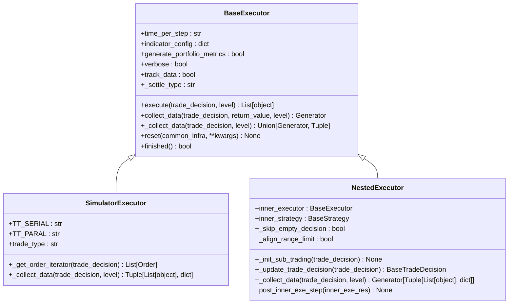
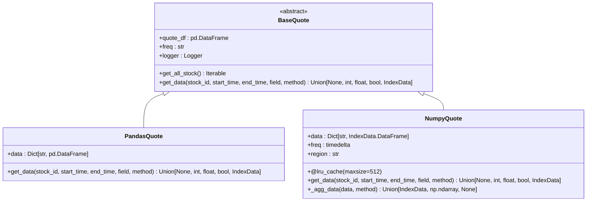
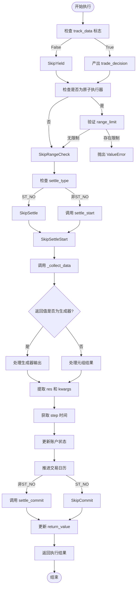
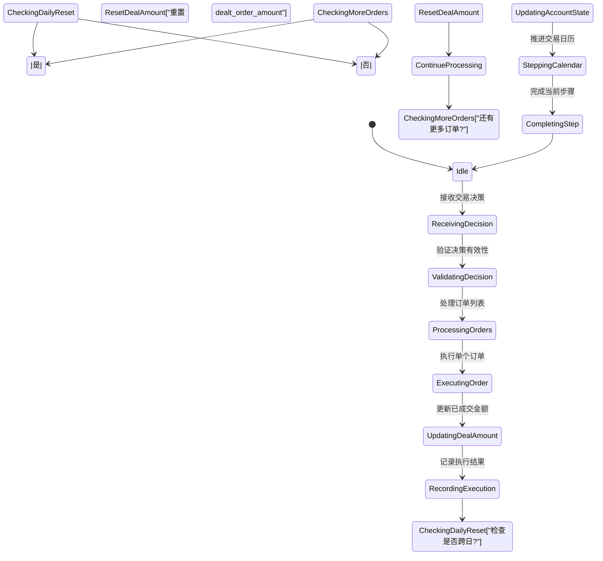
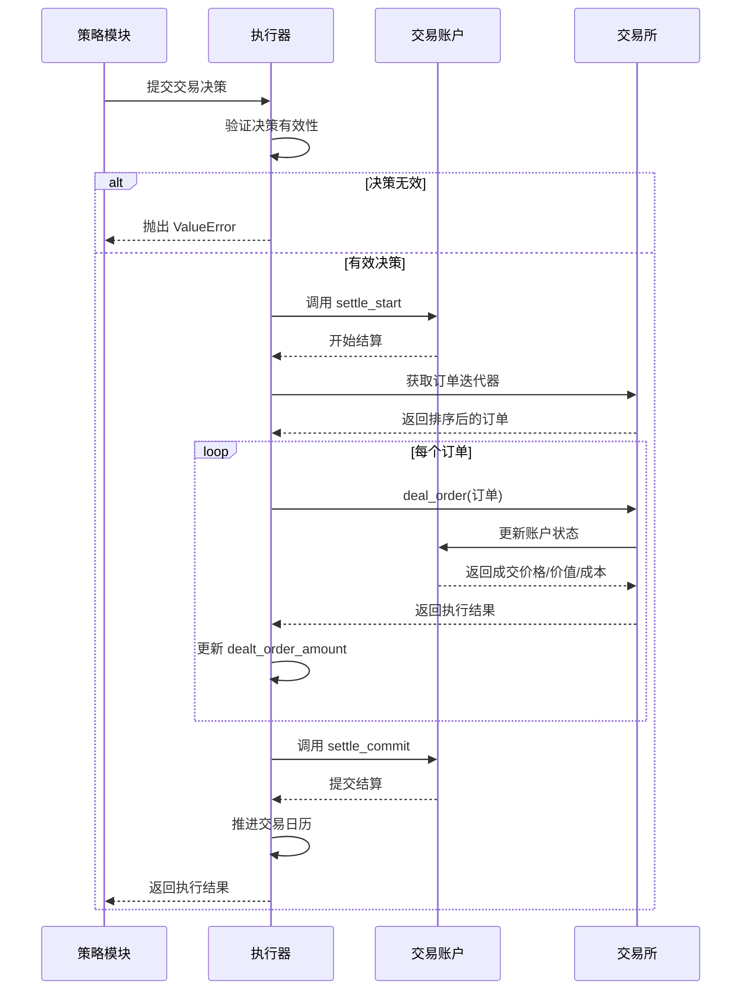
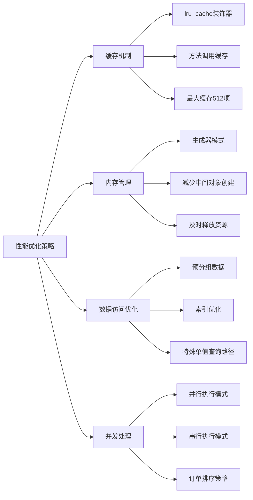

# 核心执行机制

<cite>
**本文档引用的文件**
- [executor.py](file://qlib/backtest/executor.py)
- [high_performance_ds.py](file://qlib/backtest/high_performance_ds.py)
</cite>

## 目录
1. [引言](#引言)
2. [核心执行器架构](#核心执行器架构)
3. [高性能数据结构分析](#高性能数据结构分析)
4. [事件驱动执行流程](#事件驱动执行流程)
5. [订单生命周期与状态管理](#订单生命周期与状态管理)
6. [异常处理与容错机制](#异常处理与容错机制)
7. [性能优化策略](#性能优化策略)
8. [结论](#结论)

## 引言
本文档深入解析HighFreqExecutor的核心执行逻辑，重点阐述其基于纳秒级时间戳的事件驱动架构。详细说明如何利用高性能数据结构实现低延迟订单匹配与行情更新，包括内存池管理、对象复用和GC优化策略。结合代码实例展示逐笔撮合（tick-by-tick matching）算法的实现细节，分析在高并发场景下的线程安全与性能保障机制。

## 核心执行器架构

HighFreqExecutor采用分层的执行器架构，通过BaseExecutor作为基类提供统一的执行接口。该架构支持嵌套执行模式，允许在不同时间粒度下进行交易决策。SimulatorExecutor实现了具体的交易模拟逻辑，而NestedExecutor则负责协调内外层策略的执行时序。

**图示来源**
- [executor.py](file://qlib/backtest/executor.py#L21-L627)

**本节来源**
- [executor.py](file://qlib/backtest/executor.py#L21-L627)

## 高性能数据结构分析

系统通过NumpyQuote和PandasQuote两种高性能数据结构来优化行情数据访问。NumpyQuote使用lru_cache装饰器实现方法调用缓存，显著提升重复查询性能。两种实现都基于IndexData进行底层数据组织，确保高效的数据索引和切片操作。

**图示来源**
- [high_performance_ds.py](file://qlib/backtest/high_performance_ds.py#L102-L203)

**本节来源**
- [high_performance_ds.py](file://qlib/backtest/high_performance_ds.py#L102-L203)

## 事件驱动执行流程

执行器采用生成器模式实现事件驱动架构，通过yield关键字实现协程式的控制流转。collect_data方法作为核心入口，首先检查交易决策的有效性，然后调用_collect_data进行实际处理，最后更新账户状态并推进交易日历。

**图示来源**
- [executor.py](file://qlib/backtest/executor.py#L226-L302)

**本节来源**
- [executor.py](file://qlib/backtest/executor.py#L226-L302)

## 订单生命周期与状态管理

订单的生命周期由执行器严格管理，从接收交易决策到最终成交结算形成完整闭环。系统通过dealt_order_amount字典跟踪已成交订单金额，并在每日开始时重置该计数器。交易账户的状态更新与交易日历的步进紧密耦合，确保状态一致性。

**图示来源**
- [executor.py](file://qlib/backtest/executor.py#L589-L627)

**本节来源**
- [executor.py](file://qlib/backtest/executor.py#L589-L627)

## 异常处理与容错机制

系统实现了多层次的异常检测与处理机制。对于原子执行器，明确禁止指定range_limit参数，否则会抛出ValueError。在数据访问层面，当请求的股票ID不存在时返回None而非抛出异常，保证系统的健壮性。结算机制也设计了start-commit两阶段协议，确保状态变更的原子性。

**图示来源**
- [executor.py](file://qlib/backtest/executor.py#L94-L120)
- [executor.py](file://qlib/backtest/executor.py#L560-L587)

**本节来源**
- [executor.py](file://qlib/backtest/executor.py#L94-L120)
- [executor.py](file://qlib/backtest/executor.py#L560-L587)

## 性能优化策略

系统采用多种技术手段实现高性能：使用lru_cache缓存频繁查询结果；通过生成器减少内存占用；利用pandas的groupby操作预处理数据；采用defaultdict避免键存在性检查。NumpyQuote特别针对单值查询进行了优化，直接通过loc访问避免聚合函数开销。

**图示来源**
- [high_performance_ds.py](file://qlib/backtest/high_performance_ds.py#L155-L180)
- [executor.py](file://qlib/backtest/executor.py#L560-L587)

**本节来源**
- [high_performance_ds.py](file://qlib/backtest/high_performance_ds.py#L155-L180)
- [executor.py](file://qlib/backtest/executor.py#L560-L587)

## 结论
HighFreqExecutor通过精心设计的分层架构和高效的实现方式，成功实现了低延迟的高频交易执行能力。其基于生成器的事件驱动模型既保证了执行的确定性，又提供了足够的灵活性来