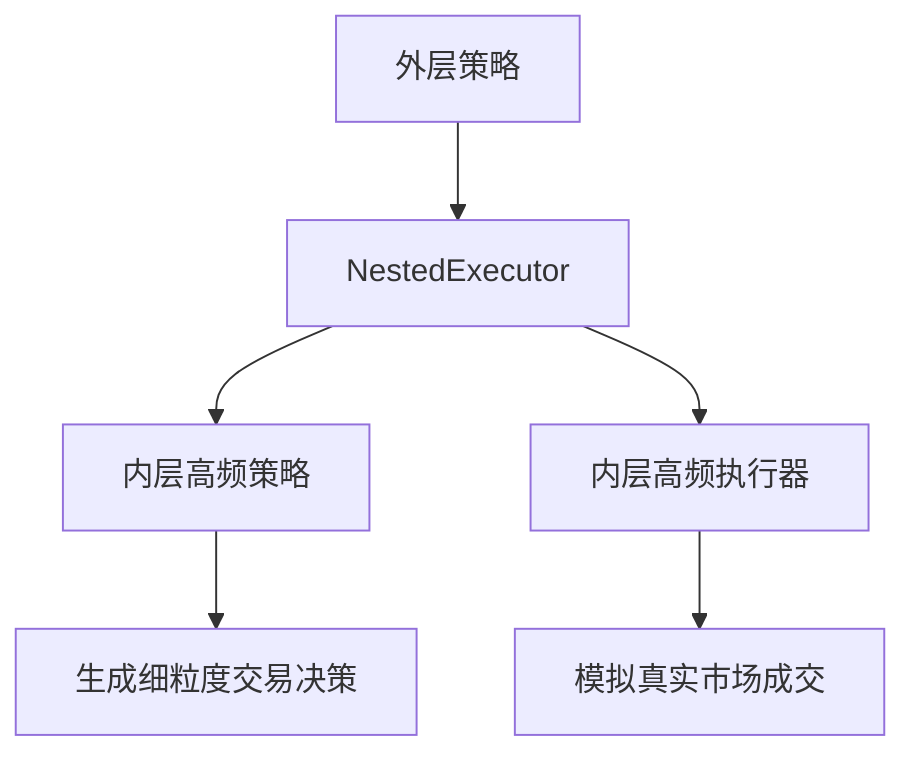
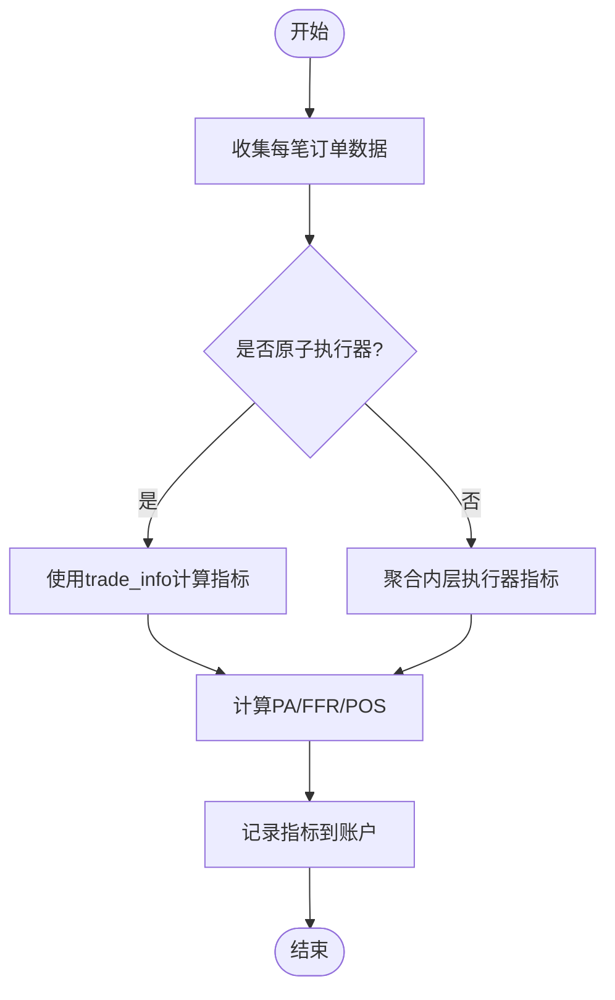

# 配置与最佳实践

<cite>
**本文档中引用的文件**   
- [executor.py](file://qlib/backtest/executor.py)
- [exchange.py](file://qlib/backtest/exchange.py)
- [workflow_config_High_Freq_Tree_Alpha158.yaml](file://examples/highfreq/workflow_config_High_Freq_Tree_Alpha158.yaml)
</cite>

## 目录
1. [高频执行器核心配置项详解](#高频执行器核心配置项详解)
2. [典型策略配置模板与调参建议](#典型策略配置模板与调参建议)
3. [不同市场环境适配要点](#不同市场环境适配要点)
4. [常见配置错误与排查方法](#常见配置错误与排查方法)
5. [性能监控指标建议](#性能监控指标建议)

## 高频执行器核心配置项详解

### tick驱动模式开关
tick驱动模式通过`NestedExecutor`实现，允许在主交易周期内嵌套更高频率的执行器。该模式通过`time_per_step`参数控制外层执行器的时间步长，并通过`inner_executor`和`inner_strategy`配置内层高频执行逻辑。



**Diagram sources**
- [executor.py](file://qlib/backtest/executor.py#L309-L497)

### 滑点模型参数
滑点模型由`Exchange`类中的`impact_cost`参数控制，表示市场冲击成本率（即滑点）。推荐值为0.1，可根据市场流动性调整。同时，`deal_price`参数决定了成交价计算方式，支持`$vwap`（成交量加权平均价）或`$twap`（时间加权平均价）作为基准价格。

**Section sources**
- [exchange.py](file://qlib/backtest/exchange.py#L64-L126)

### 流动性限制阈值
流动性限制通过`volume_threshold`参数设置，支持两种模式：
- `"cum"`：基于累计成交量的限制，例如`"0.2 * DayCumsum($volume, '9:30', '14:29')"`表示当日累计成交量的20%。
- `"current"`：基于实时盘口量的限制，例如`"$askV1"`表示卖一档挂单量。

```yaml
volume_threshold:
  all: ["cum", "0.2 * DayCumsum($volume, '9:30', '14:29')"]
  buy: ["current", "$askV1"]
  sell: ["current", "$bidV1"]
```

**Section sources**
- [exchange.py](file://qlib/backtest/exchange.py#L81-L112)

### 批处理大小（batch_size）
批处理大小在Qlib中体现为`time_per_step`参数，定义了每个交易步骤的时间间隔。对于分钟级高频交易，通常设为`"1min"`；对于更精细的tick级交易，则可使用`"30s"`或更短周期。

### 延迟模拟设置
延迟模拟通过`SimulatorExecutor`的`trade_type`参数控制：
- `TT_SERIAL`：串行交易，允许先卖出再买入使用资金。
- `TT_PARAL`：并行交易，买卖同时发生，避免资金循环利用。

```python
class SimulatorExecutor(BaseExecutor):
    TT_SERIAL = "serial"
    TT_PARAL = "parallel"
```

**Section sources**
- [executor.py](file://qlib/backtest/executor.py#L512-L627)

## 典型策略配置模板与调参建议

### 做市商策略配置模板
```yaml
executor:
  class: NestedExecutor
  module_path: qlib.backtest.executor
  kwargs:
    time_per_step: 1min
    inner_strategy:
      class: MarketMakingStrategy
      module_path: custom.strategy
    inner_executor:
      class: SimulatorExecutor
      module_path: qlib.backtest.executor
      kwargs:
        time_per_step: 30s
        trade_type: parallel
        indicator_config:
          show_indicator: true
          pa_config:
            base_price: vwap
          ffr_config:
            weight_method: value_weighted
```

### 统计套利策略配置模板
```yaml
executor:
  class: NestedExecutor
  module_path: qlib.backtest.executor
  kwargs:
    time_per_step: 5min
    inner_strategy:
      class: StatArbStrategy
      module_path: custom.strategy
    inner_executor:
      class: SimulatorExecutor
      module_path: qlib.backtest.executor
      kwargs:
        time_per_step: 1min
        trade_type: serial
        settle_type: cash
```

**Section sources**
- [workflow_config_High_Freq_Tree_Alpha158.yaml](file://examples/highfreq/workflow_config_High_Freq_Tree_Alpha158.yaml)

## 不同市场环境适配要点

| 市场类型 | 批处理大小建议 | 滑点参数建议 | 流动性阈值建议 |
|--------|--------------|------------|-------------|
| A股     | 1min         | 0.001~0.002 | 累计成交量10%-20% |
| 期货    | 30s~1min     | 0.0005~0.001 | 实时盘口量匹配 |
| 加密货币 | 10s~30s      | 0.005~0.01  | 动态波动率调整 |

**Section sources**
- [exchange.py](file://qlib/backtest/exchange.py#L111-L126)

## 常见配置错误与排查方法

### 错误1：未正确设置settle_type导致资金循环
**现象**：策略显示盈利但实际无法执行交易。
**原因**：未设置`settle_type: cash`，导致卖出股票所得现金可立即用于买入。
**解决方案**：在`BaseExecutor`初始化时添加`settle_type: cash`参数。

### 错误2：volume_threshold表达式语法错误
**现象**：回测报错"DayCumsum not defined"。
**原因**：未注册高频自定义算子。
**解决方案**：在`qlib_init`中注册`DayCumsum`算子。

### 错误3：indicator_config权重方法不匹配
**现象**：PA（价格优势）指标计算结果异常。
**原因**：`weight_method`未与实际交易规模对齐。
**解决方案**：大额交易使用`value_weighted`，小额交易使用`mean`。

**Section sources**
- [executor.py](file://qlib/backtest/executor.py#L94-L120)

## 性能监控指标建议

### 核心监控指标
- **价格优势 (PA)**：衡量成交价相对于基准价的优势程度。
- **履约率 (FFR)**：实际成交数量与目标数量的比例。
- **胜率 (POS)**：盈利交易笔数占比。

### 指标聚合方法
| 聚合方式 | 适用场景 | 计算公式 |
|---------|--------|-------|
| mean | 均等权重 | Σx_i / n |
| amount_weighted | 数量加权 | Σ(x_i × |deal_amount_i|) / Σ|deal_amount_i| |
| value_weighted | 价值加权 | Σ(x_i × |trade_value_i|) / Σ|trade_value_i| |



**Diagram sources**
- [account.py](file://qlib/backtest/account.py#L351-L378)

**Section sources**
- [report.py](file://qlib/backtest/report.py#L553-L581)