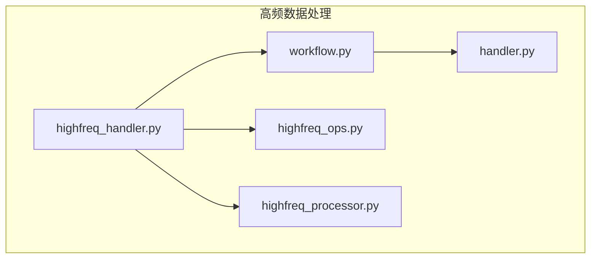
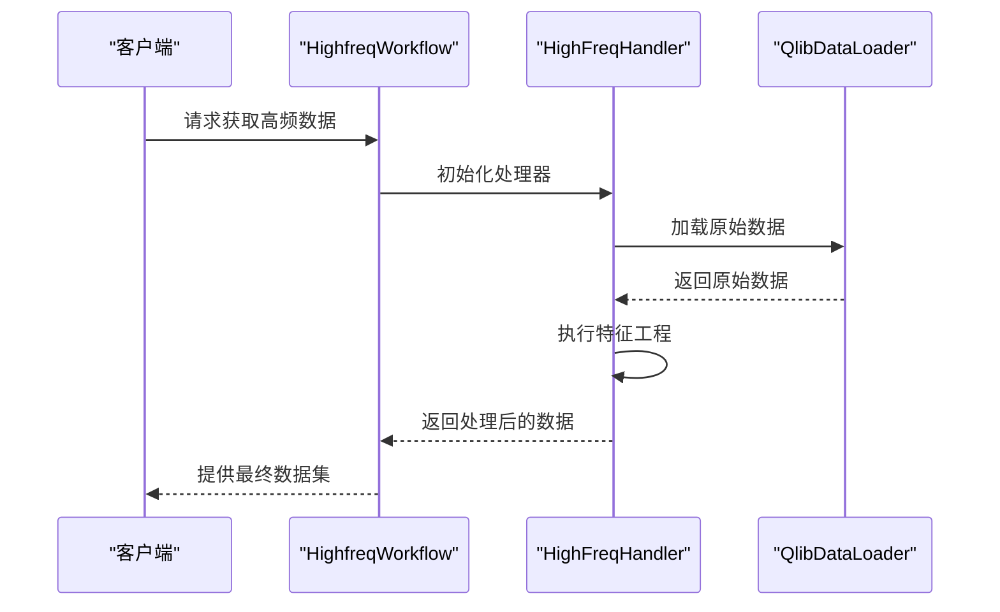
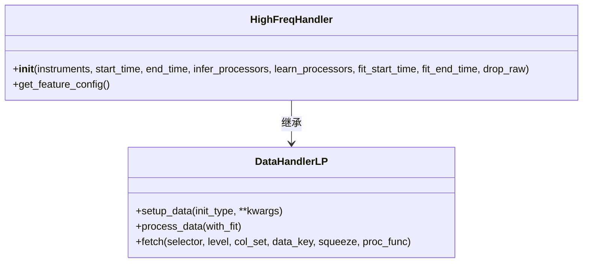
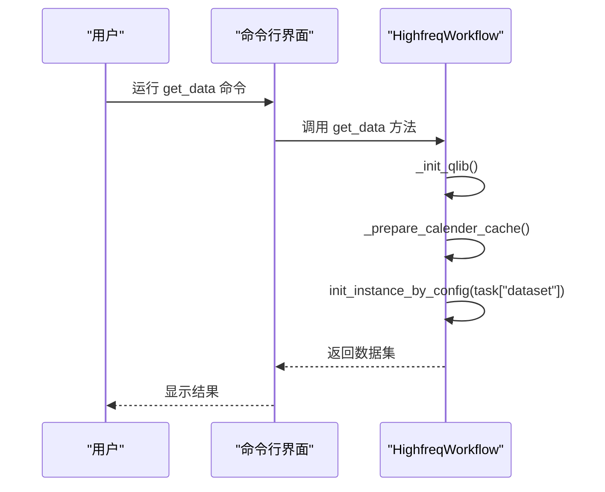
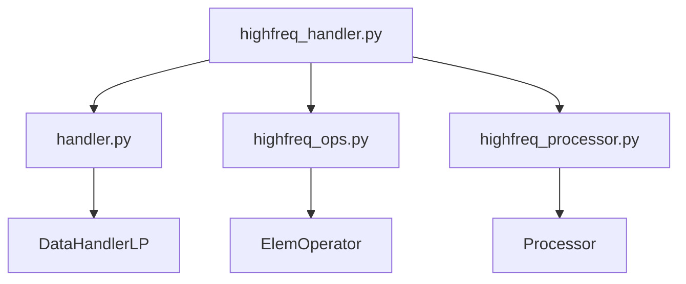

# 高频数据集成

<cite>
**本文档中引用的文件**
- [highfreq_handler.py](file://examples/highfreq/highfreq_handler.py)
- [workflow.py](file://examples/highfreq/workflow.py)
- [highfreq_ops.py](file://examples/highfreq/highfreq_ops.py)
- [highfreq_processor.py](file://examples/highfreq/highfreq_processor.py)
- [handler.py](file://qlib/data/dataset/handler.py)
</cite>

## 目录
1. [简介](#简介)
2. [项目结构](#项目结构)
3. [核心组件](#核心组件)
4. [架构概述](#架构概述)
5. [详细组件分析](#详细组件分析)
6. [依赖分析](#依赖分析)
7. [性能考虑](#性能考虑)
8. [故障排除指南](#故障排除指南)
9. [结论](#结论)

## 简介
本文档详细描述了 `highfreq_handler.py` 如何构建支持多周期融合的高频数据流水线，包括 tick、orderbook 等原始数据的加载、清洗与聚合逻辑。同时解释其与 `workflow.py` 中定义的高频工作流的协同机制，特别是时间对齐、数据缓存和流式处理的设计。提供配置示例说明如何接入不同交易所的数据格式，并实现微秒级精度的时间序列同步。此外，还分析了数据吞吐瓶颈及优化方案，如批量读取、压缩存储和异步预加载技术。

## 项目结构
该项目主要包含以下几个关键模块：
- `examples/highfreq/`: 包含高频数据处理的核心脚本。
- `qlib/data/dataset/handler.py`: 提供基础的数据处理器框架。
- `examples/highfreq/highfreq_ops.py`: 定义了一系列用于高频数据操作的自定义运算符。
- `examples/highfreq/highfreq_processor.py`: 实现了针对高频数据的标准化处理器。

**图表来源**
- [highfreq_handler.py](file://examples/highfreq/highfreq_handler.py#L1-L159)
- [workflow.py](file://examples/highfreq/workflow.py#L1-L176)
- [highfreq_ops.py](file://examples/highfreq/highfreq_ops.py#L1-L168)
- [highfreq_processor.py](file://examples/highfreq/highfreq_processor.py#L1-L77)
- [handler.py](file://qlib/data/dataset/handler.py#L1-L787)

**章节来源**
- [highfreq_handler.py](file://examples/highfreq/highfreq_handler.py#L1-L159)
- [workflow.py](file://examples/highfreq/workflow.py#L1-L176)

## 核心组件
`HighFreqHandler` 类是高频数据处理的核心，它继承自 `DataHandlerLP`，并实现了特定于高频数据的特征提取和预处理逻辑。通过 `get_feature_config` 方法定义了价格和成交量等特征的归一化规则。

**章节来源**
- [highfreq_handler.py](file://examples/highfreq/highfreq_handler.py#L4-L100)

## 架构概述
整个系统采用分层设计，从数据加载到特征工程再到模型训练，每一层都具有明确的责任划分。`HighfreqWorkflow` 类负责协调各个组件的工作流程，确保数据能够高效地流动。

**图表来源**
- [workflow.py](file://examples/highfreq/workflow.py#L19-L170)
- [highfreq_handler.py](file://examples/highfreq/highfreq_handler.py#L4-L100)

## 详细组件分析

### HighFreqHandler 分析
`HighFreqHandler` 负责将原始市场数据转换为适合机器学习模型使用的格式。它利用一系列自定义操作符（如 `DayLast`, `FFillNan`）来处理缺失值和异常值，并通过 `Cut` 操作符进行窗口切片以适应不同的训练需求。

#### 对象导向组件

**图表来源**
- [highfreq_handler.py](file://examples/highfreq/highfreq_handler.py#L4-L100)
- [handler.py](file://qlib/data/dataset/handler.py#L382-L785)

### HighfreqWorkflow 分析
`HighfreqWorkflow` 是一个命令行工具，允许用户通过简单的接口调用复杂的高频数据分析流程。它首先初始化 Qlib 环境，然后准备日历缓存，最后执行数据获取任务。

#### API/服务组件

**图表来源**
- [workflow.py](file://examples/highfreq/workflow.py#L19-L170)

## 依赖分析
该系统的依赖关系清晰明了，所有外部依赖均通过标准库或第三方包管理器引入。内部模块之间通过明确的接口进行通信，降低了耦合度。

**图表来源**
- [highfreq_handler.py](file://examples/highfreq/highfreq_handler.py#L1-L159)
- [handler.py](file://qlib/data/dataset/handler.py#L382-L785)
- [highfreq_ops.py](file://examples/highfreq/highfreq_ops.py#L1-L168)
- [highfreq_processor.py](file://examples/highfreq/highfreq_processor.py#L1-L77)

**章节来源**
- [highfreq_handler.py](file://examples/highfreq/highfreq_handler.py#L1-L159)
- [handler.py](file://qlib/data/dataset/handler.py#L382-L785)

## 性能考虑
为了提高性能，系统采用了多种优化策略，例如使用 `Cal.calendar()` 预加载日历信息以减少重复计算；利用 `pickle` 序列化技术保存和恢复数据集状态，避免每次运行时重新处理大量数据。

## 故障排除指南
当遇到问题时，请检查以下几点：
- 确保已正确安装所有必要的依赖项。
- 检查输入参数是否符合预期格式。
- 查看日志输出以定位错误原因。

**章节来源**
- [workflow.py](file://examples/highfreq/workflow.py#L129-L174)
- [highfreq_handler.py](file://examples/highfreq/highfreq_handler.py#L77-L127)

## 结论
本文档全面介绍了基于 Qlib 框架构建高频数据流水线的方法。通过对 `highfreq_handler.py` 和 `workflow.py` 的深入剖析，我们展示了如何有效地组织代码结构、实现高效的特征工程以及优化整体性能。希望这些内容能帮助开发者更好地理解和应用相关技术。