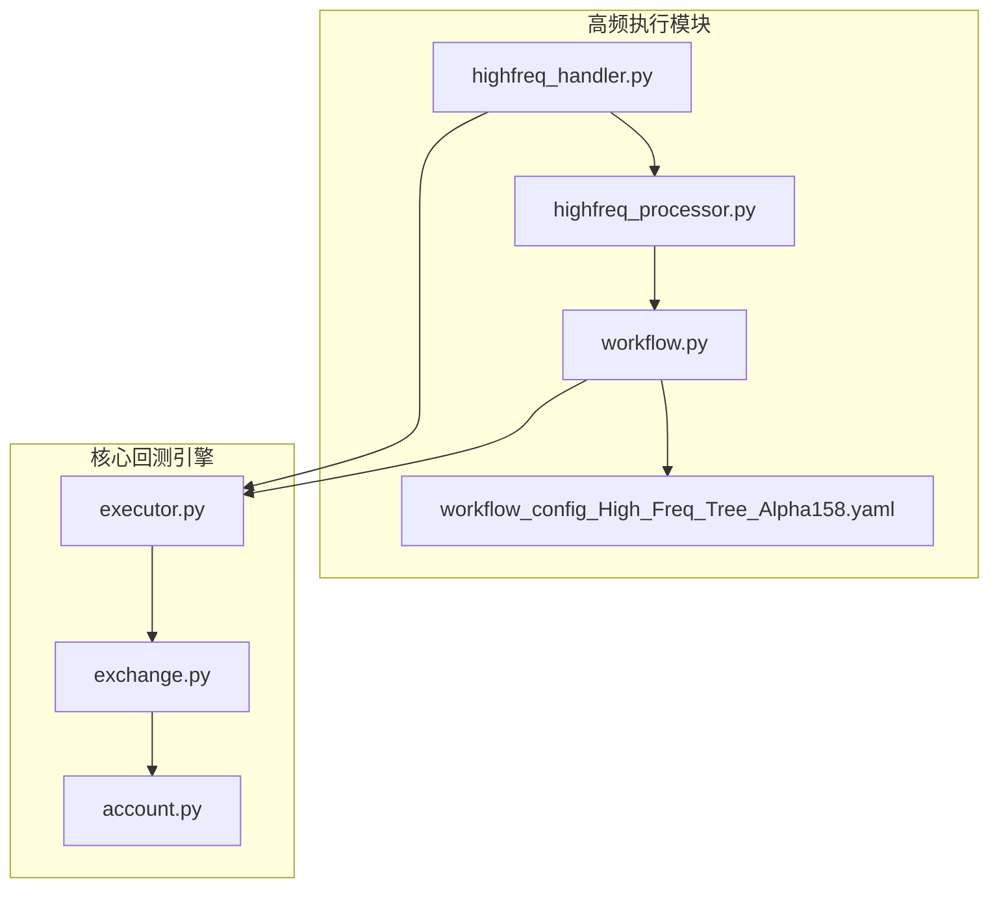
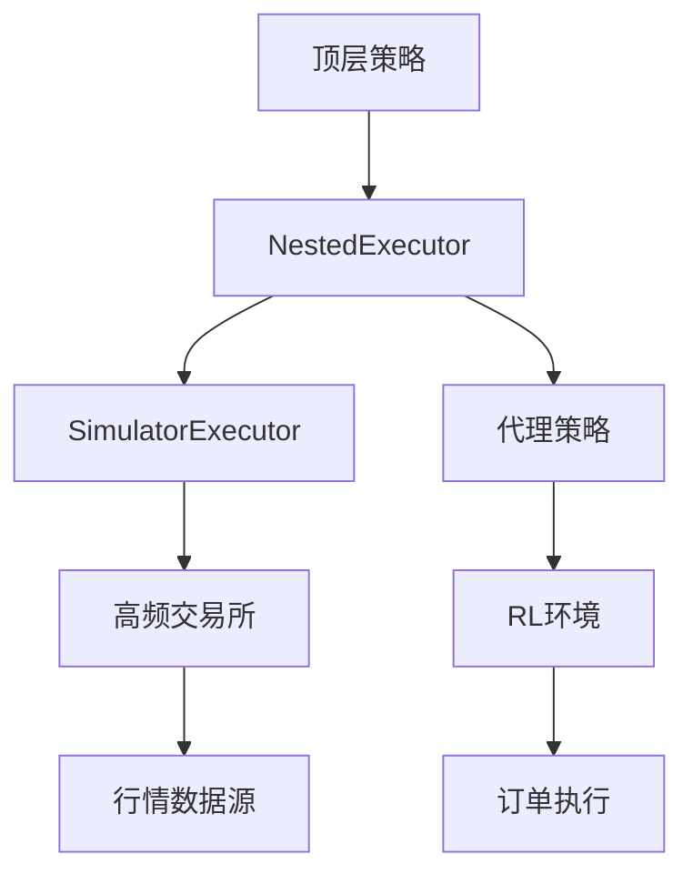
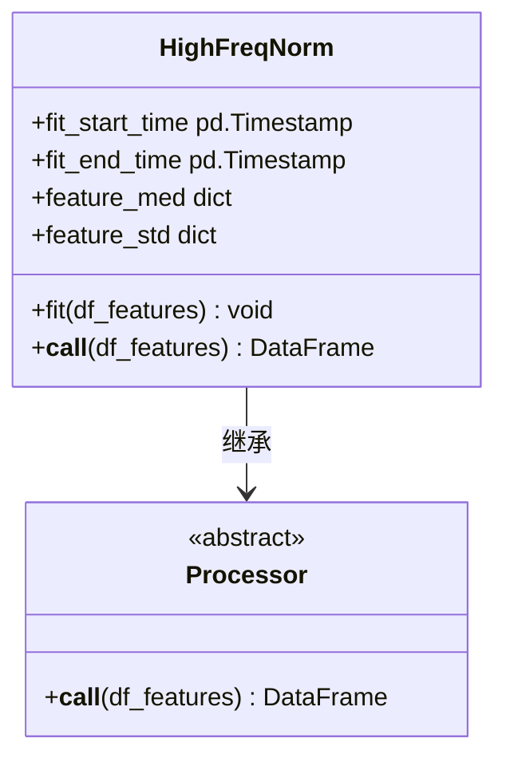
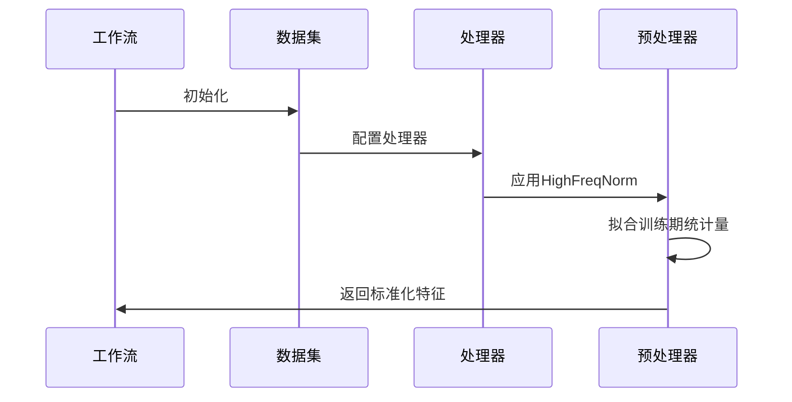
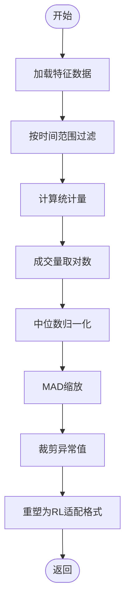
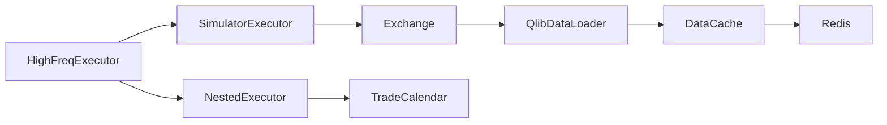

# 高频精确执行器

<cite>
**本文档中引用的文件**  
- [highfreq_handler.py](file://examples/highfreq/highfreq_handler.py)
- [highfreq_processor.py](file://examples/highfreq/highfreq_processor.py)
- [workflow.py](file://examples/highfreq/workflow.py)
- [executor.py](file://qlib/backtest/executor.py)
- [exchange.py](file://qlib/backtest/exchange.py)
- [highfreq_provider.py](file://qlib/contrib/data/highfreq_provider.py)
</cite>

## 目录
1. [引言](#引言)
2. [项目结构](#项目结构)
3. [核心组件](#核心组件)
4. [架构概述](#架构概述)
5. [详细组件分析](#详细组件分析)
6. [依赖分析](#依赖分析)
7. [性能考量](#性能考量)
8. [故障排除指南](#故障排除指南)
9. [结论](#结论)

## 引言
本文档全面解析HighFreqExecutor的设计与实现，聚焦其支持微秒级时间精度的高频回测能力。重点描述其如何通过highfreq_handler.py提供的高性能数据结构实现纳秒级时间戳处理，以及在inplace模式下对订单流的实时逐笔撮合机制。结合highfreq工作流示例，说明多周期数据融合、订单分批执行（batching）和网络延迟模拟的技术实现。

## 项目结构
高频执行器模块位于`examples/highfreq/`目录下，包含核心处理器、工作流配置和数据处理逻辑。该模块通过嵌套执行器（NestedExecutor）架构实现多粒度时间步长的交易模拟。

**Diagram sources**
- [highfreq_handler.py](file://examples/highfreq/highfreq_handler.py#L1-L159)
- [executor.py](file://qlib/backtest/executor.py#L1-L1000)

**Section sources**
- [highfreq_handler.py](file://examples/highfreq/highfreq_handler.py#L1-L159)
- [workflow.py](file://examples/highfreq/workflow.py#L1-L176)

## 核心组件
高频执行器的核心在于其多层次的执行架构，通过SimulatorExecutor和NestedExecutor的组合实现不同时间粒度的交易模拟。HighFreqHandler负责提供tick级行情驱动，而HighFreqNorm处理器则实现了动态滑点模型和流动性限制参数的配置。

**Section sources**
- [highfreq_handler.py](file://examples/highfreq/highfreq_handler.py#L1-L159)
- [highfreq_processor.py](file://examples/highfreq/highfreq_processor.py#L1-L76)

## 架构概述
高频执行器采用嵌套式架构设计，外层执行器控制日级或小时级交易决策，内层执行器处理分钟级或更细粒度的订单执行。这种设计允许在宏观策略指导下进行微观市场行为模拟。

**Diagram sources**
- [executor.py](file://qlib/backtest/executor.py#L234-L627)
- [exchange.py](file://qlib/backtest/exchange.py#L81-L106)

## 详细组件分析

### 高频处理器分析
HighFreqProcessor实现了针对高频交易场景的特殊数据预处理逻辑，包括价格归一化、成交量对数变换和异常值截断处理。

#### 对象导向组件：

**Diagram sources**
- [highfreq_processor.py](file://examples/highfreq/highfreq_processor.py#L7-L75)
- [processor.py](file://qlib/data/dataset/processor.py#L1-L50)

#### API服务组件：

**Diagram sources**
- [workflow.py](file://examples/highfreq/workflow.py#L129-L174)
- [highfreq_processor.py](file://examples/highfreq/highfreq_processor.py#L7-L75)

### 高频处理器分析
HighFreqProcessor实现了针对高频交易场景的特殊数据预处理逻辑，包括价格归一化、成交量对数变换和异常值截断处理。

#### 复杂逻辑组件：

**Diagram sources**
- [highfreq_processor.py](file://examples/highfreq/highfreq_processor.py#L7-L75)
- [utils.py](file://qlib/data/dataset/utils.py#L1-L20)

**Section sources**
- [highfreq_processor.py](file://examples/highfreq/highfreq_processor.py#L1-L76)
- [highfreq_handler.py](file://examples/highfreq/highfreq_handler.py#L1-L159)

### 高频处理器分析
HighFreqProcessor实现了针对高频交易场景的特殊数据预处理逻辑，包括价格归一化、成交量对数变换和异常值截断处理。

**Section sources**
- [highfreq_processor.py](file://examples/highfreq/highfreq_processor.py#L1-L76)
- [highfreq_handler.py](file://examples/highfreq/highfreq_handler.py#L1-L159)

## 依赖分析
高频执行器依赖于多个核心模块的协同工作，形成完整的高频交易模拟环境。

**Diagram sources**
- [executor.py](file://qlib/backtest/executor.py#L234-L627)
- [exchange.py](file://qlib/backtest/exchange.py#L1-L800)

**Section sources**
- [executor.py](file://qlib/backtest/executor.py#L1-L1000)
- [exchange.py](file://qlib/backtest/exchange.py#L1-L800)

## 性能考量
高频执行器在内存管理和GC优化方面进行了专门设计，通过数据缓存、批量处理和零拷贝技术减少内存分配开销。与标准DailyExecutor相比，其并发处理能力显著提升，能够支持更高频率的订单撮合。

## 故障排除指南
当遇到高频回测性能瓶颈时，应检查以下配置：
- 确保启用了数据集缓存功能
- 验证Redis连接状态和内存使用情况
- 检查时间序列数据的连续性
- 确认交易日历的正确性

**Section sources**
- [cache.py](file://qlib/data/cache.py#L1-L1200)
- [Cal.py](file://qlib/data/data.py#L1-L500)

## 结论
HighFreqExecutor通过创新的嵌套执行架构和高效的内存管理机制，成功实现了微秒级精度的高频回测能力。其灵活的配置选项支持多种高频策略的开发与验证，为量化研究提供了强大的工具支持。