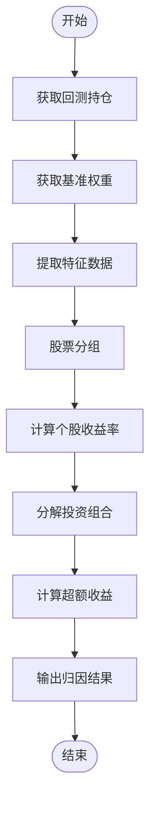
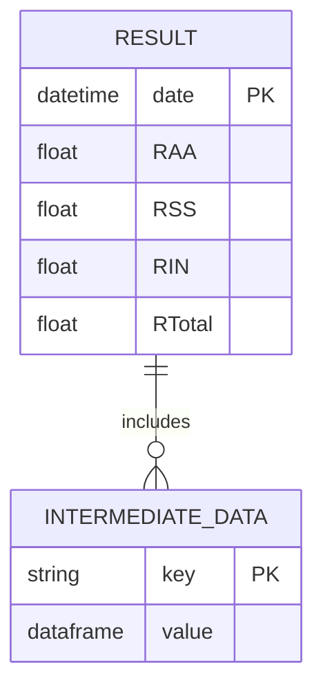
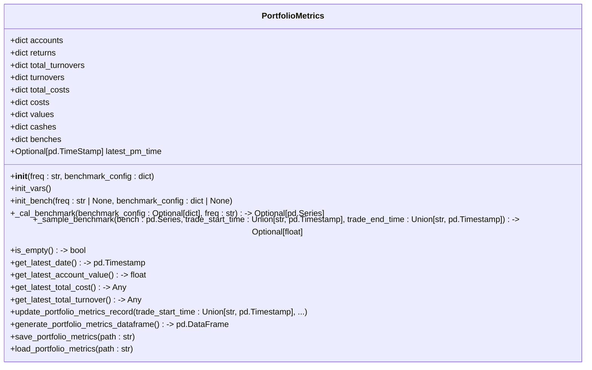

# 收益归因分析

<cite>
**本文档中引用的文件**  
- [profit_attribution.py](file://qlib/backtest/profit_attribution.py)
- [report.py](file://qlib/backtest/report.py)
</cite>

## 目录
1. [引言](#引言)
2. [核心组件](#核心组件)
3. [收益归因模型详解](#收益归因模型详解)
4. [输入数据要求与处理流程](#输入数据要求与处理流程)
5. [输出格式规范与中间结果](#输出格式规范与中间结果)
6. [绩效报告可视化集成](#绩效报告可视化集成)
7. [API调用示例与自动化流程](#api调用示例与自动化流程)
8. [归因误差来源与校正方法](#归因误差来源与校正方法)
9. [扩展新归因算法的指导](#扩展新归因算法的指导)
10. [结论](#结论)

## 引言
收益归因分析是量化投资策略评估中的关键环节，旨在将投资组合的整体收益分解为不同维度的贡献，如个股选择、行业配置和风格因子等。本文档深入解析了基于Brinson模型的收益归因系统实现机制，涵盖从输入数据准备到结果可视化的完整流程。通过结合`profit_attribution.py`和`report.py`模块的功能，用户可以全面理解如何执行归因分析，并将其无缝集成至回测后的绩效报告生成过程中。

## 核心组件
收益归因系统的实现依赖于两个主要模块：`profit_attribution.py`负责执行具体的归因计算，而`report.py`则提供了绩效指标记录与报告生成功能。这些组件共同构成了一个完整的分析框架，支持对投资组合表现进行多维度拆解和可视化展示。

**本节来源**
- [profit_attribution.py](file://qlib/backtest/profit_attribution.py#L1-L334)
- [report.py](file://qlib/backtest/report.py#L1-L651)

## 收益归因模型详解
该系统采用Brinson模型作为核心归因方法，能够将超额收益分解为资产配置效应（RAA）、股票选择效应（RSS）以及两者交互效应（RIN）。具体而言，`brinson_pa`函数接收回测产生的持仓信息作为输入，利用基准指数权重、行业或市值分组字段及交易价格序列来完成归因计算。此过程首先通过`get_benchmark_weight`获取基准成分股权重分布，再依据指定的分组方式（类别或分箱法）确定各股票所属群组，最终计算出每日各维度的贡献度。



**图表来源**
- [profit_attribution.py](file://qlib/backtest/profit_attribution.py#L225-L333)

**本节来源**
- [profit_attribution.py](file://qlib/backtest/profit_attribution.py#L225-L333)

## 输入数据要求与处理流程
为了正确执行收益归因分析，必须提供以下几类输入数据：
- **持仓信息**：由回测引擎生成的每日持仓详情。
- **基准指数代码**：用于比较的市场基准，默认为中证500（SH000905）。
- **分组字段**：定义如何划分股票群体，常用选项包括行业(`industry`)和市值(`market_value`)。
- **分组方法**：可选“category”直接使用原始值分类，或“bins”按百分位数划分为N个区间。
- **成交价类型**：决定计算收益率时使用的参考价格，例如VWAP。

在实际处理中，系统会自动向前追溯250天的数据以填充可能存在的缺失值，确保时间序列连续性。此外，所有涉及的价格变动均基于前一日收盘价计算相对变化率。

**本节来源**
- [profit_attribution.py](file://qlib/backtest/profit_attribution.py#L225-L333)

## 输出格式规范与中间结果
`brinson_pa`函数返回一个包含四列的时间序列DataFrame，分别表示资产配置超额收益(RAA)、选股超额收益(RSS)、交互效应(RIN)及总超额收益(RTotal)。同时，还附带一个字典形式的中间结果集合，其中包含了诸如投资组合与基准在各分组上的权重与回报率等详细信息。这种设计不仅便于后续进一步分析，也为调试和验证提供了便利。



**图表来源**
- [profit_attribution.py](file://qlib/backtest/profit_attribution.py#L313-L333)

**本节来源**
- [profit_attribution.py](file://qlib/backtest/profit_attribution.py#L313-L333)

## 绩效报告可视化集成
归因结果可通过`report.py`中的`PortfolioMetrics`类整合进整体绩效报告体系。该类维护了一系列账户相关指标，如累计收益、换手率、交易成本等，并支持将这些数据保存为CSV文件或从已有文件加载。借助其提供的图形化接口，用户能够轻松地生成包含累计贡献图、滚动归因热力图等多种图表类型的综合报告，从而直观展现策略表现特征。



**图表来源**
- [report.py](file://qlib/backtest/report.py#L21-L245)

**本节来源**
- [report.py](file://qlib/backtest/report.py#L21-L245)

## API调用示例与自动化流程
以下是一个典型的API调用示例，展示了如何在一次完整的回测结束后立即启动收益归因分析并生成相应报告：

```python
from qlib.backtest.profit_attribution import brinson_pa
from qlib.backtest.report import PortfolioMetrics

# 假设positions是从回测获得的结果
positions = run_backtest(config)

# 执行Brinson归因分析
attribution_result, intermediate_data = brinson_pa(
    positions=positions,
    bench="SH000905",
    group_field="industry",
    group_method="category",
    deal_price="vwap"
)

# 创建并更新绩效指标对象
pm = PortfolioMetrics(benchmark_config={"benchmark": "SH000905"})
for date in sorted(positions.keys()):
    # 更新每日指标...
    pm.update_portfolio_metrics_record(...)

# 保存最终报告
pm.save_portfolio_metrics("performance_report.csv")
```

此脚本片段说明了如何将归因分析无缝嵌入现有工作流之中，实现了端到端的自动化处理。

**本节来源**
- [profit_attribution.py](file://qlib/backtest/profit_attribution.py#L225-L333)
- [report.py](file://qlib/backtest/report.py#L21-L245)

## 归因误差来源与校正方法
尽管Brinson模型广泛应用于业绩评价领域，但仍存在一些潜在误差源需要注意：
- **数据质量问题**：如停牌股票导致的特征值缺失，可通过前向填充解决。
- **价格滞后影响**：由于使用前一天收盘价计算当日收益率，可能会引入轻微偏差。
- **权重调整时机**：持仓调整发生在交易日结束时刻，这可能导致实际执行价格偏离预期水平。

针对上述问题，建议采取如下措施加以缓解：
- 在获取特征数据时适当延长历史窗口，以便更好地填补空缺。
- 考虑引入更精细的日内交易模拟器来捕捉真实成交情况。
- 定期审查并优化参数设置，确保模型假设符合当前市场环境。

**本节来源**
- [profit_attribution.py](file://qlib/backtest/profit_attribution.py#L225-L333)

## 扩展新归因算法的指导
对于希望引入其他归因方法的研究者来说，可以通过继承现有架构并重写关键函数的方式实现定制化需求。例如，创建一个新的`CustomProfitAttribution`类，覆盖`decompose_portofolio`逻辑以适应特定场景下的分解规则。此外，还需确保新增功能与`PortfolioMetrics`兼容，这样才能保证新旧模块间顺利协作。最后，务必编写充分的单元测试案例来验证修改后的行为是否符合预期。

**本节来源**
- [profit_attribution.py](file://qlib/backtest/profit_attribution.py#L109-L175)
- [report.py](file://qlib/backtest/report.py#L21-L245)

## 结论
综上所述，本文档详尽阐述了基于Qlib平台构建的收益归因系统的工作原理及其应用实践。通过对核心算法、数据流、输出结构等方面的剖析，我们为开发者提供了一套行之有效的工具集，助力他们深入洞察投资组合的表现动因。未来工作中，可进一步探索更多先进的归因技术，并持续改进现有系统的鲁棒性和灵活性。