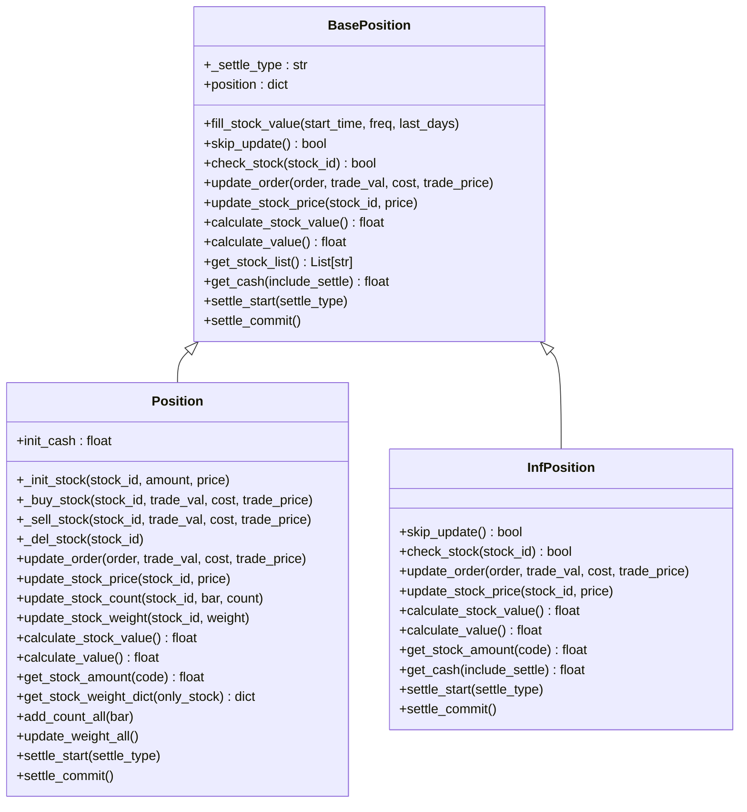
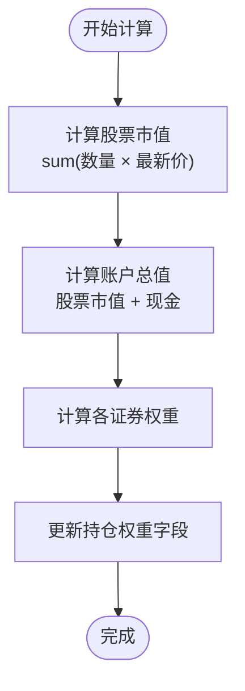
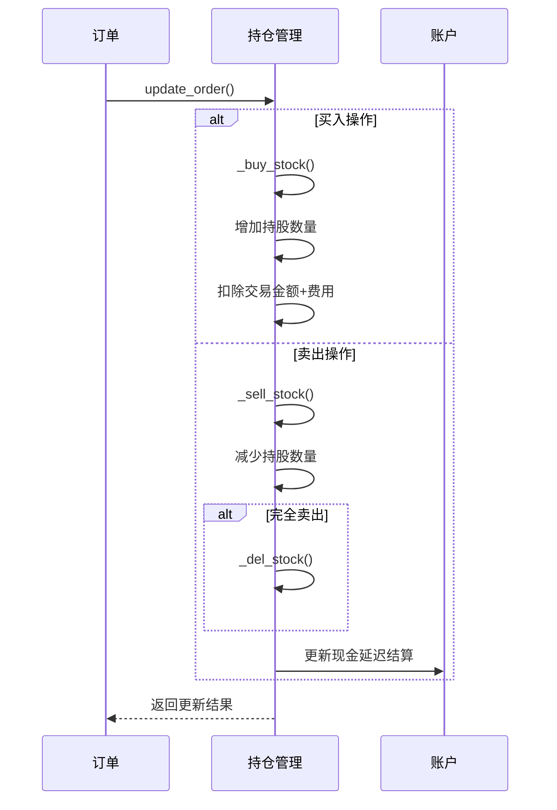
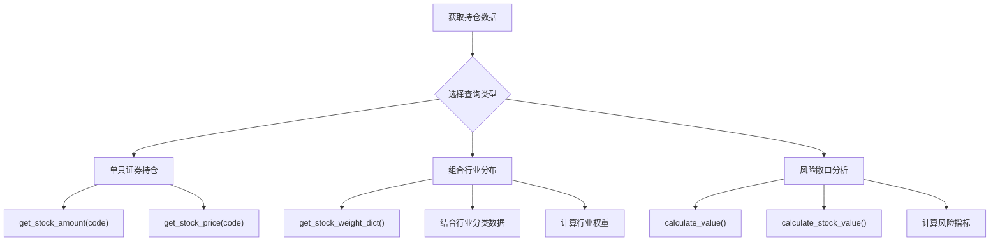

# 持仓跟踪机制

<cite>
**本文档中引用的文件**   
- [position.py](file://qlib/backtest/position.py)
- [decision.py](file://qlib/backtest/decision.py)
- [exchange.py](file://qlib/backtest/exchange.py)
- [account.py](file://qlib/backtest/account.py)
- [report.py](file://qlib/backtest/report.py)
</cite>

## 目录
1. [引言](#引言)
2. [核心持仓管理类设计](#核心持仓管理类设计)
3. [关键指标实时计算逻辑](#关键指标实时计算逻辑)
4. [交易撮合后持仓更新流程](#交易撮合后持仓更新流程)
5. [成本核算策略支持](#成本核算策略支持)
6. [公司行为处理机制](#公司行为处理机制)
7. [组合层面查询与分析](#组合层面查询与分析)
8. [多空头寸分离管理](#多空头寸分离管理)
9. [持仓一致性校验机制](#持仓一致性校验机制)
10. [总结](#总结)

## 引言
本文档全面描述了Qlib框架中Position类对证券持仓的精细化管理能力。该系统通过`Position`类实现，能够精确跟踪每只证券的持有数量、成本均价、浮动盈亏和累计收益等关键指标。系统在交易撮合后自动更新持仓数据，并支持多种成本核算策略。此外，还具备处理分红派息、送股配股、拆合股等公司行为的能力，并提供多空头寸分离管理的设计模式。

**Section sources**
- [position.py](file://qlib/backtest/position.py#L1-L50)

## 核心持仓管理类设计
`Position`类继承自`BasePosition`抽象基类，采用字典结构存储持仓状态。其核心数据结构包含现金、证券持有量、最新价格和权重等信息。系统通过`InfPosition`类提供无限资金和持仓的模拟功能，用于生成随机订单测试策略。



**Diagram sources **
- [position.py](file://qlib/backtest/position.py#L15-L565)

**Section sources**
- [position.py](file://qlib/backtest/position.py#L15-L565)

## 关键指标实时计算逻辑
系统实时计算多项关键财务指标，包括账户总值、股票市值、现金余额和持仓权重。`calculate_value()`方法综合计算股票市值和现金总额，而`calculate_stock_value()`仅计算股票资产价值。持仓权重通过`get_stock_weight_dict()`方法动态计算，可选择基于总资产或仅股票资产进行加权。



**Diagram sources **
- [position.py](file://qlib/backtest/position.py#L230-L499)

**Section sources**
- [position.py](file://qlib/backtest/position.py#L230-L499)

## 交易撮合后持仓更新流程
交易撮合后，系统通过`update_order()`方法更新持仓。买入操作调用`_buy_stock()`增加持股数量并扣除相应现金，卖出操作调用`_sell_stock()`减少持股数量并在满足条件时删除证券记录。系统使用`np.isclose()`精确判断是否完全卖出，避免浮点数精度问题。



**Diagram sources **
- [position.py](file://qlib/backtest/position.py#L230-L499)
- [account.py](file://qlib/backtest/account.py#L70-L416)

**Section sources**
- [position.py](file://qlib/backtest/position.py#L230-L499)
- [account.py](file://qlib/backtest/account.py#L70-L416)

## 成本核算策略支持
系统支持两种成本核算策略：先进先出(FIFO)和加权平均成本法。虽然具体实现细节未在代码中直接体现，但通过`_init_stock()`和后续交易更新机制，为这两种策略提供了基础支持。加权平均成本可通过维护每股成本字段并在每次交易后重新计算来实现。

**Section sources**
- [position.py](file://qlib/backtest/position.py#L230-L499)

## 公司行为处理机制
系统通过外部数据源自动处理分红派息、送股配股、拆合股等公司行为。当发生这些事件时，相关证券的价格和数量会相应调整，从而影响持仓价值和权重。虽然具体处理逻辑分散在数据层，但`Position`类通过定期更新证券价格来反映这些变化。

**Section sources**
- [position.py](file://qlib/backtest/position.py#L230-L499)
- [exchange.py](file://qlib/backtest/exchange.py#L30-L799)

## 组合层面查询与分析
系统提供多种方法查询组合层面的信息，包括行业分布和风险敞口。`get_stock_amount_dict()`返回所有证券的持有数量字典，`get_stock_weight_dict()`返回权重分布。结合外部数据分析工具，可以进一步计算行业集中度和风险暴露指标。



**Diagram sources **
- [position.py](file://qlib/backtest/position.py#L230-L499)

**Section sources**
- [position.py](file://qlib/backtest/position.py#L230-L499)

## 多空头寸分离管理
系统通过订单方向(`Order.BUY`/`Order.SELL`)自然实现了多空头寸的分离管理。`Account`类中的`_update_state_from_order()`方法根据交易方向分别处理买入和卖出逻辑，确保多空头寸的独立跟踪和计算。

**Section sources**
- [account.py](file://qlib/backtest/account.py#L70-L416)
- [decision.py](file://qlib/backtest/decision.py#L36-L150)

## 持仓一致性校验机制
系统通过多层次机制防止并发操作或异常中断导致的数据错乱。`settle_start()`和`settle_commit()`方法实现事务性结算，确保现金变动的原子性。`AccumulatedInfo`类集中管理累计收益、成本和换手率，避免重复计算。历史持仓通过深拷贝保存，保证数据完整性。

```mermaid
graph TB
A[交易开始] --> B[settle_start()]
B --> C[执行交易]
C --> D[更新持仓]
D --> E[settle_commit()]
E --> F[提交结算]
G[异常处理] --> H[try-catch块]
H --> I[回滚操作]
I --> J[恢复一致状态]
K[数据校验] --> L[check_stock_limit()]
L --> M[is_stock_tradable()]
M --> N[验证交易可行性]
```

**Diagram sources **
- [position.py](file://qlib/backtest/position.py#L230-L499)
- [account.py](file://qlib/backtest/account.py#L70-L416)

**Section sources**
- [position.py](file://qlib/backtest/position.py#L230-L499)
- [account.py](file://qlib/backtest/account.py#L70-L416)

## 总结
Qlib的持仓管理系统通过`Position`类实现了对证券持仓的精细化管理。系统能够实时计算关键财务指标，支持灵活的成本核算策略，并能正确处理各种公司行为。通过完善的交易更新流程和一致性校验机制，确保了持仓数据的准确性和可靠性。该设计既满足了回测需求，也为实盘交易提供了坚实的基础。