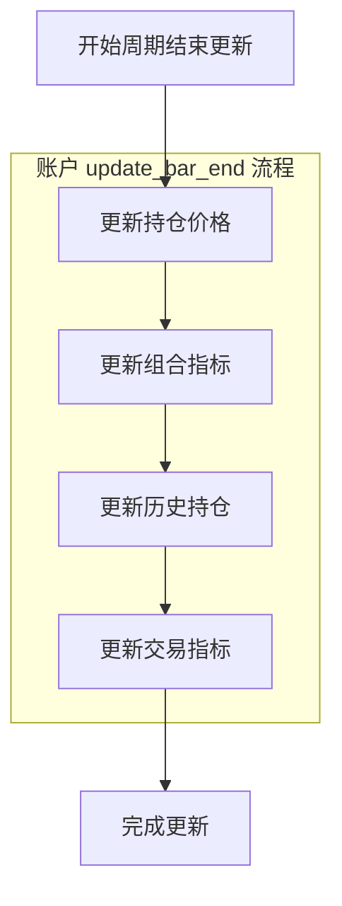
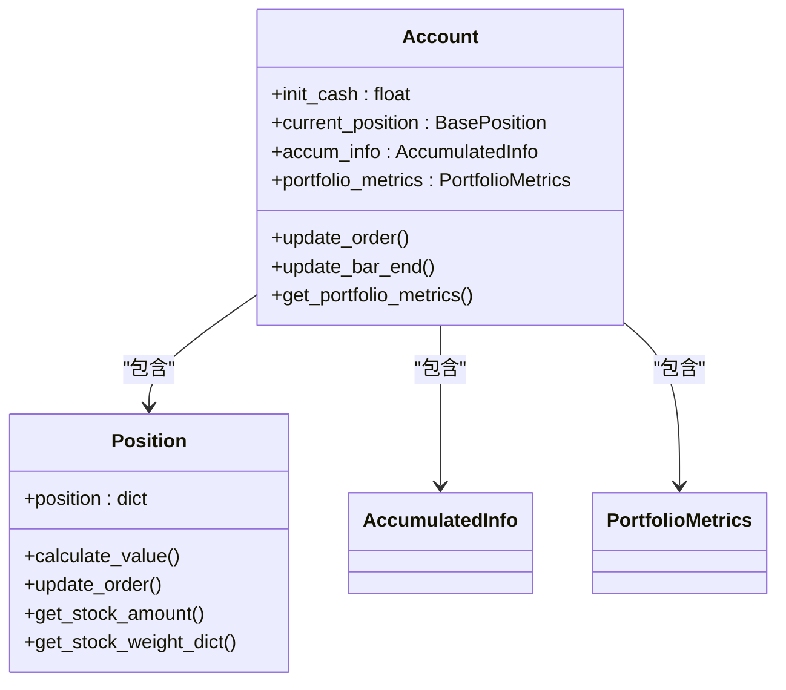

# 账户与持仓管理

<cite>
**本文档引用的文件**  
- [account.py](file://qlib/backtest/account.py)
- [position.py](file://qlib/backtest/position.py)
</cite>

## 目录
1. [引言](#引言)
2. [账户系统核心机制](#账户系统核心机制)
3. [持仓跟踪机制详解](#持仓跟踪机制详解)
4. [账户与持仓协同工作流程](#账户与持仓协同工作流程)
5. [公司行为处理逻辑](#公司行为处理逻辑)
6. [多空头寸管理](#多空头寸管理)
7. [实时查询与收益计算](#实时查询与收益计算)
8. [异常处理机制](#异常处理机制)
9. [结论](#结论)

## 引言
本文档全面阐述Qlib框架中Account（账户）系统与Position（持仓）机制的协同工作机制。详细说明Account类如何维护现金余额、总资产、交易记录等全局状态，并描述Position类如何精确追踪每只证券的持有数量、成本价、浮动盈亏及历史交易明细。解释两者之间的数据同步机制，确保在每次交易后资产估值的一致性。

**Section sources**
- [account.py](file://qlib/backtest/account.py#L70-L416)
- [position.py](file://qlib/backtest/position.py#L230-L499)

## 账户系统核心机制

Account类作为回测系统的交易账户核心，负责维护全局资金和投资组合状态。其主要职责包括：

- **初始化配置**：通过`__init__`方法接收初始资金、持仓字典、频率等参数，并调用`init_vars`进行变量初始化。
- **现金管理**：通过`get_cash`方法提供当前可用现金查询接口。
- **交易更新**：通过`update_order`方法处理买卖订单，更新账户状态。
- **周期性更新**：在每个交易周期结束时，通过`update_bar_end`触发一系列更新操作，包括价格更新、指标计算和历史记录保存。

账户系统还集成了累积信息管理（AccumulatedInfo），用于跟踪累计收益、交易成本和换手率等关键指标。

**Section sources**
- [account.py](file://qlib/backtest/account.py#L110-L129)
- [account.py](file://qlib/backtest/account.py#L179-L180)

## 持仓跟踪机制详解

Position类是持仓管理的核心实现，采用字典结构存储每只证券的详细信息，典型结构如下：
```python
{
  <instrument_id>: {
    'count': <持有天数>,
    'amount': <持有数量>,
    'price': <最新收盘价>,
    'weight': <占总仓位权重>,
  },
}
```

### 核心功能
- **价值计算**：`calculate_value`方法计算当前总市值（股票市值+现金），`calculate_stock_value`仅计算股票部分市值。
- **持仓更新**：`_buy_stock`和`_sell_stock`分别处理买入卖出逻辑，自动调整现金和持股数量。
- **价格同步**：`update_stock_price`方法从交易所获取最新收盘价并更新持仓记录。
- **权重管理**：`get_stock_weight_dict`计算各证券在组合中的价值权重，支持仅股票或包含现金两种模式。

### 特殊处理
- **卖空限制**：在`_sell_stock`中通过`np.isclose`判断是否完全清仓，若剩余数量为负则抛出异常，防止非法卖空。
- **结算延迟**：通过`settle_start`和`settle_commit`实现T+1等结算机制，使用`cash_delay`字段暂存未结算资金。

**Section sources**
- [position.py](file://qlib/backtest/position.py#L341-L349)
- [position.py](file://qlib/backtest/position.py#L351-L381)
- [position.py](file://qlib/backtest/position.py#L416-L419)
- [position.py](file://qlib/backtest/position.py#L455-L471)

## 账户与持仓协同工作流程

账户与持仓系统的协同工作遵循严格的时序逻辑，在每个交易周期结束时执行以下步骤：



**Diagram sources**
- [account.py](file://qlib/backtest/account.py#L337-L402)

### 数据同步机制
1. **价格同步**：`update_current_position`遍历所有持仓证券，从Exchange获取最新收盘价并通过`update_stock_price`更新。
2. **价值一致性**：每次交易后，`calculate_value`确保总资产 = 股票市值 + 可用现金 + 待结算资金。
3. **历史快照**：`update_hist_positions`使用深拷贝保存每日收盘时的完整持仓状态，供后续分析使用。

该机制确保了在任何时刻，账户的总资产估值都与底层持仓数据保持严格一致。

**Section sources**
- [account.py](file://qlib/backtest/account.py#L224-L247)
- [account.py](file://qlib/backtest/account.py#L292-L300)
- [position.py](file://qlib/backtest/position.py#L400-L401)

## 公司行为处理逻辑

系统通过灵活的架构设计支持分红派息、配股等公司行为的处理：

- **价格填充**：`fill_stock_value`方法在回测开始前自动填充缺失的初始价格，确保估值准确性。
- **权重动态调整**：`update_weight_all`在每个周期结束时重新计算各证券权重，反映最新的市场价值分布。
- **持有期计数**：`add_count_all`方法递增每只证券的持有周期数，可用于实现持有期相关的策略逻辑。

对于复杂的公司行为（如拆股、合并），可通过扩展Position类或在交易决策层进行预处理来实现。

**Section sources**
- [position.py](file://qlib/backtest/position.py#L279-L321)
- [position.py](file://qlib/backtest/position.py#L473-L479)
- [position.py](file://qlib/backtest/position.py#L481-L484)

## 多空头寸管理

系统原生支持多头头寸管理，通过以下机制确保合规性：

- **买入逻辑**：`_buy_stock`直接增加持股数量，资金从现金账户扣除。
- **卖出逻辑**：`_sell_stock`检查是否存在足额持仓，禁止裸卖空。
- **清仓处理**：当卖出数量等于当前持仓时，调用`_del_stock`彻底移除该证券记录。

对于做空策略，需通过扩展InfPosition类或自定义Position实现，当前标准Position不支持负持仓。

**Section sources**
- [position.py](file://qlib/backtest/position.py#L383-L384)
- [position.py](file://qlib/backtest/position.py#L428-L429)

## 实时查询与收益计算

### 实时持仓查询
通过Account提供的接口可实时查询：
- `get_hist_positions`: 获取历史持仓快照
- `get_portfolio_metrics`: 返回包含账户价值、收益率等的DataFrame

### 组合收益率计算
收益率计算在`update_portfolio_metrics`中完成，核心公式：
```
日收益率 = (当日收益 + 当日成本) / 前一日账户价值
其中：当日收益 = 当日账户价值 - 前一日账户价值
```

系统区分"收益"(earning)和"回报"(return)，前者考虑交易成本，后者用于绩效评估。



**Diagram sources**
- [account.py](file://qlib/backtest/account.py#L249-L290)
- [account.py](file://qlib/backtest/account.py#L404-L412)

## 异常处理机制

系统内置多种异常检测和处理机制：

### 资金不足
- 触发条件：买入时所需资金超过可用现金
- 处理方案：`_buy_stock`中直接扣减现金，若出现负数则在后续逻辑中被风控拦截

### 卖空限制
- 触发条件：卖出数量大于当前持仓
- 处理方案：`_sell_stock`中显式检查并抛出ValueError异常

### 结算冲突
- 触发条件：嵌套式结算（如T+1内再次启动T+1）
- 处理方案：`settle_start`中通过断言检查，确保`_settle_type`为ST_NO时才允许开启新结算周期

这些机制共同保障了交易模拟的合法性和数据一致性。

**Section sources**
- [position.py](file://qlib/backtest/position.py#L486-L490)
- [position.py](file://qlib/backtest/position.py#L492-L499)
- [account.py](file://qlib/backtest/account.py#L182-L200)

## 结论
Qlib的Account与Position系统通过清晰的职责划分和紧密的数据同步，构建了一个稳健可靠的回测基础架构。Account专注于全局状态管理和绩效评估，Position则精确追踪每笔持仓的细节变化。两者通过标准化接口协作，在保证高性能的同时，为复杂策略开发提供了坚实支撑。建议用户在自定义策略时，充分利用这套机制的扩展性，同时注意遵守其内置的风险控制规则。