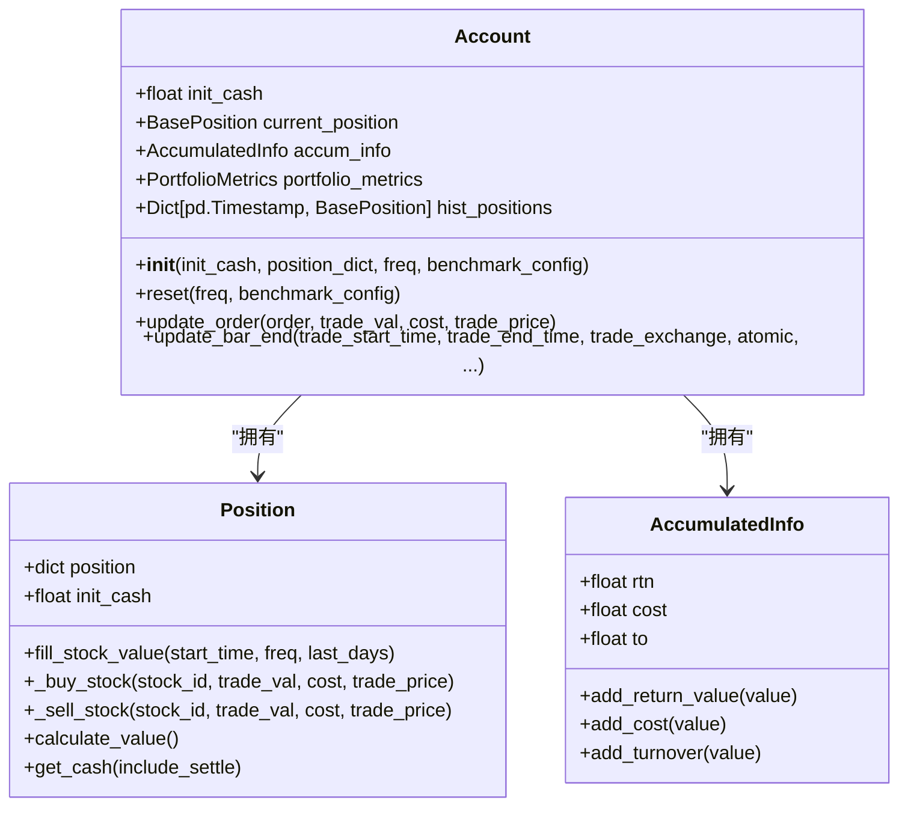
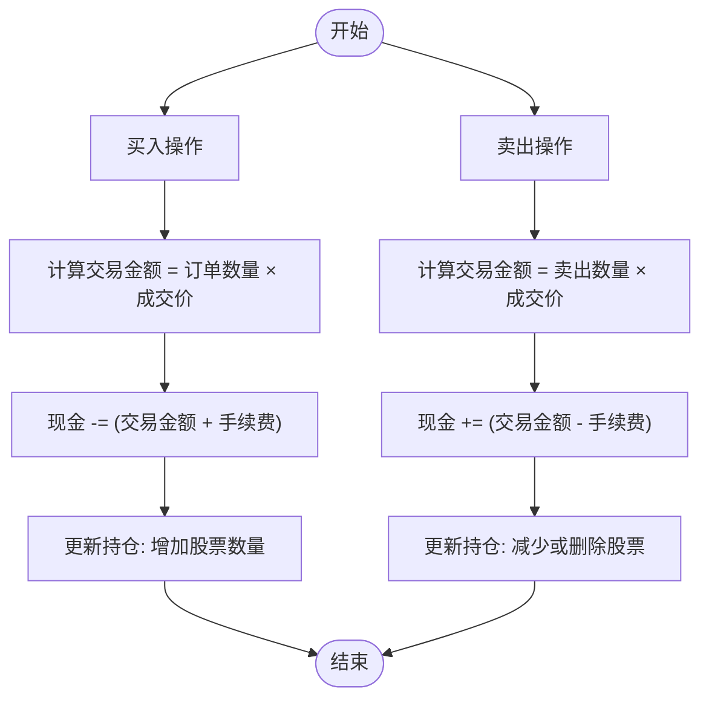
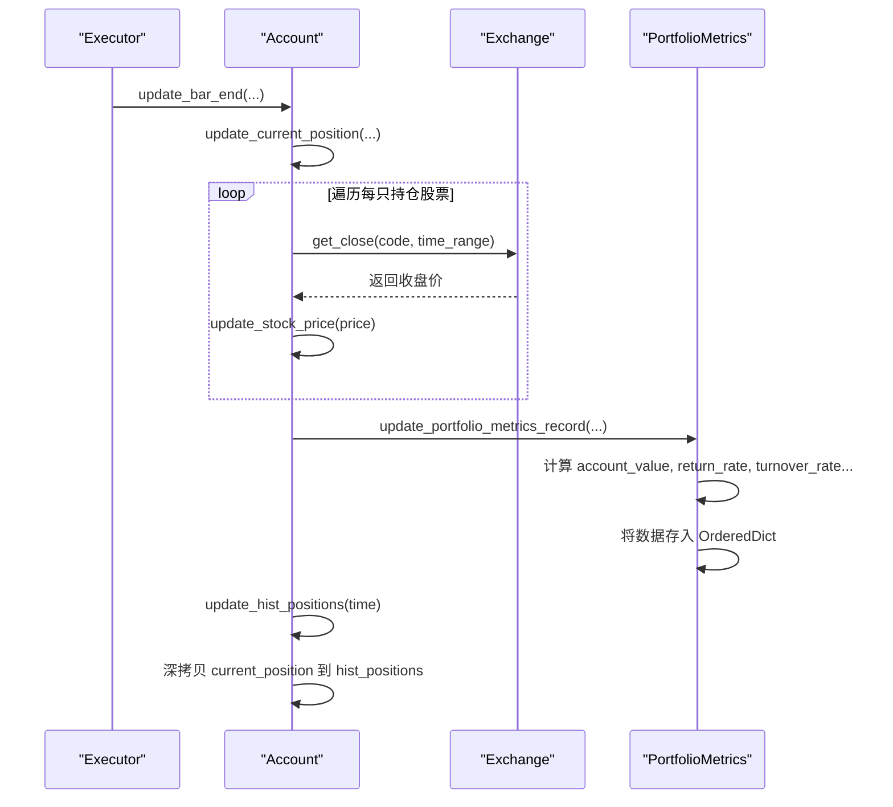

# 账户系统

<cite>
**本文档引用的文件**   
- [account.py](file://qlib/backtest/account.py)
- [position.py](file://qlib/backtest/position.py)
- [report.py](file://qlib/backtest/report.py)
- [exchange.py](file://qlib/backtest/exchange.py)
- [decision.py](file://qlib/backtest/decision.py)
</cite>

## 目录
1. [账户初始化与核心结构](#账户初始化与核心结构)
2. [现金余额与资产变动机制](#现金余额与资产变动机制)
3. [交易流水与状态更新逻辑](#交易流水与状态更新逻辑)
4. [历史净值曲线与每日结算](#历史净值曲线与每日结算)
5. [与Executor执行器的交互流程](#与executor执行器的交互流程)
6. [高级特性：多币种、杠杆与保证金](#高级特性多币种杠杆与保证金)
7. [资金透支保护机制](#资金透支保护机制)
8. [常见问题排查指南](#常见问题排查指南)

## 账户初始化与核心结构

`Account` 类是回测系统中的核心组件，负责管理用户的交易账户。其初始化过程通过 `__init__` 方法完成，主要参数包括初始现金 (`init_cash`)、初始持仓 (`position_dict`)、交易频率 (`freq`) 和基准配置 (`benchmark_config`)。

在初始化时，`Account` 会创建一个 `Position` 对象来管理具体的持仓信息，并初始化 `AccumulatedInfo` 对象以追踪累计的收益、成本和换手率。账户的状态由 `current_position` 属性维护，该属性是一个包含现金和各股票持仓的字典。

**图表来源**
- [account.py](file://qlib/backtest/account.py#L70-L416)
- [position.py](file://qlib/backtest/position.py#L230-L499)

**本节来源**
- [account.py](file://qlib/backtest/account.py#L70-L416)
- [position.py](file://qlib/backtest/position.py#L230-L499)

## 现金余额与资产变动机制

账户的现金余额 (`cash`) 是动态变化的，其变动主要发生在买入和卖出操作中。当执行买入订单时，现金会相应减少；而执行卖出订单时，现金会增加（扣除手续费后）。

具体来说，在 `Position._buy_stock` 方法中，现金的扣减计算为 `trade_val + cost`，其中 `trade_val` 是交易金额，`cost` 是交易成本。而在 `Position._sell_stock` 方法中，现金的返还计算为 `trade_val - cost`。为了支持T+1等结算模式，系统引入了 `cash_delay` 字段来记录待结算的现金。

总资产 (`account_value`) 的计算则更为复杂，它等于所有股票市值 (`stock_value`) 加上可用现金 (`cash`) 和待结算现金 (`cash_delay`) 的总和。股票市值通过 `calculate_stock_value` 方法计算，即各股票持仓数量乘以其最新价格的总和。

**图表来源**
- [position.py](file://qlib/backtest/position.py#L230-L499)

**本节来源**
- [position.py](file://qlib/backtest/position.py#L230-L499)

## 交易流水与状态更新逻辑

每次交易完成后，账户需要更新其内部状态以反映最新的交易情况。这一过程由 `Account.update_order` 方法驱动，该方法根据订单的方向（买入或卖出）调用相应的处理逻辑。

对于卖出订单，系统首先通过 `_update_state_from_order` 更新累计信息（如换手率和收益），然后调用 `current_position.update_order` 来修改持仓。而对于买入订单，则先更新持仓，再更新账户状态。这种顺序确保了在资金不足的情况下，不会错误地增加收益。

手续费的计算在 `Exchange._calc_trade_info_by_order` 方法中完成，它综合考虑了开仓费 (`open_cost`)、平仓费 (`close_cost`)、最小手续费 (`min_cost`) 和市场冲击成本 (`impact_cost`)。最终的交易成本取 `max(交易金额 * 费率, 最小手续费)`。

**本节来源**
- [account.py](file://qlib/backtest/account.py#L70-L416)
- [exchange.py](file://qlib/backtest/exchange.py#L27-L957)

## 历史净值曲线与每日结算

账户的历史净值曲线是评估策略表现的关键指标。该曲线由 `PortfolioMetrics` 类生成，它在每个交易日结束时被更新。

每日结算的核心是 `update_portfolio_metrics` 方法。该方法首先获取前一天的账户价值作为基准，然后计算当天的最新账户价值。收益 (`earning`) 定义为当前账户价值与前一日账户价值之差。同时，系统还会计算当日的收益率、换手率和成本率等关键指标，并将它们记录到 `portfolio_metrics` 的有序字典中。

历史持仓快照通过 `update_hist_positions` 方法保存。在每个交易日结束时，系统会对 `current_position` 进行深拷贝，并将其存储在 `hist_positions` 字典中，键为当天的时间戳。这使得用户可以随时回溯任意时间点的完整持仓状态。

**图表来源**
- [account.py](file://qlib/backtest/account.py#L70-L416)
- [report.py](file://qlib/backtest/report.py#L21-L245)

**本节来源**
- [account.py](file://qlib/backtest/account.py#L70-L416)
- [report.py](file://qlib/backtest/report.py#L21-L245)

## 与Executor执行器的交互流程

`Account` 对象与 `Executor` 执行器紧密协作，共同完成回测任务。`Executor` 负责调度交易决策并调用交易所进行撮合，而 `Account` 则负责接收交易结果并更新自身状态。

整个交互流程始于 `Executor.collect_data` 方法。当一个交易决策 (`TradeDecision`) 被提交后，`Executor` 会遍历其中的每一个订单 (`Order`)，并通过 `Exchange.deal_order` 方法尝试成交。如果成交成功，`deal_order` 会返回交易金额、成本和价格，并调用 `Account.update_order` 来更新账户。

在每个交易周期（bar）结束时，`Executor` 会调用 `Account.update_bar_end` 方法，触发一系列结算操作，包括更新持仓价格、计算并记录投资组合指标以及保存历史快照。

**本节来源**
- [account.py](file://qlib/backtest/account.py#L70-L416)
- [executor.py](file://qlib/backtest/executor.py#L0-L628)
- [exchange.py](file://qlib/backtest/exchange.py#L27-L957)

## 高级特性：多币种、杠杆与保证金

当前代码实现主要针对单一货币（如人民币）的现货交易，未直接体现多币种支持。然而，其设计具有良好的扩展性，理论上可以通过扩展 `Position` 类来支持多种货币的现金管理。

关于杠杆账户和保证金计算，代码中并未直接实现这些功能。`Position` 类的设计假设用户只能使用现有资金进行交易，不支持做空或融资融券。不过，`settle_start` 和 `settle_commit` 方法提供了一个结算框架，未来可以在此基础上扩展保证金逻辑，例如引入负债 (`debt`) 字段来表示借入的资金。

目前，系统通过 `InfPosition` 类实现了无限资金和持仓的模拟，这主要用于生成随机订单进行测试，而非真实的杠杆交易。

**本节来源**
- [position.py](file://qlib/backtest/position.py#L230-L499)
- [account.py](file://qlib/backtest/account.py#L70-L416)

## 资金透支保护机制

系统内置了多重资金透支保护机制，以防止在极端市场条件下发生无效交易。

首先，在 `Exchange._calc_trade_info_by_order` 方法中，系统会在执行买入操作前检查可用现金是否足以覆盖交易成本。如果现金不足以支付最低手续费 (`min_cost`)，则订单会被完全拒绝。如果现金不足以支付全部交易金额但能覆盖成本，系统会计算最大可购买数量，并据此调整订单的成交数量。

其次，在卖出操作中，系统会检查当前持仓数量是否足够。如果试图卖出的数量超过持有量，系统会抛出 `ValueError` 异常。此外，即使卖出了所有持仓，系统也会检查由此产生的现金是否足以覆盖可能产生的费用，从而避免负现金的情况。

最后，`Exchange` 类还提供了基于成交量的限制 (`volume_threshold`)，可以防止大额订单对市场造成过大冲击，间接起到了风险控制的作用。

**本节来源**
- [exchange.py](file://qlib/backtest/exchange.py#L27-L957)
- [position.py](file://qlib/backtest/position.py#L230-L499)

## 常见问题排查指南

### 账户余额异常
*   **现象**: 账户现金出现负数或与预期不符。
*   **排查步骤**:
    1.  检查是否有未处理的异常订单导致重复扣款。
    2.  确认 `min_cost` 和 `open_cost`/`close_cost` 的设置是否合理。
    3.  查看 `Exchange` 的日志输出，确认是否存在因“现金不足”而被截断的订单。
    4.  检查 `Position` 的 `cash_delay` 机制是否按预期工作。

### 净值跳变
*   **现象**: 净值曲线在某一天出现剧烈波动或跳跃。
*   **排查步骤**:
    1.  检查该日期是否有大额的买入或卖出操作。
    2.  核对 `PortfolioMetrics` 中该日的 `total_cost` 和 `total_turnover` 是否异常高。
    3.  检查相关股票在该日的收盘价数据是否准确，是否存在数据缺失或异常值。
    4.  确认 `benchmark_config` 中的起始时间是否正确，避免因填充股票价格时选取了错误的历史数据而导致初始估值偏差。

**本节来源**
- [account.py](file://qlib/backtest/account.py#L70-L416)
- [position.py](file://qlib/backtest/position.py#L230-L499)
- [exchange.py](file://qlib/backtest/exchange.py#L27-L957)
- [report.py](file://qlib/backtest/report.py#L21-L245)