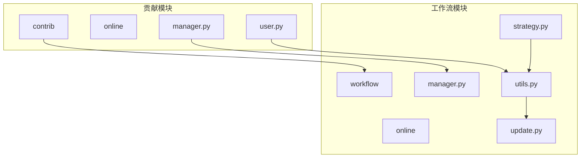
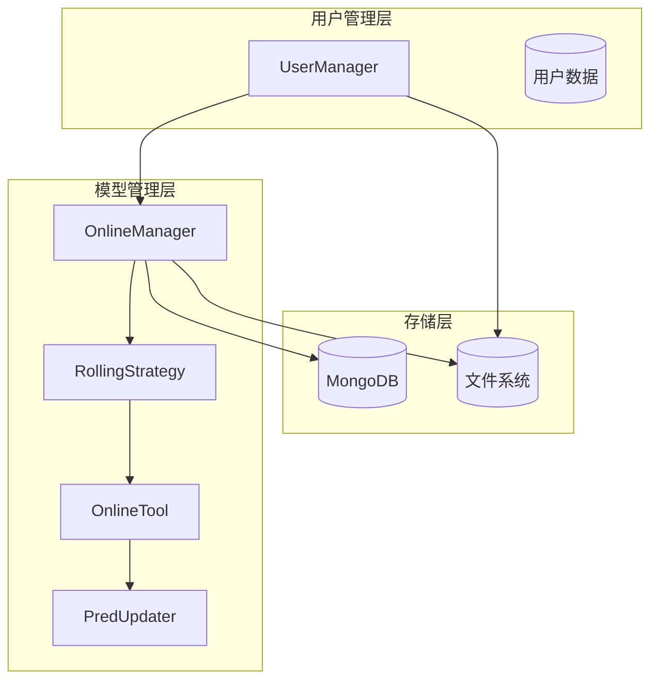
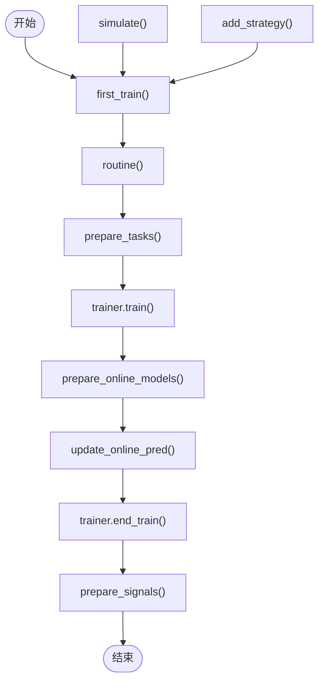
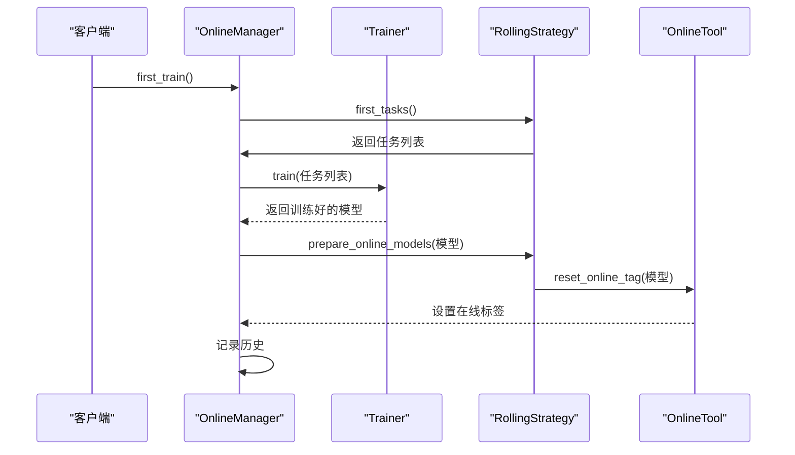
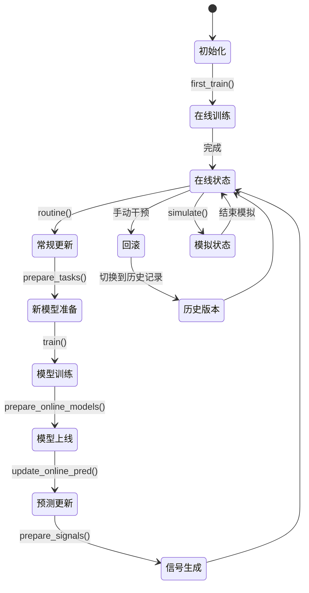
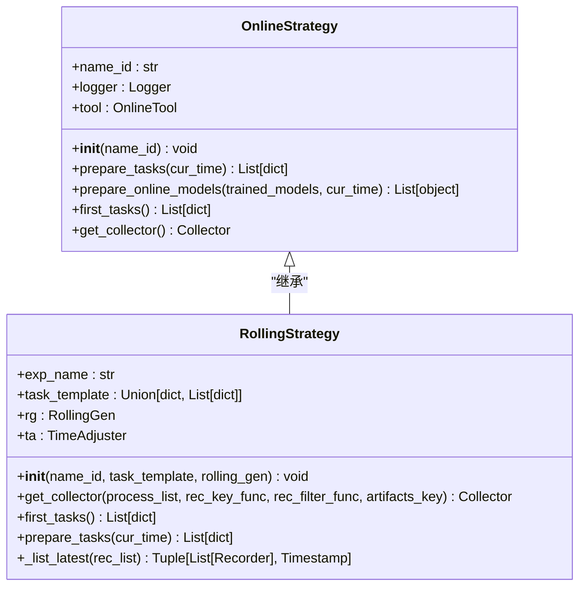
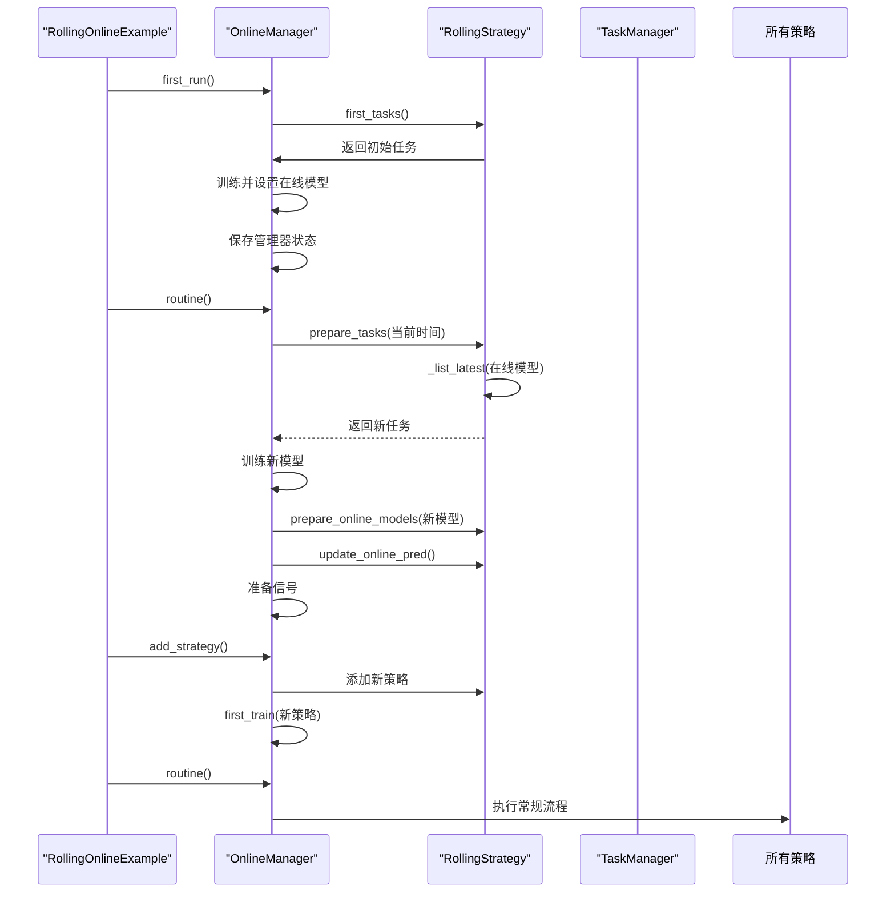
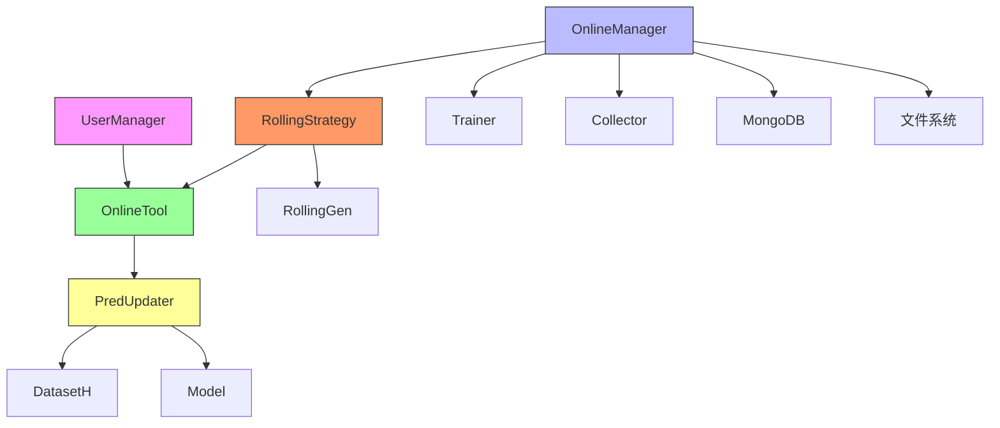

# 在线模型管理

<cite>
**本文档中引用的文件**
- [manager.py](file://qlib/contrib/online/manager.py)
- [rolling_online_management.py](file://examples/online_srv/rolling_online_management.py)
- [OnlineManager.py](file://qlib/workflow/online/manager.py)
- [RollingStrategy.py](file://qlib/workflow/online/strategy.py)
- [OnlineTool.py](file://qlib/workflow/online/utils.py)
- [PredUpdater.py](file://qlib/workflow/online/update.py)
</cite>

## 目录
1. [简介](#简介)
2. [项目结构](#项目结构)
3. [核心组件](#核心组件)
4. [架构概述](#架构概述)
5. [详细组件分析](#详细组件分析)
6. [依赖分析](#依赖分析)
7. [性能考虑](#性能考虑)
8. [故障排除指南](#故障排除指南)
9. [结论](#结论)

## 简介
Qlib在线模型管理系统提供了一套完整的模型生命周期管理解决方案，支持模型注册、加载、版本控制和热更新等核心功能。系统通过OnlineManager实现多模型实例并行运行和自动化切换，结合滚动训练场景下的自动化流程，为量化交易提供了可靠的在线服务支持。

## 项目结构
Qlib的在线模型管理功能主要分布在contrib/online和workflow/online两个模块中，通过清晰的分层设计实现了模型管理的核心逻辑。



**图源**
- [manager.py](file://qlib/contrib/online/manager.py)
- [OnlineManager.py](file://qlib/workflow/online/manager.py)
- [RollingStrategy.py](file://qlib/workflow/online/strategy.py)

**节源**
- [manager.py](file://qlib/contrib/online/manager.py)
- [OnlineManager.py](file://qlib/workflow/online/manager.py)

## 核心组件
在线模型管理系统的核心组件包括UserManager、OnlineManager、RollingStrategy和OnlineTool，这些组件协同工作实现了完整的模型管理功能。

**节源**
- [manager.py](file://qlib/contrib/online/manager.py#L16-L147)
- [OnlineManager.py](file://qlib/workflow/online/manager.py#L100-L381)

## 架构概述
Qlib在线模型管理系统的架构采用分层设计，从用户管理到模型调度形成了完整的闭环。



**图源**
- [OnlineManager.py](file://qlib/workflow/online/manager.py#L100-L381)
- [RollingStrategy.py](file://qlib/workflow/online/strategy.py#L91-L207)
- [OnlineTool.py](file://qlib/workflow/online/utils.py#L100-L188)

## 详细组件分析

### UserManager分析
UserManager负责管理在线系统中的用户数据，提供了用户添加、删除、加载和保存等基本操作。

```mermaid
classDiagram
class UserManager {
+data_path : Path
+users_file : Path
+save_report : bool
+users : dict{}
+user_record : DataFrame
+__init__(user_data_path, save_report) void
+load_users() void
+load_user(user_id) User
+save_user_data(user_id) void
+add_user(user_id, config_file, add_date) void
+remove_user(user_id) void
}
class User {
+account : Account
+strategy : Strategy
+model : Model
}
class Account {
+cash : float
+positions : dict{}
}
UserManager --> User : "包含"
UserManager --> Account : "创建"
```

**图源**
- [manager.py](file://qlib/contrib/online/manager.py#L16-L147)

**节源**
- [manager.py](file://qlib/contrib/online/manager.py#L16-L147)

### OnlineManager分析
OnlineManager是在线模型管理的核心类，负责协调模型的训练、部署和信号生成等关键流程。

#### 核心方法流程


**图源**
- [OnlineManager.py](file://qlib/workflow/online/manager.py#L100-L381)

#### 模型注册与加载


**图源**
- [OnlineManager.py](file://qlib/workflow/online/manager.py#L155-L181)
- [RollingStrategy.py](file://qlib/workflow/online/strategy.py#L154-L164)

#### 版本控制与生命周期管理


**图源**
- [OnlineManager.py](file://qlib/workflow/online/manager.py#L183-L227)
- [OnlineTool.py](file://qlib/workflow/online/utils.py#L100-L188)

**节源**
- [OnlineManager.py](file://qlib/workflow/online/manager.py#L100-L381)

### RollingStrategy分析
RollingStrategy实现了滚动训练场景下的自动化模型切换流程，确保模型能够持续适应市场变化。



**图源**
- [RollingStrategy.py](file://qlib/workflow/online/strategy.py#L91-L207)

**节源**
- [RollingStrategy.py](file://qlib/workflow/online/strategy.py#L91-L207)

### 滚动训练自动化流程


**图源**
- [rolling_online_management.py](file://examples/online_srv/rolling_online_management.py#L1-L144)
- [RollingStrategy.py](file://qlib/workflow/online/strategy.py#L166-L188)

**节源**
- [rolling_online_management.py](file://examples/online_srv/rolling_online_management.py#L1-L144)

## 依赖分析
在线模型管理系统各组件之间的依赖关系清晰，形成了良好的分层架构。



**图源**
- [OnlineManager.py](file://qlib/workflow/online/manager.py#L100-L381)
- [RollingStrategy.py](file://qlib/workflow/online/strategy.py#L91-L207)
- [OnlineTool.py](file://qlib/workflow/online/utils.py#L100-L188)

**节源**
- [OnlineManager.py](file://qlib/workflow/online/manager.py#L100-L381)

## 性能考虑
在线模型管理系统在高并发访问下需要考虑以下性能优化建议：

1. **缓存策略**：合理配置模型预测缓存，减少重复计算
2. **内存管理**：及时清理不再使用的模型实例，避免内存泄漏
3. **异步处理**：对于耗时的操作如模型训练，采用异步方式执行
4. **连接池**：与外部服务（如Redis）集成时使用连接池管理
5. **批量处理**：将多个小请求合并为批量处理，提高吞吐量

## 故障排除指南
当在线模型管理系统出现异常时，可以按照以下步骤进行排查：

1. **检查日志**：查看OnlineManager的日志输出，定位错误发生的位置
2. **验证配置**：确认模型配置文件和策略参数的正确性
3. **检查依赖**：确保所有外部服务（如MongoDB）正常运行
4. **恢复机制**：利用历史记录功能回滚到已知的良好状态
5. **监控指标**：关注系统资源使用情况，及时发现性能瓶颈

**节源**
- [OnlineManager.py](file://qlib/workflow/online/manager.py#L100-L381)
- [OnlineTool.py](file://qlib/workflow/online/utils.py#L100-L188)

## 结论
Qlib在线模型管理系统通过精心设计的架构和清晰的组件划分，实现了模型的全生命周期管理。系统支持热更新与回滚、多模型实例并行运行，并通过RollingStrategy实现了滚动训练场景下的自动化切换。合理的缓存策略和异常恢复机制确保了系统的稳定性和可靠性，为量化交易提供了强大的技术支持。