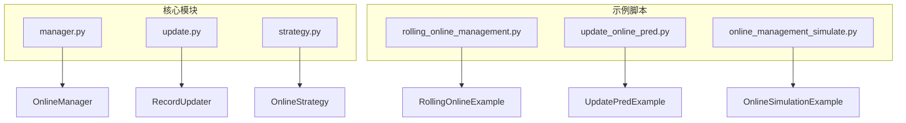
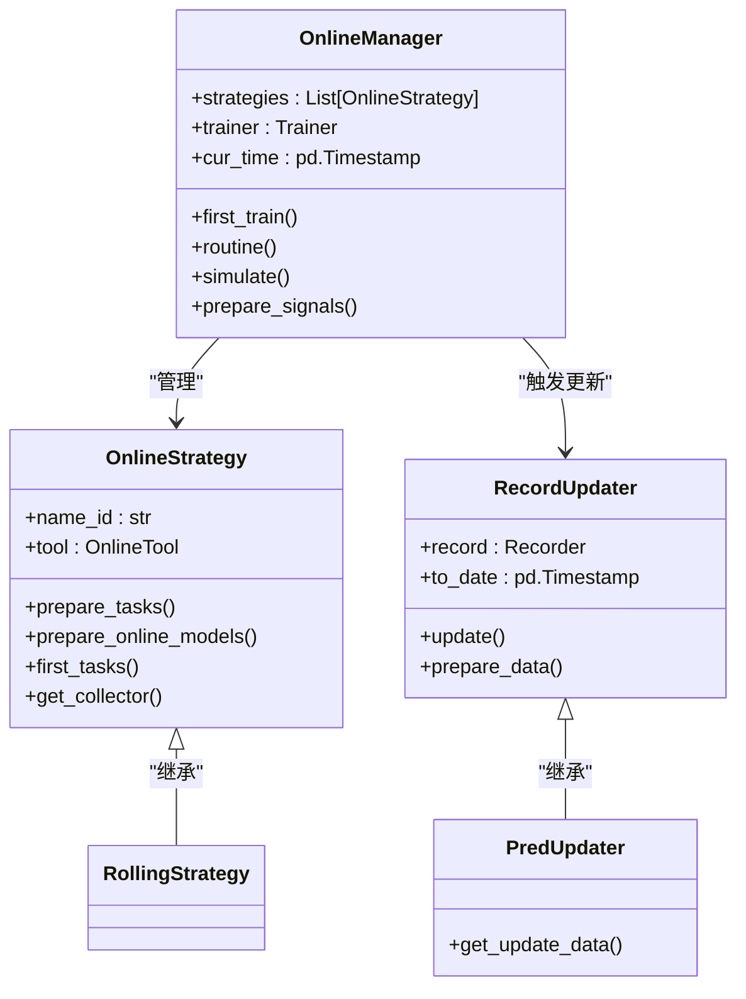
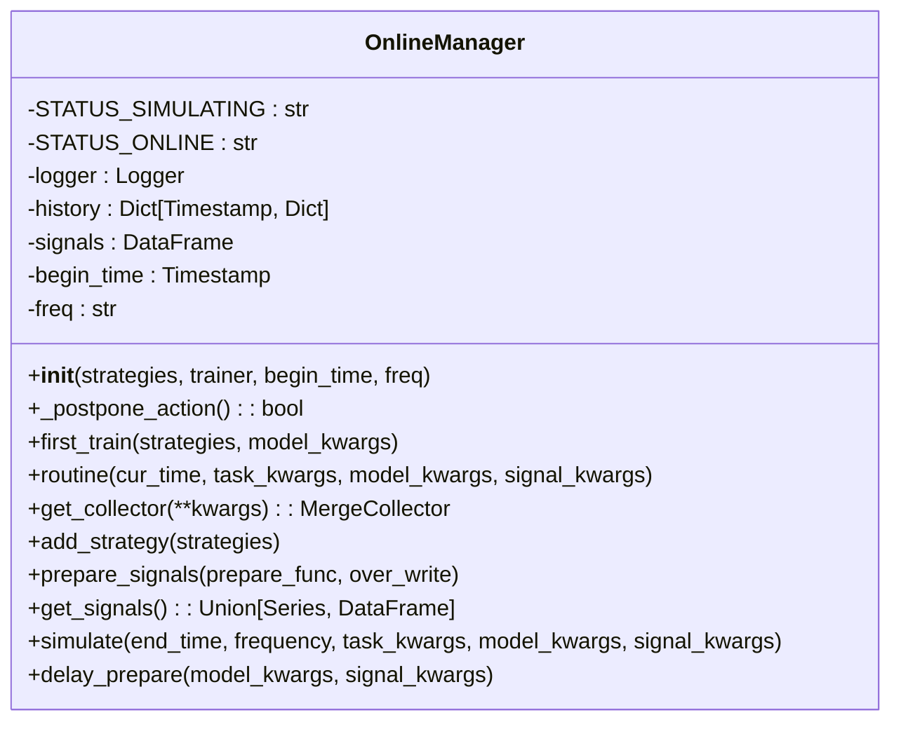
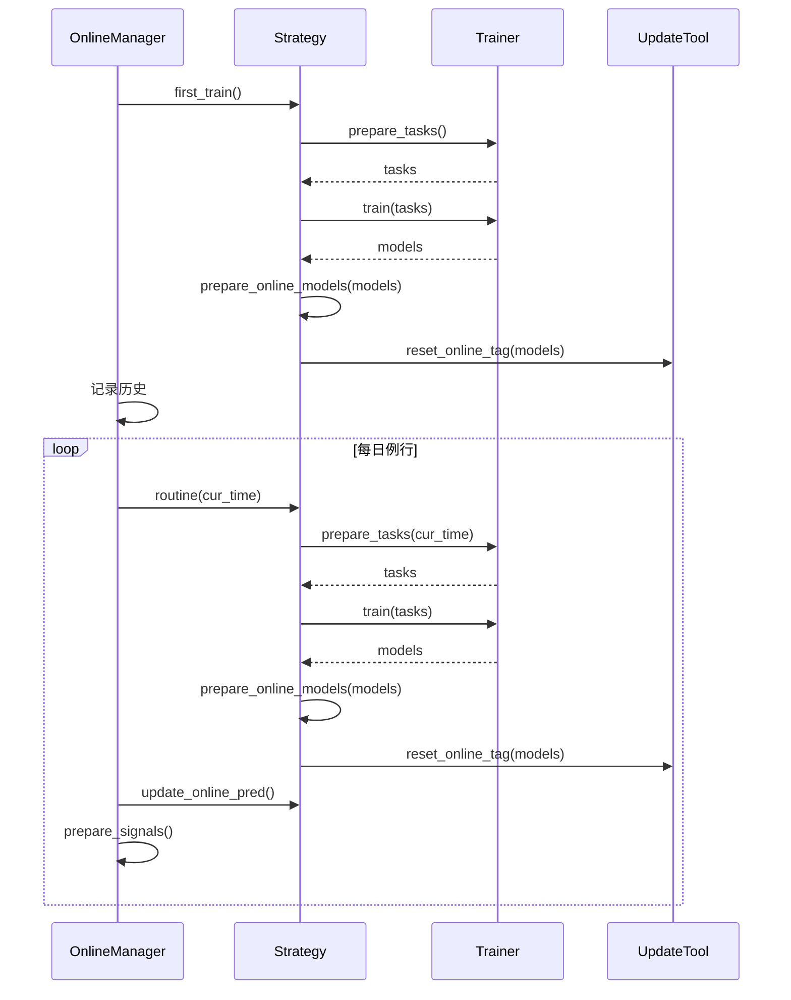
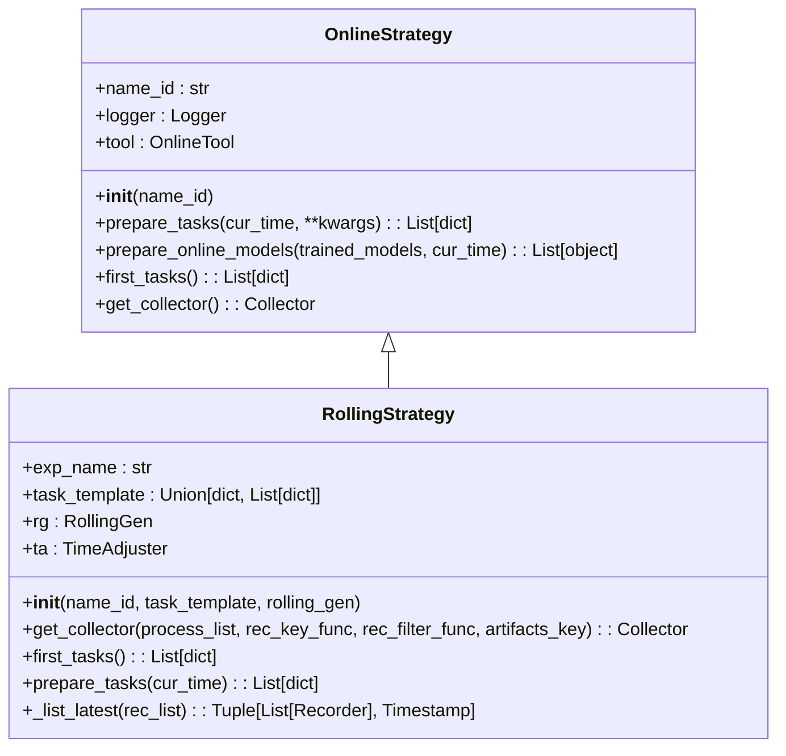
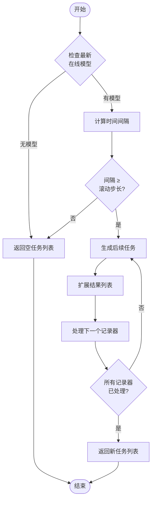

# 在线预测服务

<cite>
**本文档中引用的文件**
- [manager.py](file://qlib/workflow/online/manager.py)
- [update.py](file://qlib/workflow/online/update.py)
- [strategy.py](file://qlib/workflow/online/strategy.py)
- [rolling_online_management.py](file://examples/online_srv/rolling_online_management.py)
- [update_online_pred.py](file://examples/online_srv/update_online_pred.py)
- [online_management_simulate.py](file://examples/online_srv/online_management_simulate.py)
</cite>

## 目录
1. [引言](#引言)
2. [项目结构](#项目结构)
3. [核心组件](#核心组件)
4. [架构概述](#架构概述)
5. [详细组件分析](#详细组件分析)
6. [依赖关系分析](#依赖关系分析)
7. [性能考量](#性能考量)
8. [故障排除指南](#故障排除指南)
9. [结论](#结论)

## 引言
Qlib的在线预测服务提供了一套完整的模型部署、滚动更新和实时推理解决方案。该系统通过manager.py、update.py和strategy.py三个核心模块协同工作，实现了从模型训练到生产环境部署的端到端自动化流程。本文档将深入解析这些组件的工作机制，并结合examples/online_srv中的实际脚本说明生产环境中的工作流程。

## 项目结构
Qlib的在线预测服务主要分布在两个目录中：`qlib/workflow/online/`包含核心功能实现，`examples/online_srv/`提供实际应用示例。这种分离设计使得核心逻辑与具体应用场景解耦，便于维护和扩展。



**图源**
- [manager.py](file://qlib/workflow/online/manager.py)
- [update.py](file://qlib/workflow/online/update.py)
- [strategy.py](file://qlib/workflow/online/strategy.py)
- [rolling_online_management.py](file://examples/online_srv/rolling_online_management.py)
- [update_online_pred.py](file://examples/online_srv/update_online_pred.py)
- [online_management_simulate.py](file://examples/online_srv/online_management_simulate.py)

## 核心组件
在线预测服务的核心由三个主要组件构成：OnlineManager负责整体流程控制，OnlineStrategy定义策略逻辑，RecordUpdater处理数据更新。这些组件共同实现了模型的生命周期管理、预测更新和信号生成。

**节源**
- [manager.py](file://qlib/workflow/online/manager.py)
- [update.py](file://qlib/workflow/online/update.py)
- [strategy.py](file://qlib/workflow/online/strategy.py)

## 架构概述
Qlib的在线预测服务采用分层架构设计，各组件职责明确且松散耦合。OnlineManager作为协调者，调度不同策略的执行；每个策略独立管理其任务生成和模型更新；更新器负责具体的预测数据刷新。



**图源**
- [manager.py](file://qlib/workflow/online/manager.py#L100-L381)
- [strategy.py](file://qlib/workflow/online/strategy.py#L91-L207)
- [update.py](file://qlib/workflow/online/update.py#L269-L280)

## 详细组件分析

### OnlineManager分析
OnlineManager是整个在线预测系统的中枢，负责协调各个策略的执行流程。它通过状态机模式管理在线和模拟两种运行模式，并确保所有操作按正确顺序执行。

#### 类图


**图源**
- [manager.py](file://qlib/workflow/online/manager.py#L100-L381)

#### 执行流程


**图源**
- [manager.py](file://qlib/workflow/online/manager.py#L200-L300)

**节源**
- [manager.py](file://qlib/workflow/online/manager.py#L100-L381)

### OnlineStrategy分析
OnlineStrategy定义了具体的策略执行逻辑，包括任务生成、模型选择和结果收集等关键环节。RollingStrategy作为其实现之一，展示了滚动更新的具体工作方式。

#### 类图


**图源**
- [strategy.py](file://qlib/workflow/online/strategy.py#L91-L207)

#### 任务生成流程


**图源**
- [strategy.py](file://qlib/workflow/online/strategy.py#L150-L180)

**节源**
- [strategy.py](file://qlib/workflow/online/strategy.py#L91-L207)

### RecordUpdater分析
RecordUpdater及其子类PredUpdater负责在线预测数据的更新操作，确保模型输出能够及时反映最新的市场状况。

#### 类图
```mermaid
classDiagram
    class RecordUpdater {
        +record: Recorder
        +logger: Logger
        +__init__(record)
        +update(*args, **kwargs)
    }
    
    class DSBasedUpdater {
        +to_date: Timestamp
        +from_date: Timestamp
        +hist_ref: int
        +freq: str
        +fname: str
        +rmdl: RMDLoader
        +old_data: DataFrame
        +last_end: Timestamp
        +