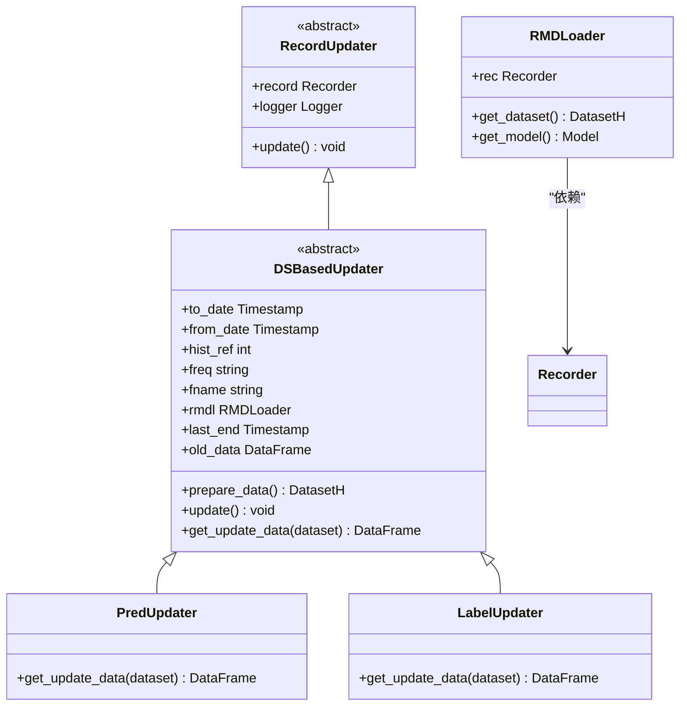
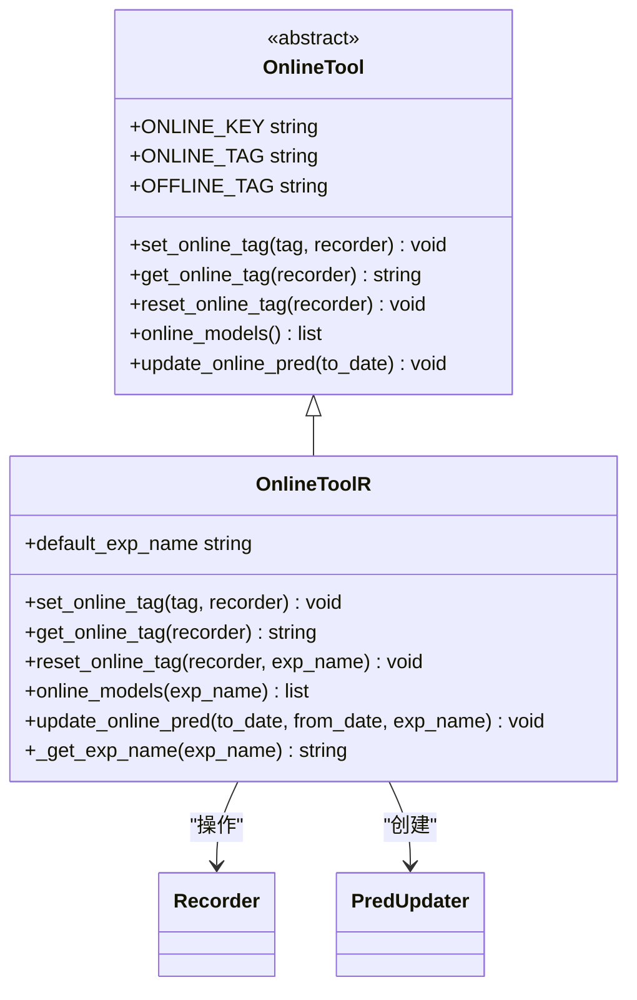
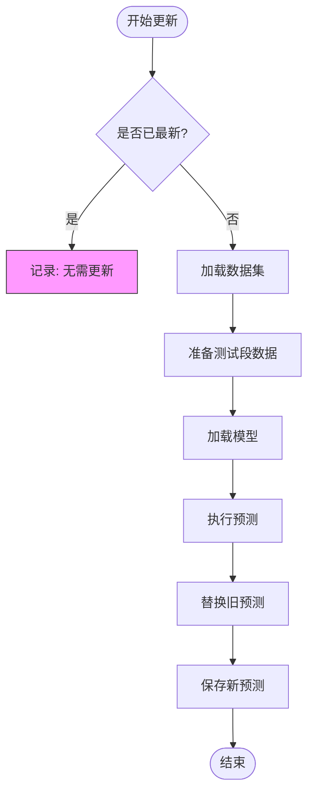
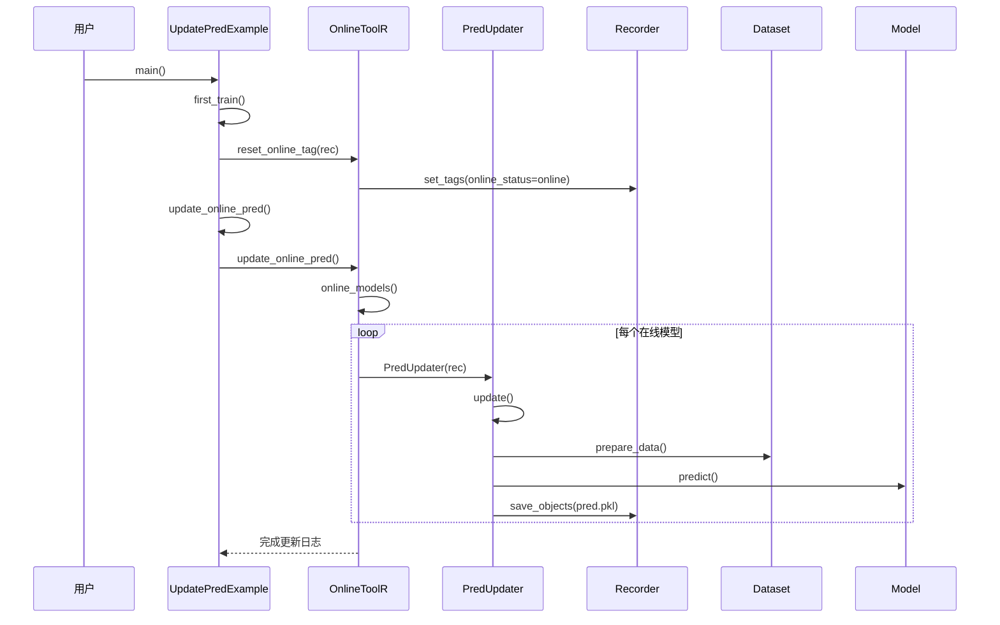

# 滚动更新机制

<cite>
**本文档引用文件**  
- [update.py](file://qlib/workflow/online/update.py)
- [update_online_pred.py](file://examples/online_srv/update_online_pred.py)
- [utils.py](file://qlib/workflow/online/utils.py)
- [recorder.py](file://qlib/workflow/recorder.py)
</cite>

## 目录
1. [引言](#引言)  
2. [核心组件分析](#核心组件分析)  
3. [滚动预测更新执行逻辑](#滚动预测更新执行逻辑)  
4. [生产环境自动化流程](#生产环境自动化流程)  
5. [增量与全量更新策略](#增量与全量更新策略)  
6. [任务容错与监控机制](#任务容错与监控机制)  
7. [工作流系统集成](#工作流系统集成)  
8. [高频交易低延迟优化](#高频交易低延迟优化)  

## 引言
Qlib 提供了一套完整的滚动预测更新机制，用于在市场数据持续更新的场景下自动刷新模型预测结果。该机制通过定时调度、数据依赖检查和预测输出持久化等环节，确保在线服务中的模型信号始终保持最新状态。本文档深入解析 `update.py` 中的核心类与方法，并结合 `update_online_pred.py` 示例脚本，全面阐述其在生产环境中的应用方式。

## 核心组件分析

### 更新器架构设计
Qlib 的滚动更新机制基于抽象基类 `RecordUpdater` 构建，形成清晰的继承体系：



**图示来源**  
- [update.py](file://qlib/workflow/online/update.py#L100-L298)

**本节来源**  
- [update.py](file://qlib/workflow/online/update.py#L1-L298)

### 在线工具管理器
`OnlineToolR` 类负责管理实验中“在线”状态的模型记录器（Recorder），实现模型版本切换与批量预测更新：



**图示来源**  
- [utils.py](file://qlib/workflow/online/utils.py#L1-L187)

**本节来源**  
- [utils.py](file://qlib/workflow/online/utils.py#L1-L187)

## 滚动预测更新执行逻辑

### 定时任务调度流程
滚动更新的核心是 `PredUpdater.update()` 方法，其执行流程如下：



**图示来源**  
- [update.py](file://qlib/workflow/online/update.py#L200-L230)

**本节来源**  
- [update.py](file://qlib/workflow/online/update.py#L100-L298)

### 数据依赖检查机制
`DSBasedUpdater.prepare_data()` 方法通过历史参考窗口（`hist_ref`）确保特征计算的时间对齐：

```python
start_time_buffer = get_date_by_shift(
    self.last_end, -hist_ref + 1, clip_shift=False, freq=self.freq
)
```
此逻辑保证了即使特征依赖过去 N 天的数据，也能正确重计算最新预测所需的所有输入。

**本节来源**  
- [update.py](file://qlib/workflow/online/update.py#L170-L185)

### 预测结果刷新策略
使用 `_replace_range()` 函数实现原子性更新：
```python
def _replace_range(data, new_data):
    dates = new_data.index.get_level_values("datetime")
    data = data.drop(data.loc[dates.min():dates.max()].index)
    cb_data = pd.concat([data, new_data], axis=0)
    return cb_data[~cb_data.index.duplicated(keep="last")].sort_index()
```
该策略先删除目标时间段内的旧数据，再合并新预测，避免重复索引问题。

**本节来源**  
- [update.py](file://qlib/workflow/online/update.py#L232-L240)

## 生产环境自动化流程

### 自动化脚本执行流程
`update_online_pred.py` 示例展示了完整的每日自动更新流程：



**图示来源**  
- [update_online_pred.py](file://examples/online_srv/update_online_pred.py#L1-L54)  
- [utils.py](file://qlib/workflow/online/utils.py#L158-L177)

**本节来源**  
- [update_online_pred.py](file://examples/online_srv/update_online_pred.py#L1-L54)

### 时间窗口对齐处理
系统自动处理时间窗口对齐问题：
- 若未指定 `to_date`，则更新至日历最新日期
- 使用 `get_date_by_shift` 确保跨节假日的准确位移
- 支持自定义 `from_date` 实现部分更新

**本节来源**  
- [update.py](file://qlib/workflow/online/update.py#L120-L140)

### 特征数据重计算
通过 `RMDLoader.get_dataset()` 重新配置数据集：
```python
dataset.config(handler_kwargs={"start_time": start_time, "end_time": end_time})
dataset.setup_data(handler_kwargs={"init_type": DataHandlerLP.IT_LS})
```
确保所有特征处理器（Processor）基于最新数据重新运行。

**本节来源**  
- [update.py](file://qlib/workflow/online/update.py#L60-L80)

### 预测输出持久化
利用 `Recorder.save_objects()` 将预测结果序列化存储：
```python
self.record.save_objects(**{self.fname: updated_data})
```
支持 MLflow 等后端的元数据管理和版本追踪。

**本节来源**  
- [recorder.py](file://qlib/workflow/recorder.py#L250-L270)

## 增量与全量更新策略

| 更新类型 | 触发条件 | 性能影响 | 适用场景 |
|--------|---------|--------|--------|
| **增量更新** | `from_date` 不为空且小于最后日期 | 低 | 日常每日更新 |
| **全量更新** | `from_date` 为空或等于起始日期 | 高 | 模型首次上线或重大重构 |

通过合理设置 `from_date` 和 `to_date` 参数可灵活选择更新模式。

**本节来源**  
- [update.py](file://qlib/workflow/online/update.py#L130-L140)

## 任务容错与监控机制

### 任务失败重试
`OnlineToolR.update_online_pred()` 内置异常捕获：
```python
try:
    updater = PredUpdater(rec, to_date=to_date)
except LoadObjectError as e:
    self.logger.warn(f"An exception `{str(e)}` happened when load `pred.pkl`, skip it.")
    continue
```
允许单个模型失败不影响整体批处理流程。

**本节来源**  
- [utils.py](file://qlib/workflow/online/utils.py#L165-L170)

### 日志追踪
系统提供多层级日志输出：
- `INFO`: 关键步骤完成提示
- `WARNING`: 可恢复异常记录
- `DEBUG`: 详细执行参数

便于排查线上问题。

**本节来源**  
- [update.py](file://qlib/workflow/online/update.py#L110)  
- [utils.py](file://qlib/workflow/online/utils.py#L20)

### 监控告警实现
可通过扩展 `OnlineToolR` 添加外部监控钩子：
```python
def update_online_pred(self, ...):
    # ...
    self.logger.info("开始更新...")
    try:
        # 执行更新
        pass
    except Exception as e:
        # 发送告警通知
        send_alert(f"预测更新失败: {e}")
        raise
    finally:
        # 上报指标
        report_metric("update_duration", duration)
```

**本节来源**  
- [utils.py](file://qlib/workflow/online/utils.py#L158-L177)

## 工作流系统集成

### 与 Workflow 系统协同
通过 `task_train()` 创建并标记在线模型：
```python
rec = task_train(task_config, experiment_name="online_srv")
self.online_tool.reset_online_tag(rec)
```
实现训练-部署一体化流水线。

**本节来源**  
- [update_online_pred.py](file://examples/online_srv/update_online_pred.py#L40-L42)  
- [trainer.py](file://qlib/model/trainer.py#L107-L127)

### 多实验管理
`OnlineToolR` 支持按实验名称隔离模型：
```python
def __init__(self, default_exp_name: str = None)
```
可在同一系统中维护多个独立的在线模型集合。

**本节来源**  
- [utils.py](file://qlib/workflow/online/utils.py#L100-L105)

## 高频交易低延迟优化

### 缓存优化建议
- 启用 `DataHandlerLP.IT_LS` 初始化类型减少重复计算
- 使用内存映射存储高频数据
- 预加载常用特征矩阵

### 并行更新策略
可扩展为并行处理多个在线模型：
```python
with ThreadPoolExecutor() as executor:
    futures = [executor.submit(updater.update) for updater in updaters]
    results = [f.result() for f in futures]
```

### 轻量级更新器
对于超低延迟场景，可定制轻量级 `RecordUpdater` 子类，跳过不必要的校验步骤。

**本节来源**  
- [update.py](file://qlib/workflow/online/update.py#L100-L298)