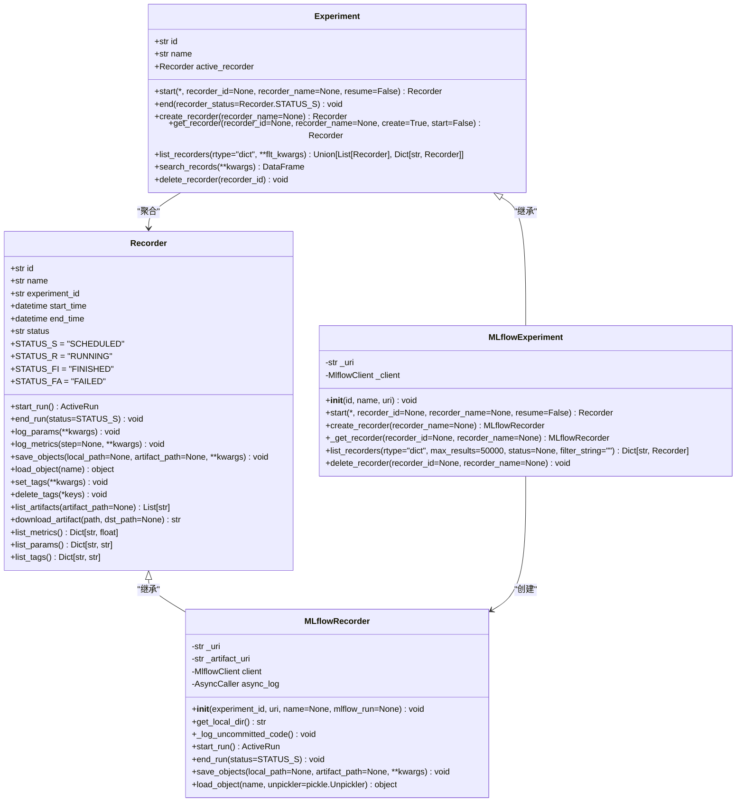
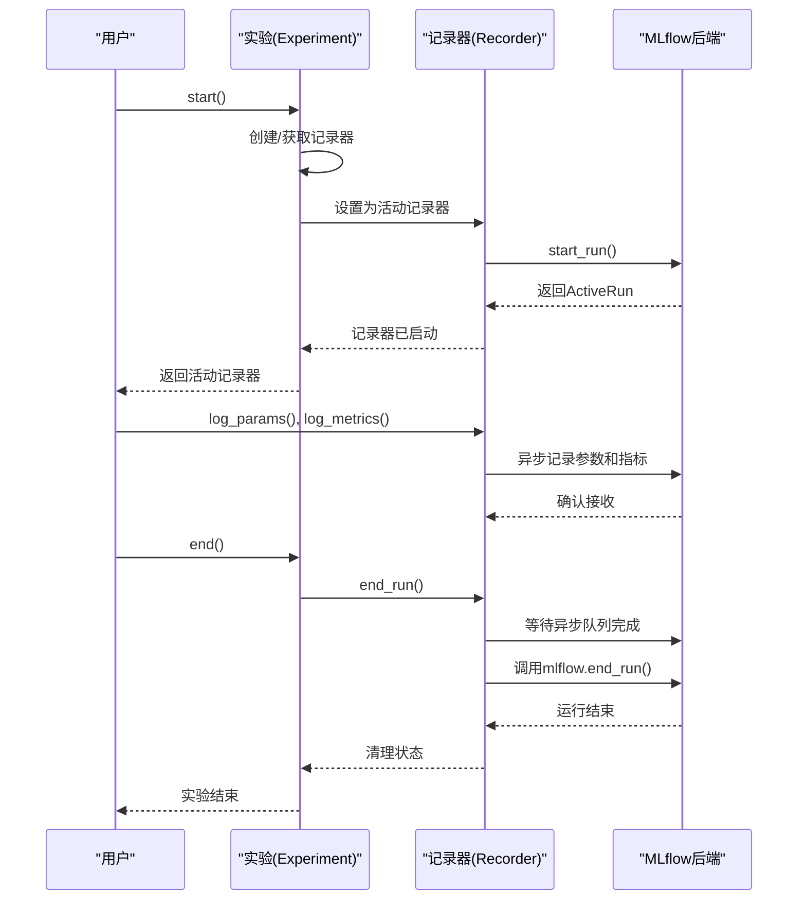

# 实验管理

<cite>
**本文档中引用的文件**
- [exp.py](file://qlib/workflow/exp.py)
- [recorder.py](file://qlib/workflow/recorder.py)
- [run_all_model.py](file://examples/run_all_model.py)
</cite>

## 目录
1. [引言](#引言)
2. [实验与记录器系统架构](#实验与记录器系统架构)
3. [实验生命周期管理](#实验生命周期管理)
4. [记录器功能详解](#记录器功能详解)
5. [MLflow集成机制](#mlflow集成机制)
6. [批量模型运行示例分析](#批量模型运行示例分析)
7. [分布式环境下的并发控制](#分布式环境下的并发控制)
8. [最佳实践指南](#最佳实践指南)
9. [结论](#结论)

## 引言
Qlib的实验（Experiment）与记录器（Recorder）系统为机器学习工作流提供了完整的实验管理和结果追踪解决方案。该系统设计灵感来源于MLflow，通过清晰的层次结构实现了从实验创建到结果分析的全流程管理。核心组件包括实验类（Experiment）和记录器类（Recorder），它们共同构成了一个强大的实验跟踪框架，支持模型指标、参数、资产和元数据的全面记录。

**Section sources**
- [exp.py](file://qlib/workflow/exp.py#L14-L239)
- [recorder.py](file://qlib/workflow/recorder.py#L27-L243)

## 实验与记录器系统架构



**Diagram sources**
- [exp.py](file://qlib/workflow/exp.py#L14-L239)
- [recorder.py](file://qlib/workflow/recorder.py#L27-L243)

**Section sources**
- [exp.py](file://qlib/workflow/exp.py#L14-L239)
- [recorder.py](file://qlib/workflow/recorder.py#L27-L243)

## 实验生命周期管理

Qlib的实验管理系统通过`Experiment`类及其子类`MLflowExperiment`实现完整的实验生命周期控制。实验对象代表一次完整的机器学习实验过程，包含唯一的ID和名称标识。系统支持实验的启动、结束、暂停和恢复等操作，确保实验状态的准确追踪。

实验的启动通过`start()`方法实现，该方法会创建或获取指定的记录器并将其设置为活动状态。在`MLflowExperiment`的具体实现中，启动过程包括初始化MLflow客户端、设置跟踪URI以及创建新的运行实例。实验结束时调用`end()`方法，该方法会终止当前活动的记录器并将实验状态更新为完成或失败。

实验系统还提供了灵活的记录器管理功能，包括`create_recorder()`用于创建新记录器，`get_recorder()`用于获取现有记录器，以及`list_recorders()`用于列出所有相关记录器。这些方法共同构成了实验上下文的管理接口，使用户能够方便地组织和访问实验数据。



**Diagram sources**
- [exp.py](file://qlib/workflow/exp.py#L256-L272)
- [recorder.py](file://qlib/workflow/recorder.py#L334-L359)

**Section sources**
- [exp.py](file://qlib/workflow/exp.py#L43-L71)
- [recorder.py](file://qlib/workflow/recorder.py#L104-L119)

## 记录器功能详解

记录器（Recorder）是Qlib实验系统的核心组件，负责具体的数据记录和资产管理。每个记录器实例都关联到特定的实验，并维护自己的唯一ID、名称、开始时间、结束时间和运行状态。记录器的状态机包含四种基本状态：SCHEDULED（计划中）、RUNNING（运行中）、FINISHED（已完成）和FAILED（已失败），确保实验过程的精确追踪。

记录器提供了丰富的API接口用于数据记录，主要包括`log_params()`用于记录超参数，`log_metrics()`用于记录模型性能指标，`set_tags()`用于添加标签信息。这些方法都基于MLflow的底层实现，但Qlib通过异步调用优化了性能，使用`AsyncCaller`装饰器将日志记录操作放入异步队列，避免阻塞主训练流程。

资产管理和对象持久化通过`save_objects()`和`load_object()`方法实现。`save_objects()`支持将本地文件或目录作为工件保存，也可以直接序列化Python对象进行存储。系统使用`Serializable.general_dump()`方法确保对象的正确序列化，并自动清理临时文件以节省磁盘空间。`load_object()`则提供安全的对象加载机制，包含异常处理和资源清理逻辑。

```mermaid
flowchart TD
    Start([开始]) --> Init