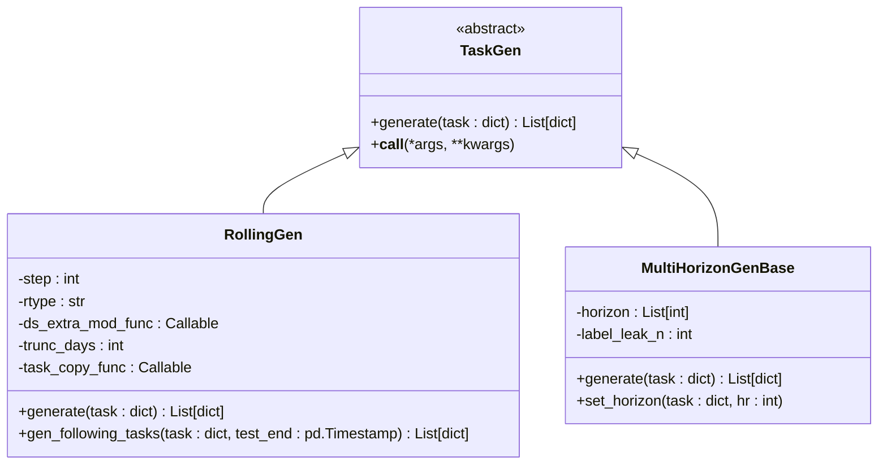
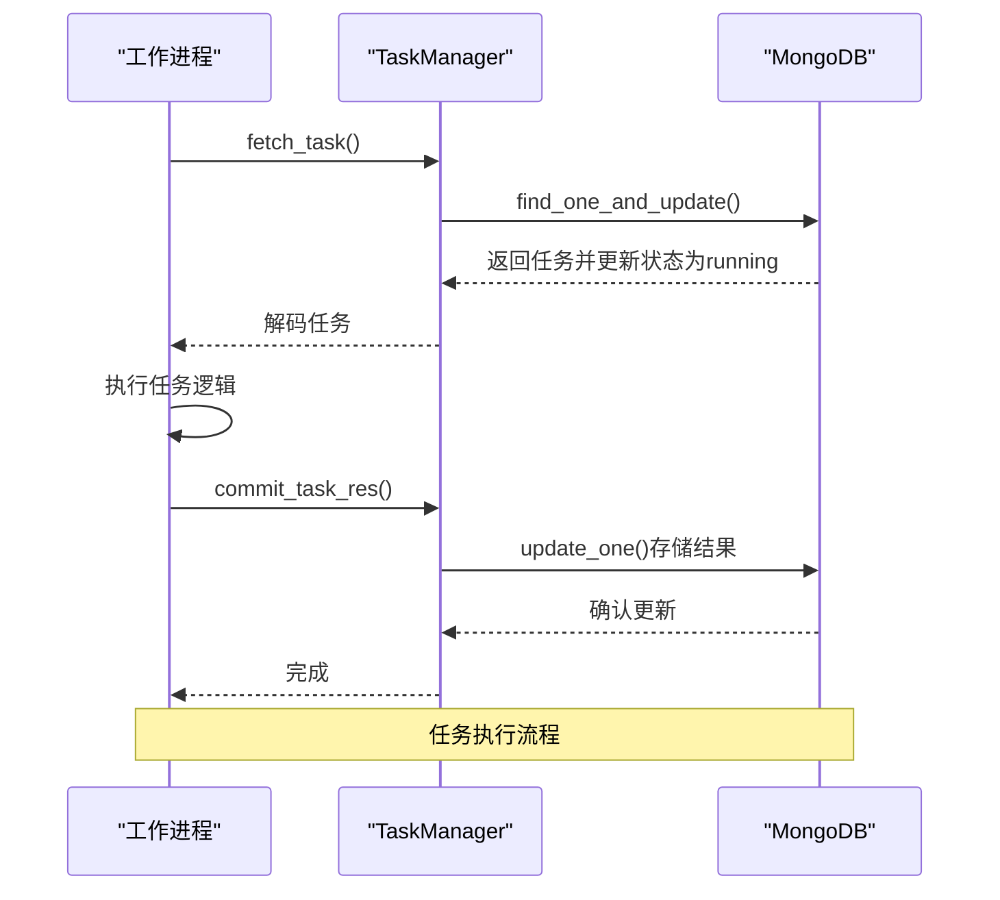
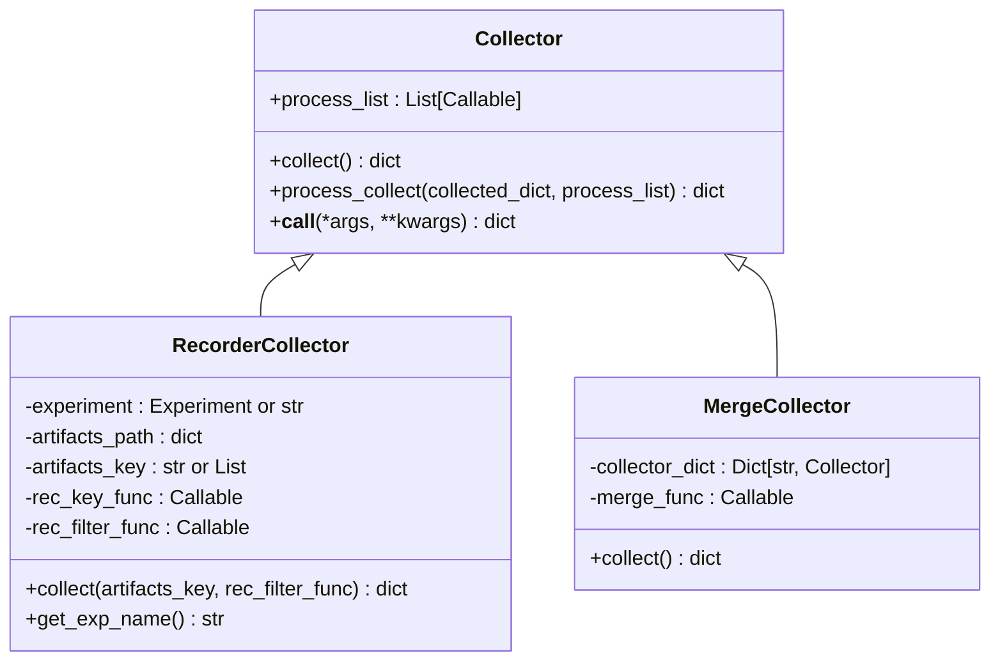
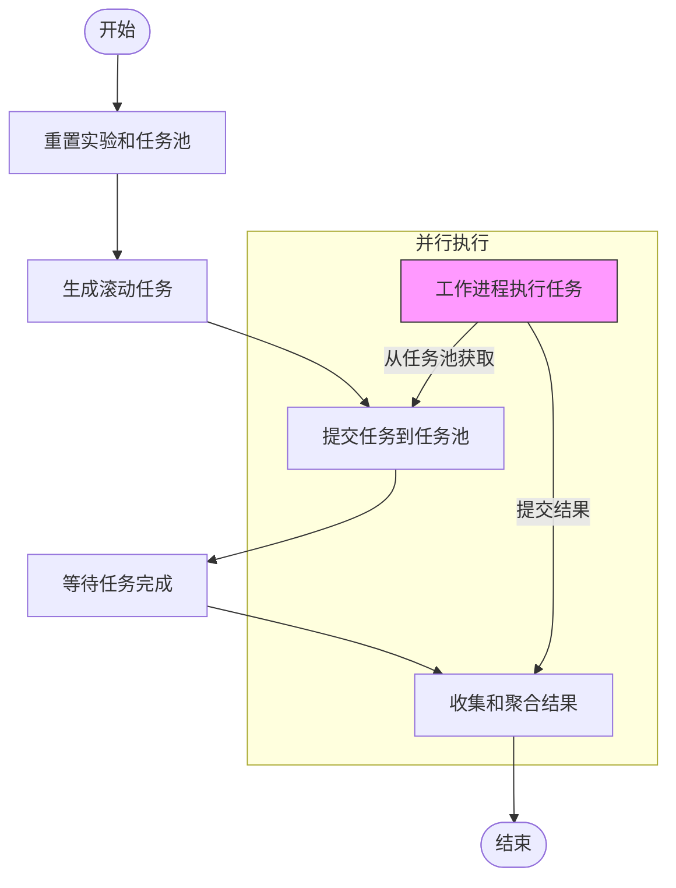

# 工作流任务调度

<cite>
**本文档中引用的文件**
- [gen.py](file://qlib/workflow/task/gen.py)
- [manage.py](file://qlib/workflow/task/manage.py)
- [collect.py](file://qlib/workflow/task/collect.py)
- [task_manager_rolling.py](file://examples/model_rolling/task_manager_rolling.py)
- [utils.py](file://qlib/workflow/task/utils.py)
</cite>

## 目录
1. [简介](#简介)
2. [任务生成机制](#任务生成机制)
3. [任务执行与协调](#任务执行与协调)
4. [分布式结果聚合](#分布式结果聚合)
5. [滚动任务管理示例](#滚动任务管理示例)
6. [关键技术细节](#关键技术细节)
7. [性能优化建议](#性能优化建议)

## 简介
Qlib工作流系统提供了一套完整的任务编排解决方案，支持大规模模型迭代场景下的回测、训练和预测等多种工作负载。该系统通过三个核心组件实现任务的全生命周期管理：`task/gen.py`负责根据配置生成任务单元，`manage.py`负责调度和协调任务执行，`collect.py`负责聚合分布式任务结果。本文档将详细阐述这三个组件的工作原理，并结合model_rolling中的滚动任务管理示例，展示系统的任务编排能力。

**Section sources**
- [gen.py](file://qlib/workflow/task/gen.py#L1-L352)
- [manage.py](file://qlib/workflow/task/manage.py#L1-L557)
- [collect.py](file://qlib/workflow/task/collect.py#L1-L259)

## 任务生成机制
`task/gen.py`模块提供了灵活的任务生成框架，其核心是`TaskGen`抽象基类和具体的生成器实现。`task_generator`函数作为主要入口点，接受任务模板列表和任务生成器列表，通过组合方式生成最终的任务集合。每个`TaskGen`子类都实现了`generate`方法，用于基于给定的任务模板生成一系列新任务。

其中，`RollingGen`是最常用的生成器之一，专门用于创建滚动时间窗口任务。它支持两种滚动模式：ROLL_EX（固定起始日期，扩展结束日期）和ROLL_SD（固定时间段大小，滑动窗口）。在生成过程中，`RollingGen`会自动调整数据集的时间段分割，并处理未来信息泄露问题。此外，`MultiHorizonGenBase`基类可用于生成不同预测周期的任务，满足多步预测的需求。

**Diagram sources**

**Diagram sources**
- [gen.py](file://qlib/workflow/task/gen.py#L50-L301)

**Section sources**
- [gen.py](file://qlib/workflow/task/gen.py#L1-L352)

## 任务执行与协调
`manage.py`模块实现了基于MongoDB的分布式任务管理系统`TaskManager`，负责任务的生命周期管理和并发执行协调。每个任务在系统中都有四种状态：等待（waiting）、运行中（running）、部分完成（part_done）和已完成（done）。`TaskManager`利用MongoDB的原子操作特性确保任务的安全获取和更新，避免了多个进程或机器同时处理同一任务的问题。

`run_task`函数是任务执行的核心，它在一个循环中持续从任务池中获取待处理任务，调用指定的处理函数执行任务，并将结果提交回系统。该过程包含异常处理机制，在发生错误时会自动将任务状态恢复为原始状态，保证系统的健壮性。此外，`TaskManager`还提供了优先级设置、任务统计和等待完成等辅助功能，便于监控和管理大规模任务队列。

**Diagram sources**
- [manage.py](file://qlib/workflow/task/manage.py#L32-L548)

**Section sources**
- [manage.py](file://qlib/workflow/task/manage.py#L1-L557)

## 分布式结果聚合
`collect.py`模块提供了强大的结果收集和处理能力，其核心是`Collector`基类及其各种实现。`Collector`不仅能够从不同来源收集结果，还能通过`process_list`参数指定的一系列处理器对收集到的数据进行后续处理，如分组、集成等操作。

`RecorderCollector`是最重要的具体实现之一，它可以从指定实验中收集所有记录器（Recorder）的产物，如预测值、IC分析结果等。用户可以通过`rec_key_func`自定义键生成函数，通过`rec_filter_func`过滤特定条件的记录器。`MergeCollector`则允许合并多个收集器的结果，形成更复杂的收集结构。这些收集器的设计使得结果聚合过程既灵活又高效，特别适合处理大规模分布式任务产生的海量结果数据。

**Diagram sources**
- [collect.py](file://qlib/workflow/task/collect.py#L18-L86)

**Section sources**
- [collect.py](file://qlib/workflow/task/collect.py#L1-L259)

## 滚动任务管理示例
`examples/model_rolling/task_manager_rolling.py`文件展示了如何使用Qlib的工作流系统进行滚动任务管理的完整示例。该示例首先初始化一个`RollingTaskExample`类，配置必要的参数如数据路径、MongoDB连接信息、实验名称等。然后通过`task_generating`方法使用`RollingGen`生成一系列滚动时间窗口任务。

接下来，`task_training`方法使用`TrainerRM`将这些任务提交到任务池中等待执行。对于分布式环境，可以在其他进程或机器上运行`worker`方法来实际执行任务。最后，`task_collecting`方法使用`RecorderCollector`收集所有完成任务的结果，并通过`RollingGroup`对相同模型的不同滚动周期结果进行集成处理。这个端到端的示例清晰地展示了Qlib工作流系统的强大能力和易用性。

**Diagram sources**

**Diagram sources**
- [task_manager_rolling.py](file://examples/model_rolling/task_manager_rolling.py#L1-L117)

**Section sources**
- [task_manager_rolling.py](file://examples/model_rolling/task_manager_rolling.py#L1-L117)

## 关键技术细节
Qlib工作流系统在设计上考虑了多种关键技术挑战。首先是任务依赖管理，虽然系统本身不直接支持复杂的任务依赖图，但通过合理设计任务生成逻辑和状态转换，可以实现简单的前后依赖关系。其次是失败重试策略，系统通过`safe_fetch_task`上下文管理器实现了优雅的错误处理机制，当任务执行失败时会自动恢复任务状态，允许后续重新尝试。

资源隔离方面，系统通过MongoDB实现了天然的资源共享和隔离机制，不同的任务池可以完全独立运行，而同一个任务池内的任务则共享资源但互不影响。并行化处理能力是系统的另一大亮点，`TrainerRM`结合`TaskManager`可以轻松实现跨进程、跨机器的分布式任务执行，极大地提高了大规模模型迭代的效率。

**Section sources**
- [manage.py](file://qlib/workflow/task/manage.py#L32-L548)
- [gen.py](file://qlib/workflow/task/gen.py#L140-L301)
- [collect.py](file://qlib/workflow/task/collect.py#L18-L86)

## 性能优化建议
为了最大化任务吞吐量和可靠性，建议采取以下配置策略：首先，合理设置MongoDB的索引，特别是对任务池集合中的`status`字段建立索引，可以显著提高任务查询和更新的性能。其次，根据计算资源情况调整`run_task`的并发级别，避免过度占用系统资源导致性能下降。

对于大规模任务队列，建议启用`TrainerRM`的延迟训练模式，先批量提交所有任务定义，然后启动多个工作进程并行处理，这样可以充分利用分布式计算的优势。在结果收集阶段，应尽量减少不必要的数据传输，通过精心设计的`rec_filter_func`只收集需要的结果。最后，定期清理已完成任务的历史数据，保持任务池的轻量化，有助于维持系统的长期稳定运行。

**Section sources**
- [manage.py](file://qlib/workflow/task/manage.py#L482-L548)
- [collect.py](file://qlib/workflow/task/collect.py#L18-L86)
- [gen.py](file://qlib/workflow/task/gen.py#L1-L352)