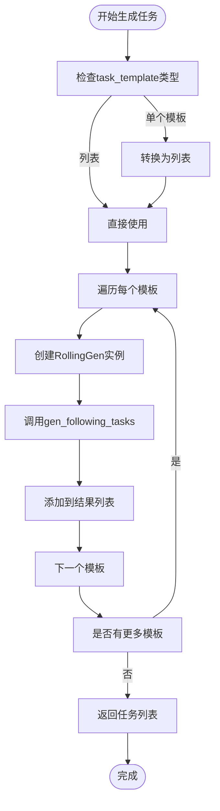

# 工作流管理

<cite>
**本文档中引用的文件**  
- [run_all_model.py](file://examples/run_all_model.py)
- [exp.py](file://qlib/workflow/exp.py)
- [recorder.py](file://qlib/workflow/recorder.py)
- [manager.py](file://qlib/workflow/online/manager.py)
- [strategy.py](file://qlib/workflow/online/strategy.py)
- [update.py](file://qlib/workflow/online/update.py)
- [rolling_online_management.py](file://examples/online_srv/rolling_online_management.py)
</cite>

## 目录
1. [引言](#引言)
2. [实验与记录器机制](#实验与记录器机制)
3. [MLflow集成与追踪系统](#mlflow集成与追踪系统)
4. [在线服务模块分析](#在线服务模块分析)
5. [批量模型工作流组织](#批量模型工作流组织)
6. [记录器生命周期与资产管理](#记录器生命周期与资产管理)
7. [分布式任务调度](#分布式任务调度)
8. [生产级部署最佳实践](#生产级部署最佳实践)
9. [监控方案](#监控方案)
10. [结论](#结论)

## 引言
本文档全面阐述了Qlib框架中的实验管理和工作流自动化系统的运作机制。重点解释了Experiment和Recorder如何与MLflow集成以实现完整的实验追踪、指标记录和模型版本管理。详细描述了在线服务模块（online/）如何支持模型的滚动更新、预测服务部署和实时推理。通过run_all_model.py示例说明了批量运行多个模型工作流的组织方式。涵盖了记录器生命周期、资产保存、元数据管理以及分布式任务调度等关键方面，并提供了生产级部署的最佳实践和监控方案。

## 实验与记录器机制

### Experiment类架构
`Experiment`类是每个实验运行的核心容器，其API设计类似于MLflow。该类负责管理实验的整个生命周期，包括创建、启动、结束和查询记录器。每个实验实例包含唯一的ID和名称，并维护一个活动记录器（active_recorder），确保同一时间只有一个记录器处于运行状态。


**图源**
- [exp.py](file://qlib/workflow/exp.py#L14-L239)

### Recorder类架构
`Recorder`类用于记录实验过程中的各种信息，包括参数、指标、标签和工件。它是实验追踪的基本单元，支持多种状态（SCHEDULED, RUNNING, FINISHED, FAILED）。每个记录器关联到一个特定的实验，并通过唯一的ID进行标识。


**图源**
- [recorder.py](file://qlib/workflow/recorder.py#L27-L243)

**本节来源**
- [exp.py](file://qlib/workflow/exp.py#L14-L239)
- [recorder.py](file://qlib/workflow/recorder.py#L27-L243)

## MLflow集成与追踪系统

### MLflow实验管理器
Qlib通过`MLflowExpManager`实现了与MLflow的深度集成。在初始化时，可以通过配置指定使用MLflow作为实验管理后端：

```python
qlib.init(
    exp_manager={
        "class": "MLflowExpManager",
        "module_path": "qlib.workflow.expm",
        "kwargs": {
            "uri": "file:" + str(Path(os.getcwd()).resolve() / exp_folder_name),
            "default_exp_name": "Experiment",
        },
    }
)
```

这种集成允许将所有实验数据存储在本地文件系统或远程服务器上，支持跨团队协作和结果复现。

### 指标与参数记录流程
当调用`log_metrics`或`log_params`方法时，MLflowRecorder会异步地将数据发送到MLflow服务器。这通过`AsyncCaller`装饰器实现，提高了系统的响应速度：


**图源**
- [recorder.py](file://qlib/workflow/recorder.py#L132-L141)

### 工件存储与加载
`save_objects`方法支持将模型检查点、预测文件等重要资产保存到指定位置。系统支持两种模式：直接保存本地路径或通过关键字参数传递对象。


**图源**
- [recorder.py](file://qlib/workflow/recorder.py#L73-L87)

**本节来源**
- [exp.py](file://qlib/workflow/exp.py#L43-L60)
- [recorder.py](file://qlib/workflow/recorder.py#L104-L113)
- [recorder.py](file://qlib/workflow/recorder.py#L115-L119)

## 在线服务模块分析

### OnlineManager核心功能
`OnlineManager`负责管理一组"在线策略"并动态执行它们。它支持四种不同的训练场景组合：

| 场景 | 描述 |
|------|------|
| 在线 + Trainer | 实时交易中，Trainer帮助训练模型，按任务和策略顺序进行 |
| 在线 + DelayTrainer | 延迟训练器会跳过具体训练直到所有任务准备完毕，适合并行训练 |
| 模拟 + Trainer | 与"在线 + Trainer"行为相同，但用于回测而非实盘交易 |
| 模拟 + DelayTrainer | 当模型没有时间依赖性时，可利用DelayTrainer实现多任务能力 |


**图源**
- [manager.py](file://qlib/workflow/online/manager.py#L145-L382)
- [strategy.py](file://qlib/workflow/online/strategy.py#L100-L208)

### 滚动策略实现
`RollingStrategy`是一个具体的在线策略实现，总是使用最新的滚动模型作为在线模型。它基于`RollingGen`生成器来创建不同时间段的任务。


**图源**
- [strategy.py](file://qlib/workflow/online/strategy.py#L100-L208)

### 预测更新机制
`PredUpdater`类负责在股票数据更新时更新预测结果。它基于Qlib Dataset提供数据集级别的更新功能。


**图源**
- [update.py](file://qlib/workflow/online/update.py#L200-L298)

**本节来源**
- [manager.py](file://qlib/workflow/online/manager.py#L145-L382)
- [strategy.py](file://qlib/workflow/online/strategy.py#L100-L208)
- [update.py](file://qlib/workflow/online/update.py#L200-L298)

## 批量模型工作流组织

### run_all_model.py整体架构
`run_all_model.py`脚本提供了一个完整的批量模型工作流组织框架，支持多种运行模式和参数配置。


**图源**
- [run_all_model.py](file://examples/run_all_model.py#L1-L403)

### 运行流程控制
脚本的运行流程遵循严格的环境隔离原则，为每个模型创建独立的conda环境以避免依赖冲突。


**图源**
- [run_all_model.py](file://examples/run_all_model.py#L1-L403)

### 结果收集与展示
结果收集过程包括检索已完成的实验记录、计算统计指标和生成可视化报告。


**图源**
- [run_all_model.py](file://examples/run_all_model.py#L1-L403)

**本节来源**
- [run_all_model.py](file://examples/run_all_model.py#L1-L403)

## 记录器生命周期与资产管理

### 生命周期管理
记录器的完整生命周期包括创建、启动、记录、结束四个阶段，每个阶段都有明确的状态转换规则。


**图源**
- [recorder.py](file://qlib/workflow/recorder.py#L27-L243)

### 资产保存策略
系统采用分层的资产保存策略，区分不同类型的数据存储需求。

| 资产类型 | 存储方式 | 访问方式 | 备注 |
|---------|--------|--------|------|
| 模型参数 | pickle序列化 | load_object("params.pkl") | 包含完整模型状态 |
| 数据集配置 | 序列化存储 | load_object("dataset") | 可重新构建数据集 |
| 预测结果 | pandas DataFrame | load_object("pred.pkl") | 多级索引结构 |
| 任务配置 | 序列化存储 | load_object("task") | 完整的任务定义 |
| 自定义工件 | 直接保存 | log_artifact() | 支持任意文件 |

**本节来源**
- [recorder.py](file://qlib/workflow/recorder.py#L73-L87)

## 分布式任务调度

### 任务生成机制
系统通过`task_generator`和`RollingGen`协同工作来生成滚动任务序列。



**本节来源**
- [strategy.py](file://qlib/workflow/online/strategy.py#L100-L208)

### 并行训练支持
通过`DelayTrainer`机制实现延迟训练，支持大规模并行处理。


**本节来源**
- [rolling_online_management.py](file://examples/online_srv/rolling_online_management.py#L1-L144)

## 生产级部署最佳实践

### 环境隔离
建议为每个模型创建独立的conda环境，避免依赖冲突：

```bash