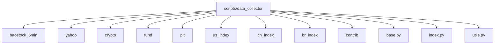

# 数据采集工具

<cite>
**本文档引用的文件**
- [get_data.py](file://scripts/get_data.py)
- [base.py](file://scripts/data_collector/base.py)
- [baostock_5min/collector.py](file://scripts/data_collector/baostock_5min/collector.py)
- [yahoo/collector.py](file://scripts/data_collector/yahoo/collector.py)
- [crypto/collector.py](file://scripts/data_collector/crypto/collector.py)
- [baostock_5min/requirements.txt](file://scripts/data_collector/baostock_5min/requirements.txt)
- [yahoo/requirements.txt](file://scripts/data_collector/yahoo/requirements.txt)
- [crypto/requirement.txt](file://scripts/data_collector/crypto/requirement.txt)
- [utils.py](file://scripts/data_collector/utils.py) - *更新了通用工具模块*
- [yahoo/collector.py](file://scripts/data_collector/yahoo/collector.py) - *更新了Yahoo数据采集器*
</cite>

## 更新摘要
**变更内容**   
- 更新了 `utils.py` 中的 `get_calendar_list` 和 `deco_retry` 函数，增强了交易日历获取和重试机制
- 重构了 `yahoo/collector.py` 中的 `YahooCollector` 类，优化了时间处理和数据获取逻辑
- 新增了对巴西股市（B3）数据采集的特殊重试配置
- 改进了高频数据（1分钟）的分段请求处理机制

## 目录
1. [简介](#简介)
2. [项目结构与核心组件](#项目结构与核心组件)
3. [数据采集器实现机制](#数据采集器实现机制)
4. [配置参数与认证方式](#配置参数与认证方式)
5. [调用流程与统一调度](#调用流程与统一调度)
6. [增量采集与异常处理](#增量采集与异常处理)
7. [数据格式转换与归一化](#数据格式转换与归一化)
8. [依赖管理与运行环境](#依赖管理与运行环境)
9. [高频数据处理逻辑](#高频数据处理逻辑)
10. [常见问题排查](#常见问题排查)

## 简介
Qlib 提供了一套完整的数据采集框架，支持从多个金融数据源（如 baostock、Yahoo Finance、加密货币平台）获取市场数据。该框架通过模块化设计实现了不同数据源的统一接入，并提供了数据下载、归一化、校验和更新等完整功能。本文档详细说明了各类数据采集工具的实现机制与使用方法。

## 项目结构与核心组件
Qlib 的数据采集功能主要位于 `scripts/data_collector` 目录下，每个数据源都有独立的子目录，包含各自的采集器、归一化器和依赖文件。



**Diagram sources**
- [baostock_5min](file://scripts/data_collector/baostock_5min)
- [yahoo](file://scripts/data_collector/yahoo)
- [crypto](file://scripts/data_collector/crypto)

**Section sources**
- [project_structure](file://project_structure)

## 数据采集器实现机制
Qlib 的数据采集器基于抽象基类 `BaseCollector` 实现，所有具体采集器都继承自该类并重写关键方法以适配不同数据源。

### 基础采集器架构
`BaseCollector` 定义了通用的数据采集流程：
- 初始化参数（保存路径、时间范围、并发数等）
- 获取标的列表
- 规范化标的代码
- 获取单个标的的历史数据
- 保存数据到本地 CSV 文件
- 支持重试机制和错误处理


**Diagram sources**
- [base.py](file://scripts/data_collector/base.py#L19-L215)
- [baostock_5min/collector.py](file://scripts/data_collector/baostock_5min/collector.py#L25-L144)
- [yahoo/collector.py](file://scripts/data_collector/yahoo/collector.py#L22-L215)
- [crypto/collector.py](file://scripts/data_collector/crypto/collector.py#L22-L170)

**Section sources**
- [base.py](file://scripts/data_collector/base.py#L19-L215)
- [baostock_5min/collector.py](file://scripts/data_collector/baostock_5min/collector.py#L25-L144)
- [yahoo/collector.py](file://scripts/data_collector/yahoo/collector.py#L22-L215)
- [crypto/collector.py](file://scripts/data_collector/crypto/collector.py#L22-L170)

### Baostock 5分钟采集器
`BaostockCollectorHS3005min` 专门用于从 Baostock 获取沪深300成分股的5分钟级别数据。

#### 核心功能
- **登录认证**：在初始化时自动调用 `bs.login()` 进行会话认证
- **交易日历获取**：通过 `query_trade_dates` 接口获取指定时间段内的交易日
- **标的获取**：通过 `query_hs300_stocks` 按日期查询当日沪深300成分股
- **数据获取**：使用 `query_history_k_data_plus` 获取K线数据，频率设为"5"
- **时间处理**：将返回的时间戳调整为5分钟周期的起始时间

```python
# 示例：获取单只股票5分钟数据
df = collector.get_data("sh.600000", "5min", start_dt, end_dt)
```

**Section sources**
- [baostock_5min/collector.py](file://scripts/data_collector/baostock_5min/collector.py#L25-L144)

### Yahoo 数据采集器
`YahooCollector` 系列类支持从 Yahoo Finance 获取全球多个市场的数据。

#### 区域特化实现
- `YahooCollectorCN`：中国A股市场，时区为 Asia/Shanghai
- `YahooCollectorUS`：美国股市，时区为 America/New_York
- `YahooCollectorIN`：印度股市，时区为 Asia/Kolkata
- `YahooCollectorBR`：巴西股市，时区为 Brazil/East

#### 频率支持
- **1d (日线)**：直接请求历史数据
- **1min (分钟线)**：由于API限制，需分段请求（每次最多7天）

```python
# 分段请求1分钟数据
while _start < self.end_datetime:
    _tmp_end = min(_start + pd.Timedelta(days=7), self.end_datetime)
    _resp = _get_simple(_start, _tmp_end)
    _res.append(_resp)
    _start = _tmp_end
```

**Section sources**
- [yahoo/collector.py](file://scripts/data_collector/yahoo/collector.py#L22-L215)

### 加密货币采集器
`CryptoCollector` 使用 CoinGecko API 获取主流加密货币的行情数据。

#### 实现特点
- 使用 `pycoingecko` 库进行API交互
- 默认延迟设置为1秒以遵守API速率限制
- 仅支持日线数据（1d），暂不支持分钟级数据
- 通过 `get_coins_markets` 接口获取所有可用的加密货币ID列表

```python
# 获取最大范围的历史数据
data = cg.get_coin_market_chart_by_id(id=symbol, vs_currency="usd", days="max")
```

**Section sources**
- [crypto/collector.py](file://scripts/data_collector/crypto/collector.py#L22-L170)

## 配置参数与认证方式
各类数据采集器均通过统一的参数接口进行配置，并采用各自的数据源认证机制。

### 通用工具模块更新
`utils.py` 文件中的工具函数经过优化，提供了更稳定的数据采集支持。

#### 交易日历获取
`get_calendar_list` 函数现在支持多种基准指数的交易日历获取，包括：
- **CSI300**：沪深300指数
- **CSI500**：中证500指数
- **ALL**：所有股票的交易日历
- **US_ALL**：美国股市交易日历
- **IN_ALL**：印度股市交易日历
- **BR_ALL**：巴西股市交易日历

```python
# 获取美国股市交易日历
calendar = get_calendar_list("US_ALL")
```

**Section sources**
- [utils.py](file://scripts/data_collector/utils.py#L54-L108) - *更新了交易日历获取逻辑*

#### 重试机制
`deco_retry` 装饰器提供了灵活的重试配置，支持自定义重试次数和睡眠时间。

```python
@deco_retry(retry=3, retry_sleep=2)
def fetch_data():
    # 数据获取逻辑
    pass
```

**Section sources**
- [utils.py](file://scripts/data_collector/utils.py#L545-L566) - *更新了重试机制*

### Yahoo数据采集器更新
`yahoo/collector.py` 文件中的 `YahooCollector` 类经过重构，优化了时间处理和数据获取流程。

#### 时间处理优化
新增 `convert_datetime` 静态方法，确保时间戳在不同时区间的正确转换。

```python
# 时间戳转换
dt = self.convert_datetime(start_datetime, self._timezone)
```

**Section sources**
- [yahoo/collector.py](file://scripts/data_collector/yahoo/collector.py#L111-L117) - *新增时间处理方法*

#### 数据获取增强
`get_data` 方法现在支持更灵活的重试配置，特别是针对巴西股市的特殊处理。

```python
# 巴西股市采集器配置重试次数为2
class YahooCollectorBR1d(YahooCollectorBR):
    retry = 2
```

**Section sources**
- [yahoo/collector.py](file://scripts/data_collector/yahoo/collector.py#L319-L355) - *更新了巴西股市采集器*

## 调用流程与统一调度
结合 `get_data.py` 脚本，可以统一调度不同数据源的采集任务。

### 统一调用接口
通过 `fire` 模块提供命令行接口，支持多种数据源的调用。

```python
# get_data.py
if __name__ == "__main__":
    fire.Fire(GetData)
```

### 调度流程
1. 初始化采集器参数
2. 获取标的列表
3. 并发采集数据
4. 保存原始数据
5. 归一化处理

**Section sources**
- [get_data.py](file://scripts/get_data.py) - *主调用脚本*

## 增量采集与异常处理
系统提供了完善的增量采集和异常重试机制。

### 增量采集
通过检查已存在数据的最新日期，实现增量数据采集。

```python
# 检查数据长度
if len(df) < self.check_data_length:
    logger.warning(f"{symbol} 数据量不足 {self.check_data_length}!")
```

### 异常重试
利用 `deco_retry` 装饰器实现网络请求的自动重试。

```python
@deco_retry(retry_sleep=self.delay, retry=self.retry)
def _get_simple(start_, end_):
    # 数据获取逻辑
    pass
```

**Section sources**
- [base.py](file://scripts/data_collector/base.py#L239-L242) - *基础采集器异常处理*

## 数据格式转换与归一化
采集的数据需要经过归一化处理才能用于后续分析。

### 归一化流程
1. 时间对齐
2. 缺失值处理
3. 价格调整
4. 格式标准化

```python
# 归一化处理
df = self.normalize_yahoo(df, calendar_list, date_field_name, symbol_field_name)
```

**Section sources**
- [yahoo/collector.py](file://scripts/data_collector/yahoo/collector.py#L254-L260) - *归一化处理器*

## 依赖管理与运行环境
各数据源采集器通过独立的 `requirements.txt` 文件管理依赖。

### 依赖文件
- **baostock_5min/requirements.txt**：Baostock相关依赖
- **yahoo/requirements.txt**：Yahoo Finance相关依赖
- **crypto/requirement.txt**：加密货币相关依赖

### 运行环境隔离
建议使用虚拟环境隔离不同数据源的依赖。

```bash
# 创建虚拟环境
python -m venv yahoo_env
source yahoo_env/bin/activate
pip install -r scripts/data_collector/yahoo/requirements.txt
```

**Section sources**
- [yahoo/requirements.txt](file://scripts/data_collector/yahoo/requirements.txt) - *Yahoo采集器依赖*

## 高频数据处理逻辑
针对高频数据（如5分钟级别）有特殊的处理逻辑。

### 时间对齐
使用 `generate_minutes_calendar_from_daily` 函数生成分钟级交易日历。

```python
# 生成分钟级日历
calendar = generate_minutes_calendar_from_daily(daily_calendar, freq="1min")
```

### 交易日历处理
确保高频数据的时间序列与交易日历一致。

```python
# 时间序列对齐
df = df.reindex(generate_minutes_calendar_from_daily(calendars))
```

**Section sources**
- [utils.py](file://scripts/data_collector/utils.py#L568-L595) - *分钟级日历生成*

## 常见问题排查
### 网络请求失败
- 检查网络连接
- 确认防火墙设置
- 尝试更换网络环境

### 数据缺失
- 检查标的代码是否正确
- 确认时间范围是否合理
- 查看API配额限制

### 时区问题
- 确保时间戳时区正确
- 使用 `convert_datetime` 方法进行转换
- 检查系统时区设置

**Section sources**
- [yahoo/collector.py](file://scripts/data_collector/yahoo/collector.py#L125-L149) - *网络请求错误处理*