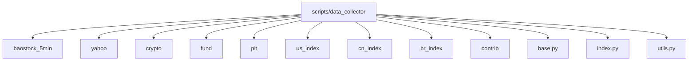
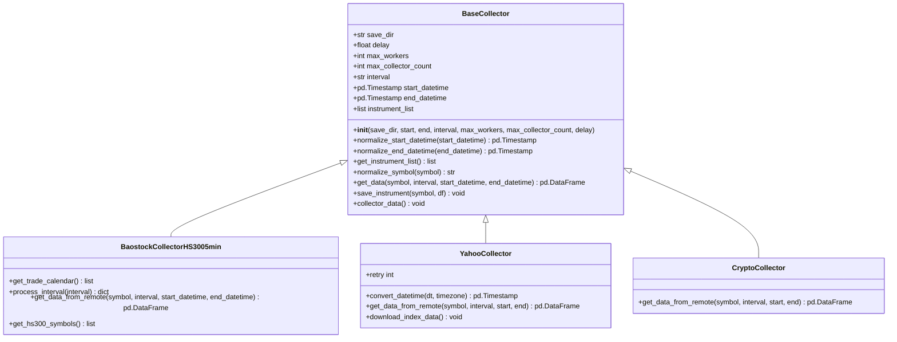

# 数据采集工具

<cite>
**本文档引用的文件**
- [get_data.py](file://scripts/get_data.py)
- [base.py](file://scripts/data_collector/base.py)
- [baostock_5min/collector.py](file://scripts/data_collector/baostock_5min/collector.py)
- [yahoo/collector.py](file://scripts/data_collector/yahoo/collector.py)
- [crypto/collector.py](file://scripts/data_collector/crypto/collector.py)
- [baostock_5min/requirements.txt](file://scripts/data_collector/baostock_5min/requirements.txt)
- [yahoo/requirements.txt](file://scripts/data_collector/yahoo/requirements.txt)
- [crypto/requirement.txt](file://scripts/data_collector/crypto/requirement.txt)
</cite>

## 目录
1. [简介](#简介)
2. [项目结构与核心组件](#项目结构与核心组件)
3. [数据采集器实现机制](#数据采集器实现机制)
4. [配置参数与认证方式](#配置参数与认证方式)
5. [调用流程与统一调度](#调用流程与统一调度)
6. [增量采集与异常处理](#增量采集与异常处理)
7. [数据格式转换与归一化](#数据格式转换与归一化)
8. [依赖管理与运行环境](#依赖管理与运行环境)
9. [高频数据处理逻辑](#高频数据处理逻辑)
10. [常见问题排查](#常见问题排查)

## 简介
Qlib 提供了一套完整的数据采集框架，支持从多个金融数据源（如 baostock、Yahoo Finance、加密货币平台）获取市场数据。该框架通过模块化设计实现了不同数据源的统一接入，并提供了数据下载、归一化、校验和更新等完整功能。本文档详细说明了各类数据采集工具的实现机制与使用方法。

## 项目结构与核心组件
Qlib 的数据采集功能主要位于 `scripts/data_collector` 目录下，每个数据源都有独立的子目录，包含各自的采集器、归一化器和依赖文件。



**Diagram sources**
- [baostock_5min](file://scripts/data_collector/baostock_5min)
- [yahoo](file://scripts/data_collector/yahoo)
- [crypto](file://scripts/data_collector/crypto)

**Section sources**
- [project_structure](file://project_structure)

## 数据采集器实现机制
Qlib 的数据采集器基于抽象基类 `BaseCollector` 实现，所有具体采集器都继承自该类并重写关键方法以适配不同数据源。

### 基础采集器架构
`BaseCollector` 定义了通用的数据采集流程：
- 初始化参数（保存路径、时间范围、并发数等）
- 获取标的列表
- 规范化标的代码
- 获取单个标的的历史数据
- 保存数据到本地 CSV 文件
- 支持重试机制和错误处理



**Diagram sources**
- [base.py](file://scripts/data_collector/base.py#L19-L215)
- [baostock_5min/collector.py](file://scripts/data_collector/baostock_5min/collector.py#L25-L144)
- [yahoo/collector.py](file://scripts/data_collector/yahoo/collector.py#L22-L215)
- [crypto/collector.py](file://scripts/data_collector/crypto/collector.py#L22-L170)

**Section sources**
- [base.py](file://scripts/data_collector/base.py#L19-L215)
- [baostock_5min/collector.py](file://scripts/data_collector/baostock_5min/collector.py#L25-L144)
- [yahoo/collector.py](file://scripts/data_collector/yahoo/collector.py#L22-L215)
- [crypto/collector.py](file://scripts/data_collector/crypto/collector.py#L22-L170)

### Baostock 5分钟采集器
`BaostockCollectorHS3005min` 专门用于从 Baostock 获取沪深300成分股的5分钟级别数据。

#### 核心功能
- **登录认证**：在初始化时自动调用 `bs.login()` 进行会话认证
- **交易日历获取**：通过 `query_trade_dates` 接口获取指定时间段内的交易日
- **标的获取**：通过 `query_hs300_stocks` 按日期查询当日沪深300成分股
- **数据获取**：使用 `query_history_k_data_plus` 获取K线数据，频率设为"5"
- **时间处理**：将返回的时间戳调整为5分钟周期的起始时间

```python
# 示例：获取单只股票5分钟数据
df = collector.get_data("sh.600000", "5min", start_dt, end_dt)
```

**Section sources**
- [baostock_5min/collector.py](file://scripts/data_collector/baostock_5min/collector.py#L25-L144)

### Yahoo 数据采集器
`YahooCollector` 系列类支持从 Yahoo Finance 获取全球多个市场的数据。

#### 区域特化实现
- `YahooCollectorCN`：中国A股市场，时区为 Asia/Shanghai
- `YahooCollectorUS`：美国股市，时区为 America/New_York
- `YahooCollectorIN`：印度股市，时区为 Asia/Kolkata
- `YahooCollectorBR`：巴西股市，时区为 Brazil/East

#### 频率支持
- **1d (日线)**：直接请求历史数据
- **1min (分钟线)**：由于API限制，需分段请求（每次最多7天）

```python
# 分段请求1分钟数据
while _start < self.end_datetime:
    _tmp_end = min(_start + pd.Timedelta(days=7), self.end_datetime)
    _resp = _get_simple(_start, _tmp_end)
    _res.append(_resp)
    _start = _tmp_end
```

**Section sources**
- [yahoo/collector.py](file://scripts/data_collector/yahoo/collector.py#L22-L215)

### 加密货币采集器
`CryptoCollector` 使用 CoinGecko API 获取主流加密货币的行情数据。

#### 实现特点
- 使用 `pycoingecko` 库进行API交互
- 默认延迟设置为1秒以遵守API速率限制
- 仅支持日线数据（1d），暂不支持分钟级数据
- 通过 `get_coins_markets` 接口获取所有可用的加密货币ID列表

```python
# 获取最大范围的历史数据
data = cg.get_coin_market_chart_by_id(id=symbol, vs_currency="usd", days="max")
```

**Section sources**
- [crypto/collector.py](file://scripts/data_collector/crypto/collector.py#L22-L170)

## 配置参数与认证方式
各类数据采集器均通过统一的参数接口进行配置，并采用各自的数据源认证机制。

###