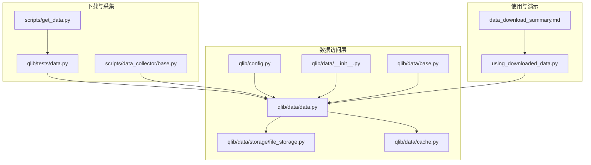
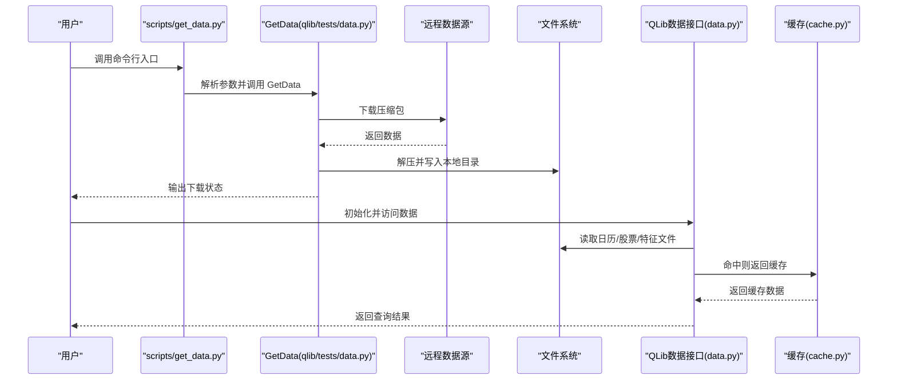
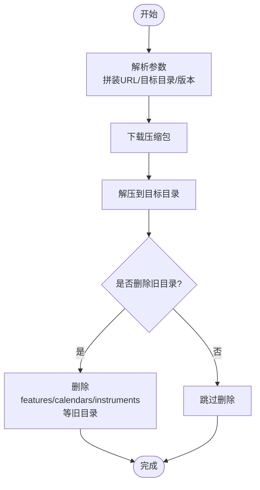
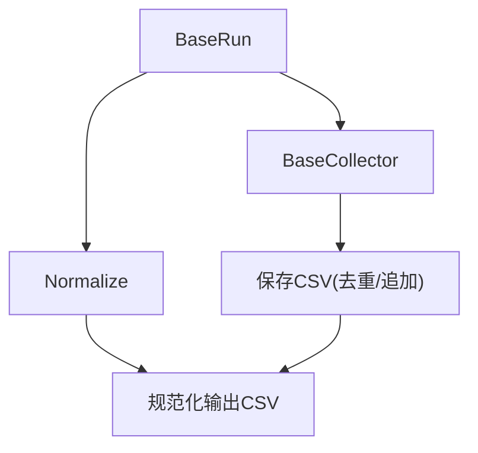
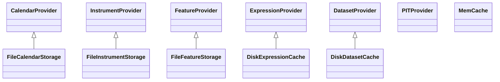
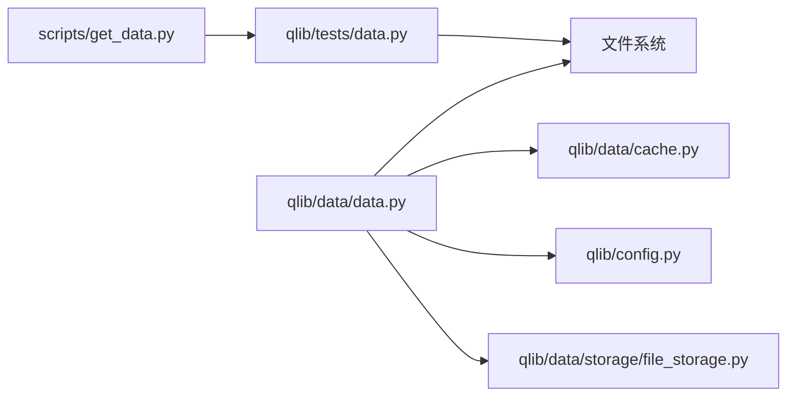

# 下载数据使用分析

<cite>
**本文引用的文件**
- [README.md](file://README.md)
- [using_downloaded_data.py](file://using_downloaded_data.py)
- [data_download_summary.md](file://data_download_summary.md)
- [scripts/get_data.py](file://scripts/get_data.py)
- [qlib/tests/data.py](file://qlib/tests/data.py)
- [scripts/data_collector/base.py](file://scripts/data_collector/base.py)
- [qlib/data/data.py](file://qlib/data/data.py)
- [qlib/data/client.py](file://qlib/data/client.py)
- [qlib/data/storage/file_storage.py](file://qlib/data/storage/file_storage.py)
- [qlib/data/cache.py](file://qlib/data/cache.py)
- [qlib/config.py](file://qlib/config.py)
- [qlib/data/__init__.py](file://qlib/data/__init__.py)
- [qlib/data/base.py](file://qlib/data/base.py)
</cite>

## 目录
1. [简介](#简介)
2. [项目结构](#项目结构)
3. [核心组件](#核心组件)
4. [架构总览](#架构总览)
5. [详细组件分析](#详细组件分析)
6. [依赖关系分析](#依赖关系分析)
7. [性能考量](#性能考量)
8. [故障排查指南](#故障排查指南)
9. [结论](#结论)
10. [附录](#附录)

## 简介
本文件围绕“下载数据使用分析”主题，系统梳理 QLib 项目中与数据下载、存储、访问与使用的相关能力与流程，重点覆盖：
- 数据下载入口与脚本
- 数据格式与标准化
- 本地数据访问与缓存机制
- 在线/离线模式下的数据服务
- 与 QLib 生态（初始化、数据接口、回测、模型）的集成方式

目标读者既包括需要快速上手数据下载与使用的用户，也包括希望深入理解数据层架构与性能优化的技术人员。

## 项目结构
与“下载数据使用”直接相关的目录与文件包括：
- scripts/data_collector：采集器基类与运行流程，支撑从网络源抓取并规范化数据
- scripts/get_data.py：命令行入口，封装 GetData 类，提供一键下载预置数据集
- qlib/tests/data.py：GetData 类的具体实现，负责远程下载、解压、清理旧数据
- qlib/data：数据访问层（Provider 抽象）、文件存储、缓存与客户端通信
- qlib/config.py：全局配置，包含 provider_uri、缓存策略、日志等
- using_downloaded_data.py 与 data_download_summary.md：演示如何使用已下载数据，并给出汇总说明

图表来源
- [scripts/get_data.py](file://scripts/get_data.py#L1-L10)
- [qlib/tests/data.py](file://qlib/tests/data.py#L1-L230)
- [scripts/data_collector/base.py](file://scripts/data_collector/base.py#L1-L440)
- [qlib/data/data.py](file://qlib/data/data.py#L1-L800)
- [qlib/data/storage/file_storage.py](file://qlib/data/storage/file_storage.py#L1-L453)
- [qlib/data/cache.py](file://qlib/data/cache.py#L1-L800)
- [qlib/config.py](file://qlib/config.py#L1-L558)
- [qlib/data/__init__.py](file://qlib/data/__init__.py#L1-L67)
- [qlib/data/base.py](file://qlib/data/base.py#L1-L296)
- [using_downloaded_data.py](file://using_downloaded_data.py#L1-L307)
- [data_download_summary.md](file://data_download_summary.md#L1-L217)

章节来源
- [README.md](file://README.md#L212-L292)
- [scripts/get_data.py](file://scripts/get_data.py#L1-L10)
- [qlib/tests/data.py](file://qlib/tests/data.py#L1-L230)
- [scripts/data_collector/base.py](file://scripts/data_collector/base.py#L1-L440)
- [qlib/data/data.py](file://qlib/data/data.py#L1-L800)
- [qlib/data/storage/file_storage.py](file://qlib/data/storage/file_storage.py#L1-L453)
- [qlib/data/cache.py](file://qlib/data/cache.py#L1-L800)
- [qlib/config.py](file://qlib/config.py#L1-L558)
- [qlib/data/__init__.py](file://qlib/data/__init__.py#L1-L67)
- [qlib/data/base.py](file://qlib/data/base.py#L1-L296)
- [using_downloaded_data.py](file://using_downloaded_data.py#L1-L307)
- [data_download_summary.md](file://data_download_summary.md#L1-L217)

## 核心组件
- 数据下载入口与远程数据管理
  - scripts/get_data.py：通过 fire 将 GetData 暴露为命令行入口，便于一键下载预置数据集
  - qlib/tests/data.py：GetData 类实现远程 URL 拼装、下载、解压、清理旧数据、版本选择等
- 数据采集与规范化
  - scripts/data_collector/base.py：BaseCollector 统一采集流程；Normalize 统一规范化流程；BaseRun 组合采集与规范化
- 数据访问层
  - qlib/data/data.py：Provider 抽象（Calendar/Instrument/Feature/Expression/Dataset/PIT），以及 D 接口
  - qlib/data/storage/file_storage.py：FileCalendarStorage/FileInstrumentStorage/FileFeatureStorage 等文件存储实现
  - qlib/data/cache.py：内存缓存、磁盘表达式/数据集缓存、Redis 锁与并发控制
  - qlib/config.py：provider_uri、缓存策略、日志、区域配置等
- 使用与演示
  - using_downloaded_data.py：演示 CSV 直接加载、统计分析、图表生成、与 QLib 接口对接
  - data_download_summary.md：汇总数据获取任务、格式、质量评估与集成建议

章节来源
- [scripts/get_data.py](file://scripts/get_data.py#L1-L10)
- [qlib/tests/data.py](file://qlib/tests/data.py#L1-L230)
- [scripts/data_collector/base.py](file://scripts/data_collector/base.py#L1-L440)
- [qlib/data/data.py](file://qlib/data/data.py#L1-L800)
- [qlib/data/storage/file_storage.py](file://qlib/data/storage/file_storage.py#L1-L453)
- [qlib/data/cache.py](file://qlib/data/cache.py#L1-L800)
- [qlib/config.py](file://qlib/config.py#L1-L558)
- [using_downloaded_data.py](file://using_downloaded_data.py#L1-L307)
- [data_download_summary.md](file://data_download_summary.md#L1-L217)

## 架构总览
下图展示从“下载数据”到“使用数据”的端到端流程，涵盖采集、存储、访问与缓存的关键节点。

图表来源
- [scripts/get_data.py](file://scripts/get_data.py#L1-L10)
- [qlib/tests/data.py](file://qlib/tests/data.py#L1-L230)
- [qlib/data/data.py](file://qlib/data/data.py#L1-L800)
- [qlib/data/cache.py](file://qlib/data/cache.py#L1-L800)

## 详细组件分析

### 数据下载与远程数据管理
- 命令行入口
  - scripts/get_data.py：将 GetData 作为 fire 入口，便于命令行一键下载
- GetData 实现
  - 远程 URL 拼装、下载、解压、清理旧目录、版本选择、存在性检测
  - 支持按地区/频率/版本下载预置数据集
- 使用建议
  - 可通过 exists_skip 避免重复下载
  - 支持删除旧目录并重新解压，确保数据一致性

图表来源
- [scripts/get_data.py](file://scripts/get_data.py#L1-L10)
- [qlib/tests/data.py](file://qlib/tests/data.py#L1-L230)

章节来源
- [scripts/get_data.py](file://scripts/get_data.py#L1-L10)
- [qlib/tests/data.py](file://qlib/tests/data.py#L1-L230)

### 数据采集与规范化
- BaseCollector
  - 统一采集流程：起止时间、并发、重试、增量合并、长度校验
  - 支持 1min/1d 频率，延迟控制，限制采集数量
- Normalize
  - 统一规范化流程：按列名、符号字段、结束日期过滤、并行处理
- BaseRun
  - 组合采集与规范化，提供 download_data/normalize_data 接口

图表来源
- [scripts/data_collector/base.py](file://scripts/data_collector/base.py#L1-L440)

章节来源
- [scripts/data_collector/base.py](file://scripts/data_collector/base.py#L1-L440)

### 数据访问层与缓存
- Provider 抽象
  - CalendarProvider/InstrumentProvider/FeatureProvider/ExpressionProvider/DatasetProvider/PITProvider
  - D 接口统一对外访问
- 文件存储
  - FileCalendarStorage/FileInstrumentStorage/FileFeatureStorage
  - 支持按频率读取、写入、索引与扩展
- 缓存机制
  - 内存缓存（MemCache/Expire）
  - 磁盘表达式/数据集缓存（DiskExpressionCache/DiskDatasetCache）
  - Redis 锁保障并发安全
- 配置
  - provider_uri、缓存开关、日志级别、区域配置等

图表来源
- [qlib/data/data.py](file://qlib/data/data.py#L1-L800)
- [qlib/data/storage/file_storage.py](file://qlib/data/storage/file_storage.py#L1-L453)
- [qlib/data/cache.py](file://qlib/data/cache.py#L1-L800)

章节来源
- [qlib/data/data.py](file://qlib/data/data.py#L1-L800)
- [qlib/data/storage/file_storage.py](file://qlib/data/storage/file_storage.py#L1-L453)
- [qlib/data/cache.py](file://qlib/data/cache.py#L1-L800)
- [qlib/config.py](file://qlib/config.py#L1-L558)

### 使用与演示
- using_downloaded_data.py
  - 加载 CSV、统计分析、生成图表、演示 QLib 使用方式
- data_download_summary.md
  - 任务完成情况、数据详情、生成文件、质量评估、集成建议

章节来源
- [using_downloaded_data.py](file://using_downloaded_data.py#L1-L307)
- [data_download_summary.md](file://data_download_summary.md#L1-L217)

## 依赖关系分析
- 组件耦合
  - scripts/get_data.py 依赖 qlib/tests/data.py 的 GetData 实现
  - qlib/data/data.py 依赖 storage 与 cache 模块
  - qlib/config.py 为全局配置中心，影响 provider_uri、缓存与日志
- 外部依赖
  - requests、pandas、numpy、joblib、loguru、tqdm 等
- 潜在风险
  - 网络不稳定导致下载失败
  - 缓存一致性与并发写入冲突
  - provider_uri 路径解析错误导致数据不可见

图表来源
- [scripts/get_data.py](file://scripts/get_data.py#L1-L10)
- [qlib/tests/data.py](file://qlib/tests/data.py#L1-L230)
- [qlib/data/data.py](file://qlib/data/data.py#L1-L800)
- [qlib/data/cache.py](file://qlib/data/cache.py#L1-L800)
- [qlib/config.py](file://qlib/config.py#L1-L558)
- [qlib/data/storage/file_storage.py](file://qlib/data/storage/file_storage.py#L1-L453)

章节来源
- [scripts/get_data.py](file://scripts/get_data.py#L1-L10)
- [qlib/tests/data.py](file://qlib/tests/data.py#L1-L230)
- [qlib/data/data.py](file://qlib/data/data.py#L1-L800)
- [qlib/data/cache.py](file://qlib/data/cache.py#L1-L800)
- [qlib/config.py](file://qlib/config.py#L1-L558)
- [qlib/data/storage/file_storage.py](file://qlib/data/storage/file_storage.py#L1-L453)

## 性能考量
- 下载与解压
  - 使用进度条与分块下载，降低内存占用
  - 解压时可选择删除旧目录，避免冗余数据
- 采集与规范化
  - 并行采集与并行规范化，提升吞吐
  - 增量合并与长度校验，减少无效请求
- 数据访问与缓存
  - 内存缓存与磁盘缓存双层缓存，命中后直接返回
  - Redis 锁保障并发安全，避免竞态
- 配置优化
  - kernels、缓存大小、日志级别等可通过配置调整

章节来源
- [qlib/tests/data.py](file://qlib/tests/data.py#L1-L230)
- [scripts/data_collector/base.py](file://scripts/data_collector/base.py#L1-L440)
- [qlib/data/cache.py](file://qlib/data/cache.py#L1-L800)
- [qlib/config.py](file://qlib/config.py#L1-L558)

## 故障排查指南
- 下载失败
  - 检查网络连通性与远程 URL 可用性
  - 使用 exists_skip 避免重复下载
- 解压失败
  - 确认目标目录权限与磁盘空间
  - 如需清理旧数据，确认删除操作提示
- 数据不可见
  - 检查 provider_uri 是否正确解析
  - 确认文件存储路径与频率匹配
- 缓存问题
  - 检查 Redis 连接状态
  - 清理损坏缓存或禁用缓存进行对比
- 并发冲突
  - 关注 Redis 锁状态，必要时重试或关闭并发

章节来源
- [qlib/tests/data.py](file://qlib/tests/data.py#L1-L230)
- [qlib/data/cache.py](file://qlib/data/cache.py#L1-L800)
- [qlib/config.py](file://qlib/config.py#L1-L558)

## 结论
- QLib 提供了从“下载/采集/规范化”到“本地存储/访问/缓存”的完整链路
- 通过 scripts/get_data.py 与 GetData，用户可以一键下载预置数据集
- 通过 data_collector/base.py，用户可自定义采集与规范化流程
- 通过 data.py、storage/file_storage.py、cache.py 与 config.py，构建了高性能、可扩展的数据访问与缓存体系
- using_downloaded_data.py 与 data_download_summary.md 为数据使用与集成提供了清晰示例与建议

## 附录
- 快速开始
  - 使用命令行下载数据：参见 README 的数据准备与自动更新说明
  - 直接加载 CSV 并进行分析：参见 using_downloaded_data.py
  - 集成到 QLib 生态：参见 data_download_summary.md 的集成建议

章节来源
- [README.md](file://README.md#L212-L292)
- [using_downloaded_data.py](file://using_downloaded_data.py#L1-L307)
- [data_download_summary.md](file://data_download_summary.md#L1-L217)