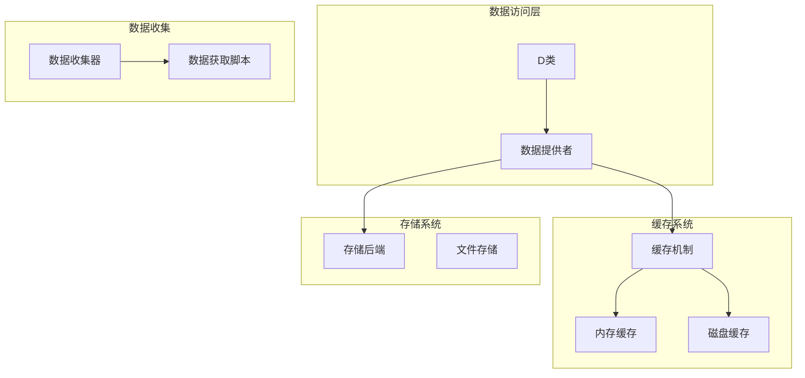
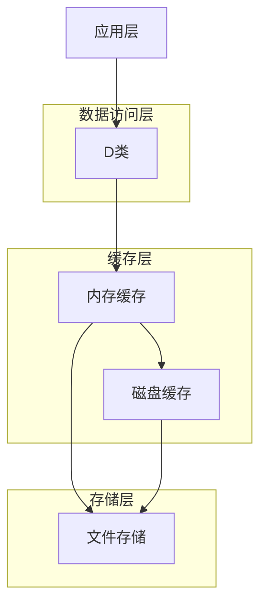
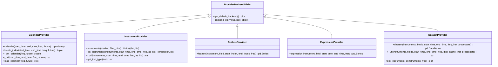
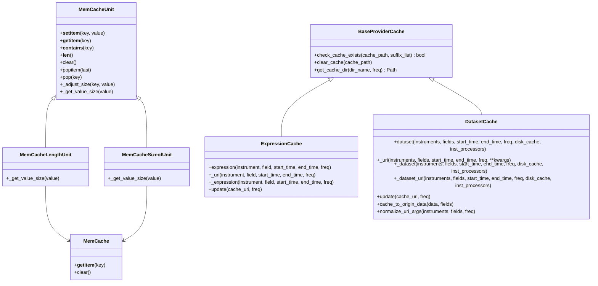
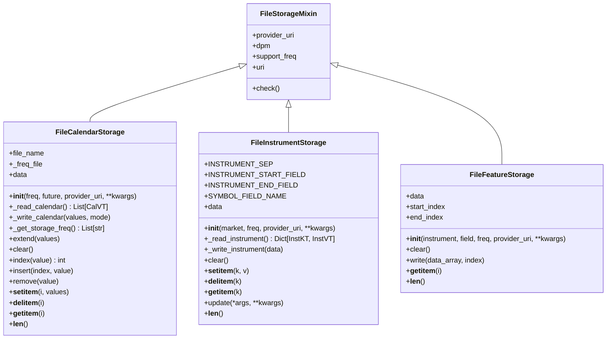
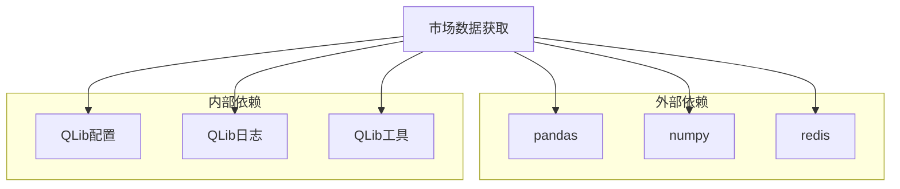

# 市场数据获取

<cite>
**本文档引用的文件**   
- [data.py](file://qlib/data/data.py)
- [__init__.py](file://qlib/data/__init__.py)
- [cache.py](file://qlib/data/cache.py)
- [client.py](file://qlib/data/client.py)
- [config.py](file://qlib/config.py)
- [file_storage.py](file://qlib/data/storage/file_storage.py)
- [index.py](file://scripts/data_collector/index.py)
- [get_data.py](file://scripts/get_data.py)
- [data.py](file://qlib/tests/data.py)
</cite>

## 目录
1. [简介](#简介)
2. [项目结构](#项目结构)
3. [核心组件](#核心组件)
4. [架构概述](#架构概述)
5. [详细组件分析](#详细组件分析)
6. [依赖分析](#依赖分析)
7. [性能考虑](#性能考虑)
8. [故障排除指南](#故障排除指南)
9. [结论](#结论)

## 简介
QLib 是一个用于量化投资研究的机器学习框架，其市场数据获取功能是整个系统的基础。本文档详细分析了 QLib 项目中市场数据获取的核心机制，包括数据提供者、缓存系统、数据存储和数据收集器等关键组件。通过深入分析源代码，我们揭示了 QLib 如何高效地获取、存储和管理市场数据，为量化研究提供可靠的数据支持。

## 项目结构
QLib 项目的市场数据获取功能主要分布在 `qlib/data` 目录下，该目录包含了数据访问、缓存、存储和提供者的核心实现。`scripts/data_collector` 目录则包含了用于收集和准备市场数据的脚本。整体结构清晰，模块化程度高，便于扩展和维护。

**图表来源**
- [data.py](file://qlib/data/data.py#L1-L800)
- [cache.py](file://qlib/data/cache.py#L1-L800)
- [file_storage.py](file://qlib/data/storage/file_storage.py#L1-L453)

**章节来源**
- [data.py](file://qlib/data/data.py#L1-L800)
- [__init__.py](file://qlib/data/__init__.py#L1-L67)

## 核心组件
市场数据获取的核心组件包括数据提供者（Provider）、缓存系统（Cache）和存储系统（Storage）。数据提供者负责抽象数据访问接口，缓存系统用于提高数据访问效率，存储系统则负责数据的持久化存储。这些组件协同工作，为上层应用提供高效、可靠的数据服务。

**章节来源**
- [data.py](file://qlib/data/data.py#L1-L800)
- [cache.py](file://qlib/data/cache.py#L1-L800)
- [file_storage.py](file://qlib/data/storage/file_storage.py#L1-L453)

## 架构概述
QLib 的市场数据获取架构采用分层设计，从上到下依次为数据访问层、缓存层和存储层。数据访问层通过统一的接口（如 D 类）提供数据服务，缓存层在内存和磁盘中缓存热点数据以提高访问速度，存储层则负责数据的持久化存储。这种分层架构使得系统具有良好的可扩展性和可维护性。

**图表来源**
- [data.py](file://qlib/data/data.py#L1-L800)
- [cache.py](file://qlib/data/cache.py#L1-L800)
- [file_storage.py](file://qlib/data/storage/file_storage.py#L1-L453)

## 详细组件分析
### 数据提供者分析
数据提供者是市场数据获取的核心，负责提供统一的数据访问接口。QLib 定义了多种数据提供者，如 CalendarProvider、InstrumentProvider、FeatureProvider 等，每种提供者负责不同类型的数据访问。

#### 数据提供者类图

**图表来源**
- [data.py](file://qlib/data/data.py#L1-L800)

### 缓存系统分析
缓存系统是提高数据访问效率的关键。QLib 提供了内存缓存和磁盘缓存两种机制，通过缓存热点数据，显著减少了对底层存储的访问次数，提高了系统性能。

#### 缓存系统类图

**图表来源**
- [cache.py](file://qlib/data/cache.py#L1-L800)

### 存储系统分析
存储系统负责数据的持久化存储。QLib 采用文件存储作为主要的存储后端，将数据以文件的形式存储在本地磁盘上。这种存储方式简单、可靠，易于管理和备份。

#### 存储系统类图

**图表来源**
- [file_storage.py](file://qlib/data/storage/file_storage.py#L1-L453)

## 依赖分析
市场数据获取功能依赖于多个外部库和内部模块。外部依赖包括 pandas、numpy、redis 等，用于数据处理和缓存管理。内部依赖则包括 QLib 的配置系统、日志系统和工具函数等，这些模块为数据获取功能提供了必要的支持。

**图表来源**
- [data.py](file://qlib/data/data.py#L1-L800)
- [cache.py](file://qlib/data/cache.py#L1-L800)
- [config.py](file://qlib/config.py#L1-L558)

## 性能考虑
为了提高市场数据获取的性能，QLib 采用了多种优化策略。首先是缓存机制，通过内存和磁盘缓存减少对底层存储的访问。其次是并行处理，利用多核 CPU 的计算能力，同时处理多个数据请求。最后是数据压缩，通过二进制格式存储数据，减少存储空间和 I/O 开销。

## 故障排除指南
在使用市场数据获取功能时，可能会遇到一些常见问题。例如，数据文件缺失、缓存失效、网络连接失败等。针对这些问题，建议首先检查数据文件是否存在，然后清除缓存并重新加载数据。对于网络问题，需要检查网络连接和服务器状态。

**章节来源**
- [data.py](file://qlib/data/data.py#L1-L800)
- [cache.py](file://qlib/data/cache.py#L1-L800)
- [client.py](file://qlib/data/client.py#L1-L115)

## 结论
QLib 的市场数据获取功能设计精良，架构清晰，性能优越。通过分层设计和模块化实现，系统具有良好的可扩展性和可维护性。缓存机制和并行处理技术的应用，显著提高了数据访问效率。未来可以进一步优化数据压缩算法和缓存策略，以适应更大规模的数据处理需求。