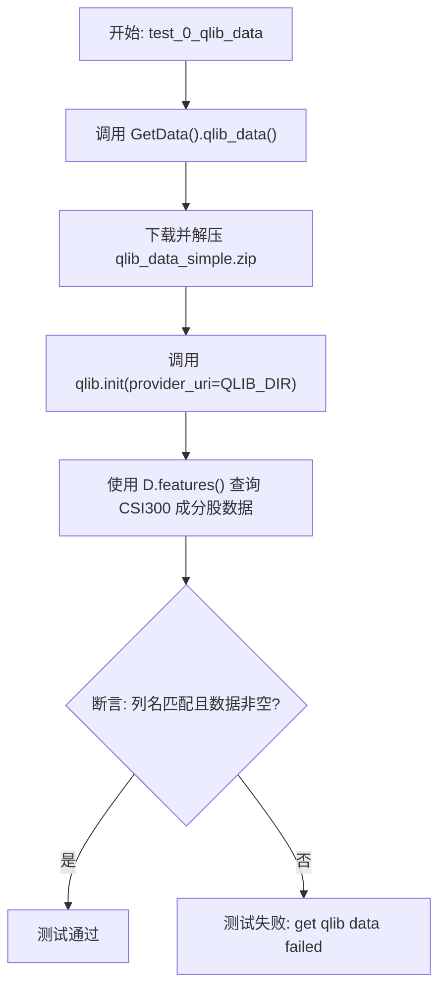
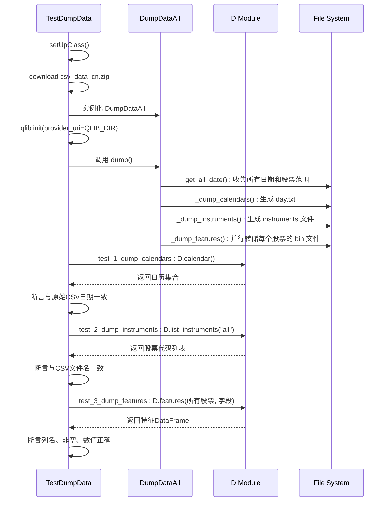

# 测试与验证工具

<cite>
**本文档中引用的文件**
- [test_get_data.py](file://tests/test_get_data.py)
- [test_dump_data.py](file://tests/test_dump_data.py)
- [conftest.py](file://tests/conftest.py)
- [pytest.ini](file://tests/pytest.ini)
- [data.py](file://qlib/tests/data.py)
- [dump_bin.py](file://scripts/dump_bin.py)
</cite>

## 目录
1. [引言](#引言)
2. [项目结构概述](#项目结构概述)
3. [核心测试组件分析](#核心测试组件分析)
4. [数据获取与存储的单元测试机制](#数据获取与存储的单元测试机制)
5. [测试夹具与配置管理](#测试夹具与配置管理)
6. [自定义测试用例编写指导](#自定义测试用例编写指导)
7. [测试套件在开发流程中的作用](#测试套件在开发流程中的作用)
8. [结论](#结论)

## 引言
Qlib 是一个面向量化金融研究的机器学习框架，其测试工具集在保障系统稳定性、数据一致性及功能正确性方面发挥着关键作用。本文旨在深入剖析 Qlib 的测试设计理念与实践应用，重点以 `test_get_data.py` 和 `test_dump_data.py` 为例，揭示如何通过单元测试验证数据采集与存储的核心逻辑。同时，探讨 `conftest.py` 中 fixture 的共享机制和 `pytest.ini` 的配置规范如何提升测试效率与可维护性，并提供编写高质量自定义测试用例的指导原则。

## 项目结构概述
Qlib 的测试代码主要位于根目录下的 `tests/` 文件夹中，遵循模块化组织方式。核心测试文件包括：
- `test_get_data.py`：负责验证从远程源下载并初始化 Qlib 格式数据集的功能。
- `test_dump_data.py`：专注于测试将原始 CSV 数据转换为 Qlib 内部二进制格式（dump）的完整流程。
- `conftest.py`：Pytest 的全局配置文件，用于定义跨测试模块共享的 fixture 和忽略规则。
- `pytest.ini`：Pytest 的配置文件，定义标记（markers）和警告过滤规则。

此外，相关实现逻辑分布在 `qlib/tests/data.py`（数据获取类）和 `scripts/dump_bin.py`（数据转储类）中。

**Section sources**
- [test_get_data.py](file://tests/test_get_data.py#L1-L50)
- [test_dump_data.py](file://tests/test_dump_data.py#L1-L90)

## 核心测试组件分析
Qlib 的测试体系围绕数据生命周期的关键环节构建，主要包括数据获取（Get Data）和数据转储（Dump Data）两大核心组件。这些组件通过继承 `unittest.TestCase` 类来组织测试用例，并利用类级别的 `setUpClass` 和 `tearDownClass` 方法进行一次性资源准备与清理，确保测试环境的独立性和纯净性。

**Section sources**
- [test_get_data.py](file://tests/test_get_data.py#L15-L25)
- [test_dump_data.py](file://tests/test_dump_data.py#L20-L47)

## 数据获取与存储的单元测试机制

### 数据采集验证 (`test_get_data.py`)
该测试文件的核心在于验证 `GetData` 类能否成功从远程服务器下载预置的数据包（如 `qlib_data_simple`），并正确地将其解压到指定目录。测试用例 `test_0_qlib_data` 通过调用 `qlib.init()` 初始化 Qlib 环境，然后使用 `D.features()` 接口查询已加载数据集中特定指数成分股（如 "csi300"）的特征数据。断言部分检查返回的 DataFrame 列名是否与预期字段列表一致，并确认数据非空，从而验证了整个数据获取与加载流程的完整性。

**Diagram sources**
- [test_get_data.py](file://tests/test_get_data.py#L34-L40)
- [data.py](file://qlib/tests/data.py#L17-L210)

### 数据存储验证 (`test_dump_data.py`)
此文件全面测试了将原始 CSV 股票数据转换为 Qlib 高效二进制格式的过程。它首先下载包含多只股票 CSV 文件的压缩包，然后实例化 `DumpDataAll` 对象执行完整的 dump 操作。后续的测试用例分别验证了三个核心输出的正确性：

1.  **日历文件 (Calendars)**：`test_1_dump_calendars` 将生成的 `day.txt` 文件内容与通过 `D.calendar()` API 获取的日历进行比对，确保时间序列对齐无误。
2.  **标的列表 (Instruments)**：`test_2_dump_instruments` 检查生成的 instruments 文件中包含的股票代码是否与原始 CSV 文件名完全一致。
3.  **特征数据 (Features)**：`test_3_dump_features` 和 `test_4_dump_features_simple` 使用 `D.features()` 读取转储后的特征数据，断言其列名、非空状态以及具体数值（通过 `np.isclose` 进行浮点数近似比较）与预期相符。

**Diagram sources**
- [test_dump_data.py](file://tests/test_dump_data.py#L47-L89)
- [dump_bin.py](file://scripts/dump_bin.py#L304-L352)

## 测试夹具与配置管理

### 共享夹具机制 (`conftest.py`)
`conftest.py` 文件实现了 Pytest 的自动发现机制，其中定义的 `collect_ignore` 变量用于在非 Linux 平台上自动忽略 `rl/` 目录下的所有测试文件。这体现了测试环境的适应性管理，避免了因平台差异导致的测试失败，提升了测试套件的健壮性和跨平台兼容性。

**Section sources**
- [conftest.py](file://tests/conftest.py#L0-L10)

### 配置规范 (`pytest.ini`)
`pytest.ini` 文件通过 `[pytest]` 部分定义了两个重要配置：
- **标记 (markers)**：定义了 `slow` 标记，允许用户通过 `-m "not slow"` 参数选择性地跳过耗时较长的测试，优化开发过程中的快速反馈循环。
- **警告过滤 (filterwarnings)**：明确忽略了特定的 `DeprecationWarning` 和 `UserWarning`，防止无关的警告信息干扰测试结果的阅读，保持输出的清晰度。

**Section sources**
- [pytest.ini](file://tests/pytest.ini#L0-L6)

## 自定义测试用例编写指导
基于 Qlib 的现有测试模式，编写自定义测试用例应遵循以下原则：
1.  **边界条件覆盖**：针对数据处理函数，应测试空数据集、单条记录、极大值/极小值等边界情况。
2.  **异常路径模拟**：使用 `unittest.mock` 或类似工具模拟网络请求失败、文件读写错误等异常场景，验证系统的容错能力。
3.  **性能回归测试**：对于关键的数据处理流水线，应建立基准性能指标，并在每次变更后进行对比，防止引入性能退化。
4.  **依赖隔离**：确保测试不依赖外部不可控服务，优先使用本地预置数据或 Mock 对象。

## 测试套件在开发流程中的作用
Qlib 的测试套件在软件开发生命周期中扮演着多重质量门禁角色：
- **贡献代码审查 (Contribution Review)**：任何 Pull Request 必须通过全部测试才能被合并，保证了新代码不会破坏现有功能。
- **版本升级兼容性验证**：在发布新版本前，运行完整的测试套件可以验证新旧版本间的数据格式、API 行为的兼容性。
- **生产发布前质量门禁**：作为 CI/CD 流程的最后一道防线，确保只有经过充分验证的稳定代码才能部署到生产环境。

## 结论
Qlib 的测试工具集设计精良，通过 `test_get_data.py` 和 `test_dump_data.py` 等单元测试，系统性地验证了数据采集与存储这一核心链路的可靠性。结合 `conftest.py` 的灵活配置和 `pytest.ini` 的