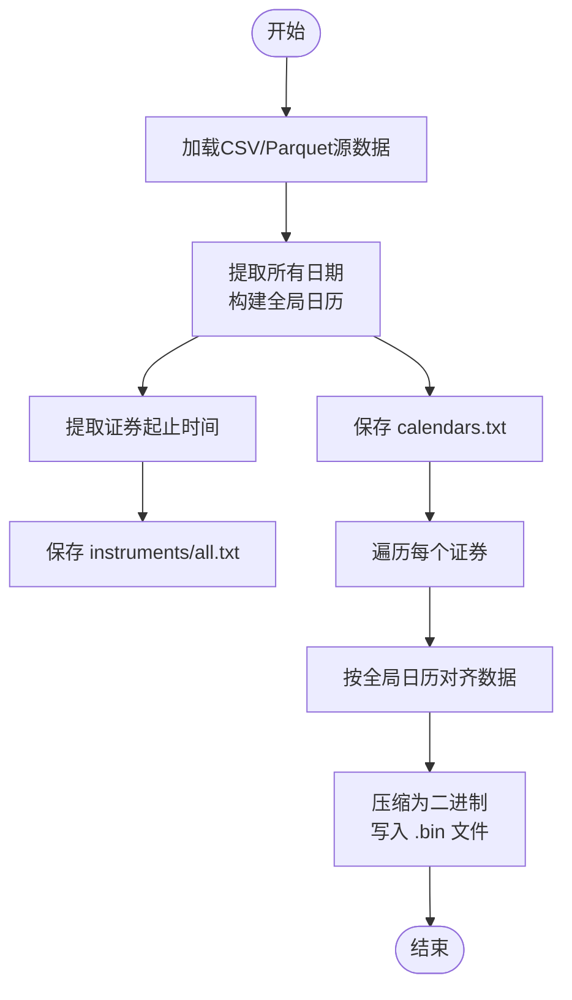
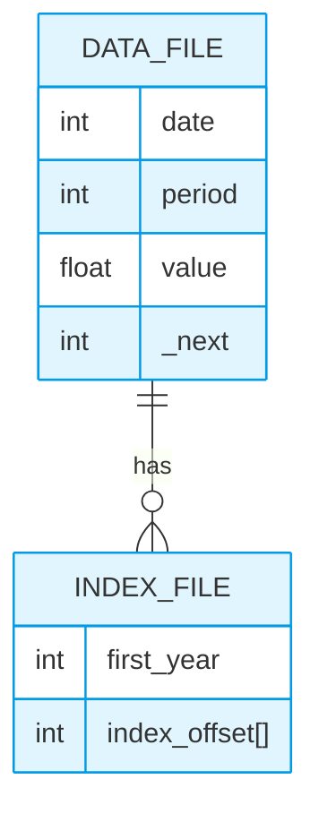

# 系统维护脚本

<cite>
**本文档中引用的文件**  
- [dump_bin.py](file://scripts/dump_bin.py)
- [dump_pit.py](file://scripts/dump_pit.py)
- [check_data_health.py](file://scripts/check_data_health.py)
- [collect_info.py](file://scripts/collect_info.py)
</cite>

## 目录
1. [简介](#简介)
2. [数据转换工具](#数据转换工具)
3. [数据健康检查](#数据健康检查)
4. [系统信息收集](#系统信息收集)
5. [典型运维场景](#典型运维场景)
6. [总结](#总结)

## 简介
Qlib 提供了一套完整的系统级维护工具集，用于保障量化研究平台的数据完整性、系统稳定性与可复现性。这些脚本在原始数据导入、存储优化、质量验证和环境诊断等关键环节发挥着重要作用。本文档将深入解析 `dump_bin.py` 和 `dump_pit.py` 在数据到二进制存储转换过程中的机制，阐述 `check_data_health.py` 的数据完整性检测逻辑，说明 `collect_info.py` 的系统元信息提取功能，并提供典型运维操作流程。

## 数据转换工具

### dump_bin.py：时间序列数据二进制化
`dump_bin.py` 脚本负责将原始CSV或Parquet格式的股票行情数据（如OHLCV）高效地转换为Qlib专用的二进制存储格式。该过程涉及字段映射、时间序列对齐和版本控制，旨在实现快速读取和低存储开销。

其核心机制如下：
1.  **字段映射与过滤**：通过 `include_fields` 和 `exclude_fields` 参数精确控制哪些列被写入二进制文件。若未指定，则默认包含除排除列表外的所有字段。
2.  **时间序列压缩与对齐**：脚本首先扫描所有输入文件，构建全局交易日历（`calendars.txt`），确保所有证券的时间轴一致。然后，每个证券的数据会根据此日历进行对齐，缺失日期用NaN填充，最终以紧凑的浮点数数组形式写入 `.bin` 文件。文件名遵循 `<field>.<freq>.bin` 的命名规则。
3.  **版本控制与增量更新**：脚本提供了三种模式：
    *   `dump_all`：全量导出，适用于首次初始化数据集。
    *   `dump_fix`：修正模式，仅处理新增的证券，保留现有数据。
    *   `dump_update`：增量更新模式，能智能识别新数据并追加到现有 `.bin` 文件末尾，同时更新 `instruments/all.txt` 中的起止时间戳，实现高效的每日数据更新。

**图示来源**
- [dump_bin.py](file://scripts/dump_bin.py#L304-L388)

**节来源**
- [dump_bin.py](file://scripts/dump_bin.py#L1-L537)

### dump_pit.py：财务数据点时（PIT）存储
`dump_pit.py` 专门用于处理财务报告等具有“点时”（Point-in-Time, PIT）特性的数据。这类数据的关键在于，同一会计期间（如某年Q3）的财务指标可能会因后续修正而产生多个版本，系统必须能追溯历史发布值。

其实现机制包括：
1.  **双文件结构**：为每个证券的每个财务指标创建一对文件：
    *   `<field>_q.data` (或 `_a.data`)：存储实际数据记录，每条记录包含 `[date, period, value, _next]` 四个字段。其中 `_next` 是一个指针，指向同一 `period` 的下一次修订记录，形成链表结构。
    *   `<field>_q.index` (或 `_a.index`)：存储索引文件，首4字节为起始年份，后续为每个会计期间在 `.data` 文件中的偏移量（即第一条记录的位置）。若无数据，则为特殊值 `NA_INDEX`。
2.  **链式更新**：当导入新的财务报告时，脚本会查找 `.index` 文件中对应 `period` 的当前偏移量。如果存在，则沿着 `_next` 指针找到链表末尾，并将新记录的偏移量写入前一条记录的 `_next` 字段，从而将新数据链接到旧数据之后。
3.  **空间优化**：通过只存储每个期间的起始年份和索引偏移量，而非重复的期间信息，有效节省了磁盘空间。

**图示来源**
- [dump_pit.py](file://scripts/dump_pit.py#L23-L275)

**节来源**
- [dump_pit.py](file://scripts/dump_pit.py#L1-L281)

## 数据健康检查

### check_data_health.py：数据完整性与一致性校验
`check_data_health.py` 是一个强大的数据质量检查工具，它能从多个维度对数据集进行健康度评估，确保研究结果的可靠性。

其主要检查项包括：
1.  **必填字段缺失检查**：验证每个数据文件是否都包含 `open`, `high`, `low`, `close`, `volume` 这五个核心价格成交量字段。
2.  **数据缺失检查**：统计各文件中各字段的空值（NaN）数量，超过预设阈值（`missing_data_num`）则告警。
3.  **异常波动检测**：计算各价格和成交量字段的逐日百分比变化（pct_change）。对于价格变动，若绝对值超过 `large_step_threshold_price`（默认0.5，即50%），或对于成交量变动超过 `large_step_threshold_volume`（默认3，即300%），则视为异常波动，可能由数据错误或未复权引起。
4.  **因子数据检查**：特别检查 `factor` 列是否存在且非全为空。该列通常用于存储复权因子，对回测准确性至关重要。检查时会排除指数代码（如000300）。

该脚本支持直接检查CSV目录或已加载的Qlib数据集，是新数据集导入前预检的必备工具。

**节来源**
- [check_data_health.py](file://scripts/check_data_health.py#L12-L198)

## 系统信息收集

### collect_info.py：调试与部署验证
`collect_info.py` 用于收集运行环境的系统信息，对于排查环境相关问题和验证部署一致性非常有用。

它能输出以下三类信息：
1.  **系统信息** (`sys`)：包括操作系统类型、机器架构、平台版本等。
2.  **Python环境信息** (`py`)：显示当前Python解释器的详细版本。
3.  **Qlib及依赖信息** (`qlib`)：列出Qlib自身的版本号以及一系列关键依赖库（如numpy, pandas, lightgbm等）的版本号。

通过执行 `python collect_info.py all` 命令，可以一次性获取完整的环境快照，便于在不同机器间对比或向开发者提供问题报告。

**节来源**
- [collect_info.py](file://scripts/collect_info.py#L1-L71)

## 典型运维场景

### 新数据集导入前的预检
1.  使用 `check_data_health.py` 对准备导入的原始CSV数据进行扫描。
2.  根据输出报告修复缺失字段、填补明显空值或调查异常波动的原因。
3.  确认数据健康后，使用 `dump_bin.py dump_all` 或 `dump_pit.py` 进行数据转换。

### 生产环境数据备份与恢复
1.  **备份**：定期使用 `dump_bin.py` 的 `backup_dir` 参数，将整个 `qlib_dir` 备份到安全位置。
2.  **恢复**：当主数据目录损坏时，直接将备份目录复制回原位置即可。由于二进制格式稳定，无需重新执行转换脚本。

### 性能瓶颈定位
1.  当怀疑数据I/O是性能瓶颈时，可使用 `collect_info.py` 收集服务器硬件和软件环境信息。
2.  导出中间状态