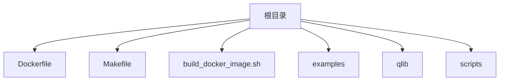
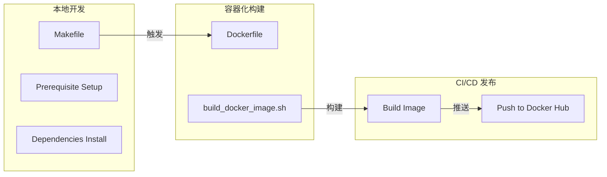
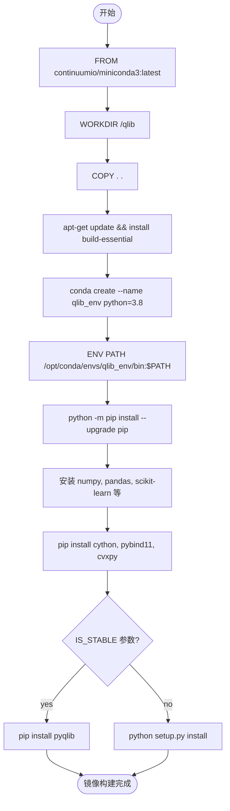
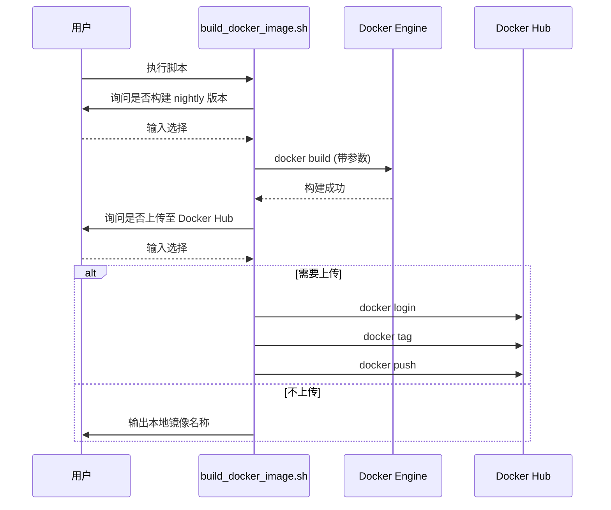
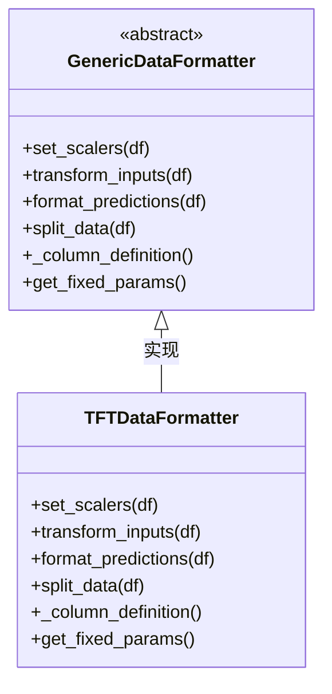
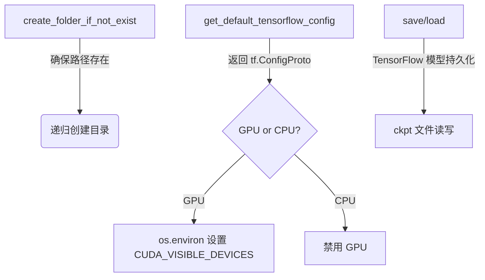
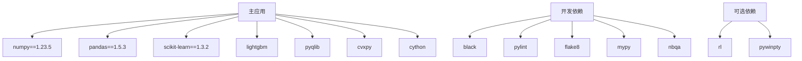

# 部署与自动化工具

<cite>
**本文档中引用的文件**  
- [Dockerfile](file://Dockerfile)
- [Makefile](file://Makefile)
- [build_docker_image.sh](file://build_docker_image.sh)
- [examples/benchmarks/TFT/data_formatters/base.py](file://examples/benchmarks/TFT/data_formatters/base.py)
- [examples/benchmarks/TFT/libs/utils.py](file://examples/benchmarks/TFT/libs/utils.py)
</cite>

## 目录
1. [简介](#简介)
2. [项目结构](#项目结构)
3. [核心组件](#核心组件)
4. [架构概述](#架构概述)
5. [详细组件分析](#详细组件分析)
6. [依赖分析](#依赖分析)
7. [性能考虑](#性能考虑)
8. [故障排除指南](#故障排除指南)
9. [结论](#结论)

## 简介
本文档旨在构建完整的容器化部署与自动化构建指南。基于 `Dockerfile` 详细说明镜像构建过程中 Python 依赖安装、系统库配置和工作目录设置的最佳实践。解析 `Makefile` 中定义的关键目标（targets），如环境初始化、测试执行、镜像打包等，展示如何通过 `make` 命令实现一键式部署流水线。结合 `build_docker_image.sh` 脚本分析 CI/CD 集成要点，包括缓存优化、多阶段构建和标签管理。介绍 `base.py` 和 `utils.py` 中通用工具函数在跨脚本协作中的复用模式，并给出自定义扩展这些自动化流程的方法示例。

## 项目结构
该项目采用模块化设计，主要分为以下几个部分：
- **examples/**：包含多个基准模型示例及其配置文件。
- **qlib/**：核心代码库，涵盖数据处理、模型训练、回测等功能模块。
- **scripts/**：提供一系列用于数据收集和系统维护的脚本。
- 根目录下包含关键的构建与部署文件，如 `Dockerfile`、`Makefile` 和 `build_docker_image.sh`。

**Diagram sources**
- [Dockerfile](file://Dockerfile#L0-L31)
- [Makefile](file://Makefile#L0-L209)
- [build_docker_image.sh](file://build_docker_image.sh#L0-L31)

**Section sources**
- [Dockerfile](file://Dockerfile#L0-L31)
- [Makefile](file://Makefile#L0-L209)
- [build_docker_image.sh](file://build_docker_image.sh#L0-L31)

## 核心组件
本节将深入分析构成自动化部署体系的核心组件，包括容器化配置、构建流程控制以及辅助工具函数。

**Section sources**
- [Dockerfile](file://Dockerfile#L0-L31)
- [Makefile](file://Makefile#L0-L209)
- [build_docker_image.sh](file://build_docker_image.sh#L0-L31)

## 架构概述
整个自动化部署流程由三个主要部分组成：基础镜像构建、本地开发环境管理及CI/CD集成发布。用户可通过简单的命令行操作完成从源码到可运行服务的全过程转换。

**Diagram sources**
- [Dockerfile](file://Dockerfile#L0-L31)
- [Makefile](file://Makefile#L0-L209)
- [build_docker_image.sh](file://build_docker_image.sh#L0-L31)

## 详细组件分析
### Dockerfile 分析
该文件定义了 Qlib 应用的基础容器镜像构建过程，使用 Miniconda 作为基础环境以支持复杂的科学计算依赖。

#### 容器镜像构建流程

**Diagram sources**
- [Dockerfile](file://Dockerfile#L0-L31)

**Section sources**
- [Dockerfile](file://Dockerfile#L0-L31)

### Makefile 分析
`Makefile` 提供了一套标准化的任务执行接口，简化了开发、测试和部署流程。

#### 关键目标（Targets）说明
| 目标 | 描述 |
|------|------|
| clean | 清理中间文件和缓存 |
| deepclean | 彻底清理包括虚拟环境在内的所有生成物 |
| prerequisite | 安装 Cython 扩展并编译共享库 |
| dependencies | 安装主依赖项 |
| develop | 安装开发依赖 |
| lint | 执行代码风格检查 |
| test | 运行单元测试 |
| build | 构建 Python 包 |
| docs-gen | 生成文档 |

**Diagram sources**
- [Makefile](file://Makefile#L0-L209)

**Section sources**
- [Makefile](file://Makefile#L0-L209)

### build_docker_image.sh 脚本分析
此 Shell 脚本封装了 Docker 镜像的构建与推送逻辑，支持稳定版与夜间构建版本的选择。

#### CI/CD 集成要点

**Diagram sources**
- [build_docker_image.sh](file://build_docker_image.sh#L0-L31)

**Section sources**
- [build_docker_image.sh](file://build_docker_image.sh#L0-L31)

### 工具函数复用模式分析
`base.py` 和 `utils.py` 文件提供了跨模块通用的功能抽象，增强了代码的可维护性。

#### base.py 抽象基类设计

**Diagram sources**
- [examples/benchmarks/TFT/data_formatters/base.py](file://examples/benchmarks/TFT/data_formatters/base.py#L0-L222)

#### utils.py 通用工具函数

**Diagram sources**
- [examples/benchmarks/TFT/libs/utils.py](file://examples/benchmarks/TFT/libs/utils.py#L0-L224)

**Section sources**
- [examples/benchmarks/TFT/data_formatters/base.py](file://examples/benchmarks/TFT/data_formatters/base.py#L0-L222)
- [examples/benchmarks/TFT/libs/utils.py](file://examples/benchmarks/TFT/libs/utils.py#L0-L224)

## 依赖分析
系统依赖关系清晰划分为主依赖、开发依赖和可选功能依赖，通过 `pyproject.toml` 和 `Makefile` 协同管理。

**Diagram sources**
- [D