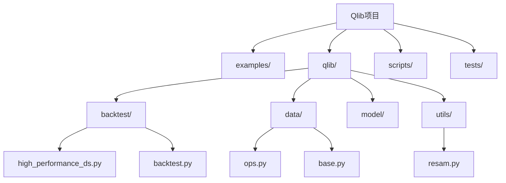
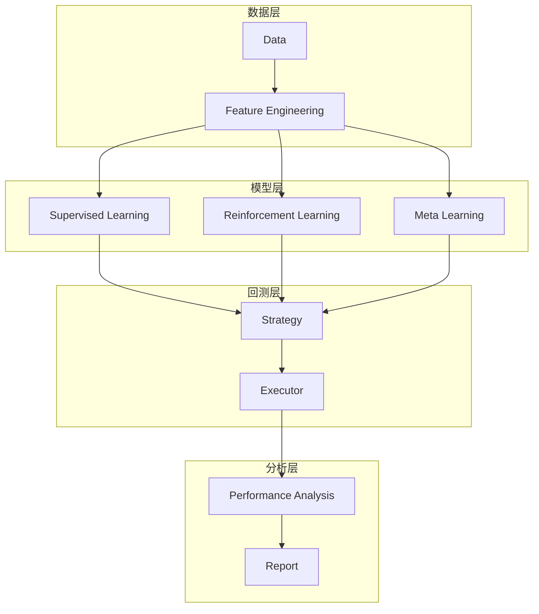
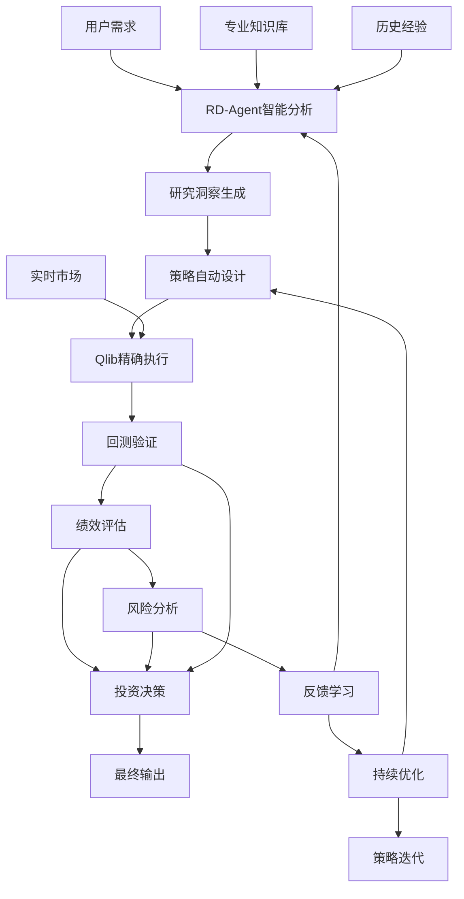
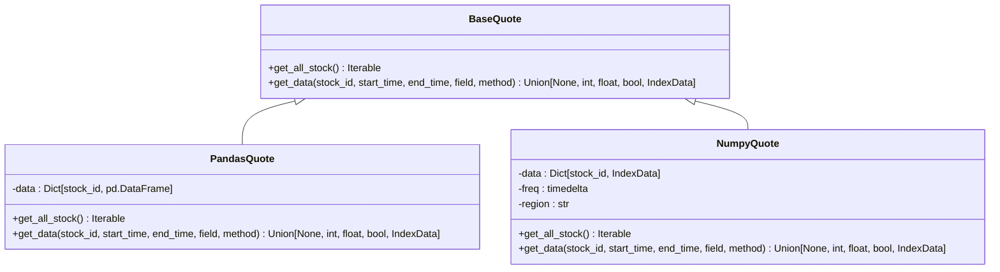
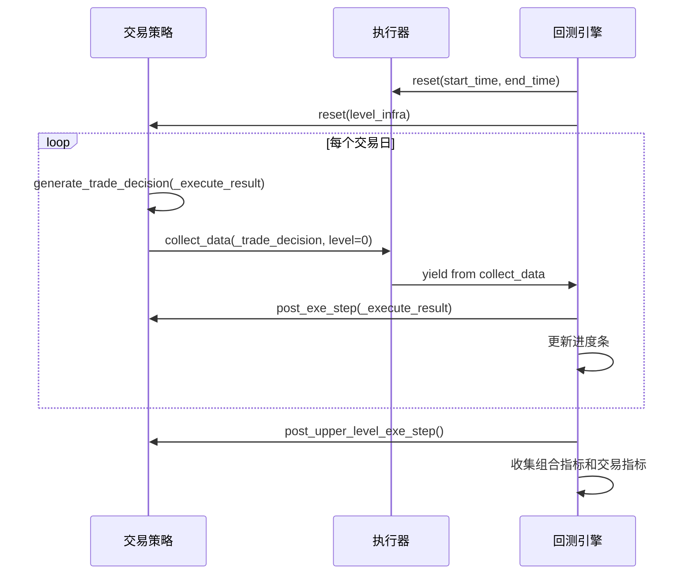
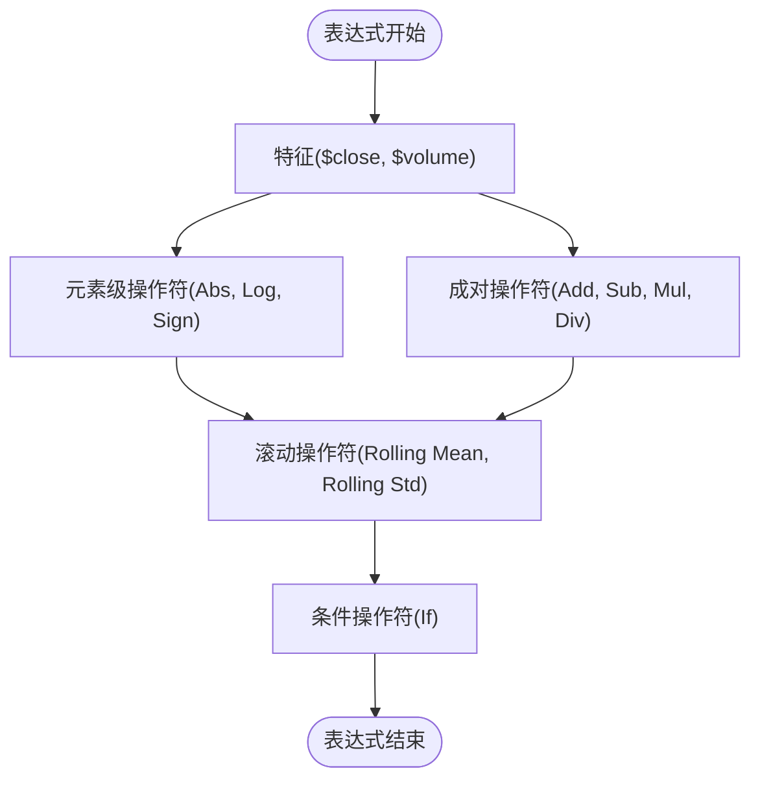
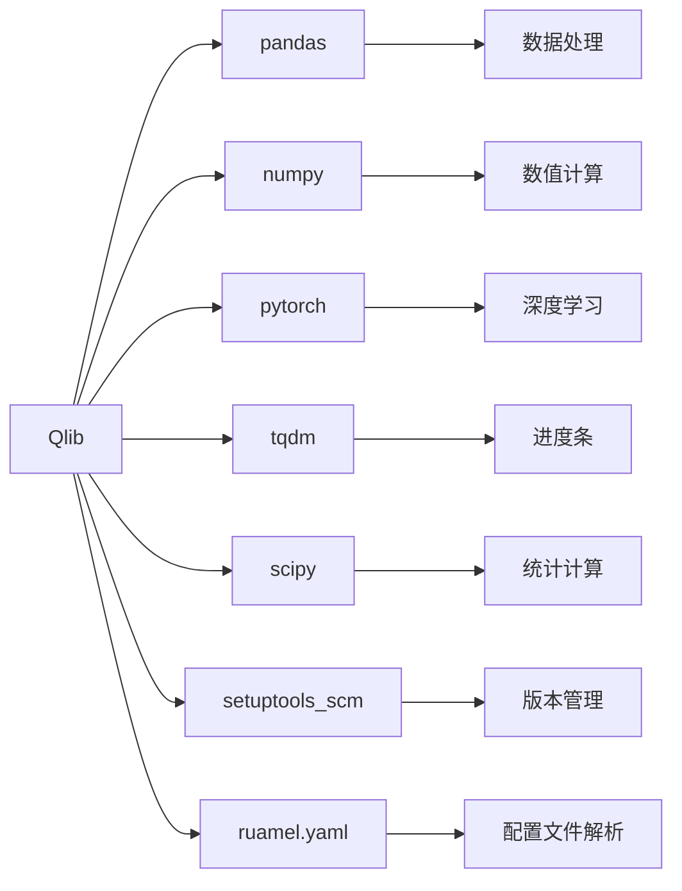

# 高性能Ops框架

<cite>
**本文档中引用的文件**   
- [README.md](file://README.md)
- [qlib/__init__.py](file://qlib/__init__.py)
- [qlib/backtest/high_performance_ds.py](file://qlib/backtest/high_performance_ds.py)
- [qlib/backtest/backtest.py](file://qlib/backtest/backtest.py)
- [qlib/data/ops.py](file://qlib/data/ops.py)
- [qlib/data/base.py](file://qlib/data/base.py)
- [qlib/utils/resam.py](file://qlib/utils/resam.py)
- [qlib/contrib/model/pytorch_utils.py](file://qlib/contrib/model/pytorch_utils.py)
- [Qlib与RD-Agent关系分析报告.md](file://Qlib与RD-Agent关系分析报告.md)
- [Qlib与RD-Agent关系完整分析报告.md](file://Qlib与RD-Agent关系完整分析报告.md)
- [Qlib与RD-Agent关系的核心洞察.md](file://Qlib与RD-Agent关系的核心洞察.md)
- [Qlib与RD-Agent深度关系分析.md](file://Qlib与RD-Agent深度关系分析.md)
</cite>

## 更新摘要
**变更内容**   
- 在结论部分新增了关于Qlib与RD-Agent关系分析的深度洞察
- 扩展了架构概述部分，增加了与RD-Agent的协同架构
- 新增了关于Qlib与RD-Agent协同应用的详细分析
- 更新了未来发展方向，包含了与RD-Agent的融合趋势

## 目录
1. [简介](#简介)
2. [项目结构](#项目结构)
3. [核心组件](#核心组件)
4. [架构概述](#架构概述)
5. [详细组件分析](#详细组件分析)
6. [依赖分析](#依赖分析)
7. [性能考虑](#性能考虑)
8. [故障排除指南](#故障排除指南)
9. [结论](#结论)

## 简介
Qlib是一个开源的、面向AI的量化投资平台，旨在实现潜力、赋能研究并利用AI技术在量化投资中创造价值。该平台支持多种机器学习建模范式，包括监督学习、市场动态建模和强化学习。它包含了数据处理、模型训练、回测的完整ML流水线，并涵盖了量化投资的整个链条：Alpha挖掘、风险建模、投资组合优化和订单执行。

Qlib提供了强大的基础设施来支持量化研究。数据始终是重要组成部分。设计了一个强大的学习框架来支持不同的学习范式（如强化学习、监督学习）和不同层次的模式（如市场动态建模）。通过市场建模，交易策略将生成交易决策并执行。不同级别或粒度的多个交易策略和执行器可以嵌套在一起进行优化和运行。最后，将提供全面的分析，模型可以以低成本在线服务。

**Section sources**
- [README.md](file://README.md#L82-L86)

## 项目结构
Qlib项目具有清晰的模块化结构，主要分为以下几个部分：
- **examples/**: 包含各种基准模型和示例工作流的配置文件
- **qlib/**: 核心代码库，包含回测、数据处理、模型等核心功能
- **scripts/**: 包含数据收集、检查和处理的脚本
- **tests/**: 单元测试和集成测试

核心功能主要集中在`qlib/`目录下，其中`backtest/`、`data/`和`model/`是最重要的子模块。`examples/`目录中的基准模型展示了如何使用Qlib实现各种先进的量化模型。

**Diagram sources**
- [README.md](file://README.md#L138-L157)

## 核心组件
Qlib的核心组件包括高性能数据处理、回测引擎和操作符系统。`high_performance_ds.py`文件实现了高性能的数据结构，如`BaseQuote`、`PandasQuote`和`NumpyQuote`，用于高效地处理股票数据。`backtest.py`文件包含了回测引擎的核心逻辑，如`backtest_loop`和`collect_data_loop`函数。

`data/ops.py`文件定义了丰富的操作符，包括元素级操作符（如`Abs`、`Sign`）、成对操作符（如`Add`、`Sub`）和滚动操作符（如`Rolling`）。这些操作符构成了Qlib特征工程的基础。`utils/resam.py`文件提供了时间序列数据重采样的功能，如`resam_ts_data`函数。

**Section sources**
- [qlib/backtest/high_performance_ds.py](file://qlib/backtest/high_performance_ds.py#L23-L679)
- [qlib/backtest/backtest.py](file://qlib/backtest/backtest.py#L54-L234)
- [qlib/data/ops.py](file://qlib/data/ops.py#L40-L800)
- [qlib/utils/resam.py](file://qlib/utils/resam.py#L1-L285)

## 架构概述
Qlib的高层架构由松散耦合的模块组成，每个组件都可以独立使用。核心架构包括数据层、模型层、回测层和分析层。数据层负责数据的加载和预处理，模型层实现各种机器学习模型，回测层执行交易策略的模拟，分析层提供全面的绩效评估。

**Diagram sources**
- [README.md](file://README.md#L146-L157)
- [qlib/backtest/backtest.py](file://qlib/backtest/backtest.py#L54-L234)

### Qlib与RD-Agent协同架构
随着RD-Agent的引入，Qlib的架构得到了进一步扩展，形成了智能量化投资生态系统。RD-Agent作为智能决策层，与Qlib的专业执行层形成了完美的互补。

**Diagram sources**
- [Qlib与RD-Agent关系分析报告.md](file://Qlib与RD-Agent关系分析报告.md#L279-L303)

## 详细组件分析

### 高性能数据结构分析
Qlib实现了多种高性能数据结构来优化数据处理效率。`BaseQuote`是所有报价数据结构的基类，定义了获取股票数据的基本接口。`PandasQuote`使用pandas DataFrame存储数据，适合灵活的数据操作。`NumpyQuote`则使用numpy数组，通过`lru_cache`装饰器缓存查询结果，显著提高了查询性能。

**Diagram sources**
- [qlib/backtest/high_performance_ds.py](file://qlib/backtest/high_performance_ds.py#L23-L132)

### 回测引擎分析
Qlib的回测引擎核心由`backtest_loop`和`collect_data_loop`两个函数构成。`collect_data_loop`是生成器函数，实现了完整的交易模拟循环，支持嵌套执行模式，可用于强化学习训练数据收集。`backtest_loop`是高级封装函数，调用`collect_data_loop`完成标准回测流程。

**Diagram sources**
- [qlib/backtest/backtest.py](file://qlib/backtest/backtest.py#L115-L234)

### 操作符系统分析
Qlib的操作符系统基于表达式树实现，支持元素级、成对和三元操作。`Expression`是所有表达式的基类，定义了基本的算术和逻辑操作。`ElemOperator`处理单个特征的操作，`PairOperator`处理两个特征的操作，`If`操作符实现条件选择。

**Diagram sources**
- [qlib/data/ops.py](file://qlib/data/ops.py#L40-L730)
- [qlib/data/base.py](file://qlib/data/base.py#L13-L296)

## 依赖分析
Qlib依赖于多个Python库来实现其功能。核心依赖包括pandas用于数据处理，numpy用于数值计算，pytorch用于深度学习模型。回测模块依赖tqdm用于进度条显示。数据操作符中使用了scipy.stats进行统计计算。项目使用setuptools_scm进行版本管理。

**Diagram sources**
- [README.md](file://README.md#L170-L177)
- [qlib/__init__.py](file://qlib/__init__.py#L1-L15)

## 性能考虑
Qlib在设计时充分考虑了性能优化。数据服务器的性能测试显示，Qlib在数据处理任务上显著优于HDF5、MySQL、MongoDB和InfluxDB等通用数据库解决方案。通过使用紧凑的数据格式和高效的缓存机制，Qlib减少了数据加载过程中的接口层和不必要的格式转换开销。

对于高频交易场景，Qlib提供了专门的高性能数据结构和操作符。`NumpyQuote`类使用`lru_cache`装饰器缓存查询结果，避免重复计算。`resam_ts_data`函数优化了时间序列数据的重采样过程，支持多种聚合方法。

**Section sources**
- [README.md](file://README.md#L555-L572)
- [qlib/backtest/high_performance_ds.py](file://qlib/backtest/high_performance_ds.py#L167-L193)
- [qlib/utils/resam.py](file://qlib/utils/resam.py#L141-L249)

## 故障排除指南
在使用Qlib时可能遇到一些常见问题。对于pandas版本兼容性问题，从pandas 1.5到2.0版本，`groupby`方法的`group_key`参数默认值从无默认值变为True，这可能导致Qlib操作时报错。解决方案是显式设置`group_key=False`。

数据健康检查是确保回测结果可靠的重要步骤。可以使用`scripts/check_data_health.py`脚本来检查数据的完整性。对于安装问题，建议使用conda管理Python环境，避免因缺少头文件导致的安装失败。

**Section sources**
- [README.md](file://README.md#L480-L485)
- [README.md](file://README.md#L282-L291)

## 结论
Qlib作为一个高性能的量化投资框架，通过精心设计的架构和优化的数据处理机制，为量化研究提供了强大的支持。其模块化的设计使得各个组件可以独立使用，同时又能够无缝集成。丰富的基准模型和示例工作流降低了使用门槛，使得研究人员可以快速验证和实现自己的想法。

随着RD-Agent等新特性的引入，Qlib的生态系统得到了显著扩展。Qlib与RD-Agent的结合代表了量化投资技术的重大范式转移：

**从专业工具到智能伙伴**：Qlib从专业工具进化为智能伙伴，RD-Agent从自动化工具进化为智能专家

**从经验驱动到数据驱动**：从基于有限人类经验的决策转向基于海量数据和AI分析的智能决策

**从工具化到平台化**：从分离的工具集整合为统一的智能化平台

**从效率提升到能力飞跃**：不仅提升了效率，更重要的是创造了全新的能力和可能性

Qlib与RD-Agent的协同工作流实现了从基础设施到智能决策的完整闭环。RD-Agent提供AI驱动的自动化研究和开发能力，而Qlib提供量化投资的专业基础设施。这种结合不仅能够大幅提升量化投资的研发效率和创新能力，更重要的是为整个行业的智能化转型提供了可行的技术路径和实践范例。

未来，随着两个系统的深度集成，我们将看到更多创新的应用场景，包括智能因子研发、量化策略全流程自动化、智能风险管理和持续优化等。这种结合将重新定义量化投资研发的未来，推动整个行业向更高层次的智能化发展。

**Section sources**
- [Qlib与RD-Agent关系分析报告.md](file://Qlib与RD-Agent关系分析报告.md#L761-L798)
- [Qlib与RD-Agent关系的核心洞察.md](file://Qlib与RD-Agent关系的核心洞察.md#L318-L328)
- [Qlib与RD-Agent深度关系分析.md](file://Qlib与RD-Agent深度关系分析.md#L730-L800)