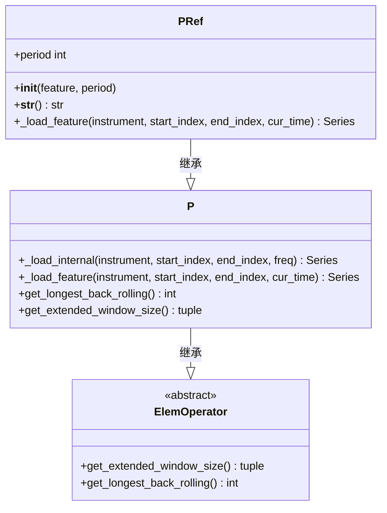
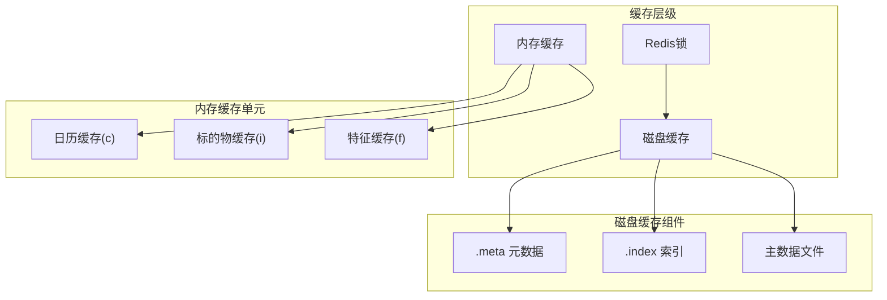
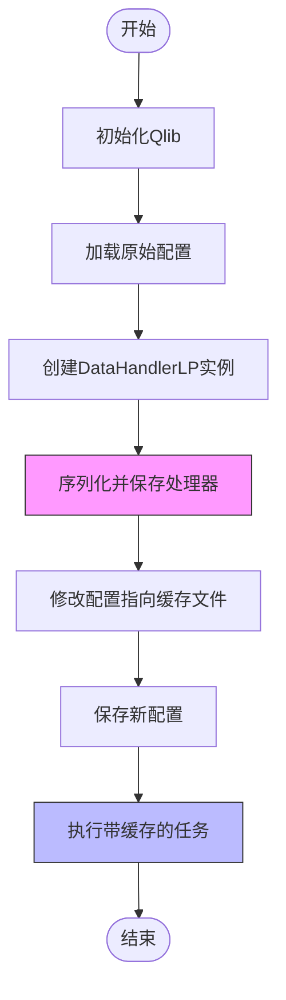

# PIT数据模型

<cite>
**本文档引用的文件**
- [pit.py](file://qlib/data/pit.py)
- [cache.py](file://qlib/data/cache.py)
- [data_cache_demo.py](file://examples/data_demo/data_cache_demo.py)
</cite>

## 目录
1. [引言](#引言)
2. [PIT数据模型核心设计](#pit数据模型核心设计)
3. [历史状态快照机制](#历史状态快照机制)
4. [多级缓存策略](#多级缓存策略)
5. [内存复用优化](#内存复用优化)
6. [一致性保证机制](#一致性保证机制)

## 引言
PIT（Point-in-Time）数据模型是金融时序数据分析中的关键设计，旨在解决传统方法中存在的幸存者偏差和未来信息泄露问题。该模型通过精确的时间点数据快照机制，确保在任意观察时间点所获取的数据仅包含当时可获得的历史信息，从而保证了回测与实盘模拟的一致性。

## PIT数据模型核心设计
PIT数据模型的核心在于区分两种时间维度：观察时间（observe_time）和周期时间（period_time）。对于每只股票，其数据格式为<观察时间, 特征>，表达式引擎支持在此格式上的计算。当需要计算特定观察时间t的特征值f_t时，会使用<周期时间, 特征>格式的数据进行计算。

例如，在2019年7月19日（观察时间）计算过去四个季度的平均收益（周期时间）。这种设计通过操作符`P`来实现数据的折叠（collapse），将周期性数据转换为单一观测点特征，从根本上避免了使用未来信息的可能性。

**Section sources**
- [pit.py](file://qlib/data/pit.py#L1-L72)

## 历史状态快照机制
在`pit.py`中实现的`P`类继承自`ElemOperator`，负责执行历史状态快照的核心逻辑。其`_load_internal`方法遍历指定时间段内的每一个时间索引，并调用`_load_feature`加载对应时间点的特征数据。

关键机制包括：
- 对于每个时间点cur_time，加载从-start_ws到0的历史窗口数据
- 明确禁止引用未来周期（如`Ref('$$roewa_q', -1)`不被支持）
- 计算结果始终取最后元素作为该时间点的代表值
- 使用resample_data数组存储重采样后的结果

与传统滚动窗口方法相比，PIT模型的本质区别在于它不是简单地滑动一个固定窗口，而是为每个观察时间点构建独立的历史视图，确保了数据的"时间一致性"。

**Diagram sources**
- [pit.py](file://qlib/data/pit.py#L22-L70)

**Section sources**
- [pit.py](file://qlib/data/pit.py#L22-L70)

## 多级缓存策略
`cache.py`实现了多层次的缓存体系，包含内存缓存、磁盘缓存和分布式缓存三种模式：

### 内存缓存（MemCache）
采用LRU（最近最少使用）淘汰策略，基于OrderedDict实现。提供两种大小计量方式：
- 长度限制（MemCacheLengthUnit）：以条目数量为单位
- 内存占用限制（MemCacheSizeofUnit）：以sys.getsizeof(value)为准

缓存分为三个独立单元：
- 日历缓存（c）
- 标的物缓存（i）
- 特征缓存（f）

### 磁盘缓存（DiskExpressionCache/DiskDatasetCache）
基于HDF5和二进制文件存储，包含：
- 表达式缓存（ExpressionCache）：单个特征的时序数据
- 数据集缓存（DatasetCache）：多个特征的组合数据集

缓存文件结构包含三部分：
1. `.meta`：元数据（含最后更新时间、访问统计等）
2. `.index`：索引文件（记录数据起止位置）
3. 主数据文件：实际特征数据

**Diagram sources**
- [cache.py](file://qlib/data/cache.py#L135-L176)
- [cache.py](file://qlib/data/cache.py#L488-L642)
- [cache.py](file://qlib/data/cache.py#L645-L1059)

**Section sources**
- [cache.py](file://qlib/data/cache.py#L42-L176)
- [cache.py](file://qlib/data/cache.py#L488-L1059)

## 内存复用优化
`data_cache_demo.py`演示了如何通过序列化处理过的数据来避免重复预处理，降低大数据量下的GC压力。主要步骤包括：

1. 初始化Qlib环境
2. 读取原始任务配置
3. 实例化DataHandlerLP处理器
4. 将处理器完整序列化保存到pickle文件
5. 创建新任务配置，指向已缓存的处理器文件
6. 执行新任务，直接复用已处理的数据

这种方法的关键优势在于：
- 避免了每次运行都重新执行耗时的数据预处理流程
- 序列化的处理器包含了所有中间状态，可直接复用
- 通过文件路径引用（file://handler.pkl）实现缓存共享
- 显著减少了内存分配和垃圾回收开销

**Diagram sources**
- [data_cache_demo.py](file://examples/data_demo/data_cache_demo.py#L1-L54)

**Section sources**
- [data_cache_demo.py](file://examples/data_demo/data_cache_demo.py#L1-L54)

## 一致性保证机制
PIT模型通过以下机制确保实盘模拟与历史回测的一致性：

1. **时间点隔离**：严格区分观察时间和周期时间，防止未来信息泄露
2. **缓存更新同步**：`update`方法确保缓存数据与最新日历同步
3. **原子操作锁**：使用Redis分布式锁保证读写一致性
4. **版本控制**：元数据中记录last_update时间戳
5. **数据完整性校验**：通过visits计数和last_visit时间监控缓存健康状态

这些机制共同作用，使得无论是在回测还是实盘环境中，同一时间点查询到的数据状态完全一致，从而保证了策略评估的公平性和可靠性。

**Section sources**
- [cache.py](file://qlib/data/cache.py#L645-L1059)
- [pit.py](file://qlib/data/pit.py#L22-L70)