# QLib Tushare 数据集成

<cite>
**本文档引用的文件**
- [README.md](file://qlib/contrib/data/tushare/README.md)
- [__init__.py](file://qlib/contrib/data/tushare/__init__.py)
- [provider.py](file://qlib/contrib/data/tushare/provider.py)
- [config.py](file://qlib/contrib/data/tushare/config.py)
- [api_client.py](file://qlib/contrib/data/tushare/api_client.py)
- [cache.py](file://qlib/contrib/data/tushare/cache.py)
- [field_mapping.py](file://qlib/contrib/data/tushare/field_mapping.py)
- [utils.py](file://qlib/contrib/data/tushare/utils.py)
- [exceptions.py](file://qlib/contrib/data/tushare/exceptions.py)
- [example.py](file://qlib/contrib/data/tushare/example.py)
- [demo_tushare_config.json](file://demo_tushare_config.json)
- [test_basic_functionality.py](file://qlib/contrib/data/tushare/tests/test_basic_functionality.py)
- [test_tushare_integration.py](file://qlib/contrib/data/tushare/tests/test_tushare_integration.py)
- [get_market_data.py](file://get_market_data.py)
- [using_downloaded_data.py](file://using_downloaded_data.py)
- [data_download_summary.md](file://data_download_summary.md)
</cite>

## 更新摘要
**变更内容**
- 新增了get_market_data.py和using_downloaded_data.py工具的使用说明
- 添加了data_download_summary.md数据下载总结的分析内容
- 扩展了使用示例部分，包含新的自动化工具和数据分析流程
- 更新了项目架构图以反映新的工具集成

## 目录
1. [简介](#简介)
2. [项目架构](#项目架构)
3. [核心组件](#核心组件)
4. [配置管理](#配置管理)
5. [数据处理流程](#数据处理流程)
6. [缓存系统](#缓存系统)
7. [错误处理](#错误处理)
8. [使用示例](#使用示例)
9. [性能优化](#性能优化)
10. [故障排除](#故障排除)
11. [总结](#总结)

## 简介

QLib Tushare 数据集成是一个专门为 QLib 量化投资平台设计的 TuShare 数据源模块。该模块提供了与 TuShare API 的无缝集成，支持 A 股市场的实时数据获取和处理，具有企业级的稳定性和高性能特点。

### 主要特性

- **统一数据接口**：与 QLib 原生数据接口完全兼容
- **多层缓存机制**：内存缓存 + 磁盘缓存提升性能
- **企业级稳定性**：完善的错误处理、重试机制、降级策略
- **灵活配置管理**：支持环境变量、配置文件、代码配置
- **实时数据获取**：支持 A 股日线、分钟线等实时数据
- **自动字段映射**：TuShare 字段到 QLib 标准字段自动转换
- **自动化工具增强**：新增get_market_data.py和using_downloaded_data.py工具，提升数据获取和分析效率

## 项目架构

```mermaid
graph TB
subgraph "用户接口层"
A[Qlib Data Interface]
B[TuShareProvider]
C[get_market_data.py]
D[using_downloaded_data.py]
end
subgraph "配置管理层"
E[TuShareConfig]
F[配置加载器]
end
subgraph "数据处理层"
G[API客户端]
H[字段映射器]
I[数据处理器]
J[代码转换器]
K[数据格式转换]
end
subgraph "缓存层"
L[内存缓存]
M[磁盘缓存]
N[缓存管理器]
end
subgraph "外部服务"
O[TuShare API]
P[本地存储]
Q[CSV文件]
end
A --> B
B --> E
B --> G
B --> N
C --> G
C --> K
D --> Q
D --> R[数据分析]
G --> H
G --> I
G --> J
N --> L
N --> M
G --> O
I --> P
K --> Q
R --> S[可视化]
R --> T[统计分析]
```



**图表来源**
- [provider.py](file://qlib/contrib/data/tushare/provider.py#L43-L509)
- [config.py](file://qlib/contrib/data/tushare/config.py#L34-L364)
- [api_client.py](file://qlib/contrib/data/tushare/api_client.py#L81-L505)
- [get_market_data.py](file://get_market_data.py#L1-L365)
- [using_downloaded_data.py](file://using_downloaded_data.py#L1-L307)

## 核心组件

### TuShareProvider 数据提供者

TuShareProvider 是整个数据集成的核心组件，实现了 QLib 的 BaseProvider 接口，负责与 TuShare API 的交互和数据处理。


**图表来源**
- [provider.py](file://qlib/contrib/data/tushare/provider.py#L43-L509)
- [config.py](file://qlib/contrib/data/tushare/config.py#L34-L364)
- [api_client.py](file://qlib/contrib/data/tushare/api_client.py#L81-L505)

**章节来源**
- [provider.py](file://qlib/contrib/data/tushare/provider.py#L43-L509)
- [config.py](file://qlib/contrib/data/tushare/config.py#L34-L364)
- [api_client.py](file://qlib/contrib/data/tushare/api_client.py#L81-L505)

### 字段映射系统

字段映射系统负责将 TuShare 的原始字段名转换为 QLib 的标准字段名，并进行数据类型转换和验证。

| TuShare 字段 | QLib 字段 | 说明 |
|-------------|-----------|------|
| ts_code | instrument | 股票代码 |
| trade_date | date | 交易日期 |
| open | open | 开盘价 |
| high | high | 最高价 |
| low | low | 最低价 |
| close | close | 收盘价 |
| vol | volume | 成交量（手） |
| amount | amount | 成交额（千元） |
| pct_chg | pct_change | 涨跌幅 |

**章节来源**
- [field_mapping.py](file://qlib/contrib/data/tushare/field_mapping.py#L28-L65)

## 配置管理

### 配置层次结构

配置系统采用分层设计，优先级从高到低为：

1. **代码直接配置** - 最高优先级
2. **环境变量配置** - 中等优先级  
3. **配置文件配置** - 较低优先级
4. **默认配置** - 最低优先级

```mermaid
flowchart TD
A[配置加载] --> B{代码配置存在?}
B --> |是| C[使用代码配置]
B --> |否| D{环境变量存在?}
D --> |是| E[使用环境变量配置]
D --> |否| F{配置文件存在?}
F --> |是| G[使用配置文件配置]
F --> |否| H[使用默认配置]
C --> I[配置验证]
E --> I
G --> I
H --> I
I --> J{配置有效?}
J --> |是| K[初始化完成]
J --> |否| L[抛出配置错误]
```



**图表来源**
- [config.py](file://qlib/contrib/data/tushare/config.py#L135-L260)

### 配置参数详解

| 参数类别 | 参数名 | 默认值 | 说明 |
|---------|--------|--------|------|
| **API配置** | token | None | TuShare API Token |
| | api_url | http://api.tushare.pro | API地址 |
| **缓存配置** | enable_cache | True | 启用缓存 |
| | cache_dir | ~/.qlib/cache/tushare | 缓存目录 |
| | cache_ttl | 86400 | 缓存生存时间（秒） |
| | max_cache_size | 1073741824 | 最大缓存大小（字节） |
| **重试配置** | max_retries | 3 | 最大重试次数 |
| | retry_delay | 1.0 | 重试延迟（秒） |
| | retry_backoff | 2.0 | 退避因子 |
| | timeout | 30.0 | 请求超时（秒） |
| **频率限制** | rate_limit | 200 | 每分钟最大请求数 |
| | rate_limit_window | 60 | 频率限制窗口（秒） |
| **数据配置** | validate_data | True | 验证数据 |
| | adjust_price | True | 是否复权 |

**章节来源**
- [config.py](file://qlib/contrib/data/tushare/config.py#L34-L364)

## 数据处理流程

### 数据获取流程

```mermaid
sequenceDiagram
participant Client as 客户端
participant Provider as TuShareProvider
participant Cache as 缓存系统
participant API as TuShare API
participant Processor as 数据处理器
Client->>Provider : features(instruments, fields)
Provider->>Cache : 检查缓存
Cache-->>Provider : 缓存状态
alt 缓存命中
Provider-->>Client : 返回缓存数据
else 缓存未命中
Provider->>API : 调用TuShare API
API-->>Provider : 原始数据
Provider->>Processor : 数据验证和清洗
Processor-->>Provider : 处理后数据
Provider->>Cache : 存储到缓存
Provider-->>Client : 返回数据
end
```



**图表来源**
- [provider.py](file://qlib/contrib/data/tushare/provider.py#L315-L413)
- [cache.py](file://qlib/contrib/data/tushare/cache.py#L621-L800)

### 数据验证和清洗

数据处理系统包含完整的验证和清洗机制：

```mermaid
flowchart TD
A[原始数据] --> B[字段验证]
B --> C{必需字段检查}
C --> |缺失| D[抛出数据错误]
C --> |完整| E[数据类型转换]
E --> F[价格合理性检查]
F --> G{价格有效性}
G --> |无效| H[标记异常记录]
G --> |有效| I[成交量检查]
I --> J{成交量合理性}
J --> |负值| K[标记异常记录]
J --> |有效| L[价格范围检查]
L --> M{价格范围逻辑}
M --> |超出范围| N[标记异常记录]
M --> |合理| O[重复日期检查]
O --> P{发现重复}
P --> |有重复| Q[标记异常记录]
P --> |无重复| R[数据清洗]
H --> S[前向填充缺失值]
K --> S
N --> S
Q --> S
S --> T[最终清洗数据]
```



**图表来源**
- [utils.py](file://qlib/contrib/data/tushare/utils.py#L32-L139)

**章节来源**
- [utils.py](file://qlib/contrib/data/tushare/utils.py#L32-L139)

## 缓存系统

### 缓存架构

Tushare 缓存系统采用多层缓存架构，提供高性能的数据访问：

```mermaid
graph TB
subgraph "缓存层次"
A[应用层] --> B[缓存管理器]
B --> C[内存缓存]
B --> D[磁盘缓存]
end
subgraph "内存缓存"
C --> E[LRU策略]
C --> F[TTL过期]
C --> G[容量限制]
end
subgraph "磁盘缓存"
D --> H[SQLite元数据]
D --> I[Pickle序列化]
D --> J[文件系统存储]
end
subgraph "缓存策略"
K[自动清理]
L[容量管理]
M[过期处理]
end
E --> K
F --> L
G --> M
H --> K
I --> L
J --> M
```



**图表来源**
- [cache.py](file://qlib/contrib/data/tushare/cache.py#L34-L838)

### 缓存配置参数

| 参数 | 类型 | 默认值 | 说明 |
|------|------|--------|------|
| enable_cache | bool | True | 是否启用缓存 |
| cache_ttl | int | 86400 | 缓存生存时间（秒） |
| max_cache_size | int | 1073741824 | 最大缓存大小（字节） |
| memory_max_size | int | 1000 | 内存缓存最大条目数 |
| disk_cleanup_interval | int | 3600 | 磁盘清理间隔（秒） |

**章节来源**
- [cache.py](file://qlib/contrib/data/tushare/cache.py#L34-L838)

## 错误处理

### 异常层次结构


**图表来源**
- [exceptions.py](file://qlib/contrib/data/tushare/exceptions.py#L17-L233)

### 错误处理策略

| 错误类型 | 处理策略 | 重试机制 | 降级方案 |
|---------|---------|---------|---------|
| 配置错误 | 立即抛出 | 不适用 | 配置修复 |
| API错误 | 指数退避重试 | 最多重试3次 | 使用缓存数据 |
| 数据错误 | 记录警告 | 不重试 | 数据清洗 |
| 缓存错误 | 降级到磁盘 | 不重试 | 禁用缓存 |

**章节来源**
- [exceptions.py](file://qlib/contrib/data/tushare/exceptions.py#L17-L233)

## 使用示例

### 基本使用

```python
from qlib.contrib.data.tushare import TuShareConfig, TuShareProvider
from qlib import init
from qlib.data import D

# 从环境变量加载配置
config = TuShareConfig.from_env()

# 使用TuShare数据源初始化Qlib
init(provider_uri="tushare", default_conf={"tushare": config})

# 获取交易日历
calendar = D.calendar(start_time="2024-01-01", end_time="2024-12-31")
print(f"2024年共有 {len(calendar)} 个交易日")

# 获取股票列表
instruments = D.instruments("csi300")
print(f"CIS300成分股数量: {len(instruments)}")

# 获取股票数据
data = D.features(
    instruments=["000001.SZ", "600000.SH"],
    fields=["close", "volume", "open"],
    start_time="2024-01-01",
    end_time="2024-12-31"
)
```

### 高级使用

```python
from qlib.contrib.data.tushare import TuShareProvider, TuShareConfig

# 自定义配置
config = TuShareConfig(
    token="your_token_here",
    enable_cache=True,
    cache_ttl=7200,  # 2小时缓存
    max_retries=5,
    rate_limit=180,  # 降低请求频率
    validate_data=True,
    adjust_price=True  # 启用复权
)

# 使用上下文管理器
with TuShareProvider(config) as provider:
    # 获取交易日历
    calendar = provider.calendar(
        start_time="2024-01-01",
        end_time="2024-12-31"
    )
    
    # 获取股票信息
    instruments = provider.instruments(market="all")
    print(f"总股票数量: {len(instruments)}")
    
    # 获取特征数据
    features = provider.features(
        instruments=["000001.SZ", "600000.SH"],
        fields=["open", "high", "low", "close", "volume"],
        start_time="2024-01-01",
        end_time="2024-12-31"
    )
    
    # 获取缓存统计
    cache_stats = provider.get_cache_stats()
    print(f"缓存统计: {cache_stats}")
```

### 自动化数据获取工具

**get_market_data.py** 是一个自动化工具，用于批量获取上证指数和沪深300成分股的近五年日线数据，并自动转换为Qlib标准格式。

```python
# 运行数据获取脚本
python get_market_data.py

# 脚本功能：
# 1. 获取上证指数(000001.SH)近五年日线数据
# 2. 获取沪深300成分股列表及近五年日线数据
# 3. 将数据保存为Qlib可用的格式
# 4. 生成数据获取总结报告
```

**章节来源**
- [get_market_data.py](file://get_market_data.py#L1-L365)

### 数据分析演示工具

**using_downloaded_data.py** 是一个数据分析演示脚本，用于加载和分析已下载的数据，生成统计分析和可视化图表。

```python
# 运行数据分析脚本
python using_downloaded_data.py

# 脚本功能：
# 1. 加载并检查下载的数据
# 2. 分析上证指数数据
# 3. 分析沪深300成分股数据
# 4. 演示Qlib中的数据使用方法
# 5. 生成数据可视化图表
```

**章节来源**
- [using_downloaded_data.py](file://using_downloaded_data.py#L1-L307)

### 数据下载总结

**data_download_summary.md** 提供了数据获取的详细总结，包括任务完成情况、获取的数据详情、生成的数据文件和使用建议。

```markdown
# 上证指数和沪深300成分股数据获取总结

## 📋 任务完成情况
✅ 已完成任务：
1. 检查qlib项目中是否已有tushare数据集成
2. 了解qlib数据源接口和配置方式
3. 创建简化版数据获取脚本
4. 获取上证指数(000001.SH)近五年日线数据
5. 获取沪深300成分股列表及近五年日线数据
6. 将数据保存为qlib可用的格式

## 📊 获取的数据详情
### 📈 上证指数(000001.SH)
- 时间范围: 2020-11-27 至 2025-11-25 (约5年)
- 交易天数: 1,211天
- 数据字段: open, high, low, close, volume, amount
- 期间表现:
  - 期间总收益率: 13.55%
  - 年化收益率: 2.68%
  - 年化波动率: 15.79%
  - 最大回撤: -27.27%

### 🏢 沪深300成分股 (样本10只)
- 股票数量: 10只 (样本数据)
- 时间范围: 2020-11-27 至 2025-11-25
- 总数据点: 12,110条
- 整体表现:
  - 平均收益率: -32.46%
  - 收益率中位数: -35.09%
  - 正收益股票: 1只 (10.0%)
  - 负收益股票: 9只 (90.0%)
```

**章节来源**
- [data_download_summary.md](file://data_download_summary.md#L1-L217)

## 性能优化

### 缓存策略优化

```python
# 针对高频数据使用更长的TTL
config = TuShareConfig(
    cache_ttl=7200,  # 2小时缓存
    max_cache_size=2*1024*1024*1024,  # 2GB缓存
)

# 批量请求优化
symbols = ["000001.SZ", "000002.SZ", "600000.SH", "600036.SH"]
data = provider.features(
    instruments=symbols,
    fields=["close", "volume"],
    start_time="2024-01-01",
    end_time="2024-12-31"
)
```

### 频率限制管理

```python
# 针对高级账户调整频率限制
config = TuShareConfig(
    rate_limit=500,  # 增加请求频率
    max_retries=5,   # 增加重试次数
)
```

### 监控和日志

```python
# 启用详细的API调用日志
config = TuShareConfig(
    enable_api_logging=True,
    log_level="DEBUG"
)

# 监控请求延迟和成功率
with TuShareProvider(config) as provider:
    start_time = time.time()
    data = provider.features(instruments, fields, start_time, end_time)
    elapsed_time = time.time() - start_time
    print(f"数据获取耗时: {elapsed_time:.2f}秒")
```

**章节来源**
- [example.py](file://qlib/contrib/data/tushare/example.py#L370-L416)

## 故障排除

### 常见问题及解决方案

| 问题类型 | 症状 | 原因 | 解决方案 |
|---------|------|------|---------|
| Token无效 | API调用失败 | Token过期或格式错误 | 检查Token有效性，重新申请 |
| 频率限制 | 请求被拒绝 | 超出API调用限制 | 降低rate_limit配置 |
| 数据为空 | 返回空DataFrame | 日期范围或股票代码错误 | 检查输入参数 |
| 缓存问题 | 缓存访问失败 | 缓存文件损坏 | 使用`provider.clear_cache()`清空缓存 |

### 调试技巧

```python
import logging
logging.basicConfig(level=logging.DEBUG)

# 查看详细的调试信息
config = TuShareConfig(
    log_level="DEBUG",
    enable_api_logging=True
)

# 启用详细日志记录
import qlib.contrib.data.tushare as tushare
tushare.logger.setLevel(logging.DEBUG)
```

**章节来源**
- [README.md](file://qlib/contrib/data/tushare/README.md#L484-L518)

## 总结

QLib Tushare 数据集成模块提供了一个完整、稳定、高性能的 A 股数据获取解决方案。通过其精心设计的架构，该模块能够：

1. **无缝集成**：与 QLib 生态系统完美兼容
2. **高性能**：多层缓存系统确保快速数据访问
3. **企业级**：完善的错误处理和监控机制
4. **易用性**：简洁的 API 设计和丰富的配置选项
5. **可扩展**：模块化设计支持功能扩展
6. **自动化增强**：新增的get_market_data.py和using_downloaded_data.py工具显著提升了数据获取和分析的自动化程度

该模块特别适合需要 A 股市场数据的量化投资者和研究人员，能够显著提高数据获取效率和研究质量。