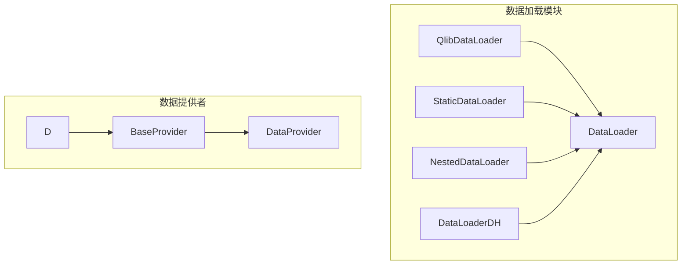
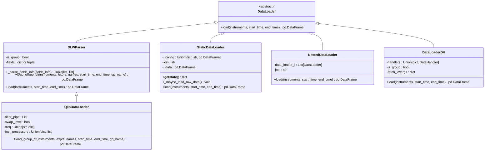
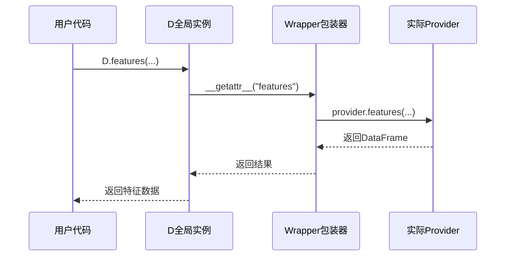
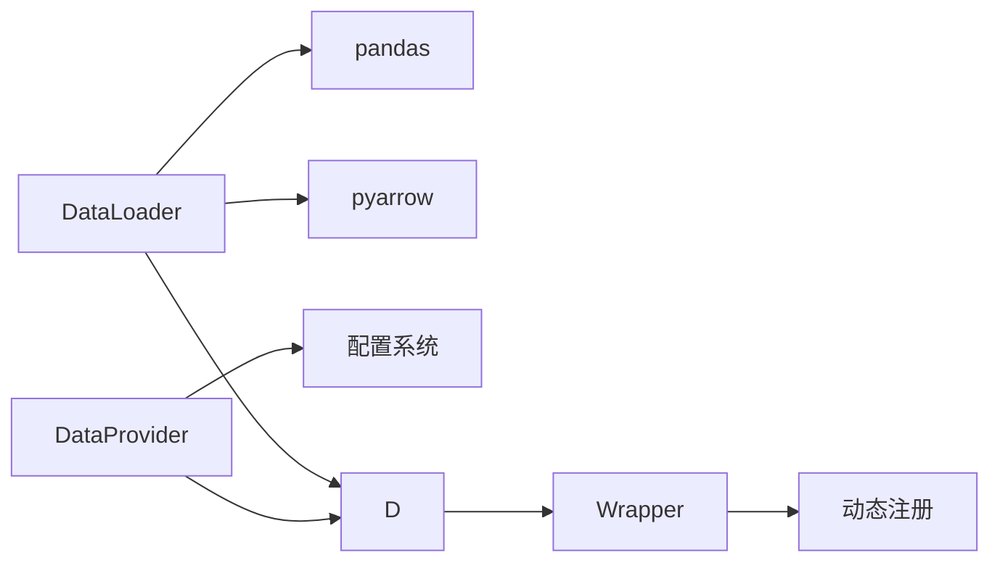

# 数据加载

<cite>
**本文档中引用的文件**
- [loader.py](file://qlib/data/dataset/loader.py)
- [data.py](file://qlib/data/data.py)
- [__init__.py](file://qlib/utils/__init__.py)
</cite>

## 目录
1. [简介](#简介)
2. [项目结构](#项目结构)
3. [核心组件](#核心组件)
4. [架构概述](#架构概述)
5. [详细组件分析](#详细组件分析)
6. [依赖分析](#依赖分析)
7. [性能考虑](#性能考虑)
8. [故障排除指南](#故障排除指南)
9. [结论](#结论)

## 简介
Qlib 是一个专为量化金融研究设计的机器学习框架，其数据加载机制是整个系统的核心部分。本文档深入解析 Qlib 的数据加载机制，重点阐述 `DatasetLoader` 类的设计与实现，并说明如何通过 `DataProvider` 接口实现统一的数据访问抽象。我们将探讨异步加载、批量读取和内存映射等性能优化技术的应用场景与配置方式，同时提供自定义数据源扩展的编程接口示例。

## 项目结构
Qlib 的数据加载功能主要分布在 `qlib/data/` 目录下，其中关键模块包括 `dataset/loader.py` 和 `data.py`。`loader.py` 定义了多种数据加载器（如 `QlibDataLoader`），用于从底层存储中高效读取时间序列数据；而 `data.py` 提供了 `DataProvider` 接口，实现了统一的数据访问抽象。



**Diagram sources**
- [loader.py](file://qlib/data/dataset/loader.py#L1-L415)
- [data.py](file://qlib/data/data.py#L1139-L1294)

**Section sources**
- [loader.py](file://qlib/data/dataset/loader.py#L1-L415)
- [data.py](file://qlib/data/data.py#L1139-L1294)

## 核心组件
Qlib 的数据加载机制围绕两个核心概念构建：`DataLoader` 和 `DataProvider`。`DataLoader` 负责具体的数据加载逻辑，支持灵活的字段解析和多源合并；`DataProvider` 则作为统一的数据访问入口，屏蔽底层存储差异。

**Section sources**
- [loader.py](file://qlib/data/dataset/loader.py#L1-L415)
- [data.py](file://qlib/data/data.py#L1139-L1294)

## 架构概述
Qlib 的数据加载架构采用分层设计，上层通过 `D` 全局实例调用统一接口，中层由各类 `DataLoader` 实现具体加载策略，底层则通过 `DataProvider` 与实际存储交互。这种设计实现了高内聚低耦合，便于扩展和维护。

```mermaid
graph TD
A[用户代码] --> B[D.features()]
B --> C{DataProvider}
C --> D[FeatureD.provider]
C --> E[DatasetD.provider]
C --> F[Cal.provider]
D --> G[(文件存储)]
E --> G
F --> H[(日历数据)]
```

**Diagram sources**
- [data.py](file://qlib/data/data.py#L1296-L1331)
- [loader.py](file://qlib/data/dataset/loader.py#L1-L415)

## 详细组件分析

### DataLoader 分析
`DataLoader` 是所有数据加载器的基类，定义了 `load()` 方法契约。其子类如 `QlibDataLoader` 支持表达式驱动的特征提取，`StaticDataLoader` 支持从静态文件加载数据，`NestedDataLoader` 支持多个加载器的结果合并。

#### 类图


**Diagram sources**
- [loader.py](file://qlib/data/dataset/loader.py#L1-L415)

**Section sources**
- [loader.py](file://qlib/data/dataset/loader.py#L1-L415)

### DataProvider 分析
`DataProvider` 是数据访问的统一接口，通过 `Wrapper` 模式实现运行时动态注册。`BaseProvider` 定义了基本方法如 `calendar()`、`instruments()` 和 `features()`，实际实现由配置决定。

#### 序列图


**Diagram sources**
- [data.py](file://qlib/data/data.py#L1139-L1294)
- [__init__.py](file://qlib/utils/__init__.py#L857-L872)

**Section sources**
- [data.py](file://qlib/data/data.py#L1139-L1294)

## 依赖分析
Qlib 的数据加载模块依赖于 pandas 进行数据处理，利用 pyarrow 读取 parquet 文件，并通过配置系统动态加载不同类型的 `DataProvider`。各组件之间通过接口解耦，确保可替换性和可测试性。



**Diagram sources**
- [loader.py](file://qlib/data/dataset/loader.py#L1-L415)
- [data.py](file://qlib/data/data.py#L1296-L1331)

**Section sources**
- [loader.py](file://qlib/data/dataset/loader.py#L1-L415)
- [data.py](file://qlib/data/data.py#L1296-L1331)

## 性能考虑
Qlib 在数据加载方面采用了多项性能优化技术：
- **磁盘缓存**：通过 `disk_cache` 参数控制是否使用磁盘缓存，减少重复计算。
- **批量读取**：支持按时间段批量加载数据，降低 I/O 开销。
- **内存映射**：对于大文件支持内存映射方式加载，避免一次性载入全部数据。
- **并行处理**：在回测等场景中支持多进程并行数据加载。

这些优化使得 Qlib 能够高效处理大规模因子回测任务，有效避免 I/O 瓶颈。

## 故障排除指南
常见数据加载问题及解决方法：

| 问题现象 | 可能原因 | 解决方案 |
|--------|--------|--------|
| 键不存在错误 | 字段名拼写错误或数据集中无该字段 | 检查字段表达式语法，确认数据集包含所需字段 |
| 格式不匹配 | 数据类型不符合预期 | 使用 `astype()` 显式转换类型，或检查数据源格式 |
| 加载速度慢 | 未启用缓存或网络延迟高 | 启用磁盘缓存，考虑本地化数据存储 |
| 内存溢出 | 数据量过大 | 使用分块加载或内存映射，优化数据类型 |

**Section sources**
- [data.py](file://qlib/data/data.py#L1139-L1189)
- [loader.py](file://qlib/data/dataset/loader.py#L1-L415)

## 结论
Qlib 的数据加载机制通过 `DataLoader` 和 `DataProvider` 的分层设计，实现了灵活性与高性能的平衡。开发者可以通过继承 `BaseProvider` 并调用 `register_provider` 注册新的数据提供者来扩展系统功能。在大规模因子回测中，合理配置缓存和批量参数可显著提升性能。未来可进一步优化异步加载机制，以更好地支持实时交易场景。