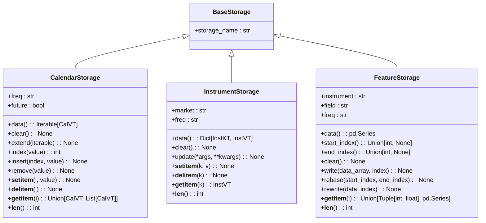
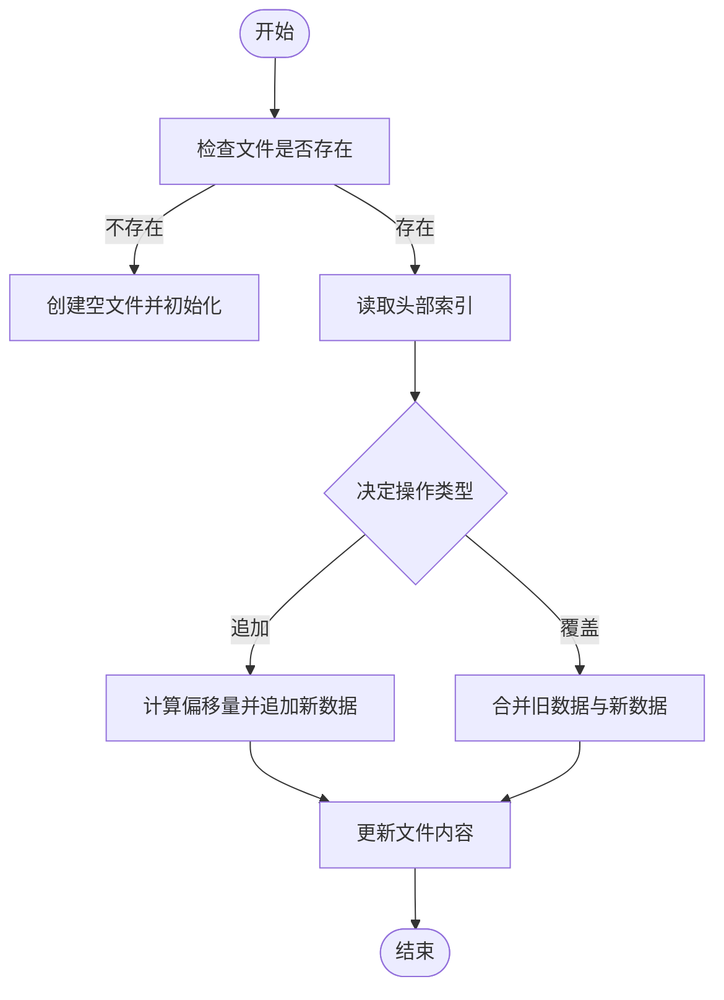

# 数据存储

<cite>
**本文档中引用的文件**
- [storage.py](file://qlib/data/storage/storage.py)
- [file_storage.py](file://qlib/data/storage/file_storage.py)
- [dataset/storage.py](file://qlib/data/dataset/storage.py)
</cite>

## 目录
1. [引言](#引言)
2. 通用存储抽象与专用存储接口对比
3. 文件存储封装机制
4. 存储分片策略与压缩算法
5. 跨平台兼容性考虑
6. 自定义存储后端扩展指南
7. 性能基准测试建议
8. 结论

## 引言
Qlib的数据存储架构设计旨在支持高效、灵活且可扩展的金融数据管理。其核心由两大部分构成：顶层`storage.py`提供的通用存储抽象，以及`dataset/storage.py`中针对因子数据优化的专用存储接口。本文档将详细分析这两种模块的设计差异，并阐述`file_storage.py`如何通过HDF5/NumPy等格式封装为统一访问层来实现高效的随机读写操作。

**Section sources**
- [storage.py](file://qlib/data/storage/storage.py#L0-L494)

## 通用存储抽象与专用存储接口对比
在Qlib中，`qlib/data/storage/storage.py`定义了三种基础存储类型——`CalendarStorage`、`InstrumentStorage`和`FeatureStorage`，它们均继承自`BaseStorage`类。这些类提供了对日历、标的物及特征数据的标准访问方法，如`__getitem__`、`__setitem__`、`clear`等，确保行为一致性的同时允许用户自定义具体实现。

相比之下，位于`qlib/data/dataset/storage.py`中的`BaseHandlerStorage`则专注于数据处理器（DataHandler）层面的数据获取逻辑。它提供了一个抽象方法`fetch()`用于从底层存储中提取数据，支持基于时间戳、切片或字符串的选择器进行索引选择，并可通过`level`参数指定多级索引中的某一层进行筛选。此外，`col_set`参数允许选择特定列集或原始数据集。

两种设计的主要区别在于：
- **通用性 vs 专用性**：`storage.py`中的类更偏向于构建一个通用框架，适用于各种类型的存储后端；而`dataset/storage.py`中的类则是为了满足量化研究中常见的数据处理需求而特别定制。
- **性能优化**：例如`HashingStockStorage`通过对股票ID进行哈希映射，显著提升了单个股票数据的随机访问速度，这对于大规模回测尤其重要。



**Diagram sources**
- [storage.py](file://qlib/data/storage/storage.py#L77-L187)
- [storage.py](file://qlib/data/storage/storage.py#L190-L251)
- [storage.py](file://qlib/data/storage/storage.py#L254-L493)

**Section sources**
- [storage.py](file://qlib/data/storage/storage.py#L77-L493)
- [dataset/storage.py](file://qlib/data/dataset/storage.py#L11-L190)

## 文件存储封装机制
`file_storage.py`实现了上述抽象接口的具体文件系统版本，即`FileCalendarStorage`、`FileInstrumentStorage`和`FileFeatureStorage`。这些类利用`FileStorageMixin`作为混入类，共享诸如`provider_uri`、`dpm`等属性以简化路径管理和资源配置。

对于日历数据，`FileCalendarStorage`使用纯文本文件按行存储日期字符串，并通过缓存机制提高读取效率。当请求频率与实际存储频率不匹配时，会自动调用`resam_calendar`函数进行重采样。

对于标的物信息，`FileInstrumentStorage`采用制表符分隔的CSV格式保存每个市场的起止时间范围，便于快速加载整个市场范围内的有效交易时段。

最复杂的部分是`FileFeatureStorage`，它负责存储数值型特征数据。该类将每个特征序列序列化为二进制文件，其中第一个浮点数表示起始索引，后续连续存放数据值。这种紧凑布局不仅减少了磁盘占用空间，还使得随机访问成为可能——只需根据目标索引计算偏移量即可直接定位到相应位置。同时，`write()`方法支持追加模式和覆盖模式，保证了增量更新的灵活性。



**Diagram sources**
- [file_storage.py](file://qlib/data/storage/file_storage.py#L75-L188)
- [file_storage.py](file://qlib/data/storage/file_storage.py#L191-L281)
- [file_storage.py](file://qlib/data/storage/file_storage.py#L284-L378)

**Section sources**
- [file_storage.py](file://qlib/data/storage/file_storage.py#L20-L378)

## 存储分片策略与压缩算法
Qlib并未显式提及分片策略，但从其实现来看，默认情况下是以“instrument/field.freq.bin”这样的命名规则组织特征文件，这实际上已经形成了一种自然的水平分片结构——不同股票的不同字段被分散到独立文件中。这种方式有利于并行I/O操作，但也可能导致小文件过多的问题。

至于压缩方面，虽然没有直接使用外部压缩库（如gzip），但通过采用固定长度的小端序IEEE 754单精度浮点数编码，本身就达到了一定的压缩效果。相比Pandas DataFrame默认使用的双精度浮点数，内存消耗减少了一半。未来若需进一步压缩，可以考虑在此基础上应用无损压缩算法。

## 跨平台兼容性考虑
Qlib通过抽象出`BaseStorage`及其子类，使得更换底层存储介质变得非常容易。只要遵循相同的接口契约，无论是本地文件系统、云存储服务还是数据库都可以无缝集成进来。特别是`FileStorageMixin`中关于`provider_uri`优先级的处理逻辑，既支持全局配置也允许实例级别覆盖，极大增强了部署灵活性。

另外，所有涉及路径拼接的地方都使用了标准库`pathlib.Path`对象而非原始字符串，从而避免了因操作系统差异导致的路径分隔符问题。加上统一采用UTF-8编码读写文本文件，确保了跨平台环境下的正确解析。

## 自定义存储后端扩展指南
要开发新的存储后端，开发者需要做以下几步：

1. 继承相应的基类（如`CalendarStorage`）
2. 实现所有必需的抽象方法
3. 如果有必要，重载某些非抽象方法以适应特定场景

例如，假设我们要添加一个基于Redis的高速缓存层，则可以这样定义：

```python
from qlib.data.storage import CalendarStorage
import redis

class RedisCalendarStorage(CalendarStorage):
    def __init__(self, freq, future=False, host='localhost', port=6379, db=0):
        super().__init__(freq, future)
        self.redis_client = redis.Redis(host=host, port=port, db=db)
    
    @property
    def data(self):
        # 从Redis获取完整日历列表
        return [item.decode('utf-8') for item in self.redis_client.lrange(f'calendar:{self.freq}', 0, -1)]
    
    def __getitem__(self, i):
        # 支持整数索引和切片查询
        if isinstance(i, slice):
            start, stop, step = i.indices(len(self))
            return [self[j] for j in range(start, stop, step)]
        else:
            return self.redis_client.lindex(f'calendar:{self.freq}', i).decode('utf-8')
    
    # 其他方法类似...
```

关键是要保持API语义不变，这样才能保证现有代码无需修改就能正常工作。

**Section sources**
- [storage.py](file://qlib/data/storage/storage.py#L23-L51)

## 性能基准测试建议
为了评估不同存储方案的实际表现，推荐执行以下几项测试：

- **顺序读取吞吐量**：测量连续读取大量记录的速度
- **随机访问延迟**：统计单次查找操作所需时间
- **并发负载能力**：模拟多个客户端同时请求的情况
- **资源利用率**：监控CPU、内存及磁盘IO占用情况

可以通过编写专门的压力测试脚本来自动化这些过程，并结合Python内置的`timeit`模块或者第三方工具如`locust`来进行精确计时。最终结果应以图表形式展示，以便直观比较优劣。

## 结论
综上所述，Qlib的数据存储架构充分体现了模块化设计思想，既提供了高度可复用的基础组件，又留有足够的自由度供高级用户定制专属解决方案。通过对通用抽象与专用优化之间的巧妙平衡，成功实现了高性能与易用性的双重目标。随着更多创新技术的应用，相信这套体系还将持续进化，更好地服务于日益增长的量化投资需求。